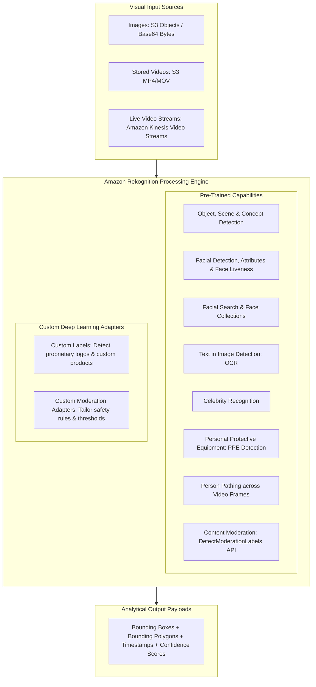
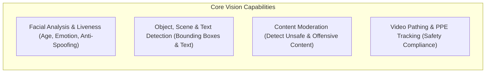
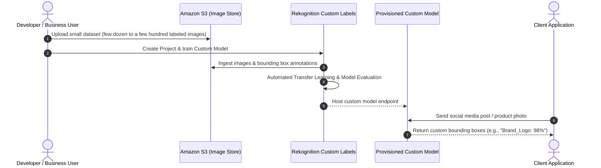
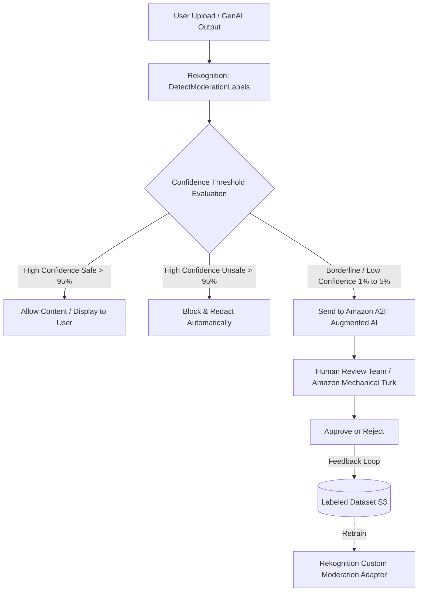

# Amazon Rekognition: Computer Vision, Custom Labels & Content Moderation

---

## Key Takeaways

**Amazon Rekognition** is a fully managed, serverless **Computer Vision (CV)** service that allows developers to analyze images, stored video files, and live streaming video feeds via pre-trained deep learning APIs without needing machine learning expertise.



Out of the box, Rekognition provides **Object/Scene Detection**, **Facial Analysis & Verification**, **Face Liveness Detection** (anti-spoofing), **Text in Image Detection**, **PPE Detection**, and **Content Moderation**. For specialized use cases, it provides **Custom Labels** (recognizing proprietary logos and custom objects with small training sets) and **Custom Moderation Adapters**, with seamless integration into **Amazon Augmented AI (Amazon A2I)** for human review workflows.

---

## Main Discussion

### Core Pre-Trained Computer Vision Capabilities



| Feature                                 | Primary Mechanism                                                                                                                                 | Typical Business Application                                                                    |
| --------------------------------------- | ------------------------------------------------------------------------------------------------------------------------------------------------- | ----------------------------------------------------------------------------------------------- |
| **Object, Scene & Label Detection**     | Identifies thousands of common objects (vehicles, pets, tools) and environmental scenes (outdoors, beach).                                        | Auto-tagging media assets, searchable digital asset management (DAM) libraries.                 |
| **Facial Analysis & Comparison**        | Detects faces, estimates age ranges, emotions (happy, calm), eye state (open/closed), and compares similarity across photos.                      | User onboarding, photo organization, entry security checkpoints.                                |
| **Face Liveness Detection**             | Verifies that a real, physically present user is interacting with the camera, blocking printed photos, screen replays, and 3D mask spoof attacks. | Fraud prevention and identity verification in mobile banking and authentication apps.           |
| **Facial Search (Collections)**         | Indexes facial vectors into managed **Face Collections** in Amazon Rekognition to match faces across large databases.                             | Employee access control, VIP guest identification, suspect lookup in authorized security feeds. |
| **Text Detection**                      | Extracts printed and handwritten text across various orientations and fonts in images.                                                            | Reading highway signs, license plates, race bib numbers, or billboard advertisements.           |
| **Personal Protective Equipment (PPE)** | Identifies face covers, hand covers, and head covers on persons, checking if equipment covers the intended body parts.                            | Industrial safety audits, automated workplace OSHA compliance monitoring.                       |
| **Celebrity Recognition**               | Recognizes known actors, athletes, politicians, and public figures.                                                                               | Media indexing, cataloging broadcast television footage, marketing analytics.                   |
| **Person Pathing**                      | Tracks the spatial movement coordinates and trajectory of individuals across video frames over time.                                              | Sports performance tracking, retail foot-traffic pattern analysis, physical security.           |

---

### Amazon Rekognition Custom Labels

When standard pre-trained models cannot recognize specialized business products, proprietary logos, or industrial defects, **Custom Labels** enables transfer learning with minimal training overhead:



- **Low Data Requirement:** Requires only a small labeled dataset (often fewer than a few hundred images) to achieve high domain accuracy.
- **No Machine Learning Code:** Amazon Rekognition handles model selection, transfer learning, hyperparameter optimization, and endpoint hosting behind the scenes.  
  

---

### Automated Content Moderation & Human-in-the-Loop (Amazon A2I)

Amazon Rekognition provides granular content moderation to protect brand reputation and user safety across user-generated content (UGC) and generative AI outputs:

<div className="grid grid-cols-1 md:grid-cols-3">

<div className="col-span-1 md:col-span-2">

</div>


</div>

1. **Automated Filtering:** The `DetectModerationLabels` API evaluates content across categories (nudity, violence, hate symbols, suggestive content, drugs/tobacco). It handles 95% to 99% of images automatically.
  
2. **Amazon Augmented AI (Amazon A2I):** For ambiguous or low-confidence predictions (typically 1% to 5% of total volume), Rekognition routes the image to **Amazon A2I** for human verification.
3. **Custom Moderation Adapters:** Organizations can train custom adapters using domain-annotated training data to adjust sensitivity thresholds for region-specific compliance rules.

---

## Exam Guide

### Exam Tips

- **Core Service Purpose:** **Amazon Rekognition** is the primary AWS service for **image and video analysis**, object detection, facial recognition, and content moderation.
- **Custom Object / Logo Detection:** If a scenario asks to detect proprietary brand logos, custom manufactured parts, or specific store products using a small set of sample images, choose **Amazon Rekognition Custom Labels**.
- **Anti-Spoofing Face Verification:** If an exam question asks how to verify that a user in a facial authentication workflow is physically present and not holding up a printed photo or playing a video loop, select **Amazon Rekognition Face Liveness Detection**.
- **Human Review Integration:** The designated AWS service for routing low-confidence machine learning predictions (such as ambiguous moderation flags) to human reviewers is **Amazon Augmented AI (Amazon A2I)**.
- **Face Collections:** Rekognition does not store raw photos when building face registries; it extracts and indexes mathematical vector representations into a **Face Collection**.

---

### Practice Test

#### Question 1

A marketing intelligence platform wants to track how often its corporate logo appears in user-uploaded event photos on social media. The company has 150 sample photos of the logo and wants a managed solution with minimal operational overhead and no custom model scripting. Which AWS solution meets these requirements?

- A. Train a custom convolutional neural network from scratch on Amazon EC2 GPU instances
- B. Use Amazon Rekognition Custom Labels trained on the sample logo images
- C. Use Amazon Textract Key-Value extraction
- D. Configure an Amazon Comprehend Custom Entity Recognizer

<details>
<summary>Correct Answer</summary>

- [x] B. Use Amazon Rekognition Custom Labels trained on the sample logo images
  - **Explanation:** **Amazon Rekognition Custom Labels** allows developers to train a custom object detection model using a small labeled dataset (in this case, 150 images of the corporate logo) without needing to write machine learning code or manage infrastructure.

</details>

---

#### Question 2

A social media platform processes millions of daily photo uploads using the Amazon Rekognition `DetectModerationLabels` API to remove inappropriate content. For borderline images where the machine learning confidence score is between 60% and 80%, the platform requires human moderators to review the images before final publication. Which AWS service provides this human review workflow integration?

- A. Amazon QuickSight
- B. Amazon Augmented AI (Amazon A2I)
- C. AWS Step Functions with Amazon Polly
- D. Amazon CloudWatch Synthetics

<details>
<summary>Correct Answer</summary>

- [x] B. Amazon Augmented AI (Amazon A2I)
  - **Explanation:** **Amazon Augmented AI (Amazon A2I)** integrates directly with Amazon Rekognition to route low-confidence or ambiguous machine learning predictions to human review workflows automatically.

</details>

---
```
