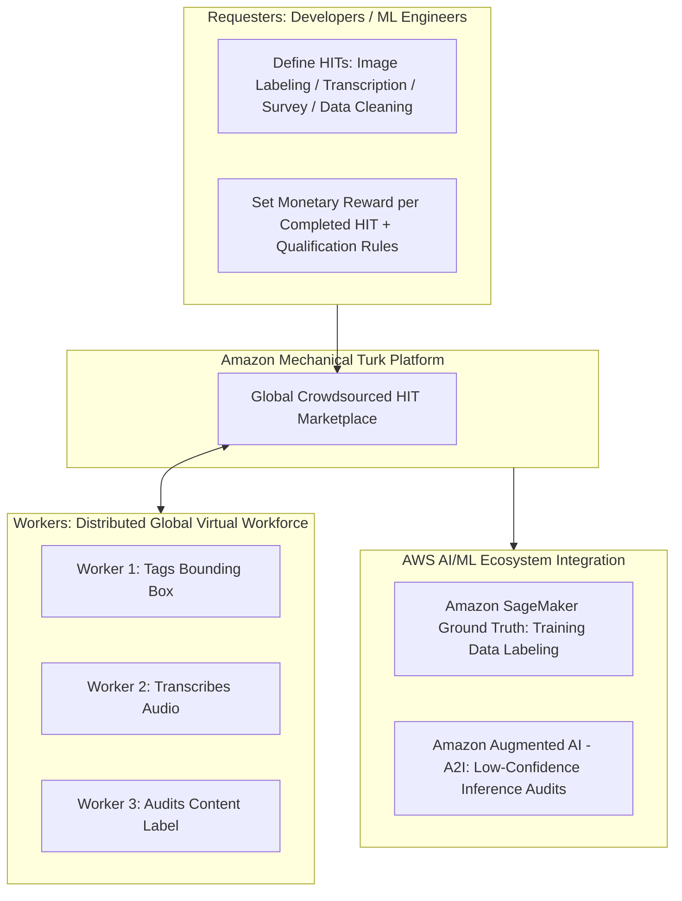
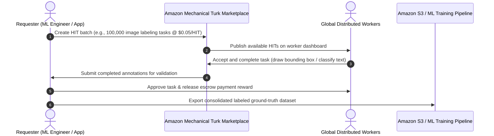
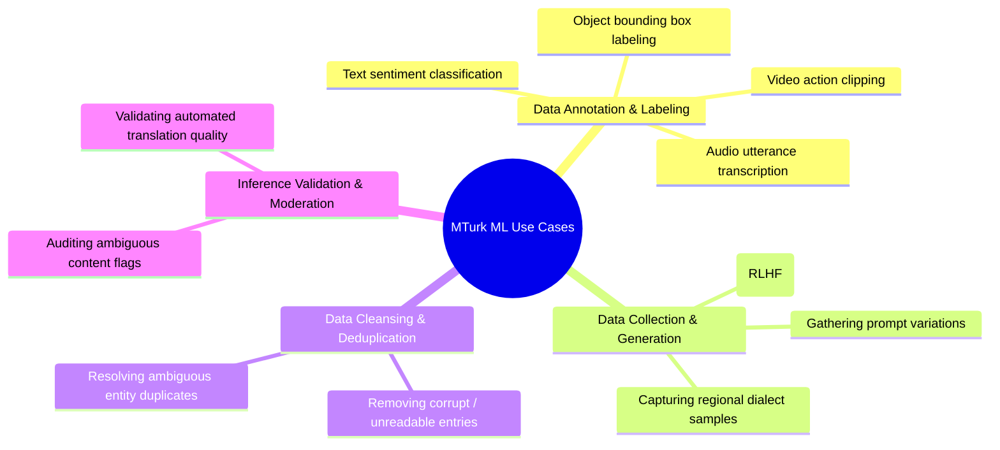
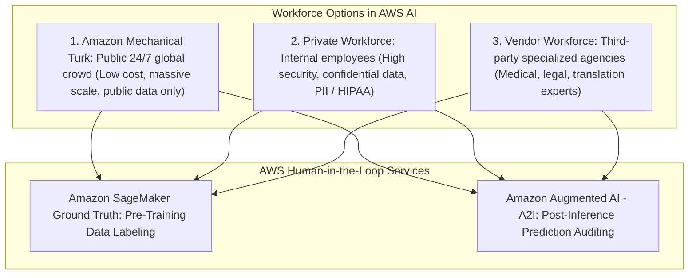

# Amazon Mechanical Turk (MTurk): Crowdsourcing Marketplace, Human-in-the-Loop & Data Annotation

---

## Key Takeaways

**Amazon Mechanical Turk (MTurk)** is a global crowdsourcing marketplace that enables businesses and developers to programmatically outsource simple Human Intelligence Tasks (HITs) to a distributed on-demand virtual workforce.

Named after the famous 18th-century chess-playing automaton illusion, MTurk provides on-demand access to hundreds of thousands of independent global workers. In AI/ML workflows, MTurk provides scalable, cost-effective human labor for **training dataset annotation** (integrated natively with **Amazon SageMaker Ground Truth**) and **human-in-the-loop inference auditing** (integrated natively with **Amazon Augmented AI / Amazon A2I**).

---

## Main Discussion

### The Anatomy of Human Intelligence Tasks (HITs)

An MTurk workflow connects **Requesters** (who post jobs) with **Workers** (also called Turkers or Providers, who complete them):

| Component                         | Technical Role                                                                                              | Operational Mechanism                                                                                                    |
| --------------------------------- | ----------------------------------------------------------------------------------------------------------- | ------------------------------------------------------------------------------------------------------------------------ |
| **Requester**                     | The entity (organization, developer, data scientist) creating the task.                                     | Defines instructions, UI templates, acceptance criteria, and reward compensation per task.                               |
| **Human Intelligence Task (HIT)** | A single, self-contained unit of human work that cannot be solved reliably by deterministic software alone. | e.g., _"Draw a bounding box around the pedestrian in this photograph"_ or _"Extract the receipt total from this image."_ |
| **Worker (Turker)**               | An independent global contractor who selects, executes, and submits HITs.                                   | Billed strictly per approved task based on the Requester's defined price.                                                |
| **Qualification Requirements**    | Rules restricting which workers can accept a task.                                                          | e.g., Requiring a 98% past HIT approval rate, location in a specific country, or passing a custom qualification test.    |

---

### Machine Learning Use Cases for Amazon Mechanical Turk

1. **Large-Scale Data Annotation:** Fast, parallelized labeling of millions of raw images, audio clips, or text documents to generate initial training datasets.
2. **Reinforcement Learning from Human Feedback (RLHF):** Evaluating and ranking foundation model responses to align generative AI agents with human preferences.
3. **Data Collection & Enrichment:** Gathering diverse phrasing variations (utterances for Amazon Lex bots) or transcribing noisy audio snippets.
4. **Data Verification & Deduplication:** Verifying web directory entries, deduplicating business address records, and cleaning tabular catalog data.

---

### Integration with Amazon SageMaker Ground Truth & Amazon A2I

Amazon Mechanical Turk serves as the public workforce backend across AWS AI/ML services:

| Dimension                   | Amazon Mechanical Turk (Public)                                                  | Private Workforce                                                                  | Vendor Workforce (AWS Marketplace)                                                    |
| --------------------------- | -------------------------------------------------------------------------------- | ---------------------------------------------------------------------------------- | ------------------------------------------------------------------------------------- |
| **Worker Composition**      | 500,000+ independent global public workers.                                      | Your company's full-time internal staff or contractors.                            | Pre-screened third-party data labeling agencies from AWS Marketplace.                 |
| **Data Privacy & Security** | **Public / Non-sensitive data only** (workers are anonymous public individuals). | **Highly confidential**, proprietary, trade secrets, or PII/HIPAA compliance data. | Specialized contracts with NDAs for domain-specific labeling (e.g., medical imaging). |
| **Scaling & Availability**  | Massive elastic scale, 24/7 instantaneous task pickup.                           | Limited by internal team size and working hours.                                   | Scalable based on agreed contract service level agreements (SLAs).                    |
| **Cost Profile**            | **Lowest cost per unit** (pay-per-HIT micropayments).                            | Fixed employee hourly/salary compensation.                                         | Professional service fee rates.                                                       |

---

## Exam Guide

### Exam Tips

- **Core Definition:** **Amazon Mechanical Turk** is an on-demand, global **crowdsourcing marketplace** used to execute simple Human Intelligence Tasks (HITs) at scale.
- **Workforce Security Rule (Critical Exam Disambiguation):**
  - Use **Amazon Mechanical Turk** when data is **public, non-sensitive, requires massive scale, and lowest cost**.
  - **NEVER** choose Mechanical Turk if the scenario mentions **Personally Identifiable Information (PII), confidential financial records, HIPAA health data, or strict privacy compliance** $\rightarrow$ Choose a **Private Workforce**.
- **Pre-Training vs. Post-Inference Human Review:**
  - To label raw training datasets before building a model $\rightarrow$ **Amazon SageMaker Ground Truth** (backed optionally by MTurk).
  - To route low-confidence live predictions from deployed models to humans for validation $\rightarrow$ **Amazon Augmented AI (Amazon A2I)** (backed optionally by MTurk).
- **Pricing Model:** Requesters set their own monetary reward per task; payment is disbursed only after the Requester approves the worker's submitted work.

---

### Practice Test

#### Question 1

A startup is building a computer vision model to identify different dog breeds from 500,000 public, royalty-free stock photos. The team needs to label bounding boxes around dogs across the entire image catalog as quickly and inexpensively as possible. The dataset contains no personal or confidential information. Which workforce option should the team select within Amazon SageMaker Ground Truth?

- [ ] A. Internal Private Workforce
- [ ] B. AWS Marketplace Specialized Medical Vendor
- [ ] C. Amazon Mechanical Turk
- [ ] D. AWS Support Enterprise Engineers

 Correct Answer

- [x] C. Amazon Mechanical Turk
  - **Explanation:** **Amazon Mechanical Turk** provides a massive, globally distributed on-demand workforce ideal for labeling large volumes of public, non-sensitive data at the lowest cost and highest elastic speed.

---

#### Question 2

A healthcare organization is building a machine learning model to extract medical diagnoses from confidential patient hospital intake records containing Protected Health Information (PHI). The compliance team requires strict adherence to HIPAA data privacy mandates and forbids third-party public internet access to the documents. Which human review workforce strategy complies with these constraints?

- [ ] A. Amazon Mechanical Turk with random worker distribution
- [ ] B. A Private Workforce composed exclusively of authorized, vetted internal hospital staff
- [ ] C. Public crowdsourcing with automated micro-rewards
- [ ] D. Publishing tasks to public AWS Discussion Forums

 Correct Answer

- [x] B. A Private Workforce composed exclusively of authorized, vetted internal hospital staff
  - **Explanation:** **Amazon Mechanical Turk** uses a public, anonymous global workforce and is **never** appropriate for confidential, sensitive, or HIPAA/PII-regulated data. Confidential workloads require a **Private Workforce** of vetted internal employees.

---
