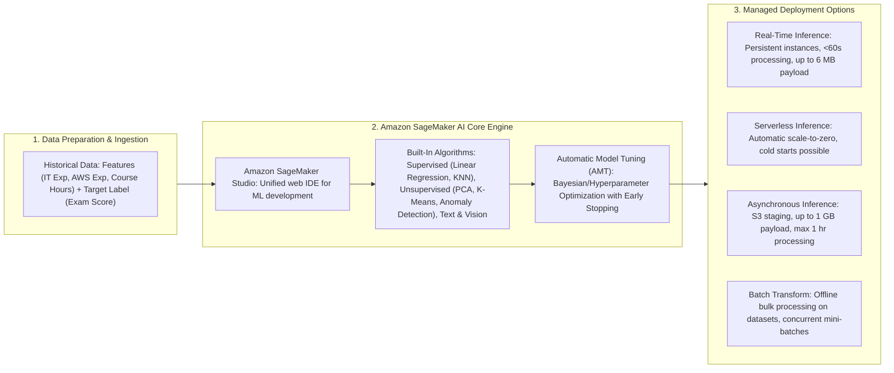
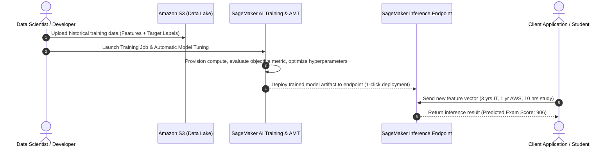
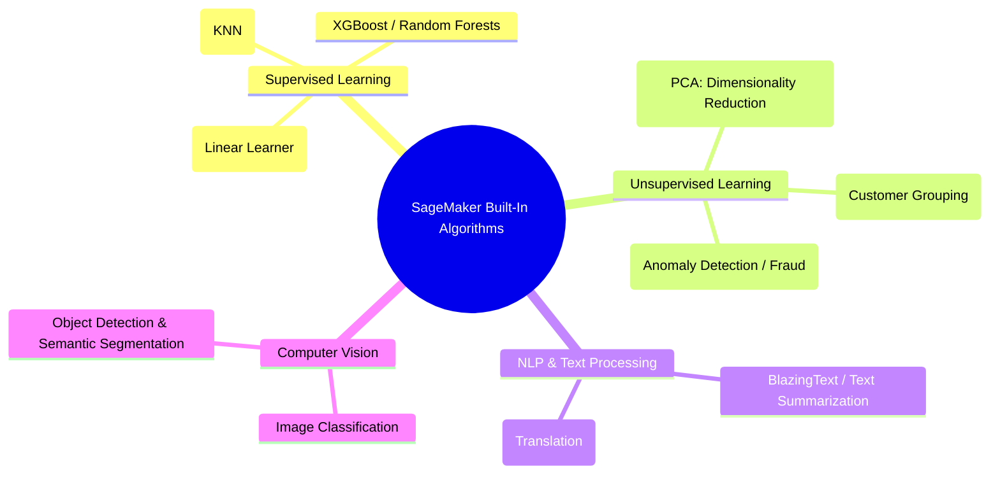
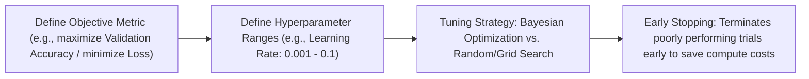
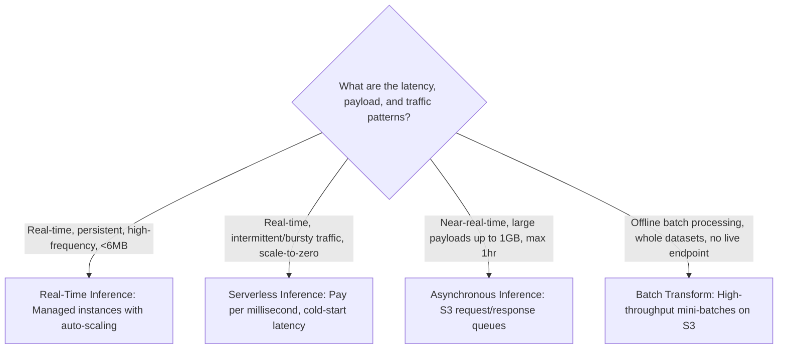

import ImageRow from '@site/src/components/ImageRow';
import RealTimeInference from './img/real-time-inference.png';
import ServerlessInference from './img/serverless-inference.png';
import AsynchronousInference from './img/async-inference.png';
import BatchTransform from './img/batch-transform.png';
import AsynchronousInferenceDocs from './img/asynchronous-inference.png';

# Amazon SageMaker AI Overview: ML Lifecycle, Algorithms, Automatic Model Tuning & Inference Options

---

## Key Takeaways

**Amazon SageMaker AI** is a fully managed cloud platform that simplifies and accelerates every stage of the machine learning lifecycle for developers and data scientists: preparing data, training models, tuning hyperparameters, deploying endpoints, and monitoring predictions.

SageMaker eliminates the heavy lifting of provisioning and scaling underlying server infrastructure. It provides built-in machine learning algorithms, automated hyperparameter optimization (**Automatic Model Tuning / AMT**), and four distinct deployment options (**Real-Time**, **Serverless**, **Asynchronous**, and **Batch Transform**) to match latency, cost, and payload requirements.

---

## Main Discussion

### The End-to-End Machine Learning Workflow

  

  

1. **Collect & Prepare Data:** Clean, structure, and label tabular, text, or visual datasets.
2. **Train & Tune:** Provision ephemeral compute clusters to run training algorithms and search hyperparameter ranges.
3. **Deploy:** Host models behind managed endpoints with automatic scaling and load balancing.
4. **Monitor & Feedback:** Continuously track prediction performance and data drift to trigger automated retraining.

---

### Built-in Algorithm Overview

Amazon SageMaker AI includes optimized containerized algorithms ready to run without writing custom framework code:

- **Supervised Learning:** Linear Learner (regressions and classifications), K-Nearest Neighbors (KNN), XGBoost.
- **Unsupervised Learning:** Principal Component Analysis (PCA) for feature dimensionality reduction, K-Means for cluster grouping, Random Cut Forest (RCF) for anomaly and fraud detection.
- **Text & Vision:** Pre-packaged natural language processing (NLP), text summarization, image classification, and object detection.

---

### Automatic Model Tuning (AMT)

**Automatic Model Tuning (AMT)**, also known as Hyperparameter Optimization (HPO), automates the process of finding the optimal hyperparameter values for a machine learning model:

- **Objective Metric:** You specify the target metric to optimize (e.g., maximize validation accuracy, minimize mean squared error).
- **Hyperparameter Ranges:** You define search boundaries for parameters like learning rate, batch size, or tree depth.
- **Early Stopping:** Automatically stops underperforming training trials before they finish, saving compute time and budget.

---

### Inference & Deployment Options Comparison

| Deployment Mode            | Latency Characteristic                            | Max Payload Size           | Max Execution Timeout       | Typical Workload & Architecture                                                                                        |
| -------------------------- | ------------------------------------------------- | -------------------------- | --------------------------- | ---------------------------------------------------------------------------------------------------------------------- |
| **Real-Time Inference**    | **Low latency** (milliseconds)                    | **6 MB**                   | **60 seconds**              | High-traffic applications, interactive customer apps requiring immediate synchronous responses on dedicated instances. |
| **Serverless Inference**   | **Low latency** (with occasional **cold starts**) | **6 MB**                   | **60 seconds**              | Intermittent or unpredictable traffic with periods of idle time; automatically scales to zero when not in use.         |
| **Asynchronous Inference** | **Near-real-time** (seconds to minutes)           | **1 GB**                   | **1 hour (3,600s)**         | Large payload inputs (medical images, high-res audio, large PDFs) queued and processed via S3 staging buckets.         |
| **Batch Transform**        | **High latency** (offline processing)             | **100 MB+** per mini-batch | **1 hour** per record/batch | Offline predictions over entire historical datasets stored in S3 without deploying a persistent endpoint.              |

<ImageRow>
  
  
</ImageRow>

<ImageRow>
  
  
</ImageRow>

---

## Exam Guide

### Exam Tips

- **Core Platform Identity:** **Amazon SageMaker AI** is the primary end-to-end managed platform for building, training, tuning, and hosting custom machine learning models on AWS.
- **Automatic Model Tuning (AMT):** Uses hyperparameter ranges, search strategies (like Bayesian optimization), and **early stopping** to identify the best model parameters while preventing wasted compute spend.
- **Inference Option Selection Rules:**
  - **Real-Time Inference:** Continuous, steady traffic requiring sub-second response times on dedicated instances.
  - **Serverless Inference:** Intermittent, bursty traffic where you want automatic scale-to-zero and pay-per-use, accepting potential cold starts.
  - **Asynchronous Inference:** Large input payloads (up to 1 GB), long processing times (up to 1 hour), and near-real-time responses backed by S3 queues.
  - **Batch Transform:** Bulk offline predictions on entire datasets stored in Amazon S3 without maintaining an active HTTP endpoint.
- **SageMaker Studio:** The centralized, web-based integrated development environment (IDE) for managing the complete ML workflow.

---

### Practice Test

#### Question 1

A media company needs to run machine learning inference on high-resolution 4K video files, where individual input files can be up to 800 MB in size and take up to 20 minutes to process. The application does not require sub-second latency, but must queue requests and write results to Amazon S3. Which Amazon SageMaker inference option should the engineering team select?

- [ ] A. SageMaker Real-Time Inference
- [ ] B. SageMaker Serverless Inference
- [ ] C. SageMaker Asynchronous Inference
- [ ] D. SageMaker JumpStart One-Click Endpoint

Correct Answer

- [x] C. SageMaker Asynchronous Inference
  - **Explanation:** **SageMaker Asynchronous Inference** is designed for workloads with large input payloads (up to 1 GB) and long processing durations (up to 1 hour). It stages incoming requests and outgoing responses via Amazon S3 using internal queues.

---

#### Question 2

A developer is configuring a SageMaker training pipeline and wants the platform to automatically evaluate different combinations of learning rates and regularization parameters to minimize validation error. The developer also wants underperforming training runs to terminate automatically to avoid unnecessary compute charges. Which SageMaker capability satisfies these requirements?

- [ ] A. Amazon SageMaker Automatic Model Tuning (AMT) with Early Stopping
- [ ] B. Amazon SageMaker Data Wrangler
- [ ] C. Amazon SageMaker Feature Store
- [ ] D. Amazon SageMaker Ground Truth Active Learning

Correct Answer

- [x] A. Amazon SageMaker Automatic Model Tuning (AMT) with Early Stopping
  - **Explanation:** **Amazon SageMaker Automatic Model Tuning (AMT)** automatically searches through hyperparameter ranges to optimize the specified objective metric, while its **Early Stopping** feature terminates poorly performing trials early to save compute time and cost.

---

#### Question 3

A retail company is using an Amazon SageMaker machine learning model to analyze customer purchasing patterns and predict future buying behavior. The data scientists at the company regularly need to process datasets of less than 1 GB, such as daily sales records and customer interaction logs. The company does not require immediate responses and can afford some delay in receiving the analysis results, as the insights are primarily used for weekly strategy meetings.

Which inference method would be the most suitable for the company in this scenario?

- [ ] A. Serverless inference
- [ ] B. Asynchronous inference
- [ ] C. Real-time inference
- [ ] D. Batch inference

Correct Answer

- [x] B. Asynchronous inference
  - **Explanation:** Asynchronous inference is the most suitable choice for this scenario. It allows the company to process smaller payloads without requiring real-time responses by queuing the requests and handling them in the background. This method is cost-effective and efficient when some delay is acceptable, as it frees up resources and optimizes compute usage. Asynchronous inference is ideal for scenarios where the payload size is less than 1 GB and immediate results are not critical.
    <ImageRow>
      
    </ImageRow>

Incorrect Answers

- [ ] A. Serverless inference
  - **Explanation:** Serverless inference is a good choice for workloads with unpredictable traffic or sporadic requests, as it scales automatically based on demand. However, it may not be as cost-effective for scenarios where workloads are predictable, and some waiting time is acceptable. Asynchronous inference provides a more targeted solution for handling delayed responses at a lower cost.
- [ ] C. Real-time inference
  - **Explanation:** Real-time inference is optimized for scenarios where low latency is essential, and responses are needed immediately. It is not suitable for cases where the system can afford to wait for responses, as it might lead to higher costs and resource consumption without providing any additional benefit for this particular use case.
- [ ] D. Batch inference
  - **Explanation:** Batch inference is generally used for processing large datasets all at once. While it does not require immediate responses, it is typically more efficient for handling larger payloads (several gigabytes or more). For smaller payloads of less than 1 GB, batch inference might be overkill and less cost-efficient compared to asynchronous inference.

References:

- https://docs.aws.amazon.com/sagemaker/latest/dg/how-it-works-deployment.html
- https://repost.aws/questions/QUlefH1ni4QOaulUT4870D5g/sagemaker-batch-transform
- https://docs.aws.amazon.com/sagemaker/latest/dg/async-inference.html

---
