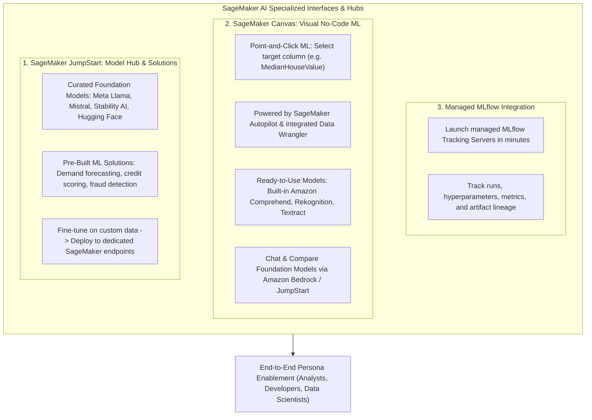
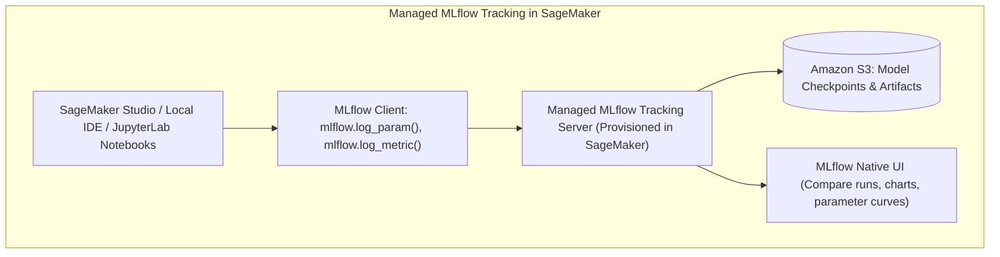

# Amazon SageMaker AI Consoles: SageMaker JumpStart, SageMaker Canvas & MLflow Integration

---

## Key Takeaways

**Amazon SageMaker AI** provides specialized interfaces and hubs tailored to distinct user personas and technical requirements: **SageMaker JumpStart** (a curated model hub and pre-built ML solutions), **SageMaker Canvas** (a visual, no-code ML studio for business analysts), and **Managed MLflow** (open-source experiment tracking and lifecycle management).



- **SageMaker JumpStart:** A broad machine learning hub providing access to pre-trained foundation models (from Meta, Mistral, Stability AI, and Hugging Face) and pre-built end-to-end ML solutions with full deployment and fine-tuning infrastructure control.
- **SageMaker Canvas:** A visual, no-code environment designed for business analysts to build predictive models, run automated ML via **SageMaker Autopilot**, prepare data via integrated **Data Wrangler**, and leverage ready-to-use AI services (**Amazon Comprehend**, **Amazon Rekognition**, **Amazon Textract**).
- **Managed MLflow:** Simplifies launching and maintaining open-source MLflow tracking servers directly within SageMaker Studio to manage experiment tracking and artifact lineage.

---

## Main Discussion

### Amazon SageMaker JumpStart: Hub & Pre-Built Solutions

<div className="grid grid-cols-1 md:grid-cols-3">

<div className="col-span-1 md:col-span-2">
```mermaid
flowchart LR
    subgraph JumpStartPillars [JumpStart Dual Architecture]
        direction TB
        P1["1. Machine Learning Hub: Pre-Trained Foundation Models"]
        P2["2. Pre-Built Machine Learning Solutions"]
    end

    P1 -->|Discover & Fine-Tune| V1["Open-source LLMs, Vision & NLP (Llama 3, Mistral, Stable Diffusion)"]
    P2 -->|1-Click Deploy| V2["Turnkey architectures: Demand Forecasting, Fraud, Credit Scoring"]

````
</div>


</div>

| Feature                | JumpStart Machine Learning Hub                                                                                                                         | JumpStart Pre-Built Solutions                                                                         |
| ---------------------- | ------------------------------------------------------------------------------------------------------------------------------------------------------ | ----------------------------------------------------------------------------------------------------- |
| **Primary Artifact**   | Pre-trained model checkpoints (LLMs, Computer Vision, NLP).                                                                                            | Fully assembled, multi-service CloudFormation templates.                                              |
| **Customization**      | Fine-tune weights on private S3 datasets with custom hyperparameter controls.                                                                          | Customize boilerplate data pipelines, feature logic, and evaluation thresholds.                       |
| **Deployment Model**   | Deploys directly to dedicated Amazon SageMaker Real-Time or Async endpoints.                                                                           | Deploys associated AWS infrastructure (Lambda, S3, Step Functions, SageMaker Endpoints).              |
| **Catalog Comparison** | Broader collection of open-source and proprietary weights than Bedrock's serverless API model, giving full infrastructure and container customization. | Addresses standard business problems (churn, credit risk, fraud) without manual architectural wiring. |


---

### Amazon SageMaker Canvas: Visual No-Code Predictive ML

SageMaker Canvas enables business users and analysts to create ML models and generate predictions through a point-and-click graphical workflow:

```mermaid
sequenceDiagram
    autonumber
    actor Analyst as Business Analyst / Non-Coder
    participant Canvas as SageMaker Canvas UI
    participant DW as Data Preparation Engine (Data Wrangler)
    participant AP as SageMaker Autopilot (AutoML)
    participant ReadyAI as Pre-built AI Services (Comprehend/Rekognition/Textract)

    Analyst->>Canvas: Import dataset from S3 / Snowflake / Redshift
    Canvas->>DW: Visually clean data, impute nulls & create features
    Analyst->>Canvas: Select Target Column (e.g. "MedianHouseValue" or "Churn")
    Canvas->>AP: Launch Quick Build (heuristic) or Standard Build (AutoML exploration)
    AP-->>Canvas: Return feature importance, accuracy metrics & SHAP explanations
    Analyst->>Canvas: Run single / batch predictions or export model to SageMaker Studio
    Note over Analyst,ReadyAI: Or use 'Ready-to-Use' models for direct sentiment/vision/document extraction
````

```mermaid
mindmap
  root((SageMaker Canvas Capabilities))
    Predictive Tabular ML
      Binary Classification (Yes/No Churn)
      Multi-class Classification
      Numeric Regression (House Value)
      Time-Series Forecasting
    Generative AI & Foundation Models
      Chat with LLMs (Amazon Bedrock / JumpStart)
      Compare multi-model responses side-by-side
    Ready-to-Use AI Services
      Sentiment Analysis (Comprehend)
      Object & Text Detection (Rekognition)
      Document Processing (Textract)
    Collaboration & Export
      Export full model recipes to SageMaker Studio
      Share feature flows with Data Scientists
```

---


---


---

### Open-Source MLOps: Managed MLflow in SageMaker



- **Zero-Management Infrastructure:** Provision and maintain scalable MLflow tracking servers directly from the SageMaker console or CLI without configuring underlying EC2 instances or databases.
- **Unified Experimentation:** Data science teams can continue using familiar open-source MLflow APIs while benefiting from AWS IAM security, encryption, and seamless integration with SageMaker Studio assets.


---

### Persona & Feature Comparison Matrix

| Service / Tool          | Target Persona                             | Code Requirement            | Core Use Case                                                                                                       |
| ----------------------- | ------------------------------------------ | --------------------------- | ------------------------------------------------------------------------------------------------------------------- |
| **SageMaker Canvas**    | Business Analysts, Citizen Data Scientists | **Zero Code (No-Code UI)**  | Building tabular predictive models, time-series forecasting, testing pre-built AI services, and chatting with LLMs. |
| **SageMaker JumpStart** | ML Engineers, Full-Stack Developers        | **Low-Code to Full-Code**   | Discovering, fine-tuning, and deploying pre-trained foundation models and complete reference solutions.             |
| **Managed MLflow**      | Data Scientists, MLOps Engineers           | **Code-First (Python / R)** | Tracking machine learning experiments, hyperparameter runs, metric comparisons, and artifact lineage across teams.  |
| **SageMaker Autopilot** | Developers, Data Scientists                | **Low-Code / Code-Visible** | Automated ML (AutoML) that produces fully transparent, editable Python code notebooks.                              |

---

## Exam Guide

### Exam Tips

- **No-Code Persona Trigger:** Whenever an exam question describes a **business analyst, citizen data scientist, or non-technical user** who needs to train predictive models, predict target columns, or test computer vision/NLP without writing code, select **Amazon SageMaker Canvas**.
- **Pre-Trained Model Hub Trigger:** If a scenario asks to browse, fine-tune, or deploy open-source foundation models (such as Meta Llama or Mistral) or deploy pre-built ML solutions (such as demand forecasting) with complete container/endpoint control, choose **Amazon SageMaker JumpStart**.
- **Ready-to-Use Models in Canvas:** SageMaker Canvas integrates directly with **Amazon Comprehend** (sentiment), **Amazon Rekognition** (image analysis), and **Amazon Textract** (document extraction) to provide out-of-the-box AI tasks inside its visual interface.
- **Open-Source Experiment Tracking:** If an exam question asks how to run and manage **MLflow tracking servers** natively within AWS without managing the underlying hosting servers, select **Amazon SageMaker Managed MLflow**.

---

### Sample AIF-C01 Questions

#### Question 1

A business operations analyst with no coding background wants to analyze customer survey feedback stored in a CSV file to determine whether customer sentiment is positive, neutral, or negative. The analyst needs a visual, web-based tool that integrates pre-built natural language processing capabilities without requiring manual model training or programming. Which AWS tool should the analyst use?

- [ ] A. Amazon EC2 `Trn1` instances
- [ ] B. Amazon SageMaker Canvas using ready-to-use models
- [ ] C. Amazon SageMaker Pipelines visual step editor
- [ ] D. AWS HealthScribe

<details>
<summary>Correct Answer</summary>

- [x] B. Amazon SageMaker Canvas using ready-to-use models
  - **Explanation:** **Amazon SageMaker Canvas** offers a visual, no-code interface with **ready-to-use models** (powered by services like Amazon Comprehend) that allows business analysts to perform tasks like sentiment analysis and entity detection directly without writing code.

</details>

---

#### Question 2

A machine learning team wants to deploy an open-source large language model (LLM) for an internal enterprise assistant. The team requires access to a curated repository of pre-trained open-source foundation models that can be fine-tuned on company data and hosted on dedicated SageMaker managed endpoints with full infrastructure control. Which SageMaker feature should they use?

- [ ] A. Amazon SageMaker JumpStart
- [ ] B. Amazon SageMaker Model Cards
- [ ] C. Amazon Polly Custom Lexicons
- [ ] D. Amazon Comprehend Medical

<details>
<summary>Correct Answer</summary>

- [x] A. Amazon SageMaker JumpStart
  - **Explanation:** **Amazon SageMaker JumpStart** provides a centralized hub to discover, evaluate, fine-tune, and deploy pre-trained open-source and proprietary foundation models directly onto managed SageMaker compute infrastructure.

</details>

---
