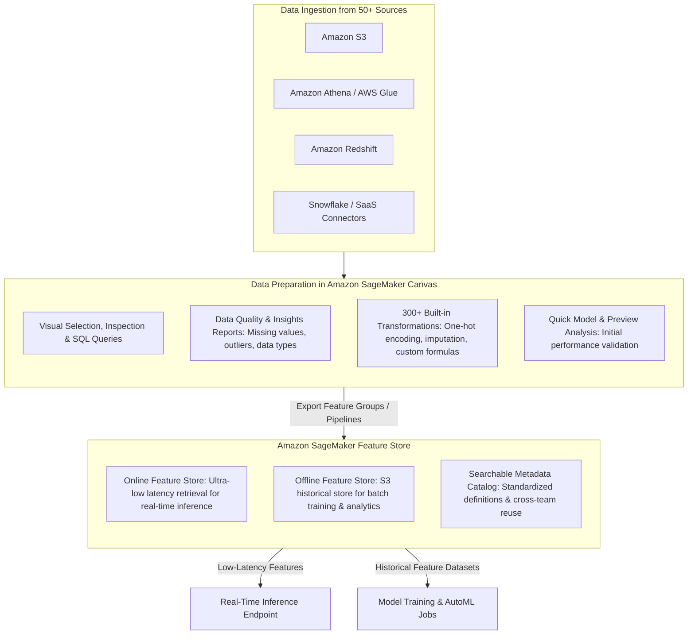
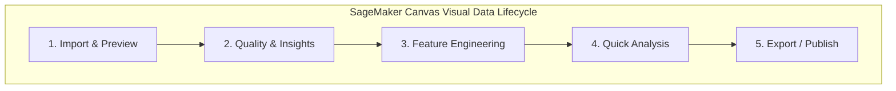
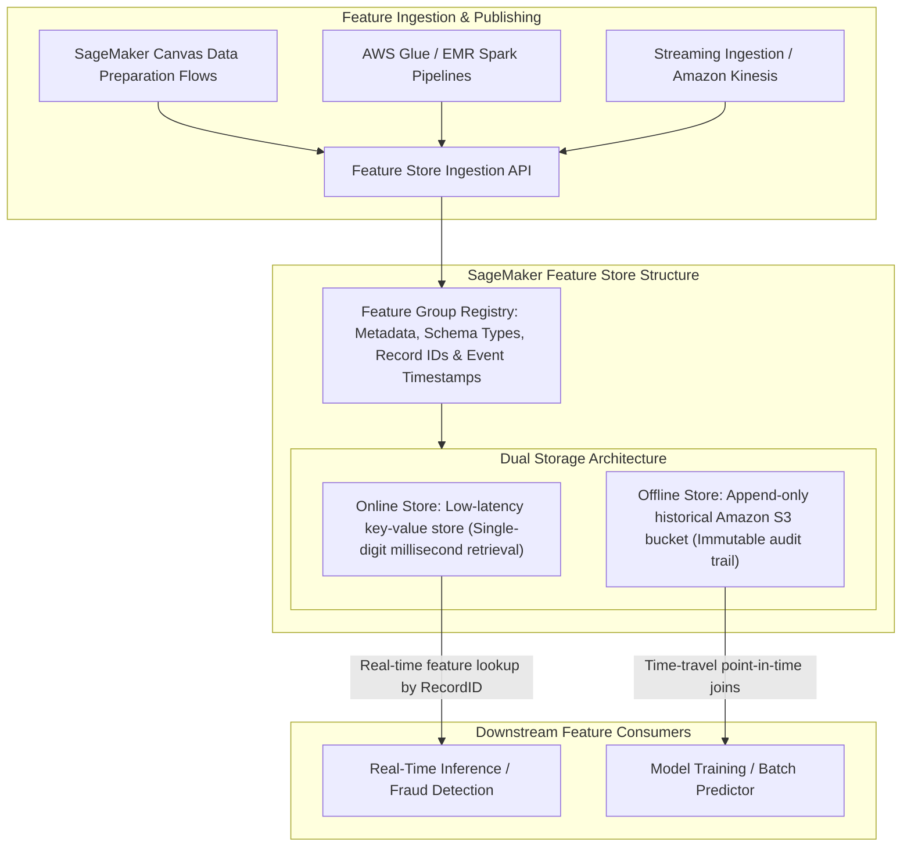
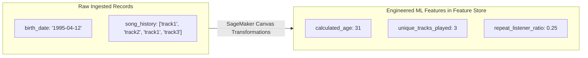

import ImageRow from '@site/src/components/ImageRow';
import SageMakerDataPreparation from './img/sagemaker-data-preparation.png';
import SageMakerImportData from './img/sagemaker-import-data.png';
import SageMakerPreviewData from './img/sagemaker-preview-data.png';
import SageMakerVisualizeData from './img/sagemaker-visualize-data.png';
import SageMakerTransformData from './img/sagemaker-transform-data.png';
import SageMakerQuickModel from './img/sagemaker-quick-model.png';
import SageMakerExportDataFlow from './img/sagemaker-export-data-flow.png';

# Amazon SageMaker AI: Data Preparation in SageMaker Canvas & Amazon SageMaker Feature Store

---

## Key Takeaways

High-performing machine learning models require clean, well-structured datasets and reusable features. AWS delivers visual, end-to-end data preparation within **Amazon SageMaker Canvas** (which now natively incorporates all visual data transformation, exploration, and Data Wrangler capabilities) and centralized feature management through **Amazon SageMaker Feature Store**.

Within **SageMaker Canvas**, practitioners can visually inspect data, run automated **Data Quality and Insights Reports**, execute SQL queries, apply 300+ pre-built transformations (such as converting date-of-birth to age or imputing missing values), and export repeatable data flows directly into **SageMaker Feature Store** and automated MLOps pipelines.

---

## Main Discussion

### Visual Data Preparation in Amazon SageMaker Canvas

Data preparation typically consumes up to 80% of an ML project's timeline. SageMaker Canvas streamlines this process with a visual, low-code/no-code interface backed by distributed Spark processing:

| Phase                      | Capability in SageMaker Canvas                                                                                                                                               | Operational Value                                                                                                                |
| -------------------------- | ---------------------------------------------------------------------------------------------------------------------------------------------------------------------------- | -------------------------------------------------------------------------------------------------------------------------------- |
| **1. Ingest & Preview**    | Connects to over 50 data sources (Amazon S3, Amazon Redshift, Amazon Athena, Snowflake, Salesforce). Supports tabular, time-series, text, and image datasets.                | Enables rapid multi-source data aggregation without manual ETL scripting.                                                        |
| **2. Inspect & Profile**   | Generates visual histograms, scatter plots, box plots, and automated **Data Quality & Insights Reports**.                                                                    | Instantly detects anomalies, class imbalances, missing data columns, and schema type mismatches.                                 |
| **3. Feature Engineering** | Offers 300+ built-in operators (handling missing values, standard scalers, tokenization, one-hot encoding, date-time transformations) plus custom SQL / formula expressions. | Converts raw fields into standardized predictive signals (e.g., parsing a raw `birth_date` into numerical `age` or `age_group`). |
| **4. Quick Model**         | Generates rapid baseline predictive metrics directly from the data flow.                                                                                                     | Evaluates whether current features provide sufficient predictive power before launching expensive, large-scale training jobs.    |
| **5. Pipeline Export**     | Exports data preparation steps into reusable flow files, SageMaker Pipelines, or Jupyter Notebook scripts.                                                                   | Allows visual data preparation logic to be integrated directly into automated production CI/CD workflows.                        |

<ImageRow>
  
</ImageRow>

<ImageRow>
  
  
</ImageRow>

<ImageRow>
  
  
</ImageRow>

<ImageRow>
  
  
</ImageRow>

---

### Amazon SageMaker Feature Store: Unified Feature Management

In enterprise environments, data scientists across different teams often duplicate effort by re-calculating the same features (e.g., customer lifetime value, song play count, 30-day return rate), resulting in data inconsistencies and training-serving skew. **Amazon SageMaker Feature Store** resolves this with a centralized, purpose-built repository.

| Dimension                     | Online Feature Store                                                                                                                                          | Offline Feature Store                                                                                                                    |
| ----------------------------- | ------------------------------------------------------------------------------------------------------------------------------------------------------------- | ---------------------------------------------------------------------------------------------------------------------------------------- |
| **Primary Storage Engine**    | Ultra-low latency, in-memory / key-value store.                                                                                                               | Scalable, cost-effective **Amazon S3** parquet repository.                                                                               |
| **Latency Profile**           | Single-digit millisecond reads.                                                                                                                               | Milliseconds to minutes (optimized for large SQL table scans).                                                                           |
| **Primary Purpose**           | Real-time feature lookups during live model inference (e.g., looking up a user's recent credit balance for live fraud evaluation).                            | Storing historical, immutable feature snapshots for model training, batch transform, and historical analytics.                           |
| **Time-Travel Capability**    | Returns latest current state.                                                                                                                                 | Supports **point-in-time historical queries** to reconstruct exact feature values at the time an event occurred (prevents data leakage). |
| **Collaboration & Discovery** | Standardizes schema definitions and descriptions across the entire enterprise in **SageMaker Studio**, preventing duplicate feature engineering across teams. |                                                                                                                                          |

---

### Feature Engineering in Action: Transforming Raw Data

---

## Exam Guide

### Exam Tips

- **Visual Data Preparation & Cleansing:** Whenever an exam question asks for a visual, low-code/no-code tool to import data from dozens of sources, clean and impute values, profile data quality, and build feature engineering flows without writing code, select **Amazon SageMaker Canvas** (which incorporates Data Wrangler functionality).
- **Feature Store Disambiguation:**
  - **Amazon SageMaker Feature Store:** The centralized repository for storing, discovering, and sharing curated machine learning features across teams.
  - **Online Store:** Low-latency, single-digit millisecond feature retrieval during real-time inference.
  - **Offline Store:** Historical S3-backed storage used for model training and point-in-time "time-travel" dataset generation.
- **Preventing Feature Redundancy:** If a scenario describes multiple data science teams rebuilding identical feature sets (e.g., customer tenure, order frequency), the solution is **SageMaker Feature Store**.
- **Export Options:** Data flows created in SageMaker Canvas can be exported as **SageMaker Pipelines**, **Jupyter Notebook scripts**, or pushed directly into a **Feature Store Feature Group**.

---

### Practice Test

#### Question 1

A retail company's data analysts need to inspect a raw dataset containing customer purchase histories, detect missing values and outliers, transform date fields into numerical customer tenure metrics, and visualize data distributions. The team has no Python programming experience and requires a visual, interactive workspace. Which AWS service capability fulfills this requirement?

- [ ] A. Amazon SageMaker Canvas
- [ ] B. AWS HealthScribe
- [ ] C. Amazon Polly Custom Lexicons
- [ ] D. Amazon EC2 `Trn1` instances

Correct Answer

- [x] A. Amazon SageMaker Canvas
  - **Explanation:** **Amazon SageMaker Canvas** provides an end-to-end, visual, no-code workspace with built-in data preparation and profiling tools (including 300+ transformations and Data Quality & Insights reports) designed specifically for business analysts and practitioners.

---

#### Question 2

An online payment processor has multiple machine learning engineering teams building separate fraud detection models. Both teams require real-time access to the same computed user transaction metrics with single-digit millisecond retrieval latency during live authorization checks, while also maintaining historical records in Amazon S3 for quarterly model retraining. Which AWS service component should be implemented?

- [ ] A. Amazon Rekognition Custom Labels
- [ ] B. Amazon SageMaker Feature Store (utilizing both Online and Offline stores)
- [ ] C. Amazon Textract `AnalyzeExpense`
- [ ] D. Amazon Comprehend Medical Entity Linking

Correct Answer

- [x] B. Amazon SageMaker Feature Store (utilizing both Online and Offline stores)
  - **Explanation:** **Amazon SageMaker Feature Store** provides a dual-store architecture: the **Online Store** delivers ultra-low latency feature retrieval for real-time model inference, while the **Offline Store** maintains historical feature snapshots in Amazon S3 for training and compliance audits.

---
