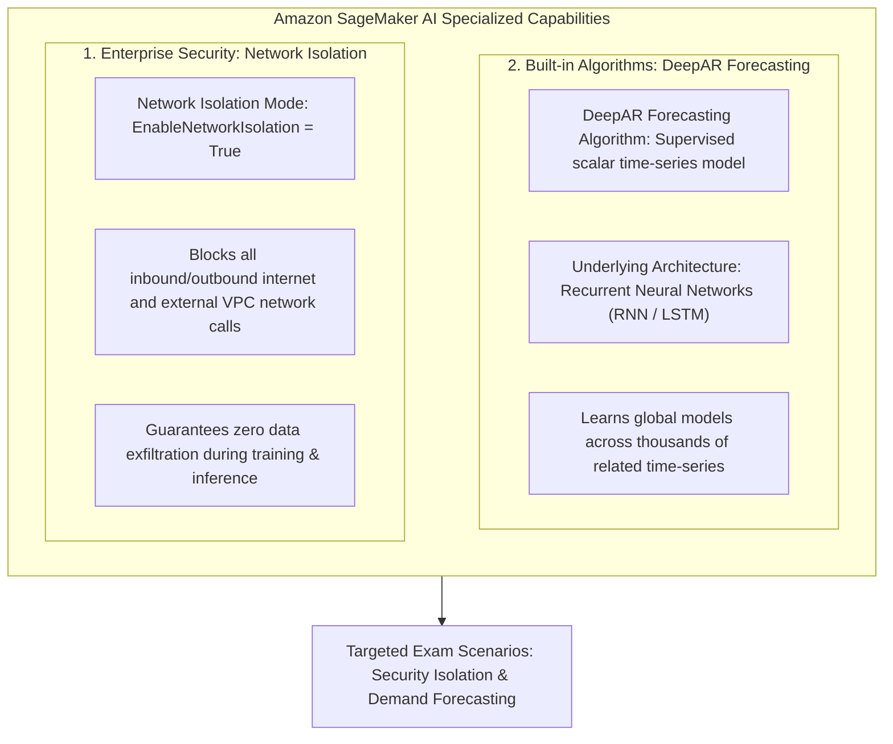
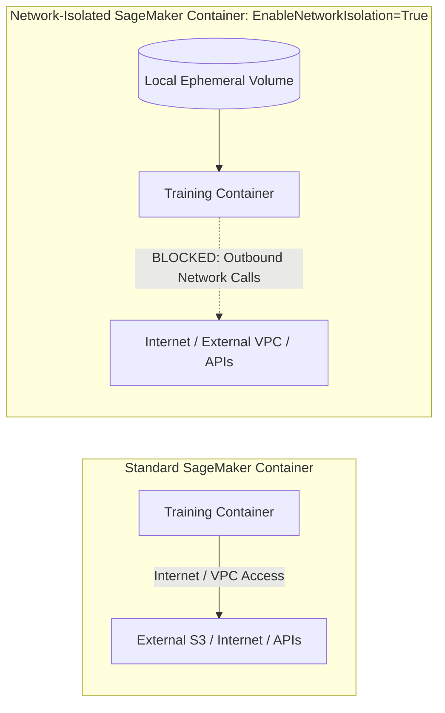
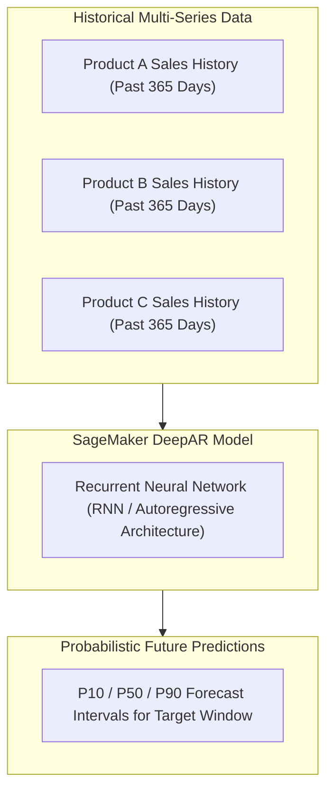

# Amazon SageMaker AI: Security via Network Isolation & Time-Series Forecasting with DeepAR

---

## Key Takeaways

This module covers two targeted features often tested in scenario-based exam questions: **SageMaker Network Isolation** for enterprise data security, and the built-in **DeepAR Forecasting Algorithm** for temporal machine learning.

- **Network Isolation Mode:** Enforces zero network access for training and inference containers, preventing outbound internet calls, external VPC traffic, and unauthorized data exfiltration.
- **DeepAR Forecasting Algorithm:** A supervised built-in SageMaker algorithm designed specifically for **scalar time-series forecasting** (e.g., retail product demand, energy consumption) powered by **Recurrent Neural Networks (RNNs)**.

---

## Main Discussion

### Enterprise Security: SageMaker Network Isolation

In highly regulated industries (healthcare, government, defense, finance), security compliance mandates that third-party or custom training code cannot transmit sensitive training data outside of the execution environment.

| Security Dimension           | Standard Execution Mode                                                          | Network Isolation Mode (`EnableNetworkIsolation = True`)                                                                                  |
| ---------------------------- | -------------------------------------------------------------------------------- | ----------------------------------------------------------------------------------------------------------------------------------------- |
| **Internet Access**          | Allows outbound calls (e.g., downloading pip packages or external dependencies). | **Completely disabled.** The container has no network interface to the public internet.                                                   |
| **VPC & AWS Service Access** | Can communicate with VPC endpoints and AWS services via IAM credentials.         | **Blocked during execution.** The container cannot call Amazon S3, external databases, or VPC resources while training or inference runs. |
| **Data Ingestion Mechanism** | Data is downloaded directly by container scripts or mounted via S3.              | SageMaker downloads training data from S3 _before_ the container starts and mounts it to local disk (`/opt/ml/input/data/`).              |
| **Primary Use Case**         | General ML development and production pipelines.                                 | **Running untrusted third-party code**, sensitive intellectual property, and zero-data-exfiltration compliance workloads.                 |

---

### Time-Series Forecasting: DeepAR Algorithm

Traditional statistical methods (such as ARIMA or ETS) fit a separate model to every individual time-series. **DeepAR** trains a single, global deep learning model over thousands of related time-series simultaneously.

- **Underlying Architecture:** Employs an autoregressive **Recurrent Neural Network (RNN)** to capture non-linear patterns, seasonality, and long-term temporal dependencies.
- **Cross-Learning Across Series:** Learns shared patterns across related items (e.g., forecasting demand for new retail products with little historical data by learning from established catalog items).
- **Probabilistic Outputs:** Generates quantile forecasts (e.g., $10\text{th}$, $50\text{th}$, $90\text{th}$ percentiles) to help businesses evaluate risk ranges rather than single scalar point estimates.

---

### Comparison: DeepAR vs. Amazon Forecast vs. Canvas Forecasting

| Capability / Service             | Target Persona                | Underlying Mechanism                            | Primary Use Case                                                                    |
| -------------------------------- | ----------------------------- | ----------------------------------------------- | ----------------------------------------------------------------------------------- |
| **SageMaker DeepAR**             | Data Scientists, ML Engineers | Built-in supervised RNN algorithm in SageMaker. | Custom time-series modeling with full hyperparameter tuning in SageMaker pipelines. |
| **Amazon Forecast**              | Developers                    | Managed SaaS AutoML forecasting engine.         | Turnkey time-series predictions via simple API calls without managing algorithms.   |
| **SageMaker Canvas Forecasting** | Business Analysts             | Visual, no-code time-series builder.            | Point-and-click revenue, inventory, or demand projections from spreadsheets.        |

---

## Exam Guide

### Exam Tips

- **Zero Internet / Exfiltration Prevention:** If a scenario asks how to run a SageMaker training job or inference container **without any outbound network access** to guarantee sensitive data cannot be exfiltrated to the internet, the answer is **Network Isolation Mode** (`EnableNetworkIsolation = True`).
- **DeepAR Exam Keywords:**
  - Target problem: **Time-series forecasting** (predicting future scalar values over time).
  - Underlying deep learning architecture: **Recurrent Neural Networks (RNNs)**.
- **Data Flow Under Network Isolation:** In isolated mode, SageMaker handles data downloads from Amazon S3 before execution begins and mounts the files to local storage so the container itself never makes an external API call.

---

### Practice Test

#### Question 1

A security-sensitive organization is deploying a custom third-party computer vision algorithm inside Amazon SageMaker for model training. Corporate compliance strictly mandates that the training environment must have zero outbound internet connectivity to prevent intellectual property theft or data leakage to external endpoints. Which SageMaker feature satisfies this requirement?

- [ ] A. Amazon SageMaker Feature Store
- [ ] B. SageMaker Network Isolation Mode
- [ ] C. Amazon SageMaker JumpStart Public Hub
- [ ] D. SageMaker Serverless Inference Cold Start

Correct Answer

- [x] B. SageMaker Network Isolation Mode
  - **Explanation:** Enabling **Network Isolation Mode** (`EnableNetworkIsolation = True`) on SageMaker training jobs isolates the container environment from all external network and internet communication, ensuring that data cannot leave the container during execution.

---

#### Question 2

An energy utility company wants to forecast hourly electricity demand across thousands of smart meters for the upcoming month using a built-in supervised algorithm in Amazon SageMaker that leverages Recurrent Neural Networks (RNNs). Which algorithm should the data science team select?

- [ ] A. Principal Component Analysis (PCA)
- [ ] B. SageMaker DeepAR Forecasting Algorithm
- [ ] C. Random Cut Forest (RCF)
- [ ] D. K-Means Clustering

Correct Answer

- [x] B. SageMaker DeepAR Forecasting Algorithm
  - **Explanation:** The **Amazon SageMaker DeepAR algorithm** is a supervised learning algorithm purpose-built for time-series forecasting that uses **Recurrent Neural Networks (RNNs)** to predict scalar values over time.

---
