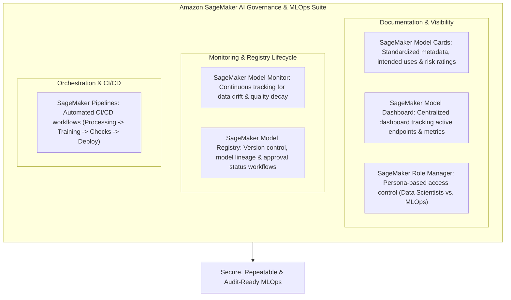
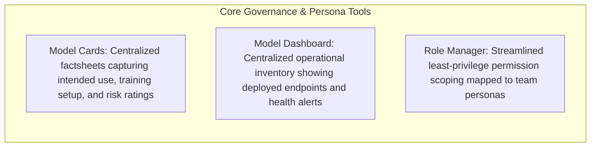
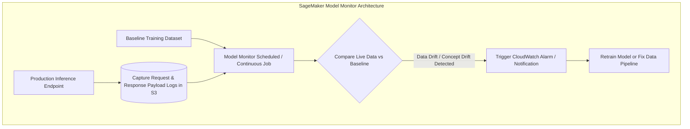
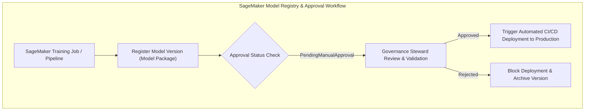
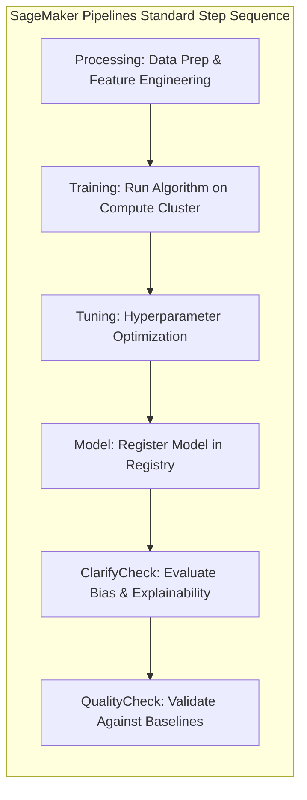

import ImageRow from '@site/src/components/ImageRow';
import ModelCard from './img/model-card.png';
import ModelDashboard from './img/model-dashboard.png';

# Amazon SageMaker AI: Model Governance, Monitoring, Registry & MLOps Pipelines

---

## Key Takeaways

Robust machine learning governance, monitoring, and MLOps automation ensure that production models remain accurate, compliant, secure, and auditable throughout their operational lifecycles.

Amazon SageMaker provides comprehensive tools for enterprise governance: **Model Cards** for standardized documentation, **Model Dashboard** for global visibility, **Role Manager** for permission scoping, **Model Monitor** for catching data and concept drift, **Model Registry** for versioning and governance approvals, and **SageMaker Pipelines** for automated MLOps CI/CD.

---

## Main Discussion

### Model Governance & Visibility Core Tools

| Governance Feature            | Primary Function                                                                                                                                       | Business & Compliance Value                                                                                                 |
| ----------------------------- | ------------------------------------------------------------------------------------------------------------------------------------------------------ | --------------------------------------------------------------------------------------------------------------------------- |
| **SageMaker Model Cards**     | Centralized, customizable factsheets documenting model metadata, training configuration, evaluation metrics, and risk ratings.                         | Establishes a single source of truth for regulatory compliance, auditing, and cross-functional transparency.                |
| **SageMaker Model Dashboard** | A centralized portal that aggregates all models, tracking which versions are serving live endpoints.                                                   | Provides instant operational visibility and surfaces compliance alerts when models violate performance or drift thresholds. |
| **SageMaker Role Manager**    | Defines granular permissions and security roles tailored to specific organizational personas (e.g., Data Scientists, MLOps Engineers, Data Engineers). | Enforces least-privilege access control across multi-user enterprise environments.                                          |

<ImageRow>
  
  
</ImageRow>

---

### Post-Deployment Monitoring: SageMaker Model Monitor

- **Continuous or Scheduled Monitoring:** Automatically analyzes production data payloads captured in Amazon S3 against established baseline statistics.
- **Catching Drift:** Detects **data drift** (changes in input feature distributions over time, such as applicants' credit scores shifting) and **model quality degradation** before failures impact users.
- **Automated Remediation:** Triggers Amazon CloudWatch alerts, enabling MLOps teams to retrain models or recalibrate upstream pipelines.

---

### Model Versioning & Approval: SageMaker Model Registry

- **Centralized Repository:** Catalogs, version-controls, and manages machine learning models across organizational groups.
- **Approval Workflows:** Implements rigorous governance gates by requiring explicit approval status (`Pending`, `Approved`, `Rejected`) before a model can be deployed to production endpoints.
- **Model Card Integration:** Model versions registered in the Model Registry can directly link to their corresponding Model Cards to ensure complete lineage and compliance.

---

### Automated MLOps: SageMaker Pipelines & Step Types

- **CI/CD for Machine Learning:** Automates the end-to-end orchestration of building, training, evaluating, testing, and deploying models.
- **Standard Pipeline Step Types:**
  - **Processing:** Executes data cleaning and feature engineering.
  - **Training & Tuning:** Trains models and optimizes hyperparameters.
  - **Model:** Registers finalized artifacts into the Model Registry.
  - **ClarifyCheck & QualityCheck:** Automatically validates models against data bias, drift, and quality thresholds before promotion.

---

## Exam Guide

### Exam Tips

- **Governance Artifact Disambiguation:**
  - To document model design, training details, intended use, and risk ratings $\rightarrow$ Use **SageMaker Model Cards**.
  - To maintain version control, lineage tracking, and explicit approval statuses before deployment $\rightarrow$ Use **SageMaker Model Registry**.
  - To view a centralized operational dashboard of all deployed endpoints and risk metrics $\rightarrow$ Use **SageMaker Model Dashboard**.
- **Monitoring Drift:** If a question asks how to detect data drift or model quality degradation after deployment, choose **SageMaker Model Monitor**.
- **MLOps Automation:** When an exam scenario describes automating the end-to-end building, training, testing, and deployment of models in a repeatable workflow, select **SageMaker Pipelines**.
- **Approval Gates:** In enterprise MLOps workflows, models must be explicitly marked as `Approved` in the Model Registry before automated CI/CD pipelines promote them to production endpoints.

---

### Practice Test

#### Question 1

An enterprise machine learning team needs to establish a centralized repository to catalog model iterations, track model lineage, and enforce strict governance policies requiring a lead data scientist to explicitly approve a model version before it can be promoted to a production endpoint. Which Amazon SageMaker feature fulfills this requirement?

- [ ] A. Amazon SageMaker Model Monitor
- [ ] B. Amazon SageMaker Model Registry
- [ ] C. Amazon SageMaker Feature Store
- [ ] D. Amazon SageMaker Data Wrangler

Correct Answer

- [x] B. Amazon SageMaker Model Registry
  - **Explanation:** **Amazon SageMaker Model Registry** provides centralized versioning, cataloging, lineage tracking, and structured approval workflows (`Pending`, `Approved`, `Rejected`) to govern model promotion to production.

---

#### Question 2

Six months after deploying a customer churn prediction model to production, the MLOps team notices that customer demographics have shifted, causing a degradation in prediction accuracy. Which SageMaker feature should be configured to continuously evaluate production inference payloads against baseline training data and trigger alerts when data drift occurs?

- [ ] A. SageMaker Model Monitor
- [ ] B. SageMaker Role Manager
- [ ] C. SageMaker JumpStart
- [ ] D. SageMaker Clarify Bias Detection

Correct Answer

- [x] A. SageMaker Model Monitor
  - **Explanation:** **Amazon SageMaker Model Monitor** tracks production endpoints continuously or on schedule to detect data drift, concept drift, and model quality deviation against established baseline metrics.

---
