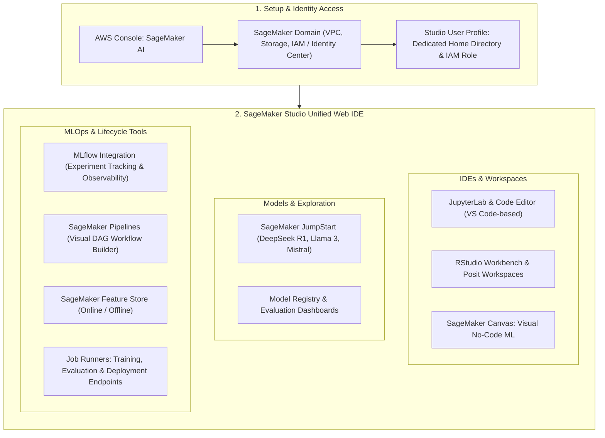

# Hands-On Lab: Amazon SageMaker AI Console, Studio Domains, IDEs & MLOps Tooling

---

## Key Takeaways

**Amazon SageMaker AI** is the core operational environment where machine learning engineers, data scientists, and developers build, train, fine-tune, and deploy models at scale.

Accessing SageMaker Studio requires provisioning a **SageMaker Domain** and associating a **User Profile** (which assigns an IAM execution role and storage directory). Within the unified Studio interface, users can launch IDEs (**JupyterLab**, **Code Editor**, **RStudio**, and **Canvas**), browse foundation models via **SageMaker JumpStart** (e.g., DeepSeek R1, Meta Llama), track experiments using integrated **MLflow**, design orchestration workflows with visual **Pipelines**, and manage assets in the **Feature Store**.

---

## Hands-On Workflow: Setting Up & Navigating the SageMaker AI Studio Environment

1. **Navigate to Amazon SageMaker AI in the Console:**
   - Open the AWS Management Console and search for **SageMaker AI**.
   - Select **Amazon SageMaker AI** (the service dedicated to building, training, and deploying custom ML models).  
     
   - If setting up for the first time, initiate the **SageMaker Studio Quick Setup** or standard enterprise domain onboarding.  
     
2. **Provision a SageMaker Domain & User Profile:**
   - Initialize the underlying identity and network boundary:
   - **SageMaker Domain:** Manages storage volumes (Amazon EFS), VPC networking settings, and authentication mode (IAM vs. IAM Identity Center).
   - **User Profile:** Creates a dedicated user workspace linked to a specific IAM execution role to control data and resource access policies.
   - Click **Open Studio** to launch the web-based IDE dashboard.  
     
3. **Explore Applications & Notebook Environments:**
   - Review the available workspace options:
   - **JupyterLab / Code Editor:** Web-based IDEs supporting interactive Python/R kernels with on-demand compute switching.  
     
   - **RStudio:** Dedicated environment for statistical analysis in R.
   - **SageMaker Canvas:** Direct access to visual, point-and-click predictive modeling for business analysts.
4. **Browse Open-Source & Foundation Models in JumpStart:**
   - Navigate to the **Models** section in the left panel:
   - Open **SageMaker JumpStart** to inspect the catalog of pre-trained foundation models (e.g., _DeepSeek R1_, _Meta Llama_, _Mistral_, _Stable Diffusion_).
   - View options to test, deploy with 1-click, or fine-tune models using custom training datasets.  
     
5. **Review MLOps: Experiments, Pipelines & Feature Store:**
   - Inspect the machine learning operations toolset:
   - **Experiments & MLflow:** Manage runs, compare parameter metrics, and observe training curves with integrated serverless MLflow.  
     
   - **Jobs & Evaluations:** Monitor active **Training Jobs**, **Model Evaluations**, and **Inference Optimizations**.  
     
   - **Pipelines:** Open the visual DAG editor to construct automated, repeatable CI/CD pipelines connecting data prep, training, and deployment steps.  
     
   - **Feature Store:** Centralize, discover, and share curated feature sets across online real-time inference and offline batch training pipelines.  
     

---

## SageMaker Studio Core Navigation Directory

| Studio Category                | Included Tools & Capabilities            | Primary Functionality                                                           |
| ------------------------------ | ---------------------------------------- | ------------------------------------------------------------------------------- |
| **Applications / IDEs**        | JupyterLab, Code Editor, RStudio, Canvas | Writing code, running interactive notebooks, building visual no-code models.    |
| **Models & Hubs**              | SageMaker JumpStart, Model Registry      | Discovering, testing, and deploying open-source LLMs and foundation models.     |
| **MLOps & Tracking**           | MLflow Integration, Experiments, Jobs    | Tracking metrics across training trials, managing hyperparameter tuning runs.   |
| **Automation & Orchestration** | SageMaker Pipelines (Visual Editor)      | Creating end-to-end automated workflows from data ingestion to model endpoints. |
| **Data & Feature Assets**      | Feature Store, Datasets, Evaluators      | Managing standardized features for low-latency retrieval and model evaluation.  |

---

## Exam Guide

### Exam Tips

- **Domain vs. User Profile:**
  - **SageMaker Domain:** The top-level administrative and network boundary that controls authentication, storage (EFS), and VPC configuration.
  - **User Profile:** Represents an individual practitioner or team member within a domain, defining their specific home directory and IAM execution role permissions.
- **SageMaker Studio:** The unified, browser-based integrated development environment (IDE) that serves as the central hub for data preparation, model training, MLflow experiment tracking, and pipeline management.
- **SageMaker JumpStart:** The built-in model hub within Studio used to discover, evaluate, fine-tune, and deploy popular open-source and proprietary foundation models with minimal custom infrastructure setup.
- **SageMaker Canvas Integration:** Business analysts can use SageMaker Canvas as a standalone visual tool or launch it directly from within a provisioned SageMaker Domain.

---

### Practice Test

#### Question 1

A data science team is onboarding several new data engineers and machine learning practitioners to Amazon SageMaker. The lead architect needs to set up a shared corporate workspace where each team member has their own dedicated home storage directory and distinct IAM execution role permissions, while sharing underlying VPC and authentication configurations. Which architectural component should be configured?

- [ ] A. Amazon EC2 Launch Template
- [ ] B. An Amazon SageMaker Domain with individual Studio User Profiles
- [ ] C. An Amazon Rekognition Custom Moderation Adapter
- [ ] D. AWS HealthScribe Dictation Group

Correct Answer

- [x] B. An Amazon SageMaker Domain with individual Studio User Profiles
  - **Explanation:** In Amazon SageMaker, an **Amazon SageMaker Domain** provides the shared network, storage, and security infrastructure, while individual **User Profiles** grant each team member their own isolated workspace directory and specific IAM execution role.

---

#### Question 2

A developer wants to explore and deploy an open-source large language model (such as Meta Llama or Mistral) inside Amazon SageMaker Studio without writing complex container configurations or provisioning custom training clusters from scratch. Which feature in SageMaker Studio should the developer access?

- [ ] A. SageMaker Clarify
- [ ] B. SageMaker JumpStart
- [ ] C. Amazon Textract AnalyzeLending
- [ ] D. Amazon Polly Pronunciation Lexicon

Correct Answer

- [x] B. SageMaker JumpStart
  - **Explanation:** **SageMaker JumpStart** is a built-in model hub within SageMaker Studio that offers a catalog of pre-trained foundation models and algorithms that can be deployed or fine-tuned with a few clicks.

---
