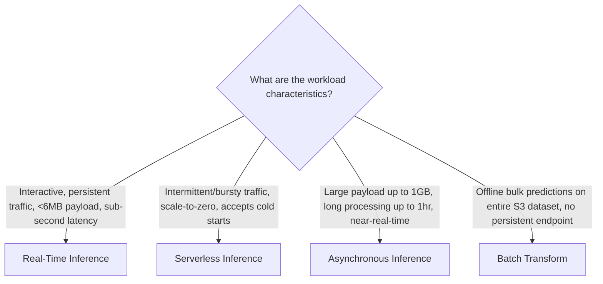
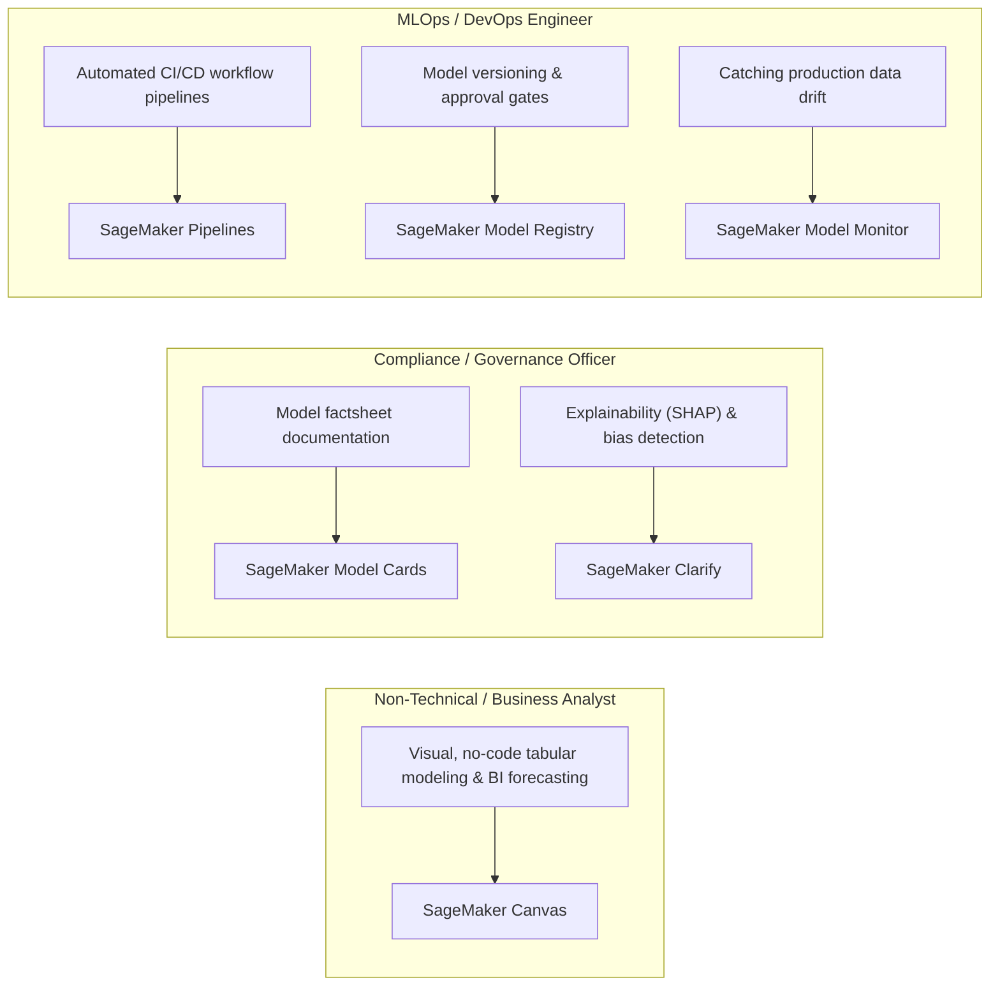

# Amazon SageMaker AI: Comprehensive Platform Architecture, Lifecycle Cheat Sheet & Exam Synthesis

---

## Key Takeaways

**Amazon SageMaker AI** is AWS’s unified, fully managed machine learning platform designed to streamline every stage of the predictive and generative machine learning lifecycle.

```mermaid
flowchart TD
    subgraph SMLifecycle [Amazon SageMaker AI End-to-End Lifecycle Architecture]
        direction TB

        subgraph Stage1 [1. Data Preparation & Feature Management]
            CanvasPrep["SageMaker Canvas: Visual, no-code data preparation & profiling"]
            FStore["SageMaker Feature Store: Low-latency Online Store & S3 Offline Store"]
            GTruth["SageMaker Ground Truth: RLHF preference alignment & human labeling"]
        end

        subgraph Stage2 [2. Model Exploration, Building & Training]
            StudioIDE["SageMaker Studio: Centralized web IDE"]
            JStart["SageMaker JumpStart: Hub for pre-trained FMs & ML solutions"]
            AMT_HPO["Automatic Model Tuning (AMT): Bayesian hyperparameter optimization & early stopping"]
            MLflowTrack["Managed MLflow: Serverless experiment tracking & metric logging"]
        end

        subgraph Stage3 [3. Deployment & Production Inference]
            RT_Inf["Real-Time Inference: Persistent instances, <60s processing"]
            SL_Inf["Serverless Inference: Auto scale-to-zero, cold starts"]
            Async_Inf["Asynchronous Inference: S3-backed queuing, up to 1GB payload"]
            Batch_Inf["Batch Transform: Offline bulk predictions on S3 datasets"]
        end

        subgraph Stage4 [4. Governance, Monitoring & MLOps Automation]
            Cards["Model Cards: Standardized metadata, risk ratings & intended uses"]
            Dashb["Model Dashboard: Centralized operational health & violation tracking"]
            Monit["Model Monitor: Continuous tracking for data & concept drift"]
            Regist["Model Registry: Version control & explicit manual approval gates"]
            Pipes["SageMaker Pipelines: Automated CI/CD MLOps workflow DAGs"]
            Roles["Role Manager: Persona-based least-privilege IAM scoping"]
            Clar["SageMaker Clarify: Bias detection, SHAP explainability & FM evaluation"]
        end
    end

    Stage1 --> Stage2 --> Stage3 --> Stage4
```

For the **AWS Certified AI Practitioner (AIF-C01)** exam, you need to map business requirements, latency profiles, and team personas to the correct SageMaker tool without writing custom code.

---

## Main Discussion

### Master Feature Directory: The Complete SageMaker AI Toolset

| SageMaker Feature / Component        | Lifecycle Phase           | Target Persona                             | Primary Function & Exam Trigger Keywords                                                                                                              |
| ------------------------------------ | ------------------------- | ------------------------------------------ | ----------------------------------------------------------------------------------------------------------------------------------------------------- |
| **SageMaker Studio**                 | Unified Workspace         | Data Scientists, Developers                | Centralized browser-based IDE integrating JupyterLab, Code Editor, experiment tracking, and pipelines.                                                |
| **SageMaker Canvas**                 | Data Prep / No-Code ML    | Business Analysts, Citizen Data Scientists | **No-code visual ML**. Prepares data, builds classification/regression models via AutoML, and runs ready-to-use AI services.                          |
| **SageMaker Feature Store**          | Data & Feature Ops        | Data Engineers, MLOps                      | Centralized catalog for sharing ML features across teams. Features an **Online Store** (low latency) and **Offline Store** (historical S3).           |
| **SageMaker Ground Truth**           | Data Labeling & Alignment | Data Labelers, GenAI Engineers             | Multi-modal human data labeling and **Reinforcement Learning from Human Feedback (RLHF)** to align models with human preferences.                     |
| **SageMaker JumpStart**              | Model Hub & Prototyping   | Developers, ML Engineers                   | Curated repository of **pre-trained open-source foundation models** (e.g., Llama, Mistral) and 1-click deployable enterprise solutions.               |
| **Automatic Model Tuning (AMT)**     | Model Optimization        | Data Scientists                            | Automated **Hyperparameter Optimization (HPO)** using Bayesian search and **early stopping** to prevent compute waste.                                |
| **Managed MLflow**                   | Experiment Tracking       | Data Scientists, MLOps                     | Serverless open-source MLflow tracking servers embedded in SageMaker to log parameters, metrics, and model artifacts.                                 |
| **SageMaker Real-Time Inference**    | Model Serving             | Application Developers                     | Persistent dedicated compute endpoints for interactive, low-latency applications with sustained traffic.                                              |
| **SageMaker Serverless Inference**   | Model Serving             | Application Developers                     | On-demand inference that **automatically scales to zero** during idle periods; suitable for bursty, intermittent workloads (cold starts possible).    |
| **SageMaker Asynchronous Inference** | Model Serving             | Application Developers                     | Non-blocking queued inference for **large payloads (up to 1 GB)** and long processing times (up to 1 hour) using S3 staging.                          |
| **SageMaker Batch Transform**        | Offline Inference         | Data Engineers                             | High-throughput bulk predictions over entire datasets in S3 without maintaining an active endpoint.                                                   |
| **SageMaker Clarify**                | Responsible AI            | Compliance Teams, Risk Officers            | Evaluates **pre/post-training bias**, provides **SHAP feature attribution explainability** (e.g., loan rejections), and benchmarks foundation models. |
| **SageMaker Model Monitor**          | Production Observability  | MLOps Engineers                            | Automatically detects **data drift, concept drift, and model quality degradation** on production endpoints.                                           |
| **SageMaker Model Cards**            | AI Governance             | Governance Officers, Auditors              | Standardized digital factsheets documenting model architecture, training data lineage, evaluation metrics, and intended use.                          |
| **SageMaker Model Dashboard**        | Operational Governance    | IT Admins, Lead Engineers                  | Centralized dashboard tracking all active model endpoints, alerts, and threshold violations in one place.                                             |
| **SageMaker Model Registry**         | MLOps & Versioning        | MLOps Engineers, Lead Reviewers            | Central repository to track model package versions, metadata lineage, and manage **approval statuses** (`Approved` / `Rejected`).                     |
| **SageMaker Pipelines**              | MLOps Automation          | DevOps / MLOps Engineers                   | Visual workflow orchestrator (DAG) implementing **CI/CD for machine learning** across data prep, training, evaluation, and deployment.                |
| **SageMaker Role Manager**           | Security & Access         | Security Admins, Cloud Architects          | Streamlined creation of least-privilege IAM roles mapped to specific ML job personas (Data Scientist, MLOps Engineer).                                |

---

### Key Exam Decision Matrices

#### 1. Selecting the Correct Inference Option

#### 2. Persona & Task Mapping

---

## Exam Guide

### Exam Tips

- **High-Level Architectural Scope:** On the AIF-C01 exam, you are never required to write low-level ML code or configure Dockerfiles; you are tested on **service identification and capability matching**.
- **Responsible AI & Governance Mapping:**
  - To explain **why** a model made a specific prediction (feature attribution / SHAP) or detect training data bias $\rightarrow$ **SageMaker Clarify**.
  - To document intended use, risk ratings, and training parameters for compliance $\rightarrow$ **SageMaker Model Cards**.
  - To enforce formal manual approval before production deployment $\rightarrow$ **SageMaker Model Registry**.
  - To detect post-deployment feature distribution changes (data drift) $\rightarrow$ **SageMaker Model Monitor**.
- **No-Code vs. Hub vs. AutoML:**
  - Business analysts needing a visual, no-code environment $\rightarrow$ **SageMaker Canvas**.
  - Developers deploying pre-trained foundation models with one click $\rightarrow$ **SageMaker JumpStart**.
  - Developers wanting automated ML with full code transparency and editable Python notebooks $\rightarrow$ **SageMaker Autopilot**.
- **Human Alignment:** For Reinforcement Learning from Human Feedback (RLHF) and data labeling workflows, the answer is **SageMaker Ground Truth**.

---

### Sample AIF-C01 Questions

#### Question 1

A loan underwriting firm deploys a machine learning model on Amazon SageMaker to evaluate mortgage applications. Regulatory authorities require the firm to provide rejected applicants with specific reasons explaining which financial attributes most heavily influenced the adverse decision. Which Amazon SageMaker feature provides this explainability?

- [ ] A. Amazon SageMaker Feature Store
- [ ] B. Amazon SageMaker Clarify
- [ ] C. Amazon SageMaker JumpStart
- [ ] D. Amazon SageMaker Data Wrangler

Correct Answer

- [x] B. Amazon SageMaker Clarify
  - **Explanation:** **Amazon SageMaker Clarify** provides model explainability using SHAP feature attribution to explain how individual input features contributed to a specific model output (such as loan denial reasons).

---

#### Question 2

An MLOps team needs to build an automated, repeatable continuous integration and continuous deployment (CI/CD) workflow on AWS that orchestrates data extraction, model training, bias verification, model registration, and automated deployment to staging endpoints. Which Amazon SageMaker service component should they use?

- [ ] A. Amazon SageMaker Pipelines
- [ ] B. Amazon SageMaker Role Manager
- [ ] C. Amazon SageMaker Canvas
- [ ] D. Amazon SageMaker Model Dashboard

Correct Answer

- [x] A. Amazon SageMaker Pipelines
  - **Explanation:** **Amazon SageMaker Pipelines** is a purpose-built CI/CD and workflow orchestration engine for machine learning that automates execution steps from data preparation to deployment.

---
