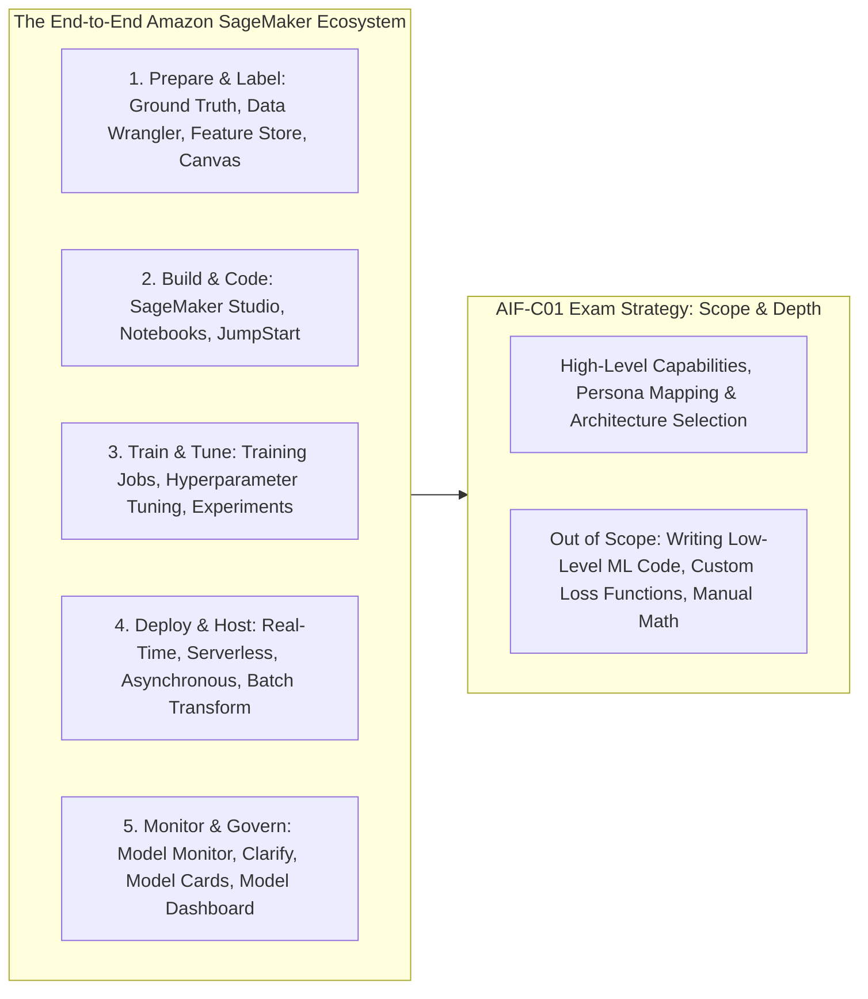
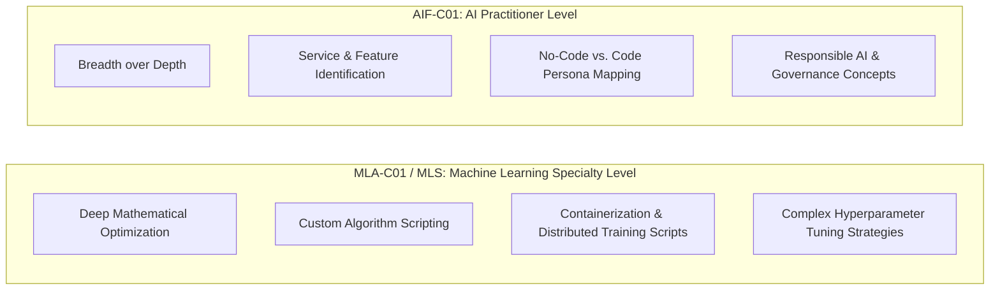
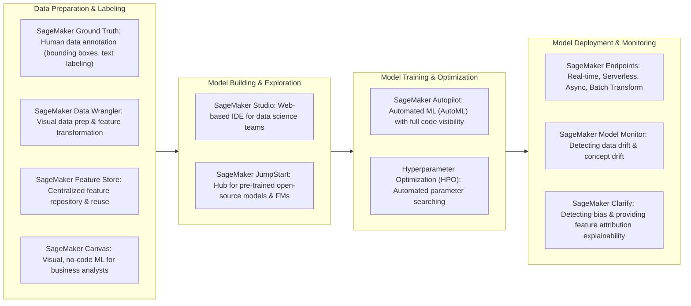

# Amazon SageMaker: Section Architecture, ML Lifecycle & AIF-C01 Exam Scope

---

## Key Takeaways

**Amazon SageMaker** is AWS's flagship, fully managed platform that brings the entire end-to-end machine learning lifecycle—from data preparation and labeling to model training, tuning, deployment, and monitoring—into a unified suite of tools.

For the **AWS Certified AI Practitioner (AIF-C01)** exam, the focus is strictly on **architectural selection, persona mapping, and high-level feature identification**. You are not expected to write low-level Python scripts, calculate backpropagation matrices, or debug container Dockerfiles; instead, you must know **what each SageMaker feature does and when to choose it over alternative AWS services**.

---

## Main Discussion

### Exam Scope Breakdown: AI Practitioner vs. ML Associate / Specialty

| Dimension              | AIF-C01 (Certified AI Practitioner)                                                   | MLA-C01 / MLS-C01 (Associate & Specialty)                                      |
| ---------------------- | ------------------------------------------------------------------------------------- | ------------------------------------------------------------------------------ |
| **Depth of Knowledge** | Conceptual and architectural (high level).                                            | Deep mathematical, algorithmic, and engineering implementation.                |
| **Coding & Scripting** | **None required**. Must understand visual and managed tools (e.g., SageMaker Canvas). | Python, PyTorch, TensorFlow, SageMaker Python SDK, Scikit-learn.               |
| **Primary Focus**      | Selecting the right tool for the right business persona and ML lifecycle phase.       | Optimizing model convergence, custom loss metrics, GPU memory management.      |
| **Hands-On Intensity** | Conceptual walkthroughs and console familiarity.                                      | End-to-end notebook execution, distributed training jobs, inference scripting. |

---

### The Amazon SageMaker Lifecycle Map for AIF-C01

---

### Core SageMaker Capability Directory

| SageMaker Feature                     | Target Persona                          | Primary Function in the ML Lifecycle                                                                                                                   |
| ------------------------------------- | --------------------------------------- | ------------------------------------------------------------------------------------------------------------------------------------------------------ |
| **SageMaker Canvas**                  | Business Analysts / Non-technical users | Visual, **no-code** machine learning to build predictive models and evaluate foundation models without writing code.                                   |
| **SageMaker Ground Truth**            | Data Labelers / ML Engineers            | Manages data labeling workflows using human workforces (MTurk, Private, Vendor) and active learning.                                                   |
| **SageMaker JumpStart**               | Developers / ML Engineers               | Hub of pre-trained foundation models and open-source architectures (Llama, Mistral, Stable Diffusion) ready for 1-click deployment or fine-tuning.     |
| **SageMaker Autopilot**               | Developers / Data Scientists            | Automated machine learning (**AutoML**) that automatically inspects tabular/text data, tests algorithms, and generates complete Python code notebooks. |
| **SageMaker Clarify**                 | ML Engineers / Compliance Teams         | Evaluates datasets and models for **bias**, imbalance, and generates **explainability reports** (SHAP feature attribution).                            |
| **SageMaker Model Monitor**           | MLOps Engineers                         | Monitors production endpoints to detect **data drift, concept drift, and model quality degradation** over time.                                        |
| **SageMaker Model Cards & Dashboard** | Compliance / AI Governance Teams        | Centralized catalog documenting model metadata, intended usage, evaluation metrics, and governance status.                                             |

---

## Exam Guide

### Exam Tips

- **Persona Mapping:**
  - If a scenario describes a **business analyst with zero coding background** who needs to build a churn prediction model $\rightarrow$ Choose **Amazon SageMaker Canvas**.
  - If a scenario describes a **developer who wants AutoML that outputs transparent, reusable code** $\rightarrow$ Choose **Amazon SageMaker Autopilot**.
  - If a scenario describes a developer who wants to **deploy pre-trained open-source models (like Llama or Mistral) with one click** $\rightarrow$ Choose **Amazon SageMaker JumpStart**.
- **Responsible AI & Governance:**
  - Detecting training data bias or model explainability $\rightarrow$ **Amazon SageMaker Clarify**.
  - Tracking production endpoint data drift $\rightarrow$ **Amazon SageMaker Model Monitor**.
  - Creating audit-ready governance documentation $\rightarrow$ **Amazon SageMaker Model Cards**.
- **Managed vs. Raw EC2:** SageMaker abstracts underlying infrastructure, automatically provisioning and tearing down compute instances for training and processing jobs.

---

### Practice Test

#### Question 1

A marketing analyst with no programming or data science background wants to predict customer churn based on historical spreadsheet data stored in Amazon S3. The analyst needs a visual, point-and-click tool to build, train, and generate predictions without writing Python code. Which AWS service or capability should they use?

- [ ] A. Amazon SageMaker JumpStart
- [ ] B. Amazon SageMaker Canvas
- [ ] C. Amazon EC2 `Trn1` instances
- [ ] D. AWS HealthScribe

Correct Answer

- [x] B. Amazon SageMaker Canvas
  - **Explanation:** **Amazon SageMaker Canvas** provides a visual, no-code interface specifically designed for business analysts to build ML models, prepare datasets, and generate predictions without writing code.

---

#### Question 2

A data science team is preparing for an enterprise governance audit. The team needs to generate standardized documentation for their deployed machine learning models, detailing model lineage, intended use cases, training parameters, and evaluation metrics. Which Amazon SageMaker feature fulfills this governance requirement?

- [ ] A. Amazon SageMaker Ground Truth
- [ ] B. Amazon SageMaker Model Cards
- [ ] C. Amazon SageMaker Feature Store
- [ ] D. Amazon SageMaker Data Wrangler

Correct Answer

- [x] B. Amazon SageMaker Model Cards
  - **Explanation:** **Amazon SageMaker Model Cards** are standardized digital documents that record critical governance metadata, intended use cases, training datasets, and performance evaluation metrics for production machine learning models.

---
