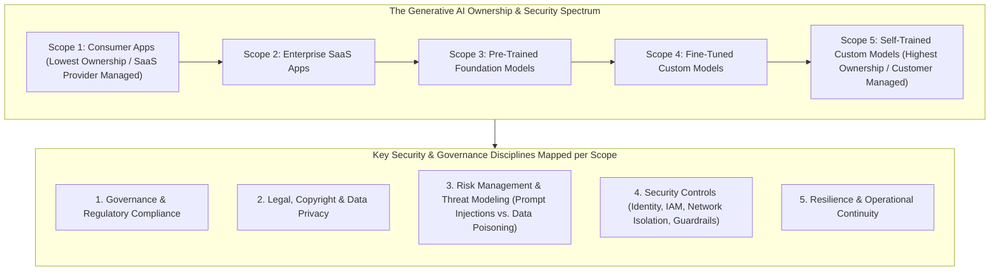
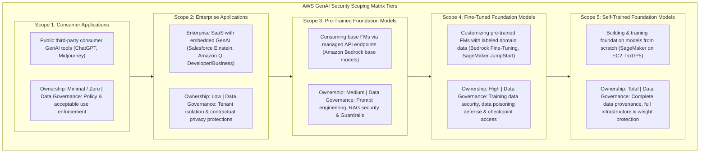
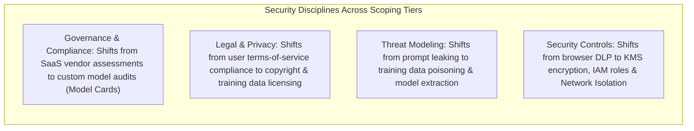

# Generative AI Security Scoping Matrix: Scopes 1 to 5, Ownership Spectrum & Risk Taxonomies

---

## Key Takeaways

The **AWS Generative AI Security Scoping Matrix** is a structured framework that categorizes generative AI applications into **five distinct scopes** based on the organization’s level of ownership, control, and customization over the underlying model and data.

- **Core Premise:** As an organization moves from consuming public generative AI tools (Scope 1) to training proprietary foundation models from scratch (Scope 5), **ownership, architectural control, and security responsibilities increase proportionally**.
- **Five Defined Scopes:** **Scope 1** (Consumer Applications), **Scope 2** (Enterprise Applications / SaaS), **Scope 3** (Pre-trained Foundation Models / APIs), **Scope 4** (Fine-tuned Foundation Models), and **Scope 5** (Self-trained Foundation Models).
- **Security Discipline Mapping:** Governance, legal/privacy exposure, threat vectors (prompt injection vs. data poisoning), access controls, and resilience requirements scale dynamically across each scope tier.

---

## Main Discussion

### The Five Scopes of the Generative AI Security Scoping Matrix

| Scope Level                      | Implementation Pattern                                                                                   | Representative AWS / Industry Services                                                              | Customer Ownership Level | Primary Risk & Security Focus                                                                                                                                                                               |
| -------------------------------- | -------------------------------------------------------------------------------------------------------- | --------------------------------------------------------------------------------------------------- | ------------------------ | ----------------------------------------------------------------------------------------------------------------------------------------------------------------------------------------------------------- |
| **Scope 1: Consumer Apps**       | Employees interacting directly with public, third-party consumer web applications.                       | ChatGPT, Midjourney, public web chatbots.                                                           | **Very Low / None**      | **Data Exfiltration & Privacy:** Employees inadvertently pasting confidential company IP, source code, or customer PII into public prompts. Managed via corporate acceptable use policies and endpoint DLP. |
| **Scope 2: Enterprise Apps**     | Enterprise-grade SaaS solutions with built-in generative AI features protected by enterprise contracts.  | **Amazon Q Developer**, **Amazon Q Business**, Salesforce Einstein GPT, Microsoft 365 Copilot.      | **Low**                  | **Access Control & Tenant Isolation:** Enforcing SSO/MFA, role-based access to corporate data sources, and verifying that enterprise prompts are not used to retrain external vendor models.                |
| **Scope 3: Pre-Trained Models**  | Building bespoke internal software on top of raw base foundation models accessed via APIs.               | **Amazon Bedrock** (Claude, Nova, Titan base models), **SageMaker JumpStart** zero-shot deployment. | **Medium**               | **Application & Prompt Security:** Mitigating prompt injections, jailbreaking, hallucinations, and securing external Retrieval Augmented Generation (RAG) vector pipelines using **Bedrock Guardrails**.    |
| **Scope 4: Fine-Tuned Models**   | Adapting existing foundation model weights using proprietary internal training and fine-tuning datasets. | **Amazon Bedrock Model Customization**, **SageMaker JumpStart Fine-Tuning**.                        | **High**                 | **Data Poisoning & Checkpoint Security:** Securing fine-tuning datasets against malicious poisoning, maintaining data lineage, and encrypting custom model weights in Amazon S3.                            |
| **Scope 5: Self-Trained Models** | Designing model architectures, collecting pre-training corpora, and training large models from scratch.  | **Amazon SageMaker AI** distributed training jobs running on **EC2 `Trn1`** or **`P5`** instances.  | **Full / Complete**      | **Full-Stack Governance & Infrastructure:** Data scraping legal compliance, copyright clearance, bias elimination, container security, network isolation, and high-performance compute security.            |

---

### Security Disciplines Mapped Across the 5 Scopes

#### 1. Governance and Compliance

- **Scopes 1 & 2:** Governance centers on vendor risk assessments, terms of service (ensuring the provider does not use customer data for model training), and tracking third-party AI tool adoption across the workforce.
- **Scopes 3 to 5:** Governance shifts to internal auditing, creating **Amazon SageMaker Model Cards**, tracking training data lineage, evaluating bias with **SageMaker Clarify**, and managing human-in-the-loop approval gates.

#### 2. Legal, Copyright & Data Privacy

- **Scopes 1 to 3:** Focuses on preventing data leakage (PII/PHI exposure) through user prompts.
- **Scopes 4 & 5:** Focuses on intellectual property rights, data licensing terms for pre-training corpora, copyright infringement risks in generated outputs, and right-to-erasure (GDPR) compliance within model weights.

#### 3. Risk Management & Threat Vectors

- **Pre-Trained / Inference Scopes (Scopes 2 & 3):** Primary threats are **Prompt Injections**, **Jailbreaks**, **Indirect Prompt Hijacking**, and **Inference Denial of Service (DoS)**.
- **Trained / Fine-Tuned Scopes (Scopes 4 & 5):** Primary threats expand to include **Training Data Poisoning**, **Model Weight Extraction / Theft**, and **Backdoor Attacks** embedded in the model parameters.

#### 4. Security Controls & Infrastructure

- **Low Scopes (1 & 2):** Identity Federation (IAM Identity Center), Multi-Factor Authentication (MFA), and Data Loss Prevention (DLP) agents.
- **High Scopes (3, 4 & 5):** Customer-Managed KMS Keys (CMKs), **Amazon VPC Endpoints (PrivateLink)**, **SageMaker Network Isolation Mode**, and strict IAM execution role scoping.

---

## Exam Guide

### Exam Tips

- **Five Scopes Hierarchy (Essential for AIF-C01):**
  - **Scope 1:** Public consumer AI tools (e.g., ChatGPT, Midjourney) $\rightarrow$ Lowest ownership, highest risk of unintentional data leakage.
  - **Scope 2:** Enterprise SaaS with integrated GenAI (e.g., Amazon Q Developer, Salesforce Einstein) $\rightarrow$ Low ownership, vendor-managed security with enterprise privacy terms.
  - **Scope 3:** Pre-trained Foundation Models accessed via APIs (e.g., Amazon Bedrock base models) $\rightarrow$ Medium ownership, developer-managed prompts and guardrails.
  - **Scope 4:** Fine-Tuned Foundation Models (e.g., Bedrock Custom Models, JumpStart Fine-Tuning) $\rightarrow$ High ownership, customer manages fine-tuning data and customized weights.
  - **Scope 5:** Self-Trained Models from scratch (e.g., custom models trained on SageMaker / EC2 Trn1) $\rightarrow$ Full ownership of the entire training stack, data provenance, and architecture.
- **Ownership vs. Security Responsibility Rule:** The higher the scope number, the more security responsibility shifts from the cloud/SaaS provider to the customer organization.
- **Threat Vector Disambiguation by Scope:**
  - **Scope 3 (Pre-trained):** Prompt injection, jailbreaking, and API rate limiting.
  - **Scopes 4 & 5 (Fine-tuned / Self-trained):** Data poisoning, dataset licensing compliance, and training data privacy.

---

### Practice Test

#### Question 1

An enterprise software team is developing an internal customer support assistant by invoking pre-trained foundation models hosted on Amazon Bedrock. The team is not fine-tuning the underlying model weights, but is augmenting prompts using internal corporate knowledge bases. According to the Generative AI Security Scoping Matrix, which scope does this architecture represent, and what is the primary security focus?

- [ ] A. Scope 1 (Consumer Applications); primary focus is personal web browser filtering
- [ ] B. Scope 3 (Pre-trained Models); primary focus is API access control, prompt injection defense, and RAG data security
- [ ] C. Scope 5 (Self-trained Models); primary focus is pre-training corpus copyright licensing
- [ ] D. Scope 2 (Enterprise SaaS); primary focus is third-party vendor SLA negotiations

Correct Answer

- [x] B. Scope 3 (Pre-trained Models); primary focus is API access control, prompt injection defense, and RAG data security
  - **Explanation:** **Scope 3 (Pre-trained Models)** covers applications built on top of pre-trained foundation model APIs (such as Amazon Bedrock base models) without custom weight fine-tuning. The primary security considerations involve securing API endpoints, preventing prompt injection attacks, configuring guardrails, and protecting data retrieved via RAG.

---

#### Question 2

A pharmaceutical company uses Amazon SageMaker on Amazon EC2 `Trn1` instances to build, architect, and train a proprietary 70-billion parameter biomedical foundation model from scratch using internal clinical research data. Which scope of the Generative AI Security Scoping Matrix applies to this workload?

- [ ] A. Scope 1
- [ ] B. Scope 2
- [ ] C. Scope 4
- [ ] D. Scope 5

Correct Answer

- [x] D. Scope 5
  - **Explanation:** **Scope 5 (Self-trained Models)** applies when an organization designs and trains a foundation model from scratch using its own data and compute infrastructure, assuming complete ownership and responsibility over the entire ML lifecycle, datasets, and security controls.

---
