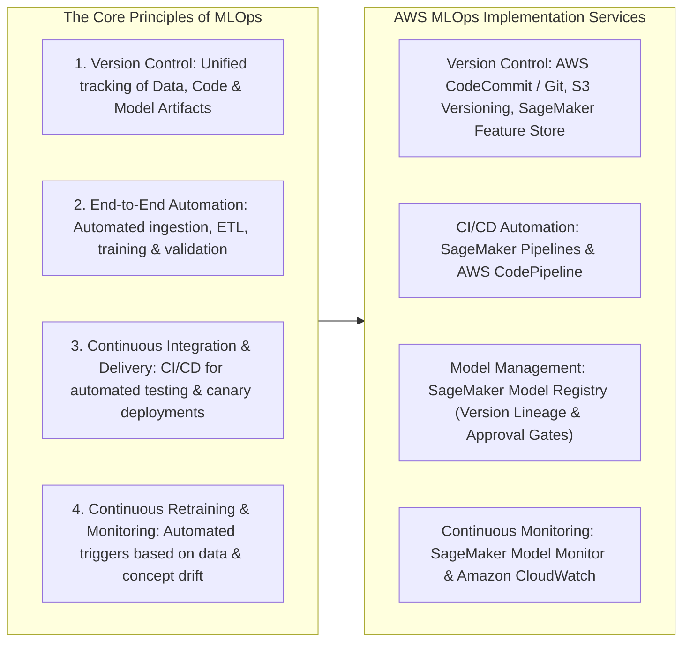
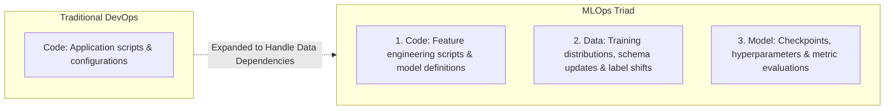
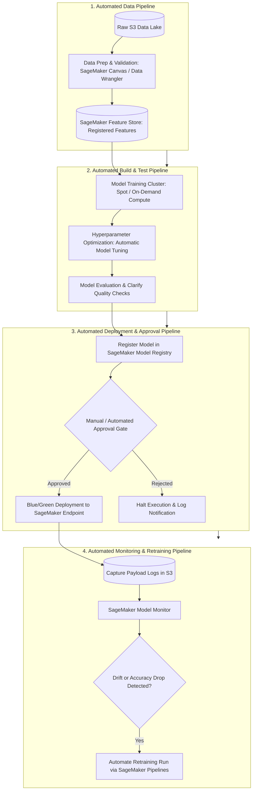
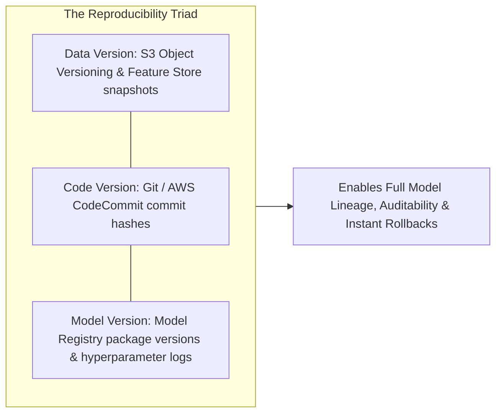

# Machine Learning Operations (MLOps): Principles, Lifecycle Automation & Operational Tooling

---

## Key Takeaways

**Machine Learning Operations (MLOps)** extends standard DevOps practices into machine learning to automate, standardize, and monitor the entire lifecycle—ensuring models transition smoothly from experimentation into production and are systematically retrained rather than deployed once and forgotten.

Key MLOps practices include:

- **The Triad of Version Control:** Tracking **Data versions**, **Code versions**, and **Model package versions** together to ensure reproducible training runs and fast rollbacks.
- **Continuous Lifecycle (CI/CD/CT/CM):** Automating **Continuous Integration** (testing code and validating models), **Continuous Delivery** (deploying endpoints with zero downtime), **Continuous Retraining** (triggering retraining runs as new data arrives), and **Continuous Monitoring** (catching data drift and performance drops).
- **AWS MLOps Architecture:** Orchestrating tasks using **SageMaker Pipelines** (visual DAGs), **SageMaker Model Registry** (governance approvals), and **SageMaker Model Monitor** (drift alarms).

---

## Main Discussion

### The MLOps Lifecycle: Beyond Traditional DevOps

While traditional DevOps focuses primarily on code changes and infrastructure state, MLOps must coordinate three independent, fast-moving variables:

| Lifecycle Dimension         | Traditional DevOps                                              | Machine Learning Operations (MLOps)                                                                                      |
| --------------------------- | --------------------------------------------------------------- | ------------------------------------------------------------------------------------------------------------------------ |
| **Artifacts Tracked**       | Application binaries, compiled code, and configuration scripts. | **Code**, dynamic **Datasets** (labels, features), and **Model artifacts** (weights, hyperparameters).                   |
| **Testing & CI**            | Unit tests, static code analysis, and integration tests.        | Unit tests, data quality validation, model evaluation metrics (F1, Accuracy, AUC), and bias checks (SageMaker Clarify).  |
| **Deployment & CD**         | Deploying verified software binaries to servers or containers.  | Deploying multi-model containers, configuring auto-scaling endpoints, canary routing, or batch transform jobs.           |
| **Operational Degradation** | Infrastructure failures, bugs, or network outages.              | **Data drift** (input distributions changing) and **concept drift** (relationships between inputs and outputs changing). |
| **Feedback Loop**           | Bug patches and feature releases.                               | **Continuous Retraining (CT)** triggered automatically by data arrival, performance alerts, or scheduled cadences.       |

---

### The End-to-End Automated MLOps Pipeline Architecture

1. **Automated Data Pipeline:** Cleans, engineers, and validates incoming data, saving curated features into the **SageMaker Feature Store**.
2. **Automated Building & Testing Pipeline:** Ephemeral compute clusters run training algorithms and tune hyperparameters, verifying the generated model against test splits and bias baselines via **SageMaker Clarify**.
3. **Deployment Pipeline:** Successfully evaluated models are packaged into the **SageMaker Model Registry**. Once marked as `Approved`, deployment pipelines roll out updates using canary or blue/green strategies to avoid downtime.
4. **Monitoring & Retraining Pipeline:** **SageMaker Model Monitor** inspects live request and response payloads, raising Amazon CloudWatch alarms that trigger automated retraining workflows when drift exceeds set thresholds.

---

### The Version Control Triad in MLOps

- **Data Versioning:** Ensures that every training run references the exact historical dataset snapshot used, preventing data leakage and enabling reproducible experiments.
- **Code Versioning:** Tracks preprocessing scripts, training code, and inference logic via Git-based repositories.
- **Model Versioning:** Maintains model checkpoints, performance metrics, and parameter configurations in the **SageMaker Model Registry**, enabling instant rollbacks to a previous version if a new deployment underperforms.

---

## Exam Guide

### Exam Tips

- **Core Purpose of MLOps:** Applying DevOps principles to machine learning to automate the lifecycle, maintain version control, ensure continuous retraining, and eliminate manual deployment friction.
- **The Triad of Version Control:** To guarantee reproducibility, an enterprise must version control three elements: **Data**, **Code**, and **Models**.
- **Key MLOps Lifecycle Triggers:**
  - **Continuous Retraining (CT):** Retraining models automatically upon the arrival of new labeled datasets or when Model Monitor flags performance degradation.
  - **Continuous Monitoring (CM):** Tracking production inference payloads to detect **data drift** and **concept drift** before users are impacted.
- **AWS Service Mappings:**
  - Automated workflow DAG execution $\rightarrow$ **SageMaker Pipelines**.
  - Model version tracking and deployment sign-offs $\rightarrow$ **SageMaker Model Registry**.
  - Endpoint health, drift detection, and automated alerting $\rightarrow$ **SageMaker Model Monitor** + **Amazon CloudWatch**.

---

### Practice Test

#### Question 1

An enterprise machine learning team wants to transition from manual, ad-hoc model training to a standardized MLOps practice. The lead engineer needs to ensure that any deployed production model can be rolled back to an earlier working state and that the exact data, code, and hyperparameters used during training can be reproduced for an audit. Which foundational MLOps principle directly addresses this requirement?

- [ ] A. Reinforcement Learning from Human Feedback (RLHF)
- [ ] B. Comprehensive version control across data, code, and model artifacts
- [ ] C. Prompt Attack Filtering in Guardrails for Amazon Bedrock
- [ ] D. Unsupervised Dimensionality Reduction using PCA

Correct Answer

- [x] B. Comprehensive version control across data, code, and model artifacts
  - **Explanation:** Comprehensive **version control across data, code, and model artifacts** is a core MLOps principle. It allows teams to reproduce historical training runs, audit decision lineage, and execute rollbacks to previous stable versions if a new model fails in production.

---

#### Question 2

A retail company uses an automated workflow that retrains a demand forecasting model whenever weekly sales data is uploaded to Amazon S3. After retraining, the model must be evaluated against accuracy baselines, registered in a central repository, and await a lead data scientist's formal approval before being deployed to a production endpoint. Which combination of Amazon SageMaker capabilities should be used to implement this automated MLOps workflow?

- [ ] A. Amazon SageMaker Pipelines and Amazon SageMaker Model Registry
- [ ] B. Amazon SageMaker Canvas ready-to-use models and Amazon Polly
- [ ] C. Amazon EC2 `Trn1` instances and AWS HealthScribe
- [ ] D. SageMaker JumpStart Public Hub and Amazon Rekognition Custom Labels

Correct Answer

- [x] A. Amazon SageMaker Pipelines and Amazon SageMaker Model Registry
  - **Explanation:** **Amazon SageMaker Pipelines** provides continuous integration and delivery (CI/CD) automation for machine learning workflows, while **Amazon SageMaker Model Registry** provides centralized model cataloging, version tracking, and formal approval status workflows (`PendingApproval`, `Approved`, `Rejected`) before deployment.

---
