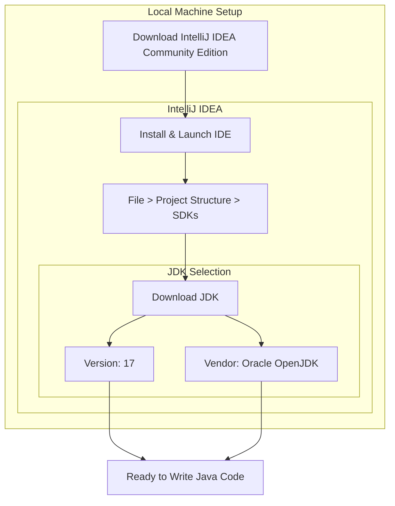
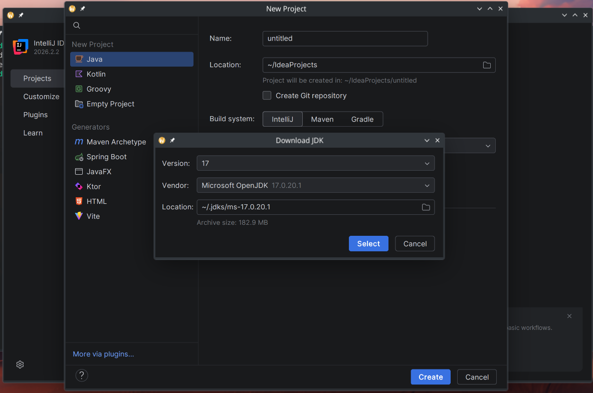

# Development Environment Setup: Installing IntelliJ IDEA and the JDK

---

## Key Takeaways

An Integrated Development Environment (IDE) is the software application where developers write and manage code, while the Java Development Kit (JDK) provides the underlying tools necessary to develop and run Java programs. IntelliJ IDEA Community Edition serves as a free, open-source IDE that simplifies development by allowing developers to download and configure the JDK directly from within its interface. Configuring Java 17 via OpenJDK provides the core open-source foundation required to begin programming in Java.



- **IDE Definition**: An IDE stands for Integrated Development Environment—the designated software environment used to write and organize application code.
- **IntelliJ IDEA Editions**: The Community Edition is the free, open-source version of IntelliJ IDEA supported across major operating systems (macOS, Windows, and Linux).
- **JDK Role**: Before writing or compiling Java code, the Java Development Kit (JDK) must be installed.
- **Integrated JDK Provisioning**: IntelliJ IDEA allows the JDK to be downloaded and configured internally via **File > Project Structure > SDKs**, avoiding external manual terminal setups.
- **Oracle OpenJDK**: Oracle owns Java, and OpenJDK is its free, open-source version.

---

## Main Discussion

### Idiomatic Java Code Snippets

Once IntelliJ IDEA and the JDK are installed, you can create a standard Java class to confirm that the editor and development kit function properly together:

```java
public class SetupCheck {

    public static void main(String[] args) {
        // Output confirmation to verify IDE and JDK functionality
        System.out.println("IntelliJ IDEA and JDK 17 are installed and ready.");
    }
}

```

### Under the Hood / JVM Mechanics

Setting up the environment establishes the relationship between the IDE interface and the underlying Java runtime:

1. **IDE Installation:** Download the OS-compatible installer for IntelliJ IDEA Community Edition and place it in the system applications directory.
   :::tip
   **On Ubuntu?**
   IntelliJ IDEA is also available as a snap package. If you’re on Ubuntu 16.04 or later, you can install IntelliJ IDEA from the command line.

   ```bash
   sudo snap install intellij-idea-ultimate --classic
   ```

   :::

2. **Project Structure Navigation:** Launch IntelliJ IDEA, open the application menu, and navigate to File followed by Project Structure.
3. **SDK Configuration:** Select SDKs under the Platform Settings menu to access the software development kit manager.
4. **JDK Retrieval and Association:** Click the + button, select Download JDK, specify version 17, choose Microsoft OpenJDK as the vendor, and confirm to install Java 17 directly into the IDE.  
   

### Structural Comparisons

| Feature / Tool       | IntelliJ IDEA Community Edition                                  | Java Development Kit (JDK)                | Microsoft OpenJDK                    |
| -------------------- | ---------------------------------------------------------------- | ----------------------------------------- | ------------------------------------ |
| **Category**         | Integrated Development Environment (IDE)                         | Development toolkit / SDK                 | Specific JDK vendor distribution     |
| **Primary Function** | Code editor and developer workspace                              | Required tools to write and run Java      | Free, open-source build of Java      |
| **Acquisition**      | Downloaded from [jetbrains.com/idea](https://jetbrains.com/idea) | Downloaded via IntelliJ Project Structure | Selected in the vendor dropdown menu |
| **Licensing**        | Free and open source                                             | Dependent on distribution                 | Free and open source                 |

### Common Anti-Patterns & Edge Cases

- **Selecting the Wrong OS Package**: Downloading an installer meant for a different operating system (e.g., Windows `.exe` on macOS) prevents installation. Always confirm the detected OS before clicking download.
- **Selecting an Incorrect JDK Version**: Choosing an older or newer version from the version dropdown instead of version `17` will misalign your project with the course requirements.
- **Confusing the IDE with the JDK**: Installing IntelliJ IDEA alone is not sufficient to write and run Java; attempting to code without configuring an SDK leaves the project unable to recognize Java instructions.

---

## Knowledge Check & JetBrains-Style Coding Challenges

### Theory Tips

- **IDE Acronym**: IDE stands strictly for _Integrated Development Environment_.
- **OpenJDK Ownership & Model**: Oracle is the owner of Java, and OpenJDK is the official free, open-source version of Java.
- **SDK Menu Path**: Inside IntelliJ IDEA, the JDK is provisioned under **File > Project Structure > SDKs**.

### Question 1: Conceptual / Code Analysis

What is the primary role of the JDK in relation to IntelliJ IDEA?

- [ ] **A.** IntelliJ IDEA is the programming language, while the JDK is the text editor used to type code.
- [ ] **B.** The JDK is an optional plugin used only for uploading code to JetBrains servers.
- [ ] **C.** IntelliJ IDEA is the IDE where code is written, whereas the JDK is the required kit that must be installed before writing Java code.
- [ ] **D.** The JDK replaces the operating system so that IntelliJ IDEA can run on macOS and Windows.

<details>
<summary>Correct Answer</summary>

**Correct Answer**: **C**

**Technical Breakdown**:

- **C is correct**: As explained in the lecture, IntelliJ IDEA is the IDE (Integrated Development Environment) where code is written, and the JDK (Java Development Kit) is the essential toolkit that must be installed before writing Java code.
- **A is incorrect**: Java is the programming language and IntelliJ IDEA is the IDE/editor, not the other way around.
- **B is incorrect**: The JDK is not a plugin for uploading code; it is required core software for Java development.
- **D is incorrect**: The JDK does not replace the host operating system; it runs on top of operating systems like macOS, Windows, or Linux.

</details>

---

### Question 2: Mini Coding Problem / Implementation Challenge

**Task**: Write a verification method `isEnvironmentReady` that takes two parameters: a `boolean hasIde` and a `String jdkVersion`.

The method should return `true` only if:

1. `hasIde` is `true`.
2. `jdkVersion` is exactly `"17"`.

Otherwise, return `false`.

**Test Assertions**:

- Input `true`, `"17"` $\rightarrow$ Returns: `true`
- Input `false`, `"17"` $\rightarrow$ Returns: `false`
- Input `true`, `"11"` $\rightarrow$ Returns: `false`
- Input `true`, `null` $\rightarrow$ Returns: `false`

```java
public class SetupValidator {

    public static boolean isEnvironmentReady(boolean hasIde, String jdkVersion) {
        if (!hasIde) {
            return false;
        }

        // Ensure JDK version matches the required Java 17 release
        return "17".equals(jdkVersion);
    }
}
```

**Complexity Analysis**:

- **Time Complexity**: $\mathcal{O}(1)$ because the check performs a direct boolean evaluation and a short, fixed-length string equality comparison.
- **Space Complexity**: $\mathcal{O}(1)$ auxiliary memory since no additional objects or dynamic data structures are allocated.
