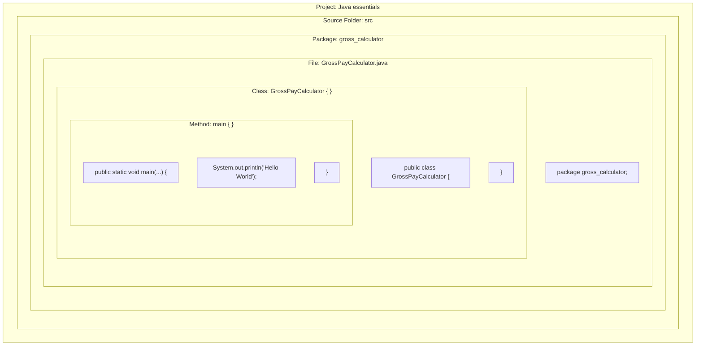

# Java Basics: Projects, Packages, Classes & Program Anatomy

---

## 1. Key Takeaways

A Java application is organized into a hierarchy: a project contains a source folder (`src`), which holds packages (folders used for logical grouping), which in turn house Java source files (`.java`) defining classes. Execution in Java requires a class with a defined entry point known as the `main` method, structured with matching blocks bounded by curly braces (`{}`) and executable statements terminated with semicolons (`;`). Java enforces strict syntactical rules regarding identifiers, statement termination, and reserved keywords that are designated specifically by the language specification.



- **Hierarchical Structure**: Projects contain source folders (`src`), source folders contain packages (folders/containers), and packages contain classes (`.java` files).
- **Logical Grouping**: Packages provide a namespace to organize related Java files, following an all-lowercase naming convention.
- **Naming Conventions**: Classes use PascalCase (words joined together, each starting with an uppercase letter, no spaces), while packages are entirely lowercase.
- **Grammar & Blocks**: Curly braces (`{}`) delimit blocks of code (classes, methods), while a semicolon (`;`) marks the end of an individual executable statement.
- **Reserved Words**: Specific keywords (such as `package`, `public`, `class`, `static`, `void`) have dedicated meanings in Java and cannot be used as custom identifiers.

---

## Main Discussion

### Idiomatic Java Code Snippets

A standard Java class file begins with the package declaration, followed by the class definition enclosing the `main` method and its statement:

```java
package gross_calculator;

public class GrossPayCalculator {

    public static void main(String[] args) {
        // A statement is an instruction to print a text string to the console
        System.out.println("Hello World");
    }
}
```

### Under the Hood / JVM Mechanics

Writing and executing basic Java files follows a sequential layout:

1. **Package Declaration:**
   The very first line of a Java file inside a package must specify the package location using the package keyword followed by the exact name and a semicolon (package gross_calculator;).
2. **Class Declaration and Enclosure:**
   A class is declared using public class GrossPayCalculator. Its body is enclosed inside an opening brace (`{`) and closing brace (`}`).
3. **Main Entry Point Definition:**
   Execution requires an entry point. Code must exist inside a method to execute. The main method defines its own block using curly braces.
4. **Statement Execution and Termination:**
   Each instruction inside the method (such as printing via System.out.println(...)) represents a statement and must end with a semicolon (;).

### Structural Comparisons

| Construct         | Convention / Syntax                   | Primary Purpose                                        | Examples                                       |
| ----------------- | ------------------------------------- | ------------------------------------------------------ | ---------------------------------------------- |
| **Package**       | All lowercase                         | Folder/container for logical grouping of related files | `gross_calculator`                             |
| **Class**         | PascalCase (No spaces, capital start) | Java file/entity that contains methods and code blocks | `GrossPayCalculator`                           |
| **Code Block**    | Enclosed in `{ }`                     | Groups lines of code belonging to a class or method    | `{ ... }`                                      |
| **Statement**     | Ends with `;`                         | A single executable instruction                        | `System.out.println("Hello World");`           |
| **Reserved Word** | Specific language syntax              | Built-in keywords that cannot be used as custom names  | `package`, `public`, `class`, `static`, `void` |

### Common Anti-Patterns & Edge Cases

- **Spaces in Class Names**: Attempting to name a class `Gross Pay Calculator` causes a compiler error. Java does not permit spaces in class identifiers; words must be concatenated directly (e.g., `GrossPayCalculator`).
- **Missing Semicolon**: Omitting the trailing `;` at the end of a statement (such as `System.out.println("Hello World")`) causes a syntax error: `; expected`.
- **Using Reserved Words as Identifiers**: Attempting to name a package, class, or method using a reserved word (e.g., naming a class `class` or `public`) triggers a syntax compilation error.
- **Incorrect Package Placement**: If the file resides inside `gross_calculator`, but the file omits `package gross_calculator;` or misspells the package name, the file will fail to resolve its path structure.

---

## Knowledge Check

### Theory Tips

- **Rule vs. Convention**: Using lowercase for packages and starting class names with an uppercase letter are **conventions** (adopted standards that won't break the build if violated), but having **no spaces in class names** and **ending statements with a semicolon** are strict **rules** (the program will not compile if violated).
- **String Definition**: A `String` in Java is a language construct used to represent text, enclosed in double quotation marks (e.g., `"Hello World"`).
- **Execution Rule**: In order to run any code from within a Java class, it must reside inside a method, specifically starting at the `main` method.

### Question 1: Conceptual / Code Analysis

Consider the following proposed Java file named `GrossPayCalculator.java`:

```java
package gross_calculator;

public class GrossPayCalculator {
    public static void main(String[] args) {
        System.out.println("Hello World")
    }
}
```

What occurs when attempting to build and run this code?

- [ ] **A.** The program runs and prints `Hello World` to the console.
- [ ] **B.** A compilation error occurs because `gross_calculator` must start with a capital letter.
- [ ] **C.** A compilation error occurs because the print statement is missing a closing semicolon (`;`).
- [ ] **D.** A runtime error occurs because `Hello World` must be enclosed in single quotation marks instead of double quotation marks.

<details>
<summary>Correct Answer</summary>

**Correct Answer**: **C**

**Technical Breakdown**:

- **C is correct**: Every executable statement in Java must end with a semicolon (`;`). Missing the semicolon after `System.out.println("Hello World")` results in a compilation failure.
- **A is incorrect**: The code cannot run because it fails during compilation due to the missing semicolon.
- **B is incorrect**: Package naming in all lowercase is standard convention; even if it had uppercase letters, it would still compile. It does not produce a syntax error.
- **D is incorrect**: In Java, strings (constructs for text) must be enclosed in double quotation marks (`"..."`), so the double quotes used here are syntactically correct.

</details>

---

### Question 2: Mini Coding Problem / Implementation Challenge

**Task**: Write a complete class named `MessagePrinter` that belongs to the package `printer_service`. Inside the class, implement the `main` method that issues two separate print statements using `System.out.println`:

1. Print the string `"Initializing system..."`
2. Print the string `"System ready."`

**Output Expectations**:

```text
Initializing system...
System ready.
```

```java
package printer_service;

public class MessagePrinter {

    public static void main(String[] args) {
        System.out.println("Initializing system...");
        System.out.println("System ready.");
    }
}

```

**Complexity Analysis**:

- **Time Complexity**: $\mathcal{O}(1)$ relative to program flow, executing two sequential I/O print statements to standard output.
- **Space Complexity**: $\mathcal{O}(1)$ auxiliary memory; literal string constants are allocated and referenced directly without dynamic data structures.
