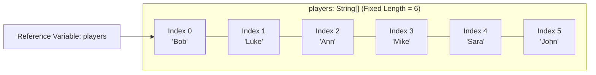

# Arrays: Fixed-Length Containers, Indexing Mechanics & Variable Arguments (Varargs)

---

## Key Takeaways

An array is a specialized container variable capable of holding multiple values of the same data type as a single entity. Arrays in Java have a fixed length established upon instantiation that cannot be resized dynamically. Each element functions like an individual variable accessed via a zero-based index (`0` to `length - 1`), while variable arguments (varargs, written as `Type...`) allow methods to accept zero, one, or multiple comma-separated values or an explicit array under a unified array-backed parameter.



- **Fixed Capacity**: The length of an array is determined at instantiation time and cannot grow or shrink during program execution.
- **Homogeneous Storage**: Every element stored within an array must conform to the array's declared data type.
- **Zero-Based Indexing**: Array positions begin at index `0`, meaning an array of size $N$ spans valid indices from `0` to $N - 1$.
- **Varargs Flexibility**: Declaring a method parameter with ellipsis (`int... numbers`) enables calling code to supply zero or more comma-separated arguments or a pre-allocated array.
- **Varargs Constraints**: A method parameter list can contain at most one varargs parameter, and it must unconditionally reside as the **last** parameter in the signature.

---

## Main Discussion / Deep Dive

### Idiomatic Java Code Snippets

#### 1. Array Declaration, Instantiation, and Traversal

An array can be instantiated with an explicit size or initialized with literal values using curly braces (`{}`):

```java
package arrays_demo;

public class HockeyRoster {

    public static void main(String[] args) {
        // Syntax 1: Instantiation with fixed length
        String[] players = new String[6];
        players[0] = "Bob";
        players[1] = "Luke";
        players[2] = "Ann";
        players[3] = "Mike";
        players[4] = "Sara";
        players[5] = "John";

        // Syntax 2: Initialization shortcut with inline literal values
        String[] startingLineup = {"Bob", "Luke", "Chad", "Sara", "Mike", "John"};

        // Array traversal using count-controlled loop
        boolean memberFound = false;
        String searchTarget = "Chad";

        for (int i = 0; i < startingLineup.length; i++) {
            if (startingLineup[i].equals(searchTarget)) {
                memberFound = true;
                break; // Premature exit once target is found
            }
        }

        System.out.println("Is " + searchTarget + " on the team? " + memberFound);
    }
}
```

#### 2. Variable Arguments (`varargs`) Implementation

The ellipsis (`...`) syntax treats incoming arguments as an array within the method body:

```java
package arrays_demo;

public class MathUtilities {

    // Varargs parameter: accepts 0, 1, or many ints, or an int[] array
    public static int calculateSum(int... numbers) {
        int sum = 0;

        // The varargs parameter is treated internally as an array
        for (int i = 0; i < numbers.length; i++) {
            sum += numbers[i];
        }

        return sum;
    }

    public static void main(String[] args) {
        // Invocation 1: Zero arguments
        System.out.println("Sum (0 args): " + calculateSum()); // Prints 0

        // Invocation 2: Two individual values
        System.out.println("Sum (2 args): " + calculateSum(2, 4)); // Prints 6

        // Invocation 3: Multiple individual values
        System.out.println("Sum (5 args): " + calculateSum(2, 4, 6, 8, 10)); // Prints 30

        // Invocation 4: Explicit array passing
        int[] scores = {5, 5, 5, 5};
        System.out.println("Sum (array): " + calculateSum(scores)); // Prints 20
    }
}
```

### Under the Hood / JVM Mechanics

1. **Array Instantiation and Heap Allocation:**
   Using the new keyword or the inline literal syntax `({...})` allocates a contiguous block of memory on the heap sized to hold the specified number of elements.

2. **Index Resolution via Base Address & Offset:**
   Array elements are accessed in constant time ($\mathcal{O}(1)$). The runtime computes an element's memory address by taking the array's base reference pointer and adding an offset calculated as index \* element_size.

3. **Varargs Syntactic Sugar Desugaring:**
   At compile time, javac desugars call sites using varargs. When arguments are supplied as a comma-separated list (e.g., calculateSum(2, 4)), the compiler automatically generates bytecode that creates an array (new int[]{2, 4}) before dispatching the invocation.

4. **Bounds Checking at Runtime:**
   Every index access is checked against the array's bounds. Attempting to access an index less than `0` or greater than or equal to the array's declared length causes the execution engine to halt normal execution with an index error.

### Structural Comparisons

#### Array Declaration and Instantiation Styles

| Style                      | Syntax                      | Length Source                       | Best Used When                                                           |
| -------------------------- | --------------------------- | ----------------------------------- | ------------------------------------------------------------------------ |
| **Explicit Allocation**    | `int[] arr = new int[5];`   | Stated explicitly in brackets `[5]` | Capacity is known, but values are populated dynamically later.           |
| **Bracket on Identifier**  | `int arr[] = new int[5];`   | Stated explicitly in brackets `[5]` | Permitted for compatibility; brackets on the type (`int[]`) is standard. |
| **Literal Initialization** | `int[] arr = {10, 20, 30};` | Inferred from number of items       | Exact element values are known at the point of declaration.              |

#### Fixed Parameter Array vs. Varargs

| Feature                     | Array Parameter (`int[] data`)                              | Varargs Parameter (`int... data`)                                  |
| --------------------------- | ----------------------------------------------------------- | ------------------------------------------------------------------ |
| **Call Site Flexibility**   | Requires passing a pre-existing or anonymous array instance | Accepts comma-separated values, no arguments, or an array instance |
| **Method Signature Limit**  | Can appear multiple times in any parameter position         | **At most one** vararg per method signature                        |
| **Parameter Ordering**      | Can be placed anywhere in the parameter list                | Must strictly be the **final parameter** in the method header      |
| **Internal Representation** | Handled internally as an array                              | Handled internally as an array                                     |

### Common Anti-Patterns & Edge Cases

- **Placing Varargs Before Other Parameters**: Declaring `public void log(String... tags, String message)` triggers a compile-time failure. The vararg must be the last parameter (`String message, String... tags`) so the compiler can bind earlier arguments deterministically.
- **Declaring Multiple Varargs**: Writing `public void configure(int... ports, String... hosts)` is illegal. A method can have only one variable-length parameter.
- **Attempting to Resize an Array**: Once initialized, an array's capacity cannot be expanded. If more slots are needed, an entirely new array with larger capacity must be instantiated.
- **Off-By-One Indexing**: Accessing `array[array.length]` instead of `array[array.length - 1]` causes a runtime index error. Because arrays are zero-indexed, an array of length 6 contains elements only at indices 0 through 5.

---

## Knowledge Check & JetBrains-Style Coding Challenges

### Theory Tips

- **Bracket Placement**: Both `int[] scores` and `int scores[]` are valid Java syntax, but placing brackets immediately following the type (`int[]`) is the standard convention.
- **Array Length Property**: An array's length is accessed via its public field property `.length` (without parentheses), unlike `String.length()`, which is a method call.
- **Empty Varargs Invocations**: Calling a varargs method with no arguments (e.g., `calculateSum()`) passes an array of length `0` (`new int[0]`), not `null`.

### Question 1: Conceptual / Code Analysis

Consider the following method header declarations:

```java
public class ServiceRegistry {
    // Declaration 1
    public void register(int id, String... aliases) { }

    // Declaration 2
    public void configure(String... flags, int mode) { }

    // Declaration 3
    public void process(double rate, int... thresholds, String... labels) { }

    // Declaration 4
    public void track(int[] counts, double... metrics) { }
}
```

Which of the above declarations will compile without errors?

- [ ] **A** Declarations 1 and 4 only
- [ ] **B** Declarations 1, 2, and 4 only
- [ ] **C** Declarations 1 and 3 only
- [ ] **D** All four declarations compile successfully

<details>
<summary>Correct Answer</summary>

**Correct Answer**: **A**

**Technical Breakdown**:

- **A is correct**: Declaration 1 is valid because `aliases` is the sole varargs parameter and is placed in the final parameter position. Declaration 4 is valid because `counts` is a regular array parameter and `metrics` is the sole vararg placed in the final position.
- **B is incorrect**: Declaration 2 fails compilation because the vararg `flags` precedes the standard parameter `mode`. A vararg must always be the final parameter.
- **C is incorrect**: Declaration 3 fails compilation because it defines two varargs parameters (`thresholds` and `labels`). Only one vararg is allowed per method signature.
- **D is incorrect**: Declarations 2 and 3 violate Java's vararg placement and count rules.

</details>

---

### Question 2: Mini Coding Problem / Implementation Challenge

**Task**: Implement a utility class named `BingoCardGenerator` that constructs a column of numbers for a Bingo game. The class must contain two methods:

1. `elementExists(int[] array, int value)`: Traverses the array up to the current count of populated entries and returns `true` if `value` is present, or `false` otherwise.
2. `generateColumn(int min, int max, int[] randomPool)`: Populates and returns an integer array of size `5`. It iteratively consumes values from `randomPool` (which provides test values in order) within the inclusive range `[min, max]`. Values outside the range or duplicate values already added to the column must be skipped until exactly 5 unique, valid numbers are placed in the column.

**Test Assertions**:

- `elementExists(new int[]{5, 12, 0, 0, 0}, 12)` $\rightarrow$ Returns: `true`
- `elementExists(new int[]{5, 12, 0, 0, 0}, 8)` $\rightarrow$ Returns: `false`
- `generateColumn(1, 15, new int[]{3, 18, 3, 7, 12, 1, 15})` $\rightarrow$ Returns: `[3, 7, 12, 1, 15]` (skips `18` because it is out of range, and skips the second `3` because it is duplicate).

```java
package arrays_demo;

public class BingoCardGenerator {

    // Helper method to verify element presence and prevent duplicates
    public static boolean elementExists(int[] array, int value) {
        for (int i = 0; i < array.length; i++) {
            if (array[i] == value) {
                return true;
            }
        }
        return false;
    }

    public static int[] generateColumn(int min, int max, int[] randomPool) {
        int[] column = new int[5];
        int count = 0;
        int poolIndex = 0;

        // Loop until exactly 5 unique elements fill the column
        while (count < column.length && poolIndex < randomPool.length) {
            int candidate = randomPool[poolIndex];
            poolIndex++;

            // Validate range boundaries
            if (candidate >= min && candidate <= max) {
                // Ensure number is unique within the populated portion
                if (!elementExists(column, candidate)) {
                    column[count] = candidate;
                    count++;
                }
            }
        }

        return column;
    }
}

```

**Complexity Analysis**:

- **Time Complexity**: $\mathcal{O}(K \cdot N)$ where $N = 5$ is the fixed length of the column and $K$ is the number of candidates inspected from the pool. For each valid candidate, `elementExists` checks up to $N$ slots. Because $N = 5$ is constant, this operations runs in $\mathcal{O}(K)$ time.
- **Space Complexity**: $\mathcal{O}(1)$ auxiliary space; allocates a single 5-element array on the heap.
