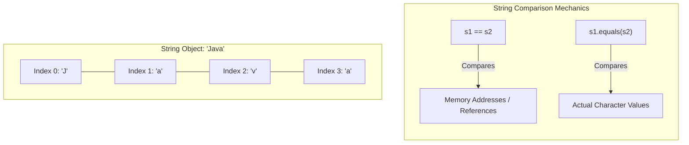

# Text Processing: String Objects, Character Manipulation & Text Blocks

---

## Key Takeaways

In Java, a `String` is neither a primitive data type nor a wrapper class; it is an immutable object representing a sequence of characters accessible by index. The `String` class provides utility methods for tokenization, formatted output, character inspection, case transformation, and pattern matching. While single-line strings rely on escape characters and concatenation across line breaks, Java text blocks (`"""`) provide multiline string literals without manual escape sequences, improving readability for structured formats such as JSON or SQL.



- **Object Character Nature**: A string operates conceptually as a character array; individual characters are extracted using `charAt(index)` from index `0` through `length() - 1`.
- **Value Equality vs. Reference Identity**: Strings (and all other reference objects) must be compared for content equality using `.equals()`; using `==` checks only whether two variables point to the same memory location.
- **Text Block Syntax Rules**: Text blocks open and close with triple quotation marks (`"""`). The content cannot begin on the same line as the opening `"""`; a line break must immediately follow the opening delimiter.
- **Convenience Utilities**: Standard methods like `split(delimiter)`, `String.format()`, `length()`, `toLowerCase()`, `toUpperCase()`, `contains()`, and `matches()` handle parsing and validation without manual character-by-character loops.

---

## Main Discussion / Deep Dive

### Idiomatic Java Code Snippets

#### 1. Tokenizing, Formatting, and Reversing Strings

Strings can be broken apart into an array of tokens via `split()` or processed backward to reverse character order:

```java
package text_processing;

public class StringOperations {

    public static void main(String[] args) {
        String phrase = "I love Java";

        // Count words by splitting on whitespace
        countWords(phrase);

        // Reverse character sequence
        reverseString("stop");
    }

    public static void countWords(String text) {
        // Split using a whitespace delimiter into an array of strings
        String[] words = text.split(" ");
        int numberOfWords = words.length;

        // Use format with %d digit placeholder
        String message = String.format("Your text contains %d words", numberOfWords);
        System.out.println(message);

        // Traverse the resulting string array
        for (int i = 0; i < words.length; i++) {
            System.out.println(words[i]);
        }
    }

    public static void reverseString(String text) {
        // Loop backward from last index (length - 1) down to 0
        for (int i = text.length() - 1; i >= 0; i--) {
            // print instead of println keeps output on the same line
            System.out.print(text.charAt(i));
        }
        System.out.println(); // Terminal line break
    }
}
```

#### 2. Multiline Formatting: Concatenation vs. Text Blocks

Text blocks remove boilerplate escape characters for formatted payloads:

```java
package text_processing;

public class TextBlockComparison {

    public static void main(String[] args) {
        // Traditional approach: requires explicit escape quotes (\"), newlines (\n), and concatenation
        String legacyJson = "{\n" +
                            "  \"language\": \"Java\",\n" +
                            "  \"version\": 17\n" +
                            "}";

        // Modern approach: multiline text block with three double quotes
        // Opening delimiter must be followed immediately by a newline
        String modernJson = """
                {
                  "language": "Java",
                  "version": 17
                }
                """;

        System.out.println(legacyJson.equals(modernJson)); // Compares character content: true
    }
}
```

### Under the Hood / JVM Mechanics

1. **String Instantiation & Underlying Sequence:**
   Instantiating a String allocates an immutable object on the heap that encapsulates an internal sequence of characters. Length is accessed via the length() method, which reads the internal character count.

2. **Token Generation via Split:**
   Invoking text.split(delimiter) scans the character sequence for matching delimiters, partitions the character sequences between tokens, and allocates a new String[] array containing each isolated substring.

3. **Reference Comparison (==) vs Value Inspection (.equals):**
   The == operator compares the raw reference pointer (heap memory address) stored within the reference variables. The .equals(Object) method iterates through the character sequences of both strings, returning true only if every character matches at every corresponding index.

4. **Text Block Compile-Time Normalization:**
   During compilation, javac strips accidental common leading indentation (incidental whitespace) from text blocks, translating the block directly into standard string bytecode without runtime string-concatenation overhead.

### Structural Comparisons

#### String Utility Methods

| Method                             | Return Type | Purpose                                                  | Typical Use Case                                  |
| ---------------------------------- | ----------- | -------------------------------------------------------- | ------------------------------------------------- |
| `length()`                         | `int`       | Returns total number of characters                       | Loop boundaries and length validation             |
| `charAt(int index)`                | `char`      | Retrieves character at specified 0-based index           | Character inspection, string reversal             |
| `split(String delimiter)`          | `String[]`  | Divides string into an array around matches              | Word counting, CSV/token parsing                  |
| `String.format(String, Object...)` | `String`    | Creates formatted strings with placeholders (e.g., `%d`) | Constructing dynamic status messages              |
| `equals(Object anObject)`          | `boolean`   | Checks for identical character content                   | Comparing user input, matching credentials        |
| `toLowerCase()` / `toUpperCase()`  | `String`    | Returns converted copy in lower or upper case            | Case-insensitive comparisons, casing checks       |
| `contains(CharSequence s)`         | `boolean`   | Verifies presence of a substring                         | Checking if a string contains forbidden words     |
| `matches(String regex)`            | `boolean`   | Tests if string matches a regular expression pattern     | Checking alphanumeric formats, special characters |

#### Traditional String Literals vs. Text Blocks

| Feature               | Single-Line String (`"..."`)                   | Text Block (`"""..."""`)                                   |
| --------------------- | ---------------------------------------------- | ---------------------------------------------------------- |
| **Multiline Support** | Requires manual `\n` and `+` concatenation     | Native multiline across editor rows                        |
| **Opening Syntax**    | Single quotation mark `"` on same line as text | Triple quotation marks `"""` followed by mandatory newline |
| **Quote Escaping**    | Internal `"` must be escaped as `\"`           | Internal `"` does not need escaping                        |
| **Resulting Type**    | `java.lang.String`                             | `java.lang.String`                                         |

### Common Anti-Patterns & Edge Cases

- **Using `==` Instead of `.equals()`**: Comparing two strings via `if (password == "Secret123")`checks whether both references share the same memory location, rather than comparing their character content. Always use`.equals()`.
- **Same-Line Text Block Initialization**: Writing `String query = """SELECT * FROM users;""";` triggers a compilation error: `illegal text block start: missing new line after opening quotes`.
- **String Index Bounds Violation**: Calling `text.charAt(text.length())` results in an index out-of-bounds runtime error because the last character resides at `text.length() - 1`.
- **Field vs. Method Length Confusion**: Writing `text.length` without parentheses causes a compilation failure; unlike arrays which use the `.length` field, `String` exposes `.length()` as an accessor method.

---

## Knowledge Check & JetBrains-Style Coding Challenges

### Theory Tips

- **Text Block Opening Rule**: The opening `"""` must be followed by a line terminator before any text content appears.
- **Placeholder Rules in `format()`**: The placeholder `%d` formats decimal integers; passing mismatched argument types causes runtime formatting errors.
- **Case-Insensitive Check Pattern**: To detect whether a string has uppercase letters without writing custom loop conditions, compare `text` with `text.toLowerCase()`. If they are equal, the original string contains no uppercase characters.

### Question 1: Conceptual / Code Analysis

Consider the following code snippet:

```java
String input1 = "admin";
String input2 = new String("admin");

boolean comparison1 = (input1 == input2);
boolean comparison2 = input1.equals(input2);

System.out.println(comparison1 + " " + comparison2);

```

What is printed to the console?

- [ ] **A** `true true`
- [ ] **B** `false true`
- [ ] **C** `true false`
- [ ] **D** A compilation error occurs because `new String()` cannot be compared with a string literal.

<details>
<summary>Correct Answer</summary>

**Correct Answer**: **B**

**Technical Breakdown**:

- **B is correct**: `==` checks reference equality (whether `input1` and `input2` point to the exact same object in memory). Because `input2` is instantiated explicitly with `new String(...)`, it is allocated as a distinct object in memory, making `input1 == input2` evaluate to `false`. Conversely, `.equals()` compares the sequence of characters inside both strings; because both contain `"admin"`, `input1.equals(input2)` evaluates to `true`.
- **A is incorrect**: `==` evaluates to `false` because they do not share the same reference.
- **C is incorrect**: `.equals()` evaluates to `true`, not `false`.
- **D is incorrect**: Instantiating strings using `new String(...)` and comparing them via `==` and `.equals()` is valid Java syntax.

</details>

---

### Question 2: Mini Coding Problem / Implementation Challenge

**Task**: Implement a password security validation method named `validatePassword` inside class `PasswordValidator`. The method takes a proposed password `String`, an existing `String oldPassword`, and a `String username`.

The password is valid (returns `true`) only if all of the following rules are satisfied:

1. It must contain at least `8` characters.
2. It must contain at least one uppercase letter (hint: check if the string equals its lowercase version).
3. It must contain at least one special character (hint: check if the string fails to match an alphanumeric-only pattern `[a-zA-Z0-9]+`).
4. It must not contain the username, evaluated case-insensitively (hint: convert both to uppercase and check `.contains()`).
5. It must not be identical to `oldPassword` using `.equals()`.

If any rule fails, return `false`.

**Test Assertions**:

- `validatePassword("P@$sword1", "OldPass123!", "john")` $\rightarrow$ Returns: `true`
- `validatePassword("p@ss1", "OldPass123!", "john")` $\rightarrow$ Returns: `false` (length < 8)
- `validatePassword("password!1", "OldPass123!", "john")` $\rightarrow$ Returns: `false` (no uppercase)
- `validatePassword("Password123", "OldPass123!", "john")` $\rightarrow$ Returns: `false` (no special characters)
- `validatePassword("JohnSecure!1", "OldPass123!", "john")` $\rightarrow$ Returns: `false` (contains username)
- `validatePassword("OldPass123!", "OldPass123!", "john")` $\rightarrow$ Returns: `false` (identical to old password)

```java
package text_processing;

public class PasswordValidator {

    public static boolean validatePassword(String password, String oldPassword, String username) {
        boolean isValid = true;

        // Rule 1: Minimum 8 characters
        if (password.length() < 8) {
            isValid = false;
        }

        // Rule 2: Contains at least one uppercase letter
        // If the password matches its all-lowercase version, no uppercase characters exist
        if (password.equals(password.toLowerCase())) {
            isValid = false;
        }

        // Rule 3: Contains at least one special character
        // If it matches purely alphanumeric characters, it lacks special characters
        if (password.matches("[a-zA-Z0-9]+")) {
            isValid = false;
        }

        // Rule 4: Must not contain the username (case-insensitive)
        if (password.toUpperCase().contains(username.toUpperCase())) {
            isValid = false;
        }

        // Rule 5: Cannot be identical to the old password
        if (password.equals(oldPassword)) {
            isValid = false;
        }

        return isValid;
    }
}

```

**Complexity Analysis**:

- **Time Complexity**: $\mathcal{O}(N + M)$ where $N$ is the character length of the proposed password and $M$ is the character length of the username. Operations such as `.toLowerCase()`, `.matches()`, and `.contains()` traverse the strings in linear time.
- **Space Complexity**: $\mathcal{O}(N + M)$ auxiliary memory on the heap created during case conversion transformations (`toLowerCase()` and `toUpperCase()`).
