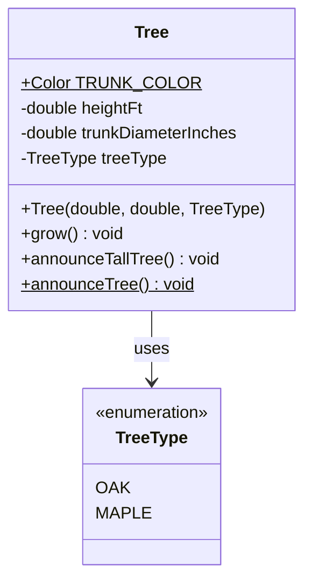

# Object Construction, Memory Architecture & Member Scope: Instance vs. Static

---

## Key Takeaways

Java objects are instantiated from class blueprints using **constructors** paired with the `new` operator, allocating isolated blocks of memory on the heap. Instance attributes represent the distinct, mutable state of an individual object, while instance methods operate directly on that state via the implicit `this` reference. Conversely, **static members** belong strictly to the class namespace itself, residing in Metaspace / static memory rather than within individual heap objects. Attempting to reference non-static instance fields or methods from a static context results in a compile-time failure because no object instance (`this`) exists in that context.



- **Constructor Semantics**: A constructor shares the exact name of its declaring class, carries **no return type** (not even `void`), and initializes newly allocated heap memory.
- **The `this` Keyword**: Resolves shadowing between constructor/method parameters and instance fields, providing an explicit reference to the current object executing the code.
- **Instance Independence**: Multiple instances of the same class maintain completely independent field values in heap memory; mutating one instance's state has zero effect on other instances.
- **Static Context Invariant**: Members marked with `static` belong to the class. A static method cannot access non-static instance members directly, nor can it use the `this` keyword.
- **JDK Source Code Architecture**: Built-in classes like `java.awt.Color` demonstrate production design patterns by combining static constants (e.g., predefined color palettes) with instance-level state and transformation methods (e.g., `.brighter()`, `.darker()`).

---

## Main Discussion

### Idiomatic Java Code Snippets

#### 1. Constructor Initialization & Dual-Scope Architecture (`Tree.java`)

Contrasting instance fields and behaviors against class-level static constants and static methods:

```java
package oop_foundations;

import java.awt.Color;

public class Tree {

    // 1. Static (Class-level) Members
    // Belongs to the class blueprint itself; shared across all instances
    public static final Color TRUNK_COLOR = new Color(102, 51, 0); // Custom Brown (R, G, B)

    // 2. Non-Static (Instance-level) Attributes / State
    // Stored independently per heap allocation
    private double heightFt;
    private double trunkDiameterInches;
    private TreeType treeType;

    // 3. Constructor
    // No return type; initializes instance fields using 'this' to resolve variable shadowing
    public Tree(double heightFt, double trunkDiameterInches, TreeType treeType) {
        this.heightFt = heightFt;
        this.trunkDiameterInches = trunkDiameterInches;
        this.treeType = treeType;
    }

    // 4. Instance Behavior (Non-static)
    // Implicitly receives 'this' pointer; operates on the calling object's state
    public void grow() {
        this.heightFt += 10.0;
        this.trunkDiameterInches += 1.0;
    }

    public void announceTallTree() {
        if (this.heightFt > 100.0) {
            System.out.println("That's a tall " + this.treeType + " tree!");
        }
    }

    // 5. Static Behavior (Class-level)
    // Called via Tree.announceTree(); cannot reference this.heightFt or treeType
    public static void announceTree() {
        System.out.println("Look out for that tree! (Trunk color RGB: " + TRUNK_COLOR + ")");
    }

    // Getters
    public double getHeightFt() { return heightFt; }
    public double getTrunkDiameterInches() { return trunkDiameterInches; }
    public TreeType getTreeType() { return treeType; }
}
```

#### 2. Instantiating Concrete Objects & Driving Application Logic (`Main.java`)

Instantiating distinct heap objects and accessing members through their respective scopes:

```java
package oop_foundations;

public class Main {

    public static void main(String[] args) {
        // Static member invocation: accessed directly via the Class identifier
        Tree.announceTree();
        System.out.println("Universal Trunk Color: " + Tree.TRUNK_COLOR);

        // Instantiation: allocating distinct heap instances via the constructor
        Tree myFavoriteOakTree = new Tree(120.0, 15.0, TreeType.OAK);
        Tree myFavoriteMapleTree = new Tree(65.0, 8.0, TreeType.MAPLE);

        // Instance methods operate on isolated internal states
        myFavoriteOakTree.announceTallTree();   // Prints: That's a tall OAK tree!
        myFavoriteMapleTree.announceTallTree(); // Silent: 65.0 <= 100.0

        // Mutating single instance state
        myFavoriteMapleTree.grow();
        System.out.println("Maple new height: " + myFavoriteMapleTree.getHeightFt()); // 75.0 ft
        System.out.println("Oak height remains: " + myFavoriteOakTree.getHeightFt());  // 120.0 ft (Isolated)
    }
}
```

#### 3. Analyzing Built-in Standard Library Patterns (`java.awt.Color`)

Examining how the JDK utilizes static factories, predefined palette constants, and immutable instance transformations:

```java
package oop_foundations;

import java.awt.Color;

public class BuiltInClassExplorer {

    public static void main(String[] args) {
        // Accessing built-in public static class constants
        Color defaultBlue = Color.BLUE;

        // Instance method invocation returning a new transformed Color object
        Color brighterBlue = defaultBlue.brighter();

        System.out.println("Original Blue RGB: " + defaultBlue.getRed() + ", "
                + defaultBlue.getGreen() + ", " + defaultBlue.getBlue());
        System.out.println("Brighter Blue RGB: " + brighterBlue.getRed() + ", "
                + brighterBlue.getGreen() + ", " + brighterBlue.getBlue());
    }
}
```

### Under the Hood / JVM Mechanics

```
   CALL STACK (Frame: main)                     JVM HEAP MEMORY
+-----------------------------+       +-----------------------------------+
| myFavoriteOakTree reference |------>| Tree Object #1 (0x00A1)           |
+-----------------------------+       | - heightFt: 120.0                 |
| myFavoriteMapleTree ref     |---\   | - trunkDiameterInches: 15.0       |
+-----------------------------+   |   | - treeType: -> TreeType.OAK       |
                                  |   +-----------------------------------+
                                  |
                                  |   +-----------------------------------+
                                  \-->| Tree Object #2 (0x00B2)           |
                                      | - heightFt: 65.0                  |
                                      | - trunkDiameterInches: 8.0        |
                                      | - treeType: -> TreeType.MAPLE     |
                                      +-----------------------------------+
                                                        ^
   METASPACE / STATIC STORAGE                           |
+------------------------------------+                  |
| Tree.class Metadata                |                  |
| - Method Bytecode (grow, announce) |                  |
| - Tree.TRUNK_COLOR (Brown Color)   |                  |
+------------------------------------+------------------+

```

1. **Operator 'new' Heap Allocation:**
   When the JVM encounters new Tree(...), it calculates the memory footprint required for the class's instance fields. It allocates contiguous memory on the JVM Heap, zero-initializes the fields (numbers to 0.0, references to null), and pushes the new memory address onto the operand stack.
2. **Constructor Execution (`<init>`):**
   The compiler converts the constructor into an internal bytecode instance initialization method named `<init>`. The newly allocated heap address is bound to parameter register 0 as the implicit this pointer.
3. **Variable Shadowing & 'this' Field Assignment:**
   Inside `<init>`, the JVM executes putfield instructions. Statements like this.heightFt = heightFt read the argument value from parameter register 1 and store it into the instance field offset pointed to by this (register 0).
4. **Static vs. Virtual Method Dispatch:**
   When calling Tree.announceTree(), the compiler emits an `invokestatic` instruction targeting the Metaspace class metadata directly—no instance address is passed. When calling myFavoriteOakTree.grow(), the compiler emits invokevirtual, pushing myFavoriteOakTree's heap address as the implicit first argument (this).

### Structural Comparisons

#### Instance Members vs. Static Members

| Dimension               | Instance (Non-Static) Member                       | Static (Class) Member                                         |
| ----------------------- | -------------------------------------------------- | ------------------------------------------------------------- |
| **Ownership**           | Belongs to an individual object instance           | Belongs to the class blueprint itself                         |
| **Memory Region**       | Allocated on the **Heap** with each `new` call     | Stored in **Metaspace / Static Area** once upon class loading |
| **Invocation Syntax**   | `instanceReference.member`                         | `ClassName.member`                                            |
| **`this` Availability** | Fully accessible (`this` points to current object) | **Forbidden** (`this` does not exist in static context)       |
| **State Nature**        | Mutable and independent per object                 | Shared universally across all instances                       |
| **Lifetime**            | Garbage collected when object is unreachable       | Lives as long as the declaring class remains loaded           |

#### Constructor vs. Standard Method

| Criterion        | Constructor                                               | Standard Method                                      |
| ---------------- | --------------------------------------------------------- | ---------------------------------------------------- |
| **Identifier**   | Must match declaring Class name exactly                   | Any valid Java identifier                            |
| **Return Type**  | **None** (declaring a return type turns it into a method) | Mandatory (`void`, primitive, or object type)        |
| **Invocation**   | Automatically via `new` during instantiation              | Explicitly called on instance or class               |
| **Core Purpose** | Initialize instance state and establish invariants        | Execute operations, computations, or state mutations |

### Common Anti-Patterns & Edge Cases

- **Referencing Instance Variables in Static Methods**:

  ```java
  public static void badMethod() {
      // Compilation Error: non-static variable heightFt cannot be referenced from a static context
      System.out.println(heightFt);
  }
  ```

  Static methods execute without an instance reference. If access to instance state is required, the method must be non-static or accept an instance explicitly as a parameter.

- **Declaring a Return Type on a Constructor**:

  ```java
  public class Tree {
      // WARNING: This is NOT a constructor! It is a regular method named Tree that returns void.
      public void Tree(double heightFt) { ... }
  }
  ```

  Adding a return type like `void` causes the compiler to treat the block as a standard method. The class will lose its custom constructor and revert to the default no-arg constructor, causing runtime instantiation bugs.

- **Accessing Static Members via Object References**:
  Calling `myFavoriteOakTree.announceTree()` or `myFavoriteOakTree.TRUNK_COLOR` compiles, but is considered poor practice because it misleads readers into thinking the member's value depends on that instance. Static members should always be accessed via the class identifier: `Tree.announceTree()`.
- **Omitting `this` When Parameters Shadow Fields**:

  ```java
  public Tree(double heightFt) {
      heightFt = heightFt; // FLAW: Assigns the parameter to itself; instance field remains 0.0!
  }
  ```

---

## Knowledge Check & JetBrains-Style Coding Challenges

### Theory Tips

- **No Return Type on Constructors**: A constructor **never** has a return type. If a return type is declared, the compiler treats it as a standard method.
- **Static Context Invariant**: Non-static fields and methods cannot be referenced directly from a static context (such as inside `public static void main`).
- **Instance Independence**: Modifying an instance variable on one object never modifies the corresponding variable in a different object instance.

### Question 1: Conceptual / Code Analysis

Consider the following Java class definition:

```java
public class Device {
    private static int deviceCount = 0;
    private int deviceId;

    public Device(int deviceId) {
        this.deviceId = deviceId;
        deviceCount++;
    }

    public static void displayStatus() {
        System.out.println("ID: " + this.deviceId + " | Total: " + deviceCount); // Line 11
    }
}

```

What occurs when this code is compiled?

- [ ] **A.** The code compiles cleanly; `displayStatus()` prints the current instance's ID and total count.
- [ ] **B.** A compilation error occurs at Line 11 because `this` and non-static member `deviceId` cannot be referenced from a static method.
- [ ] **C.** A compilation error occurs at Line 5 because static fields cannot be modified inside a constructor.
- [ ] **D.** A runtime `NullPointerException` occurs when `displayStatus()` executes.

<details>
<summary>Correct Answer</summary>

**Correct Answer**: **B**

**Technical Breakdown**:

- **B is correct**: `displayStatus()` is marked with the `static` modifier, meaning it is bound to the `Device` class rather than any individual `Device` object. Static methods have no implicit `this` reference passed to them at the bytecode level. Referencing `this` or attempting to read the instance field `deviceId` directly from a static context triggers a compile-time failure: `non-static variable this cannot be referenced from a static context`.
- **A is incorrect**: Java strictly prohibits referencing instance members from static methods without an explicit object reference.
- **C is incorrect**: Constructors run when an instance is created and can freely read and update static fields like `deviceCount++`.
- **D is incorrect**: The error is detected during compilation, preventing execution.

</details>

---

### Question 2: Challenge — Build an Employee Class (Complete Solution)

**Task**: Implement the course challenge inside package `oop_foundations`:

1. Class `Employee`:
   - Non-static instance attributes:
     - `name` (`String`)
     - `age` (`int`)
     - `salary` (`double`)
     - `location` (`String`)
   - Constructor `public Employee(String name, String location, double salary, int age)` initializing all fields via `this`.
   - Instance behavior `public void raiseSalary(double percentage)`:
     - Increases `this.salary` by the supplied percentage (e.g., `20.0` represents a 20% raise: `salary += salary * (percentage / 100.0)`).
   - Getters: `getName()`, `getLocation()`, `getSalary()`, and `getAge()`.
2. Execution Class `EmployeeRunner`:
   - Inside `public static void main(String[] args)`:
     - Instantiates Employee 1: `"Sally Roberts"`, `"Los Angeles"`, `$70,000.0`, age `34`.
     - Instantiates Employee 2: `"Matt Johnson"`, `"New York"`, `$65,000.0`, age `32`.
     - Grants Employee 2 a 20% salary increase via `raiseSalary(20.0)`.
     - Validates that Employee 2's salary becomes `$78,000.0` while Employee 1's salary remains `$70,000.0`.

**Test Assertions**:

- `Employee emp1 = new Employee("Sally Roberts", "Los Angeles", 70000.0, 34);`
- `Employee emp2 = new Employee("Matt Johnson", "New York", 65000.0, 32);`
- `emp2.raiseSalary(20.0);`
- `emp1.getSalary()` $\rightarrow$ Evaluates to `70000.0`
- `emp2.getSalary()` $\rightarrow$ Evaluates to `78000.0`

<details>
<summary>Solution</summary>

```java
package oop_foundations;

public class Employee {

    // Non-static instance attributes: unique to each employee
    private String name;
    private String location;
    private double salary;
    private int age;

    // Constructor initializing concrete instance fields
    public Employee(String name, String location, double salary, int age) {
        this.name = name;
        this.location = location;
        this.salary = salary;
        this.age = age;
    }

    // Instance behavior mutating internal salary state
    public void raiseSalary(double percentage) {
        if (percentage > 0) {
            double raiseAmount = this.salary * (percentage / 100.0);
            this.salary += raiseAmount;
        }
    }

    // Getters for inspecting internal state
    public String getName() {
        return name;
    }

    public String getLocation() {
        return location;
    }

    public double getSalary() {
        return salary;
    }

    public int getAge() {
        return age;
    }
}
```

```java
package oop_foundations;

public class EmployeeRunner {

    public static void main(String[] args) {
        // Constructing concrete instances
        Employee sally = new Employee("Sally Roberts", "Los Angeles", 70000.0, 34);
        Employee matt = new Employee("Matt Johnson", "New York", 65000.0, 32);

        System.out.println("--- Initial State ---");
        System.out.println(sally.getName() + " Initial Salary: $" + sally.getSalary());
        System.out.println(matt.getName() + " Initial Salary: $" + matt.getSalary());

        // Applying behavior to a single instance
        matt.raiseSalary(20.0);

        System.out.println("\n--- Post-Raise Verification ---");
        System.out.println(sally.getName() + " Final Salary: $" + sally.getSalary()); // 70000.0
        System.out.println(matt.getName() + " Final Salary: $" + matt.getSalary());   // 78000.0
    }
}
```

**Complexity Analysis**:

- **Time Complexity**:
  - Constructor: $\mathcal{O}(1)$ field pointer initialization.
  - `raiseSalary()`: $\mathcal{O}(1)$ arithmetic computation.
  - Getters: $\mathcal{O}(1)$ memory dereference.
- **Space Complexity**: $\mathcal{O}(1)$ auxiliary space per employee allocated on the JVM Heap.

</details>

---
