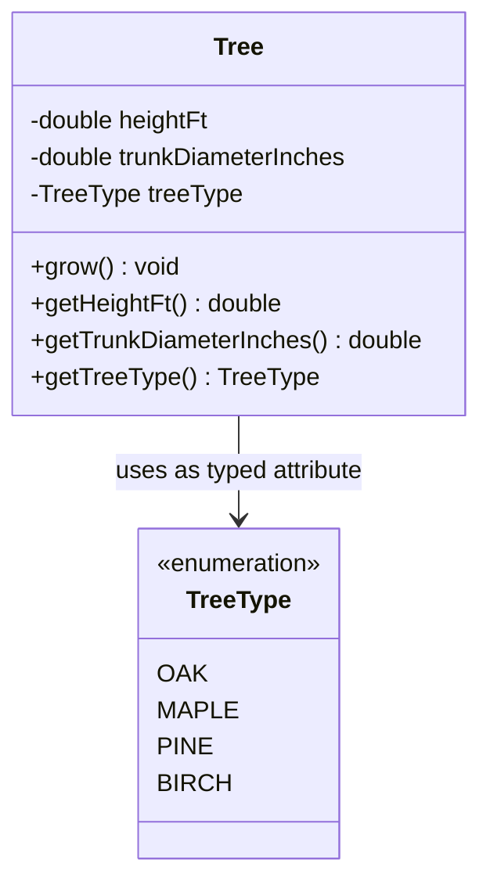

# Object-Oriented Foundations: Classes as Blueprints, State vs. Behavior & Type Safety via Enums

---

## Key Takeaways

A **class** in Java serves as a conceptual blueprint that models real-world entities by encapsulating their characteristics (**attributes/state**) and actions (**behaviors/methods**) into a single, cohesive unit. Defining a class merely declares the structural template—no actual heap instances exist until the class is explicitly instantiated. To enforce strict domain validity and eliminate nonsensical string values (e.g., preventing a `"macaroni tree"` or `"money tree"`), Java provides **enumerations (`enum`)** to restrict an attribute to a fixed, closed group of predefined constants.



- **The Blueprint Concept**: A class defines _what_ attributes and behaviors an object _can_ possess; defining a class allocates no object instances in memory on its own.
- **Attributes (State)**: Variables declared within the class scope (e.g., `double heightFt`, `double trunkDiameterInches`) representing the current condition of an object.
- **Behaviors (Methods)**: Functions declared within the class (e.g., `void grow()`) that execute business actions, often mutating or reading internal state.
- **Type-Safe Enums (`enum`)**: Special reference types that restrict a variable's value strictly to an immutable list of named constants, providing compile-time safety over freeform primitive types like `String`.

---

## Main Discussion

### Idiomatic Java Code Snippets

#### 1. Defining the Type-Safe Domain Enumeration (`TreeType`)

Restricting tree varieties to an immutable set of valid constants:

```java
package oop_blueprints;

// An enum represents a fixed group of constants
public enum TreeType {
    OAK,
    MAPLE,
    PINE,
    BIRCH,
    PECAN
}
```

#### 2. Defining the Blueprint Class (`Tree`)

Encapsulating attributes (state) and methods (behavior) within a single blueprint:

```java
package oop_blueprints;

public class Tree {

    // Attributes (State)
    private double heightFt;
    private double trunkDiameterInches;
    private TreeType treeType;

    // Constructor to initialize blueprint fields when instantiated
    public Tree(double heightFt, double trunkDiameterInches, TreeType treeType) {
        this.heightFt = heightFt;
        this.trunkDiameterInches = trunkDiameterInches;
        this.treeType = treeType;
    }

    // Behavior (Action): Mutates the internal state of the tree
    public void grow() {
        this.heightFt += 10.0;
        this.trunkDiameterInches += 1.0;
    }

    // Getters for inspecting state
    public double getHeightFt() {
        return heightFt;
    }

    public double getTrunkDiameterInches() {
        return trunkDiameterInches;
    }

    public TreeType getTreeType() {
        return treeType;
    }
}
```

#### 3. Instantiating the Blueprint into Objects

Using the blueprint to instantiate distinct objects on the heap with independent states:

```java
package oop_blueprints;

public class ForestSimulator {

    public static void main(String[] args) {
        // Enums ensure type safety: compiler prevents arbitrary strings like "macaroni"
        Tree oakTree = new Tree(25.0, 12.0, TreeType.OAK);
        Tree pineTree = new Tree(50.0, 18.0, TreeType.PINE);

        System.out.println("Initial Oak Height: " + oakTree.getHeightFt() + " ft");

        // Invoking behavior to alter state
        oakTree.grow();

        System.out.println("Oak Height after grow(): " + oakTree.getHeightFt() + " ft"); // 35.0 ft
        System.out.println("Oak Trunk Diameter: " + oakTree.getTrunkDiameterInches() + " in"); // 13.0 in

        // Verifying pineTree state remains isolated and unchanged
        System.out.println("Pine Height remains unchanged: " + pineTree.getHeightFt() + " ft"); // 50.0 ft
    }
}
```

### Under the Hood / JVM Mechanics

1. **Class Loading & Metaspace Allocation:**
   When the JVM loads Tree.class, it stores the class metadata (field names, types, method bytecodes) inside the JVM Metaspace (off-heap memory). At this stage, no heap instances of Tree exist.
2. **Enum Desugaring to Sealed Final Classes:**
   When TreeType.enum is compiled, javac desugars it into a final class TreeType extends `java.lang.Enum`. Each constant (e.g., OAK, PINE) is compiled as a public static final TreeType reference initialized during static class loading.
3. **Heap Object Instantiation (new Tree):**
   Executing new Tree(...) allocates a concrete block of memory on the JVM Heap. This block holds the object header and separate storage for each instance field (heightFt, trunkDiameterInches, and a reference pointer to the TreeType constant).
4. **Instance Method Dispatch & State Mutation:**
   Calling oakTree.grow() passes the implicit this reference pointer into the method frame on the call stack. The bytecode instructions (dadd) read the instance's heap values, perform arithmetic, and write the updated state back to oakTree's heap memory without affecting pineTree.

### Structural Comparisons

#### Attributes vs. Behaviors

| Dimension           | Attributes (Fields)                            | Behaviors (Methods)                                |
| ------------------- | ---------------------------------------------- | -------------------------------------------------- |
| **Role**            | Represents the object's **state** / properties | Represents the object's **actions** / capabilities |
| **Java Construct**  | Instance variables (`double heightFt`)         | Member functions (`public void grow()`)            |
| **Temporal Nature** | Static snapshot of values at a given moment    | Dynamic sequence of operations executed over time  |
| **Effect**          | Stores data                                    | Reads, calculates, or mutates stored data          |

#### Freeform String vs. Enum Representation

| Criterion                | `String treeType = "OAK"`                   | `TreeType treeType = TreeType.OAK`                      |
| ------------------------ | ------------------------------------------- | ------------------------------------------------------- |
| **Type Safety**          | Low (allows `"money"`, `"macaroni"`, typos) | **High** (restricted strictly to predefined constants)  |
| **Validation Point**     | Runtime string matching (error-prone)       | **Compile time** (compiler rejects invalid identifiers) |
| **Memory & Performance** | Object comparisons via `.equals()`          | Fast reference equality comparison via `==`             |
| **Refactoring**          | Prone to broken string literals             | IDE auto-renaming and instant error detection           |

### Common Anti-Patterns & Edge Cases

- **Confusing the Blueprint with the Object**: Assuming that declaring fields inside a class creates data immediately. Fields only exist in memory when an instance is instantiated using `new`.
- **String-Typed Categorization ("Stringly Typed")**: Using freeform strings for categories with fixed domains. This leads to subtle runtime bugs caused by case-sensitivity (`"oak"` vs `"Oak"` vs `"OAK"`) or invalid values.
- **Stateless Behaviors with Hidden Assumptions**: Writing methods that alter fields without maintaining internal consistency (e.g., allowing `heightFt` to drop below zero). Methods should encapsulate business invariants.

---

## Knowledge Check & JetBrains-Style Coding Challenges

### Theory Tips

- **Definition of a Class**: A class is a template or blueprint containing attributes (fields) and behaviors (methods) that describe what an object will be.
- **Enum Characteristics**: Enums define a fixed, closed set of constants. They provide compile-time safety and prevent illegal domain values.
- **State Mutation**: Behaviors act on attributes to change the internal state of the instantiated object.

### Question 1: Conceptual / Code Analysis

Consider the following proposed class and enum structure:

```java
public enum AccountType {
    CHECKING,
    SAVINGS
}

public class BankAccount {
    double balance;
    AccountType type;

    void deposit(double amount) {
        balance += amount;
    }
}
```

A junior developer writes the following client code:

```java
BankAccount acc = new BankAccount();
acc.type = "SAVINGS"; // Line 2
acc.deposit(50.0);    // Line 3
```

What occurs when attempting to compile this client code?

- [ ] **A.** It compiles cleanly; Java automatically coerces the string `"SAVINGS"` to `AccountType.SAVINGS`.
- [ ] **B.** A compilation error occurs at Line 2 because `String` cannot be assigned to variable `AccountType`.
- [ ] **C.** A runtime `IllegalArgumentException` occurs on Line 2.
- [ ] **D.** A compilation error occurs at Line 3 because `balance` was never initialized.

<details>
<summary>Correct Answer</summary>

**Correct Answer**: **B**

**Technical Breakdown**:

- **B is correct**: `AccountType` is an enum type, not a `String`. Java is a strongly typed language that does not perform implicit string-to-enum conversions during direct assignment. Assigning the string literal `"SAVINGS"` to a variable declared as `AccountType` causes an immediate compilation failure: `incompatible types: java.lang.String cannot be converted to AccountType`. To compile, the code must use the constant reference: `acc.type = AccountType.SAVINGS;`.
- **A is incorrect**: Java does not automatically convert string literals to enum instances at compile time.
- **C is incorrect**: Type mismatches are caught at compile time, preventing runtime execution.
- **D is incorrect**: Primitive numeric fields like `double` in classes default to `0.0` automatically upon heap instantiation.

</details>

---

### Question 2: Mini Coding Problem / Implementation Challenge

**Task**: Model a blueprint for an automated manufacturing drone inside package `oop_blueprints`:

1. Create an enum `DroneModel`:
   - Constants: `SCOUT`, `CARRIER`, `HARVESTER`.
2. Create a blueprint class `IndustrialDrone`:
   - Private fields:
     - `batteryLevel` (`double`, representing percentage 0.0 to 100.0).
     - `cargoWeightKg` (`double`).
     - `model` (`DroneModel`).
   - Constructor:
     - `public IndustrialDrone(DroneModel model, double cargoWeightKg)`: initializes the drone with the specified model and cargo, and sets `batteryLevel` to `100.0`.
   - Public behaviors:
     - `public void fly(double distanceKm)`: reduces `batteryLevel` by `distanceKm * 1.5`. If the calculated battery drops below `0.0`, clamp it at `0.0`.
     - `public void recharge()`: restores `batteryLevel` back to `100.0`.
   - Public getters: `getBatteryLevel()`, `getCargoWeightKg()`, and `getModel()`.

**Test Assertions**:

- `IndustrialDrone drone = new IndustrialDrone(DroneModel.SCOUT, 5.0);`
- `drone.getBatteryLevel()` $\rightarrow$ Returns: `100.0`
- `drone.fly(20.0);` $\rightarrow$ `batteryLevel` becomes `100.0 - (20.0 * 1.5) = 70.0`
- `drone.fly(60.0);` $\rightarrow$ `70.0 - 90.0 = -20.0` $\rightarrow$ Clamped to `0.0`
- `drone.recharge();` $\rightarrow$ `batteryLevel` returns to `100.0`
- `drone.getModel()` $\rightarrow$ Returns: `DroneModel.SCOUT`

<details>
<summary>Solution</summary>

```java
package oop_blueprints;

// Type-safe enum restricting drone models to predefined categories
public enum DroneModel {
    SCOUT,
    CARRIER,
    HARVESTER
}
```

```java
package oop_blueprints;

public class IndustrialDrone {

    // Blueprint attributes (state)
    private double batteryLevel;
    private double cargoWeightKg;
    private DroneModel model;

    // Constructor establishing initial state on heap allocation
    public IndustrialDrone(DroneModel model, double cargoWeightKg) {
        this.model = model;
        this.cargoWeightKg = cargoWeightKg;
        this.batteryLevel = 100.0;
    }

    // Behavior: consumes battery based on flight distance
    public void fly(double distanceKm) {
        double consumption = distanceKm * 1.5;
        this.batteryLevel = Math.max(0.0, this.batteryLevel - consumption);
    }

    // Behavior: resets battery state
    public void recharge() {
        this.batteryLevel = 100.0;
    }

    public double getBatteryLevel() {
        return batteryLevel;
    }

    public double getCargoWeightKg() {
        return cargoWeightKg;
    }

    public DroneModel getModel() {
        return model;
    }
}
```

**Complexity Analysis**:

- **Time Complexity**: $\mathcal{O}(1)$ for all constructor operations, getter lookups, flight battery calculations, and recharge calls.
- **Space Complexity**: $\mathcal{O}(1)$ auxiliary memory; instances consume fixed heap allocation sizes based on primitive fields and constant enum references.

</details>

---
