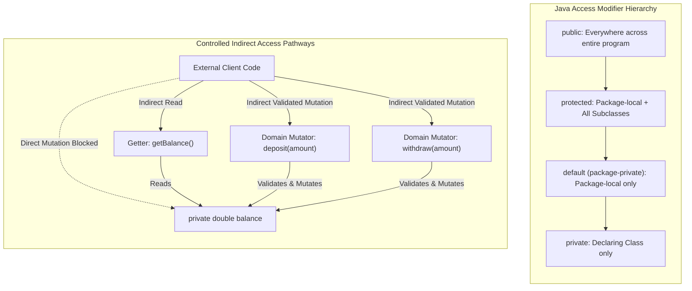

# Access Control Architecture: Modifiers, Encapsulation Patterns & The Banking Challenge

---

## Key Takeaways

Java controls member visibility and enforces encapsulation through four access tiers: `public`, `protected`, package-private (no modifier), and `private`. True encapsulation pairs `private` attributes with public, indirect pathways: **getters** for read access and **setters / domain mutators** for validated state transitions. By hiding internal storage—exemplified by Java 9's JEP 254 migration in `java.lang.String` from `char[]` to `byte[]` without altering its public API—classes achieve loose coupling, enforce immutability where appropriate (e.g., omitting setters for fixed fields like account owners or tree species), and safeguard object invariants against corrupting states like negative balances.



- **The Four Access Levels**:
  - `public`: Visible to all classes everywhere throughout the program and across packages.
  - `protected`: Accessible within the same package and by subclasses across packages through inheritance.
  - Default (package-private): When no keyword is specified, accessible only within the declaring package.
  - `private`: Strictly accessible only within the body of the declaring class.
- **Getters & Controlled Mutators**: Getters expose state safely; setters or domain-specific verbs (`deposit()`, `withdraw()`, `grow()`) intercept incoming parameters to prevent invalid assignments (such as negative heights or overdrafts).
- **Intentional Immutability**: Fields that must never change after object construction (e.g., `owner`, `treeType`, or String's backing array) simply omit setter methods, making them unmodifiable post-instantiation.
- **Loose Coupling in Action (JEP 254)**: In JDK 9, `java.lang.String` changed its internal storage field `value` from `char[]` to `byte[]` for space savings. Because `value` was `private` and accessed only via methods like `.length()` and `.charAt()`, no external Java programs were broken.

---

## Main Discussion

### Idiomatic Java Code Snippets

#### 1. Complete Encapsulated Class with Asymmetric Mutability (`Tree.java`)

Using access modifiers to create read-only, conditionally mutable, and fully mutable fields:

```java
package access_control_demo;

import java.awt.Color;

public class Tree {

    // Protected static constant: accessible to package and subclasses
    protected static final Color TRUNK_COLOR = new Color(102, 51, 0);

    // Private attributes: hidden from external direct access
    private double heightFt;
    private double trunkDiameterInches;
    private TreeType treeType;

    // Public constructor: allows instantiation anywhere
    public Tree(double heightFt, double trunkDiameterInches, TreeType treeType) {
        this.heightFt = Math.max(0.0, heightFt);
        this.trunkDiameterInches = Math.max(0.0, trunkDiameterInches);
        this.treeType = treeType;
    }

    // Public getters: Safe read pathways
    public double getHeightFt() {
        return this.heightFt;
    }

    public double getTrunkDiameterInches() {
        return this.trunkDiameterInches;
    }

    // TreeType is immutable: has a getter, but NO setter exists
    public TreeType getTreeType() {
        return this.treeType;
    }

    // Setter for trunk diameter: allows direct updates with bounds validation
    public void setTrunkDiameterInches(double trunkDiameterInches) {
        if (trunkDiameterInches >= this.trunkDiameterInches) {
            this.trunkDiameterInches = trunkDiameterInches;
        }
    }

    // Domain mutator for height: height cannot be set arbitrarily, only grown
    public void grow() {
        this.heightFt += 10.0;
        this.trunkDiameterInches += 1.0;
    }
}
```

#### 2. Encapsulation Analysis of `java.lang.String` (JDK Internals Inspection)

Illustrating how the JDK relies on private state and public accessors to permit massive structural optimizations under the hood:

```java
package access_control_demo;

public class StringEncapsulationDemo {

    public static void main(String[] args) {
        String greeting = "Hello, World!";

        // Public methods provide an invariant contract:
        int length = greeting.length();
        char firstChar = greeting.charAt(0);

        System.out.println("String: " + greeting);
        System.out.println("Length: " + length + ", First character: " + firstChar);

        // UNDER THE HOOD (JEP 254 Compact Strings):
        // Prior to Java 9: private final char[] value; (16 bits per char)
        // Since Java 9:     private final byte[] value; (8 bits per Latin-1 char)
        // If 'value' had been declared public, every application accessing string.value[i]
        // would have broken upon updating to Java 9.
        // Because of encapsulation, zero caller code was affected.
    }
}
```

### Under the Hood / JVM Mechanics

1. **Bytecode Access Flag Encoding:**
   During compilation, javac encodes access modifiers into binary bitmasks stored in the class file's constant pool:
2. **Compile-Time Access Boundary Resolution:**
   When client code executes account.balance, javac inspects the caller's package and class identity against the target field's access bitmask. If ACC_PRIVATE is present and the caller is not the declaring class, compilation immediately halts: balance has private access in BankAccount.
3. **JVM Runtime Link-Time Verification:**
   Even if raw bytecode is manually manipulated to bypass compilation checks, the JVM's bytecode verifier runs verification passes during class linking. Any illegal field access instruction (such as getfield on a private field from another class) throws an IllegalAccessError.
4. **Invariant Protection Before Heap Commits:**
   In a domain mutator method like deposit(double amount), arithmetic comparison opcodes (dcmpg, ifle) execute on the operand stack. The putfield opcode writing back to heap memory is only executed if validation branches pass, guaranteeing corrupt data never commits to the heap.

### Structural Comparisons

#### The Four Java Access Modifiers

| Modifier                      | Declaring Class | Same Package | Subclasses (Different Package) | Entire World |
| ----------------------------- | --------------- | ------------ | ------------------------------ | ------------ |
| **`public`**                  | Yes             | Yes          | Yes                            | **Yes**      |
| **`protected`**               | Yes             | Yes          | **Yes**                        | No           |
| **default** (package-private) | Yes             | **Yes**      | No                             | No           |
| **`private`**                 | **Yes**         | No           | No                             | No           |

#### Direct Field Mutation vs. Domain Mutator Methods

| Characteristic             | Direct Field Access (`acc.balance = 500`) | Standard Setter (`acc.setBalance(500)`) | Domain Mutator (`acc.deposit(500)`)      |
| -------------------------- | ----------------------------------------- | --------------------------------------- | ---------------------------------------- |
| **Encapsulation Level**    | None (leaks internal state)               | Basic (syntactic)                       | **High (business-driven)**               |
| **Input Validation**       | None                                      | Possible, but often overlooked          | Built into the business operation        |
| **Auditability / Logging** | Impossible to hook into                   | Centralized to setter method            | Centralized to specific business actions |
| **Intent Clarity**         | Expresses mechanical write                | Expresses value reassignment            | Expresses clear domain behavior          |

### Common Anti-Patterns & Edge Cases

- **Exposing Mutable Attributes as Public**:

  ```java
  public class BankAccount {
      public double balance; // ANTI-PATTERN: Anyone can write acc.balance = -10000.0;
  }
  ```

- **Assuming Missing Modifier Means "No Restrictions"**: Omitting an access modifier does **not** make a member public; it defaults to package-private. Classes located in any other package (e.g., a test directory in a distinct package) cannot access default members.
- **Creating Inflexible Setters for Immutable Concepts**: Writing `setOwner(String owner)` on an account when ownership should remain immutable after account creation invites accidental reassignment bugs.
- **Returning Direct References to Mutable Internal Objects**: When getters return references to mutable objects (such as `java.util.Date` or arrays), external callers can mutate internal state through the returned reference. Defensive copying or unmodifiable views should be returned instead.

---

## Knowledge Check & JetBrains-Style Coding Challenges

### Theory Tips

- **Visibility Scopes**: `private` is the most restrictive (class only); `public` is the least restrictive (everywhere); `protected` bridges package access and subclass inheritance.
- **The Main Method Access**: `main` must always be `public` so the JVM runtime launcher can invoke it from outside the application's package structure.
- **Achieving Immutability**: To make an attribute immutable after constructor initialization, mark it `private` and provide a getter, but omit any setter or mutator methods.

### Question 1: Conceptual / Code Analysis

Consider the following two classes located in separate packages:

```java
package com.bank.core;

public class Vault {
    public int publicCode = 1111;
    protected int securityKey = 2222;
    int packagePin = 3333;
    private int masterSecret = 4444;
}
```

```java
package com.bank.app;

import com.bank.core.Vault;

public class Auditor {
    public void inspect() {
        Vault vault = new Vault();
        System.out.println(vault.publicCode);    // Line 8
        System.out.println(vault.securityKey);   // Line 9
        System.out.println(vault.packagePin);    // Line 10
        System.out.println(vault.masterSecret);  // Line 11
    }
}

```

Which line is the **only** statement inside `inspect()` that will compile successfully?

- [ ] **A.** Line 8
- [ ] **B.** Line 9
- [ ] **C.** Line 10
- [ ] **D.** Line 11

<details>
<summary>Correct Answer</summary>

**Correct Answer**: **A**

**Technical Breakdown**:

- **A is correct**: `Auditor` resides in `com.bank.app`, while `Vault` is declared in `com.bank.core`.
  - Line 8 accesses `publicCode`, which is `public` and therefore accessible across all packages.
  - Line 9 accesses `securityKey`, which is `protected`. `Auditor` is not a subclass of `Vault` and resides in a different package, so access is denied.
  - Line 10 accesses `packagePin`, which has default (package-private) access. It is not visible outside `com.bank.core`.
  - Line 11 accesses `masterSecret`, which is `private` and accessible only within `Vault`.
- **B, C, and D are incorrect**: All three lines cause compile-time access visibility errors.

</details>

---

### Question 2: Challenge — Banking Application (Complete Course Solution)

**Task**: Implement the course banking application challenge inside package `access_control_demo`:

1. Class `BankAccount`:
   - Private attributes:
     - `owner` (`String`)
     - `balance` (`double`)
   - Constructor `public BankAccount(String owner, double startingBalance)`:
     - Sets `this.owner`.
     - Guards initial balance using `Math.max(startingBalance, 0.0)` to prevent negative starting balances.
   - Public getters:
     - `public String getOwner()`
     - `public double getBalance()`
   - Omit setters for both `owner` (making owner immutable) and `balance`.
   - Public domain mutator behaviors:
     - `public double deposit(double amount)`: If `amount > 0.0`, adds it to `balance` and returns the deposited amount; otherwise returns `0.0`.
     - `public double withdraw(double amount)`: If `amount > 0.0` and `amount <= balance`, subtracts it from `balance` and returns the withdrawn amount; otherwise returns `0.0`.
2. Main Class `BankApplicationRunner`:
   - Instantiates a `BankAccount` for `"Wonder Woman"` with a `$1,000.0` starting balance.
   - Executes transactions:
     1. Withdraw `$500.0`
     2. Deposit `$5,000.0`
     3. Withdraw `$2,000.0`
   - Prints the owner and resulting balance to the console, confirming output is `"Wonder Woman: $3500.0"`.

**Test Assertions**:

- `BankAccount acc = new BankAccount("Wonder Woman", 1000.0);`
- `acc.withdraw(500.0)` $\rightarrow$ Returns `500.0`, balance becomes `500.0`
- `acc.deposit(5000.0)` $\rightarrow$ Returns `5000.0`, balance becomes `5500.0`
- `acc.withdraw(2000.0)` $\rightarrow$ Returns `2000.0`, balance becomes `3500.0`
- `acc.withdraw(10000.0)` $\rightarrow$ Returns `0.0` (insufficient funds), balance remains `3500.0`
- `acc.deposit(-50.0)` $\rightarrow$ Returns `0.0` (invalid amount), balance remains `3500.0`

<details>
<summary>Solution</summary>

```java
package access_control_demo;

public class BankAccount {

    // Data Hiding: Private attributes preventing direct outside tampering
    private String owner;
    private double balance;

    // Constructor enforcing positive initial balance invariant
    public BankAccount(String owner, double startingBalance) {
        this.owner = owner;
        this.balance = Math.max(startingBalance, 0.0);
    }

    // Read-only getter for owner: No setter exists, making owner immutable post-construction
    public String getOwner() {
        return owner;
    }

    // Read-only getter for balance: Directly mutating balance is prohibited
    public double getBalance() {
        return balance;
    }

    // Validated domain mutator acting as controlled setter
    public double deposit(double amount) {
        if (amount > 0.0) {
            this.balance += amount;
            return amount;
        }
        return 0.0;
    }

    // Validated domain mutator preventing overdrafts
    public double withdraw(double amount) {
        if (amount > 0.0 && amount <= this.balance) {
            this.balance -= amount;
            return amount;
        }
        return 0.0;
    }
}

```

```java
package access_control_demo;

public class BankApplicationRunner {

    public static void main(String[] args) {
        // Constructing account instance with starting balance
        BankAccount account = new BankAccount("Wonder Woman", 1000.0);

        // Performing validated transactions through public pathways
        account.withdraw(500.0);   // Balance: 500.0
        account.deposit(5000.0);   // Balance: 5500.0
        account.withdraw(2000.0);  // Balance: 3500.0

        // Accessing state indirectly via getters
        System.out.println(account.getOwner() + ": $" + account.getBalance());
        // Prints: Wonder Woman: $3500.0
    }
}

```

**Complexity Analysis**:

- **Time Complexity**: $\mathcal{O}(1)$ constant time for constructor execution, balance reads, and validated deposits / withdrawals.
- **Space Complexity**: $\mathcal{O}(1)$ auxiliary memory allocated per account instance on the JVM Heap.

</details>

---
