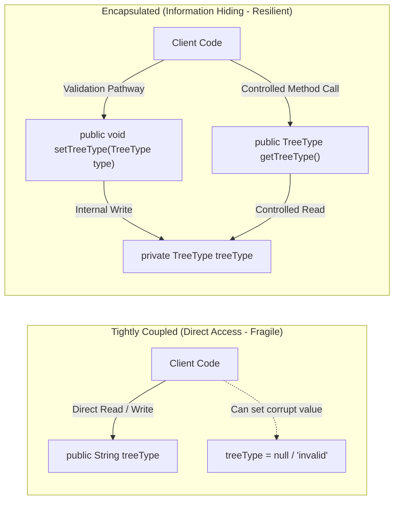

# Object-Oriented Principles: Encapsulation, Loose Coupling & Information Hiding

---

## Key Takeaways

Encapsulation is a foundational pillar of Object-Oriented Programming (OOP) centered on bundling an object's internal state (data/attributes) and the behaviors acting upon that state (methods) into a single, cohesive unit. Beyond structural bundling, true encapsulation enforces **information hiding** by restricting direct external access to internal fields. Instead of allowing calling classes to manipulate fields directly, a class exposes a controlled public interface (such as getters, setters, or domain actions). This architecture achieves **loose coupling**, prevents accidental corruption or invalid assignments (such as `null` or negative values), and ensures that internal data structures can be refactored without breaking consuming classes across the application.



- **Core Definition**: Encapsulation is the bundling of data and the methods that operate on that data into a single unit (a Java class).
- **Information Hiding**: Shielding an object's internal representation from direct outside modification, exposing only designated functional pathways.
- **Loose Coupling**: Minimizes interdependencies between classes; internal implementation details or field identifiers can change without requiring updates to external caller code.
- **State Validation & Security**: Prevents clients from corrupting an object's state with unexpected `null` references or nonsensical domain values.
- **Maintenance & Refactoring**: Because external callers interact only with public method contracts, the class author can alter internal storage mechanisms (e.g., swapping a `String` field for an `enum` or a calculated property) without affecting callers.

---

## Main Discussion / Deep Dive

### Idiomatic Java Code Snippets

#### 1. The Fragile, Unencapsulated Approach (Tight Coupling)

Exposing public fields allows external callers to bypass business rules and creates widespread breakage when refactoring:

```java
package encapsulation_demo;

// FRAGILE DESIGN: Direct field access exposes internals
public class UnencapsulatedTree {
    // Public fields: No access control or validation
    public String treeType;
    public double heightFt;
}

class ClientCallingCode {
    public static void run() {
        UnencapsulatedTree tree = new UnencapsulatedTree();

        // 1. Invariant Corruption: External code can write invalid/null data directly
        tree.treeType = null;
        tree.heightFt = -500.0; // Negative height violates reality!

        // 2. Tight Coupling: If we rename 'treeType' to 'species' inside UnencapsulatedTree,
        // every single line referencing 'tree.treeType' across the entire project will fail to compile.
        System.out.println("Tree height: " + tree.heightFt);
    }
}
```

#### 2. The Robust, Encapsulated Approach (Loose Coupling & Guarded State)

Hiding state behind `private` fields and providing controlled accessor and mutator pathways:

```java
package encapsulation_demo;

import java.util.Objects;

public class EncapsulatedTree {

    // 1. Data Hiding: Internal representation is strictly private
    private TreeType treeType;
    private double heightFt;

    // Constructor establishing valid initial state
    public EncapsulatedTree(TreeType treeType, double heightFt) {
        setTreeType(treeType);
        setHeightFt(heightFt);
    }

    // 2. Controlled Read Pathway (Getter)
    public TreeType getTreeType() {
        return this.treeType;
    }

    // 3. Controlled Write Pathway (Setter with Invariant Validation)
    public void setTreeType(TreeType treeType) {
        // Guard against null corruption
        this.treeType = Objects.requireNonNull(treeType, "TreeType cannot be null.");
    }

    public double getHeightFt() {
        return this.heightFt;
    }

    public void setHeightFt(double heightFt) {
        if (heightFt < 0.0) {
            throw new IllegalArgumentException("Height cannot be negative. Supplied: " + heightFt);
        }
        this.heightFt = heightFt;
    }

    // Domain behavior: Encapsulates state mutation logic internally
    public void grow(double additionalHeight) {
        if (additionalHeight > 0.0) {
            this.heightFt += additionalHeight;
        }
    }
}
```

#### 3. Client Interaction via the Encapsulated Interface

Consuming code relies entirely on the stable method interface, insulating it from internal implementation shifts:

```java
package encapsulation_demo;

public class EncapsulationRunner {

    public static void main(String[] args) {
        EncapsulatedTree tree = new EncapsulatedTree(TreeType.OAK, 30.0);

        // Safe interaction via exposed interface
        System.out.println("Tree species: " + tree.getTreeType());
        System.out.println("Current height: " + tree.getHeightFt() + " ft");

        // Attempting invalid updates is safely blocked by class validation
        try {
            tree.setHeightFt(-15.0);
        } catch (IllegalArgumentException e) {
            System.out.println("Validation protected object integrity: " + e.getMessage());
        }

        // Domain action mutating state safely
        tree.grow(12.5);
        System.out.println("Height after growth: " + tree.getHeightFt() + " ft"); // 42.5 ft
    }
}
```

### Under the Hood / JVM Mechanics

1. **Modifier Enforcement via Bytecode Flags:**
   When javac compiles a field marked private, it emits the ACC_PRIVATE access flag into the field descriptor within the .class file.
2. **Compile-Time Access Boundary Check:**
   If an external class attempts to read or write a private field directly via tree.heightFt, the compiler checks the target field's access flags against the caller's context. Detecting ACC_PRIVATE outside the declaring class halts compilation immediately: heightFt has private access in EncapsulatedTree.
3. **Method Call Indirection:**
   When accessing data through getters/setters (tree.getHeightFt()), the compiler emits an invokevirtual bytecode instruction targeting the public method.
4. **Runtime Validation Guard Execution:**
   During method execution, parameter validation bytecode (such as dcmpl for bounds checking or Objects.requireNonNull) executes on the call stack before any putfield opcode writes to the heap, guaranteeing that corrupted data never enters memory.

### Structural Comparisons

#### Tight Coupling vs. Loose Coupling

| Dimension              | Tight Coupling (Direct Access)                 | Loose Coupling (Encapsulation)                                   |
| ---------------------- | ---------------------------------------------- | ---------------------------------------------------------------- |
| **Field Visibility**   | Fields are `public` or package-private         | Fields are `private` (hidden)                                    |
| **Data Access**        | Direct variable assignment (`obj.field = val`) | Method calls (`obj.setField(val)`)                               |
| **Validation Point**   | None (callers must manually validate)          | **Centralized inside the class methods**                         |
| **Refactoring Impact** | Changing a field name breaks all callers       | Field internals can change freely; method signatures stay stable |
| **Integrity Risk**     | High risk of unintended `null` or invalid data | **Zero external corruption risk**; invariants enforced           |

#### What Encapsulation Solves

| Problem Without Encapsulation      | How Encapsulation Solves It                                                                                             |
| ---------------------------------- | ----------------------------------------------------------------------------------------------------------------------- |
| **Direct State Tampering**         | Making fields `private` blocks direct external writes.                                                                  |
| **Unchecked Invalid Values**       | Mutator methods (`setX`, actions) inspect inputs before applying changes.                                               |
| **Cascading Compilation Failures** | Exposing methods creates an abstraction layer; internal variable types or names can change without impacting consumers. |
| **Scattered Validation Code**      | Validation logic resides in one place within the class, rather than repeated across multiple client classes.            |

### Common Anti-Patterns & Edge Cases

- **Public Fields for "Convenience"**: Exposing attributes directly as `public` to avoid writing accessor methods creates technical debt, prevents future validation, and tightly couples every caller to internal field naming.
- **Blind Getters and Setters (Anemic Encapsulation)**: Generating getters and setters for every single private field without validation or business checks provides only syntactic encapsulation. If a setter allows `null` or invalid negative numbers without guards, internal state can still be corrupted.
- **Direct Field Mutation in Domain Logic**: Exposing `setBalance(double balance)` instead of domain-driven methods like `deposit(double amount)` and `withdraw(double amount)` forces callers to perform arithmetic externally, weakening encapsulation boundaries.

---

## Knowledge Check & JetBrains-Style Coding Challenges

### Theory Tips

- **Definition**: Encapsulation is the binding of an object's state and behavior into a single unit, alongside restricting direct access to components.
- **Loose Coupling Advantage**: Encapsulating data allows modifications to a class's internal attributes or methods without breaking the rest of the application.
- **Information Hiding**: By hiding attributes from external classes and channeling access through methods, programs become less error-prone and protect against invalid or `null` values.

### Question 1: Conceptual / Code Analysis

Consider the following two designs for a `UserAccount` class:

```java
// Design A
public class UserAccountA {
    public int loyaltyPoints;
}

// Design B
public class UserAccountB {
    private int loyaltyPoints;

    public int getLoyaltyPoints() {
        return loyaltyPoints;
    }

    public void addPoints(int points) {
        if (points > 0) {
            this.loyaltyPoints += points;
        }
    }
}
```

Which statement accurately describes why Design B demonstrates superior encapsulation and loose coupling over Design A?

- [ ] **A.** Design B executes faster at the JVM bytecode level because private variables are stored in the stack instead of the heap.
- [ ] **B.** Design B automatically serializes the data to disk without throwing exceptions.
- [ ] **C.** Design B protects internal state by preventing negative points from being set and allows internal representation changes without breaking client code.
- [ ] **D.** Design B allows any outside class to bypass `addPoints` by calling `loyaltyPoints` directly when needed.

<details>
<summary>Correct Answer</summary>

**Correct Answer**: **C**

**Technical Breakdown**:

- **C is correct**: Encapsulation provides two core benefits: **data protection** and **loose coupling**. Design B marks `loyaltyPoints` as `private`, preventing external code from corrupting the balance with negative numbers or arbitrary values. Furthermore, by restricting access to methods (`getLoyaltyPoints()` and `addPoints()`), the internal implementation (e.g., changing `int` to `long` or computing points from transaction history) can be altered later without changing the public contract that client code depends on.
- **A is incorrect**: Access modifiers (`private`, `public`) control compile-time and runtime access permissions; they do not alter whether an instance variable resides on the heap.
- **B is incorrect**: Encapsulation does not trigger automatic serialization.
- **D is incorrect**: External code cannot access `private` fields directly; that is the core enforcement of information hiding.

</details>

---

### Question 2: Mini Coding Problem / Implementation Challenge

**Task**: Refactor an unencapsulated bank account class into an encapsulated, loosely coupled model inside package `encapsulation_demo`:

1. Class `BankAccount`:
   - Private fields:
     - `accountNumber` (`String`)
     - `balance` (`double`)
   - Constructor `public BankAccount(String accountNumber, double initialBalance)`:
     - Validates that `accountNumber` is non-null and not blank; throws `IllegalArgumentException` otherwise.
     - Validates that `initialBalance` is greater than or equal to `0.0`; throws `IllegalArgumentException` otherwise.
   - Public getters for `accountNumber` and `balance` .
   - Public behaviors:
     - `public void deposit(double amount)`: increments `balance` if `amount > 0.0`; otherwise throws `IllegalArgumentException` with message `"Deposit amount must be positive"`.
     - `public boolean withdraw(double amount)`: if `amount > 0.0` and `amount <= balance`, deducts `amount` and returns `true`; otherwise returns `false`.
   - **Do not** provide a public setter for `balance` (balance must only be modified via `deposit` or `withdraw`).

**Test Assertions**:

- `BankAccount acc = new BankAccount("ACC-101", 500.0);`
- `acc.getBalance()` $\rightarrow$ Returns: `500.0`
- `acc.deposit(200.0);` $\rightarrow$ `acc.getBalance()` becomes `700.0`
- `acc.withdraw(300.0);` $\rightarrow$ Returns: `true`, `acc.getBalance()` becomes `400.0`
- `acc.withdraw(1000.0);` $\rightarrow$ Returns: `false`, `acc.getBalance()` remains `400.0`
- Attempting `new BankAccount("ACC-102", -50.0);` $\rightarrow$ Throws `IllegalArgumentException`

<details>
<summary>Solution</summary>

```java
package encapsulation_demo;

public class BankAccount {

    // Internal attributes are strictly hidden from direct external access
    private String accountNumber;
    private double balance;

    public BankAccount(String accountNumber, double initialBalance) {
        if (accountNumber == null || accountNumber.trim().isEmpty()) {
            throw new IllegalArgumentException("Account number cannot be null or blank.");
        }
        if (initialBalance < 0.0) {
            throw new IllegalArgumentException("Initial balance cannot be negative.");
        }

        this.accountNumber = accountNumber;
        this.balance = initialBalance;
    }

    // Read-only pathway for account number
    public String getAccountNumber() {
        return accountNumber;
    }

    // Read-only pathway for current balance
    public double getBalance() {
        return balance;
    }

    // Controlled mutator behavior enforcing positive deposits
    public void deposit(double amount) {
        if (amount <= 0.0) {
            throw new IllegalArgumentException("Deposit amount must be positive");
        }
        this.balance += amount;
    }

    // Controlled mutator behavior preventing overdrafts
    public boolean withdraw(double amount) {
        if (amount > 0.0 && amount <= this.balance) {
            this.balance -= amount;
            return true;
        }
        return false;
    }
}

```

**Complexity Analysis**:

- **Time Complexity**: $\mathcal{O}(1)$ for initialization, balance checks, deposits, and withdrawals. Validation operates in constant time.
- **Space Complexity**: $\mathcal{O}(1)$ auxiliary space allocated on the heap per `BankAccount` instance.

</details>

---
