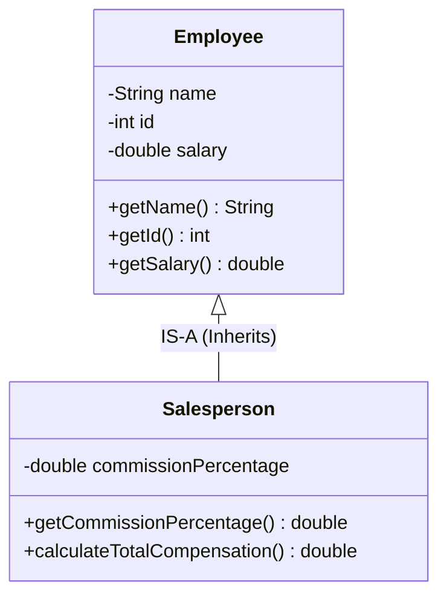

# Object-Oriented Principles: Inheritance, Class Hierarchies & The "IS-A" Relationship

---

## Key Takeaways

Inheritance is a foundational object-oriented programming principle that establishes hierarchical relationships between classes, enabling one class to inherit the attributes (state) and behaviors (methods) of another. The hierarchy consists of two primary roles: the **superclass** (parent class) that declares common, reusable state and logic, and the **subclass** (child class) that inherits those members while adding specialized, domain-specific features. Inheritance models an **"IS-A"** relationship (e.g., a `Salesperson` **IS-A** `Employee`), promoting code reusability, eliminating redundant field declarations across similar entities, and enhancing application scalability.



- **The Two Core Roles**:
  - **Superclass (Parent)**: The generalized class containing common properties and behaviors shared across multiple domain types.
  - **Subclass (Child)**: The specialized class that inherits the parent's attributes and methods while introducing unique characteristics.
- **The "IS-A" Relationship**: A directional contract where the subclass represents a specialized variety of the superclass (e.g., a `Salesperson` IS-A `Employee`, but not all `Employee`s are `Salesperson`s).
- **Code Reusability**: Eliminates duplicate code by writing common fields (`name`, `id`, `salary`) once in the superclass instead of declaring them repeatedly across specialized child classes.
- **Automatic Downstream Scalability**: Modifying or augmenting the superclass automatically extends those updates down to all inheriting subclasses throughout the hierarchy.

---

## Main Discussion

### Idiomatic Java Code Snippets

#### 1. Defining the Superclass (`Employee.java`)

The superclass defines the foundational attributes and behaviors shared by all employees:

```java
package inheritance_fundamentals;

public class Employee {

    // Common attributes shared by all employees
    private String name;
    private int id;
    private double salary;

    public Employee(String name, int id, double salary) {
        this.name = name;
        this.id = id;
        this.salary = salary;
    }

    // Common behaviors inherited by all subclasses
    public String getName() {
        return name;
    }

    public int getId() {
        return id;
    }

    public double getSalary() {
        return salary;
    }

    public void raiseSalary(double percentage) {
        if (percentage > 0) {
            this.salary += this.salary * (percentage / 100.0);
        }
    }
}
```

#### 2. Defining the Subclass via Inheritance (`Salesperson.java`)

The subclass uses the `extends` keyword to establish the "IS-A" relationship, inheriting all base properties and adding a specialized attribute (`commissionPercentage`):

```java
package inheritance_fundamentals;

// Salesperson IS-A Employee
public class Salesperson extends Employee {

    // Specialized attribute unique to Salesperson
    private double commissionPercentage;

    public Salesperson(String name, int id, double salary, double commissionPercentage) {
        // Delegates initialization of inherited state to superclass constructor
        super(name, id, salary);
        this.commissionPercentage = commissionPercentage;
    }

    public double getCommissionPercentage() {
        return commissionPercentage;
    }

    // Specialized behavior unique to Salesperson
    public double calculateCommission(double totalSales) {
        return totalSales * (this.commissionPercentage / 100.0);
    }
}

```

#### 3. Verification of Reusability and Hierarchy Rules (`Main.java`)

Demonstrating that the child class has access to all superclass behaviors without duplicating code:

```java
package inheritance_fundamentals;

public class Main {

    public static void main(String[] args) {
        // 1. Instantiating the general Superclass
        Employee genericEmployee = new Employee("Alice Chen", 101, 75000.0);
        System.out.println("Base Employee: " + genericEmployee.getName());

        // 2. Instantiating the specialized Subclass
        Salesperson rep = new Salesperson("Bob Miller", 202, 60000.0, 15.0);

        // Inherited methods from Employee work automatically on Salesperson
        System.out.println("Salesperson Name: " + rep.getName()); // Inherited behavior
        System.out.println("Salesperson Base Salary: $" + rep.getSalary()); // Inherited behavior

        rep.raiseSalary(10.0); // Inherited method mutating inherited field
        System.out.println("Updated Salary: $" + rep.getSalary()); // $66000.0

        // Subclass-specific behavior
        double commission = rep.calculateCommission(100000.0);
        System.out.println("Earned Commission: $" + commission); // $15000.0

        // 3. Hierarchy Asymmetry: The reverse IS-A relationship is NOT valid
        // genericEmployee.getCommissionPercentage(); // Compilation Error! Not all employees are salespeople.
    }
}
```

### Under the Hood / JVM Mechanics

```
   CALL STACK (Frame: main)                     JVM HEAP MEMORY
+-----------------------------+       +---------------------------------------------+
| rep reference               |------>| Salesperson Instance (0x00FF)               |
+-----------------------------+       |                                             |
                                      | [Superclass Sub-object: Employee]           |
                                      | - name: "Bob Miller"                        |
                                      | - id: 202                                   |
                                      | - salary: 66000.0                           |
                                      |                                             |
                                      | [Subclass Extension Data: Salesperson]      |
                                      | - commissionPercentage: 15.0                |
                                      +---------------------------------------------+
                                                        ^
   METASPACE CLASS HIERARCHY                            |
+------------------------------------+                  |
| class Salesperson extends Employee |------------------+
| - super_class pointer -> Employee  |
+------------------------------------+

```

1. **Class Loading & Metaspace Super Pointer Linking:**
   When the JVM loads Salesperson.class, it reads the super_class pointer in the class file format. The class loader ensures Employee.class is loaded first, creating a parent-child type relationship in Metaspace.
2. **Contiguous Heap Layout for Inherited State:**
   Executing new Salesperson(...) allocates a single contiguous block of memory on the Heap large enough to store both the superclass fields (name, id, salary) and the subclass fields (commissionPercentage).
3. **Constructor Chaining (`<init>` Invocation):**
   Inside the subclass constructor, super(...) invokes Employee`.<init>` before Salesperson`.<init>` executes. The parent constructor sets the initial values of inherited fields on the same heap object instance.
4. **Virtual Method Table (vtable) Inheritance:**
   The JVM builds a Virtual Method Table (vtable) for Salesperson. It copies method entry pointers from Employee's vtable (such as getName and raiseSalary), allowing the subclass to invoke inherited methods via invokevirtual with zero bytecode redirection overhead.

### Structural Comparisons

#### Superclass vs. Subclass

| Dimension                | Superclass (Parent Class)                     | Subclass (Child Class)                                        |
| ------------------------ | --------------------------------------------- | ------------------------------------------------------------- |
| **Concept Level**        | Generalized / Foundational                    | Specialized / Detailed                                        |
| **Hierarchy Position**   | Higher in class hierarchy                     | Lower in class hierarchy                                      |
| **Keyword Usage**        | Declared as a normal class (`class Employee`) | Extends parent (`class Salesperson extends Employee`)         |
| **Attribute Scope**      | Contains attributes common to all variants    | Inherits superclass attributes + adds unique child attributes |
| **Method Scope**         | Contains universal behaviors                  | Inherits all parent behaviors + adds specialized behaviors    |
| **Directional Validity** | Does **not** know about subclasses            | Firmly bound to superclass via "IS-A" relationship            |

#### Direct Duplication vs. Inheritance Architecture

| Criterion              | Code Duplication (No Inheritance)                          | Inheritance Architecture (`extends`)                 |
| ---------------------- | ---------------------------------------------------------- | ---------------------------------------------------- |
| **Code Redundancy**    | High (repeating `name`, `id`, `salary` across every role)  | **Zero** (declared once in `Employee`)               |
| **Maintenance Burden** | Updating a base rule requires editing $N$ distinct classes | Changing the parent immediately updates all children |
| **Type Relationship**  | Classes are completely unrelated                           | Establishes a true polymorphic "IS-A" type hierarchy |
| **Error Surface**      | High (inconsistencies between duplicate definitions)       | Low (centralized single source of truth)             |

### Common Anti-Patterns & Edge Cases

- **Violating the "IS-A" Relationship**: Using inheritance purely to steal methods where no natural hierarchy exists (e.g., making `Tree` extend `Employee` just to reuse an `id` field). If the sentence _"Subclass IS-A Superclass"_ is false in plain English, inheritance should not be used.
- **Assuming Asymmetric Access Works in Reverse**: Expecting a superclass reference to access subclass-specific methods:

  ```java
  Employee emp = new Employee("Jane", 102, 50000.0);
  emp.getCommissionPercentage(); // Fails at compile-time: Employee has no such method.
  ```

- **Attempting Multiple Class Inheritance**: Java does **not** support multiple inheritance of classes (a class cannot `extends ClassA, ClassB`). A subclass may extend only one superclass.
- **Bypassing Private Encapsulation in the Parent**: Subclasses inherit `private` fields from the superclass, but they cannot access them directly by name (e.g., `this.salary`). Access must occur indirectly through the superclass's `public` or `protected` getters and mutator methods.

---

## Knowledge Check & JetBrains-Style Coding Challenges

### Theory Tips

- **Key Terminology**: The class being inherited from is the **superclass** (or parent class); the class that inherits properties and behaviors is the **subclass** (or child class).
- **The "IS-A" Rule**: Inheritance models an **"IS-A"** relationship. A `Salesperson` is an `Employee`, but an `Employee` is not necessarily a `Salesperson`.
- **Subclass Capability**: A subclass inherits all accessible properties and behaviors of the superclass, and can expand upon them by adding its own unique fields and methods.

### Question 1: Conceptual / Code Analysis

Consider the following hierarchy declarations:

```java
public class Vehicle {
    private String brand;
    public void startEngine() { System.out.println("Vroom"); }
}

public class Car extends Vehicle {
    public void openSunroof() { System.out.println("Sunroof opened"); }
}
```

A developer writes the following statements inside `main`:

```java
Vehicle v = new Vehicle();
Car c = new Car();

c.startEngine(); // Line 4
v.openSunroof(); // Line 5
```

What occurs when this code is compiled?

- [ ] **A.** The code compiles and prints `"Vroom"` followed by `"Sunroof opened"`.
- [ ] **B.** A compilation error occurs at Line 4 because subclasses cannot access superclass methods.
- [ ] **C.** A compilation error occurs at Line 5 because `Vehicle` does not possess the `openSunroof()` method.
- [ ] **D.** A runtime `ClassCastException` occurs at Line 5.

<details>
<summary>Correct Answer</summary>

**Correct Answer**: **C**

**Technical Breakdown**:

- **C is correct**: Inheritance flows downward from superclass to subclass. `Car` inherits `startEngine()` from `Vehicle`, making Line 4 completely valid. However, the superclass `Vehicle` has no knowledge of behaviors declared exclusively in its subclass `Car`. Calling `v.openSunroof()` on an instance whose declared type and runtime type is `Vehicle` triggers an immediate compile-time failure: `cannot find symbol: method openSunroof()`.
- **A is incorrect**: Line 5 fails to compile.
- **B is incorrect**: Subclasses freely inherit all non-private methods of their parent class.
- **D is incorrect**: The failure is identified during compile-time symbol resolution; no runtime execution occurs.

</details>

---

### Question 2: Mini Coding Problem / Implementation Challenge

**Task**: Model a customer service hierarchy inside package `inheritance_fundamentals`:

1. Superclass `Ticket`:
   - Private attributes: `ticketId` (`int`), `customerEmail` (`String`), `priority` (`String`).
   - Constructor initializing all three attributes.
   - Public getters: `getTicketId()`, `getCustomerEmail()`, and `getPriority()`.
   - Public behavior `public String getSummary()` returning `"[ID: " + ticketId + "] Customer: " + customerEmail + " (Priority: " + priority + ")"`.
2. Subclass `TechnicalSupportTicket` extending `Ticket`:
   - Adds private attribute: `assignedEngineer` (`String`).
   - Constructor accepting `(int ticketId, String customerEmail, String priority, String assignedEngineer)`:
     - Delegates `ticketId`, `customerEmail`, and `priority` to the `Ticket` superclass constructor via `super(...)`.
     - Initializes `assignedEngineer`.
   - Public getter: `getAssignedEngineer()`.
   - Specialized behavior `public String getDiagnosticRouting()`: returns `"Routing to Tier 2: Assigned to " + assignedEngineer`.

**Test Assertions**:

- `TechnicalSupportTicket techTicket = new TechnicalSupportTicket(1042, "user@cloud.io", "CRITICAL", "Alex Mercer");`
- `techTicket.getTicketId()` $\rightarrow$ Returns: `1042` (Inherited from `Ticket`)
- `techTicket.getPriority()` $\rightarrow$ Returns: `"CRITICAL"` (Inherited from `Ticket`)
- `techTicket.getSummary()` $\rightarrow$ Returns: `"[ID: 1042] Customer: user@cloud.io (Priority: CRITICAL)"` (Inherited method)
- `techTicket.getDiagnosticRouting()` $\rightarrow$ Returns: `"Routing to Tier 2: Assigned to Alex Mercer"` (Subclass-specific method)

<details>
<summary>Solution</summary>

```java
package inheritance_fundamentals;

public class Ticket {

    private int ticketId;
    private String customerEmail;
    private String priority;

    public Ticket(int ticketId, String customerEmail, String priority) {
        this.ticketId = ticketId;
        this.customerEmail = customerEmail;
        this.priority = priority;
    }

    public int getTicketId() {
        return ticketId;
    }

    public String getCustomerEmail() {
        return customerEmail;
    }

    public String getPriority() {
        return priority;
    }

    public String getSummary() {
        return "[ID: " + ticketId + "] Customer: " + customerEmail + " (Priority: " + priority + ")";
    }
}
```

```java
package inheritance_fundamentals;

// TechnicalSupportTicket IS-A Ticket
public class TechnicalSupportTicket extends Ticket {

    // Unique attribute for the specialized technical child class
    private String assignedEngineer;

    public TechnicalSupportTicket(int ticketId, String customerEmail, String priority, String assignedEngineer) {
        // Initializes parent state
        super(ticketId, customerEmail, priority);
        this.assignedEngineer = assignedEngineer;
    }

    public String getAssignedEngineer() {
        return assignedEngineer;
    }

    // Specialized behavior not present in base Ticket
    public String getDiagnosticRouting() {
        return "Routing to Tier 2: Assigned to " + assignedEngineer;
    }
}
```

**Complexity Analysis**:

- **Time Complexity**: $\mathcal{O}(1)$ for object construction, getter retrievals, and summary string formatting.
- **Space Complexity**: $\mathcal{O}(1)$ auxiliary space allocated per ticket on the JVM Heap.

</details>

---
