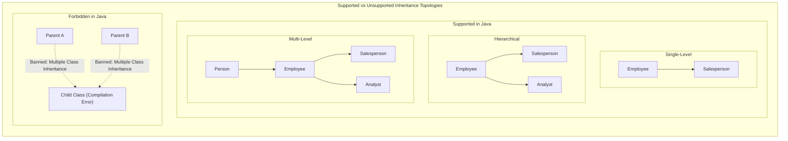

# Advanced Inheritance: Hierarchy Topologies, Constructor Chaining (`super`), Member Visibility & Custom Collections

---

## Key Takeaways

Java supports structural inheritance using the `extends` keyword, enabling subclasses to absorb the state and behavior of their superclasses. While Java permits **single-level**, **hierarchical** (one parent, multiple siblings), and **multi-level** (chained ancestors) topologies, it explicitly prohibits **multiple inheritance of classes** and **hybrid inheritance** to prevent the Diamond Problem, constructor ambiguity, and complex type resolution. Subclasses delegate parent field initialization to the superclass constructor via `super(...)`, access parent state directly when marked with the `protected` modifier, and reuse vetted standard library algorithms—demonstrated by the JDK's `Stack extends Vector` and custom collection extensions like `ModArrayList extends ArrayList`.



- **Supported Topologies**:
  - **Single-Level**: One direct subclass extending one superclass (`Salesperson extends Employee`).
  - **Hierarchical**: Multiple sibling classes extending the same base class (`Salesperson extends Employee`, `Analyst extends Employee`).
  - **Multi-Level**: Chained ancestor links where a class is both a child and a parent (`Salesperson extends Employee extends Person`).
- **Forbidden Topologies**: Java strictly prohibits multiple class inheritance (a class cannot `extends A, B`) to avoid state collisions and method resolution ambiguities.
- **Constructor Chaining (`super(...)`)**: The subclass constructor invokes the parent constructor using `super(...)` as its very first statement, delegating the initialization of inherited fields.
- **The `protected` Access Tier**: Fields marked `private` in the parent remain inaccessible to child classes directly. Changing the modifier to `protected` exposes them to subclasses and package peers without making them fully `public`.
- **JDK Extension Patterns**: Extending standard library classes like `java.util.Vector` (in `java.util.Stack`) or `java.util.ArrayList` allows developers to inherit pre-tested data storage and index algorithms while overlaying specialized behaviors.

---

## Main Discussion

### Idiomatic Java Code Snippets

#### 1. Multi-Level & Hierarchical Inheritance Architecture

Decomposing personal attributes (`Person`), employment data (`Employee`), and specialized compensation (`Salesperson` and `Analyst`):

```java
package inheritance_models;

// Level 1: Root Base Class
public class Person {
    private String name;
    private int age;

    public Person(String name, int age) {
        this.name = name;
        this.age = age;
    }

    public String getName() {
        return name;
    }

    public int getAge() {
        return age;
    }
}
```

```java
package inheritance_models;

// Level 2: Intermediate Superclass (Multi-Level from Person)
public class Employee extends Person {

    // Protected modifier grants direct access to subclasses (Salesperson, Analyst)
    protected double salary;

    public Employee(String name, int age, double salary) {
        // Constructor Chaining: Delegates name and age to Person constructor
        super(name, age);
        this.salary = salary;
    }

    public double getSalary() {
        return salary;
    }

    public void raiseSalary(double percentage) {
        if (percentage > 0) {
            this.salary += this.salary * (percentage / 100.0);
        }
    }
}
```

```java
package inheritance_models;

// Level 3: Concrete Leaf Class A (Hierarchical sibling to Analyst)
public class Salesperson extends Employee {

    private double commissionPercentage;

    public Salesperson(String name, int age, double salary, double commissionPercentage) {
        // Delegates name, age, and salary to Employee constructor
        super(name, age, salary);
        this.commissionPercentage = commissionPercentage;
    }

    public double getCommissionPercentage() {
        return commissionPercentage;
    }

    public void raiseCommission() {
        this.commissionPercentage += 1.5;
    }
}
```

```java
package inheritance_models;

// Level 3: Concrete Leaf Class B (Hierarchical sibling to Salesperson)
public class Analyst extends Employee {

    public Analyst(String name, int age, double salary) {
        super(name, age, salary);
    }

    // Direct access to protected superclass field 'salary' (or via super.salary)
    public double getAnnualBonus() {
        return this.salary * 0.05; // 5% annual bonus
    }
}
```

#### 2. Investigating JDK Standard Library Inheritance (`Stack extends Vector`)

Demonstrating how `java.util.Stack` inherits backing dynamic array logic from `java.util.Vector`:

```java
package inheritance_models;

import java.util.Stack;

public class StackInheritanceExplorer {

    public static void main(String[] args) {
        // Stack extends Vector<E>, inheriting synchronization and dynamic array growth
        Stack<Character> charStack = new Stack<>();

        // Stack-specific behaviors layered on top of Vector methods:
        // push() internally delegates to Vector.addElement()
        charStack.push('c');
        charStack.push('a');
        charStack.push('t');

        System.out.println("--- Stack Traversal (LIFO via pop()) ---");
        // pop() retrieves from the trailing index and invokes Vector.removeElementAt()
        while (!charStack.isEmpty()) {
            System.out.print(charStack.pop()); // Prints: "tac"
        }
        System.out.println();
    }
}
```

### Under the Hood / JVM Mechanics

```
   CALL STACK (Constructor Chaining)            JVM HEAP MEMORY (Unified Instance)
+------------------------------------+       +---------------------------------------------+
| 3. Person.<init>(name, age)        |       | Analyst Instance (0x00D4)                   |
+------------------------------------+       |                                             |
| 2. Employee.<init>(name, age, sal) |------>| [Level 1: Person State]                     |
+------------------------------------+       | - name: "Dana Scully"                       |
| 1. Analyst.<init>(name, age, sal)  |       | - age: 36                                   |
+------------------------------------+       |                                             |
                                             | [Level 2: Employee State]                   |
                                             | - salary: 85000.0 (protected)               |
                                             |                                             |
                                             | [Level 3: Analyst Methods / vtable ptr]     |
                                             +---------------------------------------------+

```

1. **Class Dependency Verification & Hierarchy Linking:**
   When the JVM loads Analyst.class, it recursively verifies and loads its complete superclass chain in Metaspace: Analyst → Employee → Person → java.lang.Object.
2. **Single Heap Block Allocation:**
   Executing new Analyst(...) calculates the total instance field size across the entire inheritance chain. A single unified block of heap memory is allocated containing slots for name, age, and salary.
3. **Enforced LIFO Constructor Execution (`<init>`):**
   The super(...) statement translates to an invokespecial bytecode instruction. The call stack builds downward (Analyst → Employee → Person → Object) and initializes fields from the top-most root parent down to the concrete leaf subclass.
4. **Access Resolution on Protected Fields:**
   When Analyst reads this.salary, the compiler emits a getfield instruction. Because salary is marked ACC_PROTECTED in Employee, the runtime access validator permits direct heap access because the calling class resides in the inheritance tree.

### Structural Comparisons

#### Inheritance Topologies in Java

| Topology         | Structural Shape                        | Supported in Java?             | Example Architecture                                    |
| ---------------- | --------------------------------------- | ------------------------------ | ------------------------------------------------------- |
| **Single-Level** | $A \rightarrow B$                       | **Yes**                        | `Salesperson extends Employee`                          |
| **Hierarchical** | $A \rightarrow B$ and $A \rightarrow C$ | **Yes**                        | `Employee` extended by both `Salesperson` and `Analyst` |
| **Multi-Level**  | $A \rightarrow B \rightarrow C$         | **Yes**                        | `Salesperson extends Employee extends Person`           |
| **Multiple**     | $A, B \rightarrow C$                    | **No** (Forbidden for classes) | Banned due to diamond collision ambiguity               |
| **Hybrid**       | Combination involving Multiple          | **No** (Forbidden for classes) | Banned for the same complexity reasons                  |

#### Field Access Tiers in Inheritance

| Modifier                      | Accessible by Subclass in Same Package? | Accessible by Subclass in Different Package? | Direct Subclass Access Syntax                      |
| ----------------------------- | --------------------------------------- | -------------------------------------------- | -------------------------------------------------- |
| **`private`**                 | No                                      | No                                           | Must call public/protected getter: `getSalary()`   |
| **default** (package-private) | **Yes**                                 | No                                           | Direct access if in same package: `this.salary`    |
| **`protected`**               | **Yes**                                 | **Yes**                                      | Direct access anywhere in hierarchy: `this.salary` |
| **`public`**                  | **Yes**                                 | **Yes**                                      | Direct access anywhere: `this.salary`              |

### Common Anti-Patterns & Edge Cases

- **Attempting Multiple Class Extension**:

  ```java
  // COMPILATION ERROR: '{' expected (Java does not permit multiple class inheritance)
  public class Salesperson extends Employee, Person { }
  ```

  Java restricts class extension to a single parent. To inherit behaviors from multiple lineages, multi-level inheritance or interfaces must be used.

- **Misplacing the `super()` Constructor Call**: Placing any statement before `super(...)` inside a constructor causes an immediate compile error: `call to super must be first statement in constructor`.
- **Accessing `private` Parent Fields Directly**:

  ```java
  public class Analyst extends Employee {
      public double getBonus() {
          return this.salary * 0.05; // Fails if 'salary' in Employee is declared private!
      }
  }
  ```

  Private parent fields are never directly accessible by name in subclasses. Change the visibility to `protected` or access the field via `getSalary()`.

- **Using `this` vs `super` for Shadowed Identifiers**: If a subclass declares an attribute with the exact same name as a parent attribute, `this.attribute` references the child's variable, while `super.attribute` explicitly references the parent's variable. Avoid field shadowing to prevent maintenance confusion.

---

## Knowledge Check & JetBrains-Style Coding Challenges

### Exam / Theory Tips

- **Keyword for Inheritance**: Java uses the reserved keyword `extends` to establish inheritance between classes.
- **Constructor Chaining**: The `super` keyword invokes the superclass constructor and **must** be the first line of the subclass constructor body.
- **Modifier Scope**: Making a superclass attribute `protected` enables direct access by its subclasses while keeping it hidden from unrelated external packages.

### Question 1: Conceptual / Code Analysis

Consider the following class definitions across multiple inheritance levels:

```java
public class Alpha {
    public Alpha() {
        System.out.print("A ");
    }
}

public class Beta extends Alpha {
    public Beta() {
        System.out.print("B ");
    }
}

public class Gamma extends Beta {
    public Gamma() {
        super();
        System.out.print("C ");
    }
}
```

What is printed to the console when executing `Gamma g = new Gamma();`?

- [ ] **A.** `C B A `
- [ ] **B.** `C `
- [ ] **C.** `A B C `
- [ ] **D.** A compilation error occurs because `Alpha` does not declare a `super()` constructor.

<details>
<summary>Correct Answer</summary>

**Correct Answer**: **C**

**Technical Breakdown**:

- **C is correct**: In Java, constructors execute top-down from the root superclass to the leaf subclass.

1. Instantiating `Gamma` triggers `Gamma()`'s constructor, which calls `super()` targeting `Beta()`.
2. Before `Beta()` executes its body, it implicitly invokes `super()` targeting `Alpha()`.
3. `Alpha()` implicitly invokes `Object()` and prints `"A "`.
4. Control returns to `Beta()`, which prints `"B "`.
5. Control returns to `Gamma()`, which prints `"C "`.
6. The complete console sequence is `"A B C "`.

- **A is incorrect**: Constructors do not execute in reverse order; leaf constructors complete last.
- **B is incorrect**: Subclasses always trigger ancestor constructors up the chain.
- **D is incorrect**: `Alpha` implicitly extends `java.lang.Object`, which has a valid no-argument constructor.

</details>

---

### Question 2: Challenge — Reduce Redundant Code with Inheritance (Complete Solution)

**Task**: Implement the course challenge inside package `inheritance_models`:

1. Class `ModArrayList<E>`:

- Extends `java.util.ArrayList<E>`, inheriting all dynamic array storage and index capabilities.
- Method `public E getUsingMod(int index)`:
- If the list is empty (`this.size() == 0`), returns `null` or throws an `IndexOutOfBoundsException`.
- Calculates a valid non-negative index using modulo arithmetic:
  - Takes the absolute value of the input: `Math.abs(index)`.
  - Takes the remainder with respect to the list's size: `Math.abs(index) % this.size()`.
- Retrieves and returns the element at that computed position using the inherited `this.get(validIndex)` method.

2. Execution Class `ModRunner`:
   - Inside `public static void main(String[] args)`:
   - Instantiates `ModArrayList<Integer> numbers = new ModArrayList<>();`.
   - Appends four integers: `10`, `20`, `30`, `40` (sizes = 4; indices 0, 1, 2, 3).
   - Tests `numbers.getUsingMod(1)` $\rightarrow$ Retrieves index 1 (`20`).
   - Tests `numbers.getUsingMod(-2)` $\rightarrow$ `Math.abs(-2) % 4 = 2` $\rightarrow$ Retrieves index 2 (`30`).
   - Tests `numbers.getUsingMod(40)` $\rightarrow$ `40 % 4 = 0` $\rightarrow$ Retrieves index 0 (`10`).

**Test Assertions**:

- `ModArrayList<Integer> list = new ModArrayList<>();`
- `list.add(10); list.add(20); list.add(30); list.add(40);`
- `list.getUsingMod(1)` $\rightarrow$ Returns: `20`
- `list.getUsingMod(-2)` $\rightarrow$ Returns: `30`
- `list.getUsingMod(40)` $\rightarrow$ Returns: `10`
- `list.getUsingMod(7)` $\rightarrow$ `7 % 4 = 3` $\rightarrow$ Returns: `40`

<details>
<summary>Solution</summary>

```java
package inheritance_models;

import java.util.ArrayList;

// Inherits complete dynamic array functionality from ArrayList
public class ModArrayList<E> extends ArrayList<E> {

    // Enhanced behavior: foolproof circular index retrieval
    public E getUsingMod(int index) {
        if (this.isEmpty()) {
            return null;
        }

        // Convert index to absolute positive integer and mod by list size
        int validIndex = Math.abs(index) % this.size();

        // Delegate retrieval to inherited ArrayList.get(int) method
        return this.get(validIndex);
    }
}
```

```java
package inheritance_models;

public class ModRunner {

    public static void main(String[] args) {
        ModArrayList<Integer> numbers = new ModArrayList<>();

        // Using inherited ArrayList methods: add()
        numbers.add(10); // Index 0
        numbers.add(20); // Index 1
        numbers.add(30); // Index 2
        numbers.add(40); // Index 3

        // 1. Standard valid index
        System.out.println("Item at index 1: " + numbers.getUsingMod(1)); // 20

        // 2. Negative index wrapped to positive remainder
        System.out.println("Item at index -2: " + numbers.getUsingMod(-2)); // 30

        // 3. Out-of-bounds index wrapped via modulo
        System.out.println("Item at index 40: " + numbers.getUsingMod(40)); // 10
    }
}
```

**Complexity Analysis**:

- **Time Complexity**: $\mathcal{O}(1)$ constant time for `getUsingMod()`. Absolute value conversion, modulo arithmetic, and array random access via `this.get(i)` all execute in $\mathcal{O}(1)$ time.
- **Space Complexity**: $\mathcal{O}(1)$ auxiliary space beyond the inherited dynamic array buffer managed by `ArrayList`.

</details>

---
