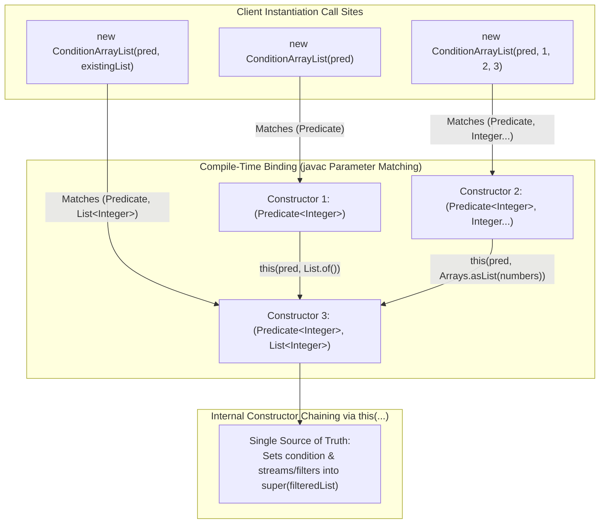

# Compile-Time Polymorphism: Method & Constructor Overloading, Varargs & Constructor Chaining (`this()`)

---

## Key Takeaways

**Compile-time polymorphism** (also known as static polymorphism or early binding) allows multiple methods or constructors within the same class to share the exact same identifier, distinguished strictly by their parameter lists (parameter count, types, and order). Unlike runtime polymorphism which relies on late dynamic dispatch via virtual method tables, overloaded targets are resolved and statically bound by the Java compiler at compile time based on the static types of the provided arguments. Applying compile-time polymorphism to constructors enables multiple flexible instantiation pathways (such as accepting varargs, collections, or generalized interfaces like `List`), while constructor chaining via `this(...)` centralizes validation and prevents logic duplication.



- **Method Overloading Contract**: Overloaded methods or constructors must have the **exact same name** but **different parameter lists** (varying in number, type, or order of parameters). Return type alone is insufficient to overload a method.
- **Static Resolution**: Overload resolution happens strictly at compile time (`javac`), preventing runtime overhead by embedding the exact target method descriptor directly into bytecode.
- **Flexible Initialization Forms**: Providing overloaded constructors allows clients to instantiate objects from bare predicates, variable-length argument arrays (varargs), or existing collections.
- **Coding to Interfaces**: Overloading with interface abstractions (e.g., `List<Integer>` instead of concrete `ArrayList<Integer>`) broadens client compatibility while ensuring essential pipeline methods (like `.stream()`) remain accessible.
- **Constructor Chaining via `this(...)`**: Delegating simpler constructors to a master constructor centralizes parsing, filtering, and invariant validation in one place.

---

## Main Discussion

### Idiomatic Java Code Snippets

#### 1. Constructor Overloading & Constructor Chaining (`ConditionArrayList.java`)

Providing multiple instantiation pathways while funneling initialization logic into a primary constructor using `this(...)`:

```java
package compile_time_polymorphism;

import java.util.ArrayList;
import java.util.Arrays;
import java.util.List;
import java.util.Objects;
import java.util.function.Predicate;

public class ConditionArrayList extends ArrayList<Integer> {

    private final Predicate<Integer> condition;

    // 1. Primary Constructor (Takes generalized List interface)
    // Centralizes invariant checks, filtering, and superclass population
    public ConditionArrayList(Predicate<Integer> condition, List<Integer> initialList) {
        // Populate super ArrayList only with elements matching the predicate
        super(
            Objects.requireNonNull(initialList, "Initial list cannot be null")
                   .stream()
                   .filter(Objects::nonNull)
                   .filter(Objects.requireNonNull(condition, "Condition cannot be null"))
                   .toList()
        );
        this.condition = condition;
    }

    // 2. Overloaded Constructor: Varargs (Integer...)
    // Chains to Primary Constructor using this(...)
    public ConditionArrayList(Predicate<Integer> condition, Integer... numbers) {
        this(condition, numbers == null ? List.of() : Arrays.asList(numbers));
    }

    // 3. Overloaded Constructor: Predicate Only (Empty List)
    // Chains to Primary Constructor with an empty list
    public ConditionArrayList(Predicate<Integer> condition) {
        this(condition, List.of());
    }

    public boolean isEligible(int element) {
        return this.condition.test(element);
    }

    @Override
    public boolean add(Integer element) {
        if (element != null && isEligible(element)) {
            return super.add(element);
        }
        return false;
    }
}
```

#### 2. Client Consumption Demonstrating Early Compile-Time Resolution (`Main.java`)

Instantiating `ConditionArrayList` through its various overloaded constructors:

```java
package compile_time_polymorphism;

import java.util.ArrayList;
import java.util.List;
import java.util.function.Predicate;

public class Main {

    public static void main(String[] args) {
        Predicate<Integer> isDivisibleByThree = n -> n % 3 == 0;
        Predicate<Integer> isDivisibleBySix = n -> n % 6 == 0;

        // Path 1: Resolves to Constructor 3 (Predicate only)
        ConditionArrayList emptyList = new ConditionArrayList(isDivisibleByThree);
        emptyList.add(3);
        emptyList.add(5); // Filtered out
        System.out.println("Path 1 (Predicate only): " + emptyList); // [3]

        // Path 2: Resolves to Constructor 2 (Predicate + Varargs)
        // 1, 2, 4, 5 are dropped; only 3 and 6 pass the predicate
        ConditionArrayList varargsList = new ConditionArrayList(isDivisibleByThree, 1, 2, 3, 4, 5, 6);
        System.out.println("Path 2 (Varargs): " + varargsList); // [3, 6]

        // Path 3: Resolves to Constructor 1 (Predicate + Generalized List)
        List<Integer> rawNumbers = List.of(3, 6, 9, 12, 15, 18);
        ConditionArrayList listInit = new ConditionArrayList(isDivisibleBySix, rawNumbers);
        System.out.println("Path 3 (List): " + listInit); // [6, 12, 18]

        // Path 4: Feeding one ConditionArrayList into another via List polymorphism
        // Filters divisibleByThree items down to divisibleBySix items
        ConditionArrayList refinedList = new ConditionArrayList(isDivisibleBySix, varargsList);
        System.out.println("Path 4 (Subclass instance as List): " + refinedList); // [6]
    }
}
```

### Under the Hood / JVM Mechanics

```
   SOURCE CODE (Compile-Time)                      BYTECODE INVOCATION (Class File)
+-----------------------------------+           +------------------------------------------+
| new ConditionArrayList(pred, 1, 2)|           | invokespecial #14                        |
+-----------------------------------+           | <Method init(Predicate, Integer[])V>     |
                  |                             +------------------------------------------+
                  | Compiler matches signature                        |
                  v                                                   v
   STATIC DESCRIPTOR GENERATION                                 HEAP EXECUTION
+-----------------------------------+           +------------------------------------------+
| Javac selects exact parameter     |           | Evaluates this(pred, Arrays.asList(...)) |
| match based on static types       |           | Executes init(Predicate, List)V          |
+-----------------------------------+           +------------------------------------------+

```

1. **Candidate Signature Gathering:**
   During semantic compilation, javac gathers all constructor or method declarations matching the target name in the enclosing class hierarchy.
2. **Three-Phase Overload Resolution:**
   The compiler searches for a valid match in three strictly defined passes:
   - **Phase 1:** Select all candidate methods based on the method name.
   - **Phase 2:** Filter candidates by the number of arguments.
   - **Phase 3:** Determine the most specific method based on argument types.
3. **Static Descriptor Binding:**
   Once the most specific method is determined, javac writes that exact method descriptor (e.g., (Ljava/util/function/Predicate;Ljava/util/List;)V) into the class file's bytecode instruction (invokespecial for constructors/private methods, invokevirtual for standard instance methods). No dynamic table lookup is required to choose the overload at runtime.
4. **Constructor Chaining Optimization:**
   When this(...) is invoked, bytecode executes an invokespecial instruction targeting sibling constructor frames on the operand stack before running downstream instructions, ensuring initialization executes once through the primary constructor.

### Structural Comparisons

#### Compile-Time Polymorphism vs. Runtime Polymorphism

| Dimension            | Compile-Time Polymorphism (Overloading)  | Runtime Polymorphism (Overriding)                |
| -------------------- | ---------------------------------------- | ------------------------------------------------ |
| **Mechanism**        | Method / Constructor Overloading         | Method Overriding via inheritance or interfaces  |
| **Method Name**      | Must be identical                        | Must be identical                                |
| **Parameters**       | Must **differ** in type, count, or order | Must be **identical** in types, count, and order |
| **Resolution Point** | Compile time (`javac`)                   | Runtime (JVM via `invokevirtual` & `vtable`)     |
| **Performance**      | Zero runtime dispatch overhead           | Minimal dynamic table indirection                |
| **Class Scope**      | Handled within the same class            | Spans parent-child class hierarchy               |

#### Varargs vs. Collection Parameter Signatures

| Parameter Style           | Signature Example                | Caller Flexibility                                                        | Trade-off / Consideration                                         |
| ------------------------- | -------------------------------- | ------------------------------------------------------------------------- | ----------------------------------------------------------------- |
| **Varargs (`T...`)**      | `(Predicate p, Integer... nums)` | Caller can pass comma-separated values (`1, 2, 3`) or an array            | Synthetic array allocation occurs under the hood                  |
| **Concrete Class**        | `(Predicate p, ArrayList nums)`  | Restricts callers to `ArrayList` only                                     | Rigid; rejects `LinkedList`, `List.of()`, or custom lists         |
| **Interface Abstraction** | `(Predicate p, List nums)`       | Accepts any `List` implementation (`ArrayList`, unmodifiable lists, etc.) | **Idiomatic Java standard**; decouples caller from implementation |

### Common Anti-Patterns & Edge Cases

- **Attempting to Overload by Return Type Alone**:

  ```java
  public int calculate(String s) { return s.length(); }
  public double calculate(String s) { return (double) s.length(); } // COMPILE ERROR
  ```

  Java distinguishes overloads solely by method signatures (name + parameter types). Differentiating only by return type triggers a compilation error: `method calculate(String) is already defined`.

- **Ambiguous Overload Collisions**:

  ```java
  public void process(int a, long b) { ... }
  public void process(long a, int b) { ... }
  // Calling process(10, 20) fails: reference to process is ambiguous
  ```

  When arguments can widen equally in multiple directions, `javac` cannot determine the most specific method, causing a compile-time ambiguity error.

- **Recursive Constructor Chaining**:

  ```java
  public ConditionArrayList(Predicate<Integer> p) {
      this(p, 10);
  }
  public ConditionArrayList(Predicate<Integer> p, Integer val) {
      this(p); // COMPILE ERROR: Recursive constructor invocation
  }
  ```

- **Misplaced `this()` Invocations**:
  Just like `super(...)`, calling `this(...)` to chain constructors must be the **very first statement** in the constructor body.

---

## Knowledge Check & JetBrains-Style Coding Challenges

### Theory Tips

- **Overload Criteria**: Methods are overloaded if they share the same identifier but have different parameter types, parameter counts, or parameter order. Return types play no role in overload resolution.
- **Constructor Chaining Keyword**: Use `this(...)` as the first statement in a constructor to call another constructor in the same class.
- **Prefer Interfaces Over Concrete Implementations**: Defining parameters as `List<T>` rather than `ArrayList<T>` allows your methods and constructors to accept any collection implementing the `List` contract.

### Question 1: Conceptual / Code Analysis

Consider the following overloaded class methods:

```java
public class Formatter {
    public void printValue(Object obj) {
        System.out.print("Object ");
    }

    public void printValue(Number num) {
        System.out.print("Number ");
    }

    public void printValue(Integer integer) {
        System.out.print("Integer ");
    }
}
```

A developer executes the following client code:

```java
Formatter formatter = new Formatter();
Number candidate = Integer.valueOf(42);
formatter.printValue(candidate);
```

What is printed to the console?

- [ ] **A.** `Integer `
- [ ] **B.** `Number `
- [ ] **C.** `Object `
- [ ] **D.** A compilation error occurs due to ambiguous method resolution.

<details>
<summary>Correct Answer</summary>

**Correct Answer**: **B**

**Technical Breakdown**:

- **B is correct**: Overload resolution occurs at **compile time** based on the static declared type of the argument reference. In the client code, `candidate` is declared as reference type `Number` (`Number candidate = ...`). Even though the underlying heap object is an `Integer`, the compiler selects the most specific method matching the static type `Number`. Therefore, `printValue(Number)` is statically bound at compile time, printing `"Number "`.
- **A is incorrect**: Dynamic runtime type inspection applies to method _overriding_, not method _overloading_.
- **C is incorrect**: `Number` is more specific than `Object` in the inheritance hierarchy, so `printValue(Number)` is preferred over `printValue(Object)`.
- **D is incorrect**: The type hierarchy `Integer` $\rightarrow$ `Number` $\rightarrow$ `Object` provides clear specificity; there is no ambiguity.

</details>

---

### Question 2: Mini Coding Problem / Implementation Challenge

**Task**: Implement an overloaded data transformer class named `MetricSeries` inside package `compile_time_polymorphism`:

1. Class `MetricSeries`:
   - Private fields: `label` (`String`), `readings` (`List<Double>`).
   - **Constructor 1 (Primary)**: `public MetricSeries(String label, List<Double> readings)`:
     - Stores `label` (defaults to `"UNLABELED"` if null or blank).
     - Stores a sanitized copy of `readings` containing only non-null values greater than or equal to `0.0`.
   - **Constructor 2 (Overload - Varargs)**: `public MetricSeries(String label, Double... values)`:
     - Chains to Constructor 1 via `this(...)` converting `values` to a list (handling null varargs gracefully).
   - **Constructor 3 (Overload - Label only)**: `public MetricSeries(String label)`:
     - Chains to Constructor 1 via `this(...)` with an empty list.
   - Public getters: `getLabel()` and `getReadings()`.
   - Overloaded methods:
     - `public void append(Double value)`: Adds `value` if non-null and $\ge 0.0$.
     - `public void append(Double... values)`: Iterates and appends each valid value.
     - `public void append(List<Double> values)`: Iterates and appends each valid value from the list.

**Test Assertions**:

- `MetricSeries s1 = new MetricSeries("CPU", 12.5, -3.0, 45.0);`
  - `s1.getReadings()` contains `[12.5, 45.0]` (negative value filtered).
- `MetricSeries s2 = new MetricSeries("Memory");`
  - `s2.getReadings().isEmpty()` evaluates to `true`.
- `s2.append(64.0);`
  - `s2.getReadings()` contains `[64.0]`.
- `s2.append(List.of(128.0, 256.0));`
  - `s2.getReadings()` contains `[64.0, 128.0, 256.0]`.

<details>
<summary>Solution</summary>

```java
package compile_time_polymorphism;

import java.util.ArrayList;
import java.util.Arrays;
import java.util.List;

public class MetricSeries {

    private final String label;
    private final List<Double> readings;

    // Primary Constructor: Centralized validation and assignment
    public MetricSeries(String label, List<Double> readings) {
        this.label = (label == null || label.trim().isEmpty()) ? "UNLABELED" : label.trim();
        this.readings = new ArrayList<>();

        if (readings != null) {
            for (Double val : readings) {
                if (val != null && val >= 0.0) {
                    this.readings.add(val);
                }
            }
        }
    }

    // Overloaded Constructor 2: Varargs chaining to Primary Constructor
    public MetricSeries(String label, Double... values) {
        this(label, values == null ? List.of() : Arrays.asList(values));
    }

    // Overloaded Constructor 3: Label only chaining to Primary Constructor
    public MetricSeries(String label) {
        this(label, List.of());
    }

    public String getLabel() {
        return label;
    }

    public List<Double> getReadings() {
        return new ArrayList<>(readings);
    }

    // Overloaded Method 1: Single element append
    public void append(Double value) {
        if (value != null && value >= 0.0) {
            this.readings.add(value);
        }
    }

    // Overloaded Method 2: Varargs append
    public void append(Double... values) {
        if (values != null) {
            for (Double val : values) {
                append(val); // Reuses single-element append
            }
        }
    }

    // Overloaded Method 3: List append
    public void append(List<Double> values) {
        if (values != null) {
            for (Double val : values) {
                append(val); // Reuses single-element append
            }
        }
    }
}
```

**Complexity Analysis**:

- **Time Complexity**:
  - Constructor 1 / List Ingestion: $\mathcal{O}(N)$ where $N$ is the number of elements in the supplied collection or array.
  - `append(Double)`: $\mathcal{O}(1)$ amortized insertion into backing list.
  - `append(Double...)` / `append(List)`: $\mathcal{O}(K)$ where $K$ is the number of elements appended.
- **Space Complexity**: $\mathcal{O}(N)$ heap memory allocated for the internal `ArrayList<Double>` buffer.

</details>

---
