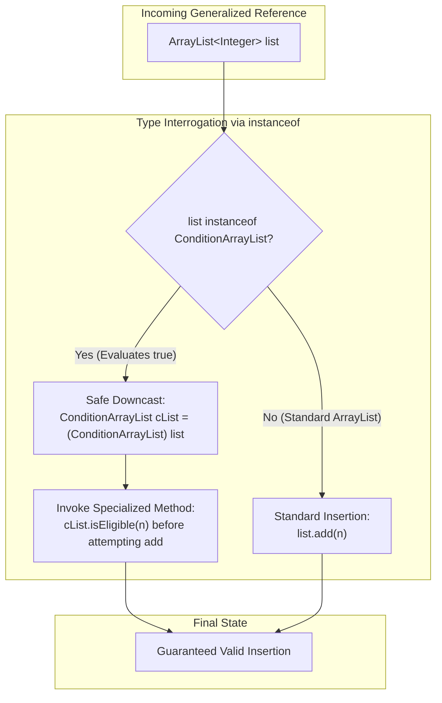

# Type Interrogation: The `instanceof` Operator, Downcasting & Dynamic Predicate Collections

---

## Key Takeaways

While runtime polymorphism encourages writing algorithms against generalized references (like `ArrayList<Integer>`), algorithms occasionally need to interrogate an incoming reference to discover its underlying runtime form and access specialized, subclass-specific capabilities. Java provides the **`instanceof`** binary comparison operator to test whether a heap object is an instance of a specified class or interface. Once confirmed via `instanceof`, the reference can be safely downcast to its specialized type without risking a runtime `ClassCastException`. Furthermore, evolving a hardcoded subclass (such as `OddArrayList`) into a dynamic parameterized collection (**`ConditionArrayList`**) via functional interfaces (`Predicate<Integer>`) demonstrates how composition and polymorphism combine to produce highly extensible domain structures.



- **The `instanceof` Operator**: Evaluates whether the object referenced on the left side is an instance of the class, subclass, or interface on the right side, returning a `boolean`.
- **Safe Downcasting**: Prevents `ClassCastException` by guarding explicit type casts with an `instanceof` check before accessing subclass-specific methods.
- **Higher-Order Parameterization**: Replacing static boolean checks (like `isOdd`) with an injected `Predicate<Integer>` field turns hardcoded subclasses into flexible, condition-driven abstractions.
- **Instance Scope Shift**: Moving from a static helper method to an instance-level method (`isEligible`) is necessary once validation logic depends on instance state (the `condition` predicate field accessed via `this`).
- **Defensive Algorithm Design**: Universal algorithms can interrogate generalized parameters at runtime, applying specialized validation logic (such as pre-screening random numbers via `isEligible`) when available, while gracefully falling back for standard parent instances.

---

## Main Discussion

### Idiomatic Java Code Snippets

#### 1. Generalizing State with Predicates: `ConditionArrayList.java`

Transitioning from hardcoded odd checks to an instance-level predicate condition:

```java
package type_interrogation;

import java.util.ArrayList;
import java.util.Collection;
import java.util.Objects;
import java.util.function.Predicate;

public class ConditionArrayList extends ArrayList<Integer> {

    // Instance-level predicate governing insertion eligibility
    private final Predicate<Integer> condition;

    // Constructor accepting a custom functional condition
    public ConditionArrayList(Predicate<Integer> condition) {
        super();
        this.condition = Objects.requireNonNull(condition, "Condition predicate cannot be null");
    }

    // Instance method evaluating elements against this list's specific rule
    public boolean isEligible(int element) {
        return this.condition.test(element);
    }

    @Override
    public boolean add(Integer element) {
        if (element != null && isEligible(element)) {
            return super.add(element);
        }
        return false;
    }

    @Override
    public void add(int index, Integer element) {
        if (element != null && isEligible(element)) {
            super.add(index, element);
        }
    }

    @Override
    public boolean addAll(Collection<? extends Integer> c) {
        Collection<Integer> validElements = c.stream()
                .filter(num -> num != null && isEligible(num))
                .toList();
        return super.addAll(validElements);
    }
}
```

#### 2. Type Interrogation and Downcasting: `UniversalAdder.java`

Using `instanceof` to identify specialized capabilities before attempting downcasts:

```java
package type_interrogation;

import java.util.ArrayList;
import java.util.Random;

public class UniversalAdder {

    private static final Random RANDOM = new Random();

    // Universal method accepting the generalized superclass reference
    public static void addRandomNumber(ArrayList<Integer> list) {
        // Interrogate runtime form: Is this list actually a ConditionArrayList?
        if (list instanceof ConditionArrayList) {
            // Explicit downcast: safe because instanceof confirmed the heap type
            ConditionArrayList conditionList = (ConditionArrayList) list;

            int randomInt = RANDOM.nextInt(1000);
            // Pre-screen the number using the subclass's unique method
            while (!conditionList.isEligible(randomInt)) {
                randomInt = RANDOM.nextInt(1000);
            }

            // Guaranteed to succeed on first invocation
            conditionList.add(randomInt);
        } else {
            // Fallback for regular ArrayList instances: standard direct addition
            int randomInt = RANDOM.nextInt(1000);
            list.add(randomInt);
        }
    }

    public static void main(String[] args) {
        // ConditionArrayList configured for odd integers only
        ConditionArrayList oddList = new ConditionArrayList(n -> Math.abs(n) % 2 == 1);

        // ConditionArrayList configured for even integers only
        ConditionArrayList evenList = new ConditionArrayList(n -> Math.abs(n) % 2 == 0);

        // Standard unconstrained ArrayList
        ArrayList<Integer> standardList = new ArrayList<>();

        // Invoking the universal method across different runtime types
        for (int i = 0; i < 5; i++) {
            addRandomNumber(oddList);
            addRandomNumber(evenList);
            addRandomNumber(standardList);
        }

        System.out.println("Odd List (ConditionArrayList):   " + oddList);
        System.out.println("Even List (ConditionArrayList):  " + evenList);
        System.out.println("Standard List (ArrayList):       " + standardList);
    }
}
```

#### 3. Modern Pattern Matching for `instanceof` (Java 16+)

In modern Java versions, the ceremony of explicit casting after `instanceof` can be streamlined using **pattern matching for `instanceof`**:

```java
// Traditional Pre-Java 16 downcasting:
if (list instanceof ConditionArrayList) {
    ConditionArrayList cList = (ConditionArrayList) list;
    cList.isEligible(42);
}

// Idiomatic Java 16+ Pattern Matching syntax:
if (list instanceof ConditionArrayList cList) {
    // Variable cList is already bound, typed, and in scope
    cList.isEligible(42);
}
```

### Under the Hood / JVM Mechanics

```
   CALL STACK (Frame: addRandomNumber)           JVM HEAP MEMORY (Instance Header)
+------------------------------------+        +-----------------------------------------+
| list reference: 0x00E2             |------->| ConditionArrayList Instance (0x00E2)    |
| (Declared Type: ArrayList<Integer>)|        | - Mark Word                             |
+------------------------------------+        | - Klass Word -> ConditionArrayList.class|
                                              | - condition: -> Lambda (n -> n % 2 != 0)|
                                              +-----------------------------------------+
                                                                   ^
   METASPACE CLASS HIERARCHY                                       |
+--------------------------------------------+                     |
| ConditionArrayList.class                   |---------------------+
| - super_class -> ArrayList.class           |
+--------------------------------------------+

```

1. **instance_of Bytecode Instruction Execution:**
   When the JVM encounters if (list instanceof ConditionArrayList), it emits the instanceof bytecode instruction. The JVM checks if the object reference on top of the operand stack is non-null. If null, it pushes 0 (false) immediately without throwing an exception.
2. **Metaspace Class Hierarchy Traversal:**
   The JVM reads the instance's Klass Word in its object header to locate its runtime class descriptor in Metaspace. It traverses the ancestor chain (and interface tables) upward. If the target type ConditionArrayList matches any point in that lineage, it pushes 1 (true) onto the operand stack.
3. **The checkcast Instruction Verification:**
   Executing the downcast (ConditionArrayList) list compiles into the checkcast opcode. The JVM validates type compatibility. Because instanceof evaluated to true, checkcast passes without raising a ClassCastException.
4. **Accessing Specialized Virtual Methods:**
   Once cast, the compiler permits calls to cList.isEligible(). At runtime, invokevirtual resolves the method directly via ConditionArrayList's vtable slot, invoking the underlying condition.test(element) lambda.

### Structural Comparisons

#### Upcasting vs. Downcasting

| Dimension        | Upcasting                                        | Downcasting                                              |
| ---------------- | ------------------------------------------------ | -------------------------------------------------------- |
| **Direction**    | Subclass $\rightarrow$ Superclass / Interface    | Superclass / Interface $\rightarrow$ Subclass            |
| **Syntax**       | Implicit / Automatic (`ArrayList list = cList;`) | Explicit cast required (`(ConditionArrayList) list`)     |
| **Runtime Risk** | **100% Safe**; never fails at runtime            | **Risky**; throws `ClassCastException` if types mismatch |
| **Safety Guard** | None required                                    | **Mandatory guard with `instanceof`**                    |
| **Capability**   | Restricts view to generalized parent members     | Unlocks specialized, subclass-specific members           |

#### `instanceof` vs. `.getClass()` Equality

| Characteristic        | `obj instanceof TargetClass`                                   | `obj.getClass() == TargetClass.class`                               |
| --------------------- | -------------------------------------------------------------- | ------------------------------------------------------------------- |
| **Polymorphic Check** | **Yes**; returns `true` for exact class **and all subclasses** | **No**; returns `true` **only** for exact runtime type match        |
| **Null Safety**       | Returns `false` cleanly if `obj == null`                       | Throws `NullPointerException` if `obj == null`                      |
| **Standard Usage**    | General type compatibility & safe downcasting                  | Strict identity checks (e.g., in strict `equals()` implementations) |

### Common Anti-Patterns & Edge Cases

- **Downcasting Without an `instanceof` Guard**:

  ```java
  public static void process(ArrayList<Integer> list) {
      // DANGEROUS: If caller passes a standard ArrayList, throws ClassCastException!
      ConditionArrayList cList = (ConditionArrayList) list;
      cList.isEligible(10);
  }
  ```

- **Redundant Null Checks**:
  Writing `if (list != null && list instanceof ConditionArrayList)` contains unnecessary boilerplate. The `instanceof` operator evaluates to `false` automatically whenever the operand is `null`.
- **Excessive `instanceof` Branching (Polymorphism Code Smell)**:
  Overusing long `if-else` chains checking for concrete types (`if (x instanceof Dog) ... else if (x instanceof Cat) ...`) often signals missing polymorphism in the base class design. Prefer adding a common polymorphic method to the parent class when behavior varies uniformly across all types.
- **Inverting Inheritance in `instanceof`**:
  Testing `if (conditionList instanceof ArrayList)`is trivially`true`for all non-null instances, but testing`if (arrayList instanceof ConditionArrayList)` requires dynamic evaluation since not all array lists are condition lists.

---

## Knowledge Check & JetBrains-Style Coding Challenges

### Theory Tips

- **Null Handling**: If `ref` is `null`, `ref instanceof AnyType` always evaluates to `false` without throwing an exception.
- **Downcasting Role**: Downcasting allows a program to treat a generalized object as its more specific subtype, unlocking methods that are not declared in the parent reference.
- **Instance Context Dependency**: When a method references an instance variable (like a predicate field), it **cannot** be marked `static`; it requires an active instance context (`this`).

### Question 1: Conceptual / Code Analysis

Consider the following inheritance hierarchy and driver snippet:

```java
class Vehicle {}
class Plane extends Vehicle {
    void fly() { System.out.print("Flying "); }
}
class Seaplane extends Plane {}

public class Airport {
    public static void inspect(Vehicle v) {
        if (v instanceof Plane) {
            Plane p = (Plane) v;
            p.fly();
        } else {
            System.out.print("Grounded ");
        }
    }

    public static void main(String[] args) {
        inspect(new Seaplane());
        inspect(new Vehicle());
        inspect(null);
    }
}
```

What is printed to the console?

- [ ] **A.** `Flying Grounded Grounded `
- [ ] **B.** `Flying Flying Grounded `
- [ ] **C.** `Flying Grounded ` followed by a `NullPointerException`
- [ ] **D.** A compilation error occurs because `Seaplane` cannot be cast to `Plane`.

<details>
<summary>Correct Answer</summary>

**Correct Answer**: **A**

**Technical Breakdown**:

- **A is correct**:

1. `inspect(new Seaplane())`: `Seaplane` extends `Plane`, so `v instanceof Plane` evaluates to `true`. The downcast succeeds, executing `p.fly()` which prints `"Flying "`.
2. `inspect(new Vehicle())`: The runtime type is `Vehicle`, which is not a `Plane`. `v instanceof Plane` evaluates to `false`, executing the else branch and printing `"Grounded "`.
3. `inspect(null)`: The `instanceof` operator evaluates to `false` on any `null` reference without throwing an exception. The else branch executes and prints `"Grounded "`.
4. The complete output sequence is `"Flying Grounded Grounded "`.

- **B is incorrect**: `new Vehicle()` is an ancestor, not an instance of `Plane`.
- **C is incorrect**: `null instanceof Plane` evaluates safely to `false`.
- **D is incorrect**: A subclass instance can be cast to any of its superclasses.

</details>

---

### Question 2: Mini Coding Problem / Implementation Challenge

**Task**: Implement an extensible scoring and audit framework inside package `type_interrogation`:

1. Class `ScoreList`:
   - Extends `ArrayList<Double>`.
   - Holds an instance variable `Predicate<Double> thresholdValidator`.
   - Constructor `public ScoreList(Predicate<Double> thresholdValidator)`: stores the predicate.
   - Method `public boolean passesThreshold(double score)`: tests the score using the validator.
   - Overrides `add(Double score)`: adds the score only if `score != null` and `passesThreshold(score)` is true.
2. Utility Class `ScoreAuditor`:
   - Method `public static int auditAndIngest(ArrayList<Double> targetList, double[] candidateScores)`:
   - Iterates through `candidateScores`.
   - If `targetList` is an instance of `ScoreList`:
     - Downcasts `targetList` to `ScoreList`.
     - Only attempts to add scores where `passesThreshold(score)` returns `true`.
   - If `targetList` is a standard `ArrayList`:
     - Adds each candidate score directly via `targetList.add(score)`.
   - Returns the total count of scores successfully added to `targetList`.

**Test Assertions**:

- `ScoreList passingScores = new ScoreList(s -> s >= 75.0);`
- `double[] scores = { 50.0, 80.0, 72.0, 95.0 };`
- `auditAndIngest(passingScores, scores)` $\rightarrow$ Adds `80.0` and `95.0`, returns: `2`
- `ArrayList<Double> standard = new ArrayList<>();`
- `auditAndIngest(standard, scores)` $\rightarrow$ Adds all 4 scores, returns: `4`

<details>
<summary>Solution</summary>

```java
package type_interrogation;

import java.util.ArrayList;
import java.util.Objects;
import java.util.function.Predicate;

public class ScoreList extends ArrayList<Double> {

    private final Predicate<Double> thresholdValidator;

    public ScoreList(Predicate<Double> thresholdValidator) {
        super();
        this.thresholdValidator = Objects.requireNonNull(thresholdValidator, "Validator cannot be null");
    }

    public boolean passesThreshold(double score) {
        return this.thresholdValidator.test(score);
    }

    @Override
    public boolean add(Double score) {
        if (score != null && passesThreshold(score)) {
            return super.add(score);
        }
        return false;
    }
}
```

```java
package type_interrogation;

import java.util.ArrayList;

public class ScoreAuditor {

    public static int auditAndIngest(ArrayList<Double> targetList, double[] candidateScores) {
        int addedCount = 0;

        // Interrogate runtime form using instanceof
        if (targetList instanceof ScoreList scoreList) {
            // Pattern matching downcast: access subclass-specific threshold method
            for (double score : candidateScores) {
                if (scoreList.passesThreshold(score)) {
                    scoreList.add(score);
                    addedCount++;
                }
            }
        } else {
            // Fallback for standard ArrayList instances
            for (double score : candidateScores) {
                targetList.add(score);
                addedCount++;
            }
        }

        return addedCount;
    }
}
```

**Complexity Analysis**:

- **Time Complexity**: $\mathcal{O}(M)$ where $M$ is the number of elements in `candidateScores`. Each `instanceof` check and predicate evaluation executes in $\mathcal{O}(1)$ time.
- **Space Complexity**: $\mathcal{O}(1)$ auxiliary space beyond the storage array growth managed by `ArrayList`.

</details>

---
