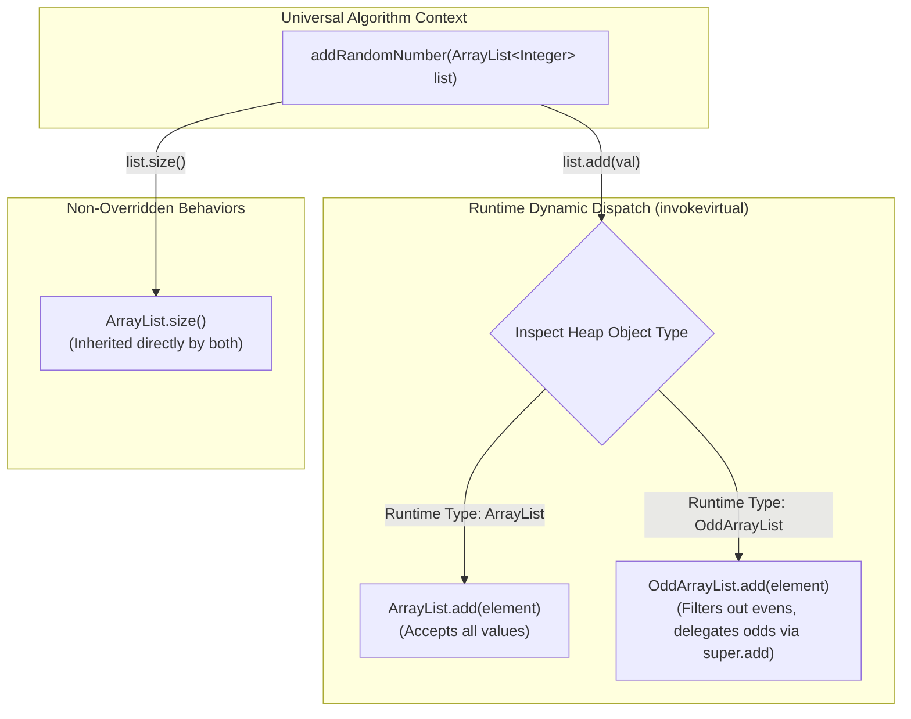

# Runtime Polymorphism: Method Overriding (`@Override`), Superclass Delegation (`super`), and Universal Algorithms

---

## Key Takeaways

**Runtime polymorphism** (dynamic polymorphism) occurs when a subclass overrides methods of its superclass to modify or constrain behaviors while maintaining the superclass's public interface contract. By overriding mutator methods such as `add()`, `addAll()`, and `set()`, a specialized collection like `OddArrayList` can enforce domain invariants (e.g., admitting only odd integers) while delegating actual storage manipulation to the parent class via `super.method()`. Because method dispatch in Java is resolved dynamically at runtime by inspecting the heap object's actual type, client methods written against generalized types (like `ArrayList<Integer>`) execute subclass-specific algorithms automatically.



- **Method Overriding Contract**: An overriding method must match the exact method signature (name and parameter types) of the parent method and use the `@Override` annotation for compile-time validation.
- **Superclass Delegation (`super.method()`)**: Reuses the underlying, bug-free implementations in the superclass (e.g., `super.add(element)`) rather than rewriting low-level storage routines.
- **Non-Overridden Heritage**: Behaviors not overridden (such as `list.size()`) invoke the superclass's implementation directly on both the superclass and subclass instances.
- **Writing Universal Algorithms**: Coding against generalized references (`ArrayList<Integer>` or `List<Integer>`) enables a single algorithm to process any present or future subclass, deferring exact behavioral execution to dynamic dispatch.
- **Invariant-Aware Loop Design**: When universal algorithms depend on state changes (such as generating random inputs until a specialized list accepts a value), checking state differentials (e.g., `list.size() == originalSize + 1`) ensures robustness against polymorphic filtering.

---

## Main Discussion

### Idiomatic Java Code Snippets

#### 1. Designing the Constrained Subclass (`OddArrayList.java`)

Overriding mutator entry points while delegating storage to `ArrayList<Integer>`:

```java
package runtime_polymorphism;

import java.util.ArrayList;
import java.util.Collection;
import java.util.function.UnaryOperator;

public class OddArrayList extends ArrayList<Integer> {

    // Helper predicate: Shared domain check for oddness
    public static boolean isOdd(int element) {
        return Math.abs(element) % 2 == 1;
    }

    // Default Constructor
    public OddArrayList() {
        super();
    }

    // Varargs Constructor: Filters initial elements
    public OddArrayList(Integer... numbers) {
        super();
        for (Integer num : numbers) {
            this.add(num);
        }
    }

    // Overriding add(E element)
    @Override
    public boolean add(Integer element) {
        if (element != null && isOdd(element)) {
            // Leverage superclass storage implementation
            return super.add(element);
        }
        return false;
    }

    // Overriding add(int index, E element)
    @Override
    public void add(int index, Integer element) {
        if (element != null && isOdd(element)) {
            super.add(index, element);
        }
    }

    // Overriding addAll(Collection<? extends Integer> c)
    @Override
    public boolean addAll(Collection<? extends Integer> c) {
        // Collect only odd elements using the Stream API
        Collection<Integer> oddOnly = c.stream()
                .filter(num -> num != null && isOdd(num))
                .toList();
        return super.addAll(oddOnly);
    }

    // Overriding set(int index, E element)
    @Override
    public Integer set(int index, Integer element) {
        if (element != null && isOdd(element)) {
            return super.set(index, element);
        }
        return Integer.MIN_VALUE; // Sentinel signaling rejected element
    }

    // Overriding replaceAll(UnaryOperator<Integer> operator)
    @Override
    public void replaceAll(UnaryOperator<Integer> operator) {
        super.replaceAll(operator);
        // Clean out any elements that transformed into even numbers
        super.removeIf(num -> !isOdd(num));
    }
}
```

#### 2. Writing Universal Algorithms Operating on Polymorphic Parameters (`Main.java`)

A single algorithm accepting `ArrayList<Integer>` adapts dynamically at runtime based on the concrete instance passed:

```java
package runtime_polymorphism;

import java.util.ArrayList;
import java.util.Random;

public class Main {

    private static final Random RANDOM = new Random();

    // Universal Algorithm: Operates on any ArrayList<Integer> polymorphically
    public static void addRandomNumber(ArrayList<Integer> list) {
        int originalSize = list.size();

        // Loop guarantees an element is added even if list.add() rejects evens
        while (list.size() == originalSize) {
            int randomInt = RANDOM.nextInt(1000); // 0 to 999
            list.add(randomInt); // Runtime Polymorphism in action!
        }
    }

    public static void main(String[] args) {
        // Initializing specialized and standard instances
        ArrayList<Integer> regularList = new ArrayList<>();
        OddArrayList oddList = new OddArrayList(1, 2, 3, 4, 5); // 2 and 4 filtered out on load

        System.out.println("Initial OddArrayList: " + oddList); // [1, 3, 5]

        // Invoking universal algorithm with polymorphic instances
        addRandomNumber(regularList);
        addRandomNumber(oddList);

        System.out.println("\n--- Post-Addition Inspection ---");
        System.out.println("Regular List: " + regularList + " (Size: " + regularList.size() + ")");
        System.out.println("Odd List:     " + oddList + " (Size: " + oddList.size() + ")");

        // Validating the OddArrayList invariant holds unconditionally
        boolean allOdd = oddList.stream().allMatch(OddArrayList::isOdd);
        System.out.println("Are all elements in OddArrayList odd? " + allOdd); // true
    }
}
```

### Under the Hood / JVM Mechanics

```
   CALL SITE (addRandomNumber)                  JVM HEAP (Actual Instance)
+-----------------------------------+        +-----------------------------------+
| aload_0 (list reference)          |------->| OddArrayList Instance (0x00FC)    |
| iload_2 (randomInt)               |        | - Object Header                   |
| invokevirtual #12 <ArrayList.add> |        | - Type Pointer: OddArrayList.class|
+-----------------------------------+        +-----------------------------------+
                  |                                            |
                  v                                            v
   METASPACE CLASS METADATA                     VIRTUAL METHOD TABLE (vtable)
+-----------------------------------+        +-----------------------------------+
| ArrayList.class                   |        | OddArrayList vtable               |
| - add(E) -> Offset [Slot 4]       |        | ...                               |
+-----------------------------------+        | Slot 4: &OddArrayList.add(Integer)| <--- Resolved!
                                             | Slot 5: &ArrayList.size()         |
                                             +-----------------------------------+
```

1. **Bytecode Generation (invokevirtual):**
   Inside addRandomNumber, the compiler checks the declared type of the parameter (`ArrayList<Integer>`) and generates an invokevirtual bytecode instruction targeting ArrayList.add(Object).
2. **Vtable Slot Resolution:**
   Each class in Metaspace maintains a Virtual Method Table (vtable) containing pointers to its executable methods. The method add(E) occupies a fixed slot offset in the vtable of ArrayList and all of its subclasses.
3. **Dynamic Dispatch at Runtime:**
   When invokevirtual executes, the JVM dereferences the heap object's header to identify its concrete runtime class. When passed an OddArrayList, the JVM reads Slot 4 of OddArrayList's vtable, redirecting execution to OddArrayList.add rather than ArrayList.add.
4. **Delegation via invokespecial:**
   When OddArrayList.add executes super.add(element), the compiler emits an invokespecial instruction. This instructs the JVM to bypass dynamic vtable lookup and directly call the superclass's implementation in ArrayList.

### Structural Comparisons

#### Method Overriding vs. Method Overloading

| Dimension           | Method Overriding (Runtime Polymorphism)       | Method Overloading (Compile-Time Polymorphism) |
| ------------------- | ---------------------------------------------- | ---------------------------------------------- |
| **Location**        | Between superclass and subclass                | Within the same class                          |
| **Method Name**     | Must be **identical**                          | Must be **identical**                          |
| **Parameters**      | Must match **exact types, count, and order**   | Must **differ** in type, count, or order       |
| **Return Type**     | Must be identical or covariant (subtype)       | Can be anything (not part of the signature)    |
| **Resolution Time** | Resolved dynamically at **runtime** via vtable | Resolved statically at **compile time**        |
| **Annotation**      | Enforced via `@Override`                       | None                                           |

#### Direct Implementation vs. Super Delegation

| Approach                   | Pattern                                                        | Trade-Off                                                             |
| -------------------------- | -------------------------------------------------------------- | --------------------------------------------------------------------- |
| **Pure Re-implementation** | Rewrite array resizing, shifting, and boundary checks directly | High risk of subtle memory or indexing bugs; duplicates JDK code      |
| **Delegation via `super`** | Validate input filter $\rightarrow$ call `super.method()`      | Reuses robust JDK array-handling routines while layering domain rules |

### Common Anti-Patterns & Edge Cases

- **Missing Mutator Entry Points**: Overriding `add(E)` on a custom collection but forgetting to override `addAll()`, `set()`, or collection-based constructors allows invalid elements to bypass the validation rules.
- **Omitting the `@Override` Annotation**:

  ```java
  // ACCIDENTAL OVERLOAD: Parameter type int instead of Integer
  public boolean add(int element) { ... }
  ```

  Without `@Override`, typos in method names or parameter types create a brand-new overloaded method rather than overriding the superclass method, disabling dynamic dispatch.

- **Direct Recursion without `super`**:

  ```java
  @Override
  public boolean add(Integer element) {
      if (isOdd(element)) {
          return this.add(element); // INFINITE RECURSION! Results in StackOverflowError
      }
      return false;
  }
  ```

  Invoking `this.add()` or `add()` from within an overriding method causes infinite recursive self-invocation. The superclass logic must be called using `super.add(element)`.

- **Assuming Primitive Modulo is Always Positive**: Evaluating negative odd numbers like `-3 % 2` produces `-1` in Java. Always use `Math.abs(num) % 2 == 1` or `num % 2 != 0` when checking oddness.

---

## Knowledge Check & JetBrains-Style Coding Challenges

### Theory Tips

- **Dynamic Binding**: Runtime polymorphism resolves method calls based on the runtime type of the object residing in the heap, not the declared type of the reference variable.
- **The `super` Keyword**: Used within an overriding method to invoke the superclass's version of that method (`super.add(item)`).
- **Negative Remainder Rule**: In Java, `%` retains the sign of the dividend. For negative numbers, `-5 % 2` equals `-1`, making `Math.abs(val) % 2 == 1` necessary for safe oddness verification.

### Question 1: Conceptual / Code Analysis

Consider the following classes:

```java
class Base {
    public void print(Number n) {
        System.out.print("Base ");
    }
}

class Sub extends Base {
    @Override
    public void print(Number n) {
        System.out.print("Sub-Number ");
    }

    public void print(Integer i) {
        System.out.print("Sub-Integer ");
    }
}
```

A developer writes the following client code:

```java
Base obj = new Sub();
Integer value = 10;
obj.print(value);
```

What is printed to the console?

- [] **A.** `Base `
- [] **B.** `Sub-Integer `
- [] **C.** `Sub-Number `
- [] **D.** A compilation error occurs because `Base` cannot resolve `Integer`.

<details>
<summary>Correct Answer</summary>

**Correct Answer**: **C**

**Technical Breakdown**:

- **C is correct**: Polymorphic resolution occurs in two phases:

1. **Compile Time**: The compiler looks at the declared reference type (`Base obj`). The only method available in `Base` matching `Integer` (via widening to `Number`) is `print(Number)`. The compiler permanently binds the call signature to `print(Number)`.
2. **Runtime**: At runtime, the JVM inspects the heap instance of `obj`, which is `Sub`. It dispatches dynamically to the method overriding `print(Number)`.
3. The method `Sub.print(Integer)` is an overload, not an override, and was never selected during compile time. Thus, `Sub.print(Number)` executes, printing `"Sub-Number "`.

- **A is incorrect**: Overridden methods are dispatched dynamically to the subclass; the base implementation is bypassed.
- **B is incorrect**: Overload selection happens at compile time based on the reference type `Base`, which has no `print(Integer)` method.
- **D is incorrect**: `Integer` is a subtype of `Number`, so it widening-converts cleanly at compile time.

</details>

---

### Question 2: Mini Coding Problem / Implementation Challenge

**Task**: Implement a positive-number-only collection named `PositiveDoubleList` inside package `runtime_polymorphism`:

1. Class `PositiveDoubleList`:
   - Extends `java.util.ArrayList<Double>`.
   - Overrides `boolean add(Double val)`:
     - If `val != null` and `val > 0.0`, delegates to `super.add(val)` and returns `true`.
     - Otherwise, returns `false` without adding the element.
   - Overrides `void add(int index, Double val)`:
     - If `val != null` and `val > 0.0`, delegates to `super.add(index, val)`.
   - Overrides `boolean addAll(Collection<? extends Double> c)`:
     - Filters input elements to only those strictly greater than `0.0`.
     - Passes the filtered elements to `super.addAll(...)`.
2. Utility class `ListAggregator`:
   - Method `public static double sumAnyList(ArrayList<Double> list)`:
     - Accepts any `ArrayList<Double>` polymorphically.
     - Iterates through elements and returns their sum.

**Test Assertions**:

- `PositiveDoubleList posList = new PositiveDoubleList();`
- `posList.add(10.5)` $\rightarrow$ Returns `true`, size becomes 1
- `posList.add(-4.2)` $\rightarrow$ Returns `false`, element rejected, size remains 1
- `posList.add(0.0)` $\rightarrow$ Returns `false`, element rejected
- `posList.addAll(List.of(-1.0, 5.0, -2.0, 15.0))` $\rightarrow$ Adds only `5.0` and `15.0`
- `ListAggregator.sumAnyList(posList)` $\rightarrow$ Returns `30.5`

<details>
<summary>Solution</summary>

```java
package runtime_polymorphism;

import java.util.ArrayList;
import java.util.Collection;
import java.util.List;

public class PositiveDoubleList extends ArrayList<Double> {

    @Override
    public boolean add(Double val) {
        if (val != null && val > 0.0) {
            return super.add(val);
        }
        return false;
    }

    @Override
    public void add(int index, Double val) {
        if (val != null && val > 0.0) {
            super.add(index, val);
        }
    }

    @Override
    public boolean addAll(Collection<? extends Double> c) {
        List<Double> positiveElements = c.stream()
                .filter(val -> val != null && val > 0.0)
                .toList();
        return super.addAll(positiveElements);
    }
}
```

```java
package runtime_polymorphism;

import java.util.ArrayList;

public class ListAggregator {

    // Universal Algorithm: Evaluates any ArrayList<Double> polymorphically
    public static double sumAnyList(ArrayList<Double> list) {
        double total = 0.0;
        for (Double value : list) {
            if (value != null) {
                total += value;
            }
        }
        return total;
    }
}
```

**Complexity Analysis**:

- **Time Complexity**:
  - `add(Double)`: $\mathcal{O}(1)$ amortized insertion time inherited from `ArrayList`.
  - `addAll(Collection)`: $\mathcal{O}(K)$ where $K$ is the number of elements in the collection to filter and append.
  - `sumAnyList`: $\mathcal{O}(N)$ linear scan across all stored elements.
- **Space Complexity**: $\mathcal{O}(1)$ auxiliary memory for single insertions; $\mathcal{O}(K)$ temporary space for the filtered collection during `addAll`.

</details>

---
