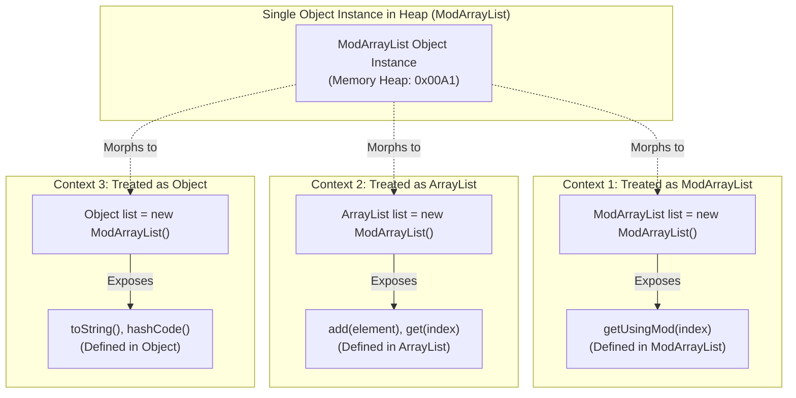

# Object-Oriented Principles: The Essence of Polymorphism, Dual Morphologies & Behavioral Context

---

## Key Takeaways

Polymorphism (derived from the Greek _poly_ meaning "many" and _morph_ meaning "form") is the ability of an object or method to take on multiple forms depending on the execution context. In Java, an object instantiated from a derived class can be treated as an instance of its own class, an instance of any superclass in its inheritance hierarchy, or an implementation of any interface it fulfills. Java categorizes polymorphism into two mechanisms: **compile-time polymorphism** (static polymorphism achieved via method overloading) and **runtime polymorphism** (dynamic polymorphism achieved via method overriding and inheritance substitution).



- **Core Definition**: The capability of a single entity (object reference or method name) to exhibit different forms and behaviors depending on invocation context.
- **Structural Manifestation in Inheritance**: A `ModArrayList` instance simultaneously _is_ a `ModArrayList`, an `ArrayList`, an `AbstractList`, and a `java.lang.Object`.
- **Context-Driven Capability**: Invoking `.getUsingMod()` utilizes the object in its specialized child form; invoking `.add()` or `.get()` utilizes the object in its generalized parent form.
- **The Two Classifications**:
  - **Compile-Time Polymorphism (Static)**: Method Overloading—resolved by the compiler using parameter types and counts before runtime.
  - **Runtime Polymorphism (Dynamic)**: Method Overriding & Upcasting—resolved dynamically at runtime by inspecting the heap object's actual type.

---

## Main Discussion / Deep Dive

### Idiomatic Java Code Snippets

#### 1. Manifesting Multiple Forms: An Object Assuming Different Contexts

Demonstrating how a single underlying heap instance of `ModArrayList` is referenced and utilized across multiple polymorphic types:

```java
package polymorphism_intro;

import java.util.ArrayList;
import java.util.List;

public class PolymorphicFormsDemo {

    public static void main(String[] args) {
        // Form 1: Explicit Subclass Reference
        // Direct access to specialized methods like getUsingMod() as well as inherited methods
        ModArrayList<String> specializedRef = new ModArrayList<>();
        specializedRef.add("Java");
        specializedRef.add("Kotlin");
        System.out.println("Form 1 (ModArrayList): " + specializedRef.getUsingMod(5)); // Kotlin

        // Form 2: Superclass Reference (ArrayList)
        // Upcasting: The same instance treated generally as an ArrayList
        ArrayList<String> arrayListRef = specializedRef;
        arrayListRef.add("Scala"); // Method defined inside java.util.ArrayList
        // arrayListRef.getUsingMod(0); // Compilation Error: ArrayList does not define getUsingMod()

        // Form 3: Interface Reference (List)
        // Treated purely as a contractual List
        List<String> listInterfaceRef = specializedRef;
        System.out.println("Form 3 (List size): " + listInterfaceRef.size()); // 3

        // Form 4: Root Universal Superclass Reference (Object)
        Object rootObjRef = specializedRef;
        System.out.println("Form 4 (Object toString): " + rootObjRef.toString());
    }
}
```

#### 2. The Two Forms of Polymorphism in Java

Contrasting Compile-Time (Static) vs. Runtime (Dynamic) polymorphism in one class:

```java
package polymorphism_intro;

public class PolymorphismTypesDemo {

    // 1. COMPILE-TIME POLYMORPHISM (Static / Overloading)
    // Same method name, distinct parameter signatures resolved at compile time
    public int multiply(int a, int b) {
        return a * b;
    }

    public double multiply(double a, double b) {
        return a * b;
    }

    public int multiply(int a, int b, int c) {
        return a * b * c;
    }

    public static void main(String[] args) {
        PolymorphismTypesDemo demo = new PolymorphismTypesDemo();

        // Compiler selects multiply(int, int) based on argument types
        System.out.println("Overload (int): " + demo.multiply(4, 5));

        // Compiler selects multiply(double, double)
        System.out.println("Overload (double): " + demo.multiply(2.5, 4.0));
    }
}
```

```java
package polymorphism_intro;

// 2. RUNTIME POLYMORPHISM (Dynamic / Overriding)
class Animal {
    public void makeSound() {
        System.out.println("Generic animal vocalization");
    }
}

class Dog extends Animal {
    @Override
    public void makeSound() {
        System.out.println("Bark! Bark!");
    }
}

class Cat extends Animal {
    @Override
    public void makeSound() {
        System.out.println("Meow!");
    }
}

class RuntimePolymorphismDemo {
    public static void main(String[] args) {
        // Polymorphic reference assignment
        Animal pet1 = new Dog();
        Animal pet2 = new Cat();

        // JVM resolves the concrete implementation dynamically at runtime
        pet1.makeSound(); // Prints: Bark! Bark!
        pet2.makeSound(); // Prints: Meow!
    }
}
```

### Under the Hood / JVM Mechanics

1. **Reference Type vs. Runtime Object Type:**
   In `ArrayList<String> list = new ModArrayList<>()`, the compiler checks validity against the declared reference type (ArrayList). The heap memory allocation however stores the actual runtime object type (ModArrayList).
2. **Static Compile-Time Resolution (invokestatic / invokespecial):**
   For method overloading (compile-time polymorphism), javac inspects the argument types and permanently binds the call to a specific bytecode signature descriptor (e.g., multiply:(II)I vs multiply:(DD)D) at compile time.
3. **Virtual Method Table (vtable) Setup:**
   When classes load into Metaspace, the JVM constructs a vtable for each class. ModArrayList inherits the vtable slots of ArrayList, adding new slots for custom methods like getUsingMod.
4. **Runtime Dynamic Method Dispatch (invokevirtual):**
   When a virtual method runs on a polymorphic reference (e.g., pet1.makeSound()), the JVM issues an invokevirtual instruction. It reads the heap object's actual class header pointer, navigates to that class's vtable, and branches to the overridden method dynamically.

### Structural Comparisons

#### Compile-Time vs. Runtime Polymorphism

| Dimension               | Compile-Time Polymorphism                    | Runtime Polymorphism                                              |
| ----------------------- | -------------------------------------------- | ----------------------------------------------------------------- |
| **Mechanism**           | **Method Overloading**                       | **Method Overriding & Upcasting**                                 |
| **Binding Time**        | Static / Early binding (Compile time)        | Dynamic / Late binding (Runtime)                                  |
| **How It Operates**     | Methods have same name, different signatures | Subclass provides specific implementation of parent method        |
| **Flexibility**         | High speed, fixed parameter matching         | Dynamic, allows substituting new subclasses without recompilation |
| **JVM Instruction**     | Directly binds target descriptor in bytecode | Uses `invokevirtual` to inspect heap instance via `vtable`        |
| **Inheritance Needed?** | **No** (can exist in a single class)         | **Yes** (requires class inheritance or interface contracts)       |

#### Declared Reference Type vs. Actual Runtime Instance Type

| Code Statement                         | Declared Type (Compiler Lens) | Actual Runtime Type (Heap Lens) | Accessible Methods                                             |
| -------------------------------------- | ----------------------------- | ------------------------------- | -------------------------------------------------------------- |
| `ModArrayList m = new ModArrayList();` | `ModArrayList`                | `ModArrayList`                  | All `ArrayList` methods + `getUsingMod()`                      |
| `ArrayList a = new ModArrayList();`    | `ArrayList`                   | `ModArrayList`                  | Only methods declared in `ArrayList` (e.g., `add`, `get`)      |
| `Object o = new ModArrayList();`       | `Object`                      | `ModArrayList`                  | Only universal methods declared in `Object` (e.g., `toString`) |

### Common Anti-Patterns & Edge Cases

- **Attempting to Invoke Subclass Methods via Superclass Reference**:

  ```java
  ArrayList<Integer> list = new ModArrayList<>();
  list.getUsingMod(2); // COMPILATION ERROR: cannot find symbol method getUsingMod(int)
  ```

  Even though the heap instance _is_ a `ModArrayList`, the compiler restricts accessible method signatures to the declared reference type (`ArrayList`).

- **Confusing Overloading with Overriding**:
  - **Overloading** (Compile-time): Same method name, different parameters (e.g., `calculate(int)` vs `calculate(double)`).
  - **Overriding** (Runtime): Same method name, exact same parameters, identical or covariant return type in a subclass.
- **Assuming Fields are Polymorphic**:
  In Java, **only methods are polymorphic**. If a subclass declares a field with the exact same name as a superclass field (field shadowing), accessing the field via a superclass reference retrieves the _superclass's_ value, bypassing the child's field.

---

## Knowledge Check & JetBrains-Style Coding Challenges

### Theory Tips

- **Definition of Polymorphism**: The capability of an object or function to take on many forms depending on the context.
- **Two Core Types**: Java supports **compile-time polymorphism** (method overloading) and **runtime polymorphism** (method overriding).
- **Code Navigation**: Clicking into a method in an IDE takes you to where that method is defined in the class hierarchy (e.g., calling `add()` on `ModArrayList` navigates to `ArrayList.java`).

### Question 1: Conceptual / Code Analysis

Consider the following class hierarchy:

```java
class Printer {
    public void print(String message) {
        System.out.println("Base Printer: " + message);
    }
}

class LaserPrinter extends Printer {
    @Override
    public void print(String message) {
        System.out.println("Laser Printer: " + message);
    }

    public void cleanToner() {
        System.out.println("Cleaning toner cartridges...");
    }
}
```

A developer writes the following main method:

```java
Printer p = new LaserPrinter();
p.print("Invoice.pdf"); // Line 2
p.cleanToner();         // Line 3
```

What occurs when this code is compiled and executed?

- [ ] **A.** The code compiles and prints `"Laser Printer: Invoice.pdf"` followed by `"Cleaning toner cartridges..."`.
- [ ] **B.** A compilation error occurs at Line 3 because `cleanToner()` is not declared in the reference type `Printer`.
- [ ] **C.** A compilation error occurs at Line 2 because `Printer` cannot reference a `LaserPrinter`.
- [ ] **D.** Line 2 prints `"Base Printer: Invoice.pdf"` because `p` is of type `Printer`.

<details>
<summary>Correct Answer</summary>

**Correct Answer**: **B**

**Technical Breakdown**:

- **B is correct**: Java uses the **declared reference type** at compile time to determine what members are accessible. The variable `p` is declared with reference type `Printer`. Because `Printer` does not declare a `cleanToner()` method, Line 3 fails to compile: `cannot find symbol method cleanToner()`.
- **A is incorrect**: Line 3 fails before compilation can complete.
- **C is incorrect**: Upcasting (`Printer p = new LaserPrinter()`) is fully legal under the "IS-A" inheritance relationship.
- **D is incorrect**: If Line 3 were commented out, Line 2 would use dynamic method dispatch to invoke the overridden method in `LaserPrinter`, printing `"Laser Printer: Invoice.pdf"`.

</details>

---

### Question 2: Mini Coding Problem / Implementation Challenge

**Task**: Demonstrate compile-time and runtime polymorphism inside package `polymorphism_intro`:

1. Class `VolumeCalculator` (demonstrating **Compile-Time Polymorphism via Overloading**):
   - `public double calculateVolume(double side)`: calculates cube volume ($side^3$).
   - `public double calculateVolume(double radius, double height)`: calculates cylinder volume ($\pi \times radius^2 \times height$) using `Math.PI`.
   - `public double calculateVolume(double length, double width, double height)`: calculates rectangular prism volume ($length \times width \times height$).
2. Hierarchy demonstrating **Runtime Polymorphism via Overriding**:
   - Base class `MediaElement`: method `public String render()` returning `"Rendering generic media element"`.
   - Subclass `ImageElement` extending `MediaElement`: overrides `render()` returning `"Rendering high-resolution bitmap image"`.
   - Subclass `VideoElement` extending `MediaElement`: overrides `render()` returning `"Rendering 60fps streaming video frame"`.
3. Method `public static String[] renderAll(MediaElement[] elements)`:
   - Iterates through an array of polymorphic `MediaElement` references and populates a `String[]` with the result of calling `.render()` on each instance.

**Test Assertions**:

- `VolumeCalculator vc = new VolumeCalculator();`
- `vc.calculateVolume(3.0)` $\rightarrow$ Returns: `27.0`
- `vc.calculateVolume(2.0, 5.0)` $\rightarrow$ Returns: `20.0 * Math.PI` ($\approx 62.83185$)
- `vc.calculateVolume(2.0, 3.0, 4.0)` $\rightarrow$ Returns: `24.0`
- `MediaElement[] batch = { new ImageElement(), new VideoElement() };`
- `renderAll(batch)` $\rightarrow$ Returns: `["Rendering high-resolution bitmap image", "Rendering 60fps streaming video frame"]`

<details>
<summary>Solution</summary>

```java
package polymorphism_intro;

// Demonstrates Compile-Time Polymorphism (Method Overloading)
public class VolumeCalculator {

    // Overload 1: Cube
    public double calculateVolume(double side) {
        return side * side * side;
    }

    // Overload 2: Cylinder
    public double calculateVolume(double radius, double height) {
        return Math.PI * radius * radius * height;
    }

    // Overload 3: Rectangular Prism
    public double calculateVolume(double length, double width, double height) {
        return length * width * height;
    }
}
```

```java
package polymorphism_intro;

// Base class for Runtime Polymorphism
public class MediaElement {

    public String render() {
        return "Rendering generic media element";
    }
}
```

```java
package polymorphism_intro;

public class ImageElement extends MediaElement {

    @Override
    public String render() {
        return "Rendering high-resolution bitmap image";
    }
}
```

```java
package polymorphism_intro;

public class VideoElement extends MediaElement {

    @Override
    public String render() {
        return "Rendering 60fps streaming video frame";
    }
}
```

```java
package polymorphism_intro;

public class MediaRenderer {

    // Runtime Polymorphic Dispatch: operates on base MediaElement, executes child logic
    public static String[] renderAll(MediaElement[] elements) {
        String[] results = new String[elements.length];

        for (int i = 0; i < elements.length; i++) {
            // Dynamic dispatch resolves ImageElement.render() or VideoElement.render()
            results[i] = elements[i].render();
        }

        return results;
    }
}
```

**Complexity Analysis**:

- **Time Complexity**:
  - `VolumeCalculator`: $\mathcal{O}(1)$ constant-time arithmetic evaluation.
  - `renderAll`: $\mathcal{O}(N)$ where $N$ is the number of elements in the `MediaElement[]` array. Each virtual method dispatch resolves in $\mathcal{O}(1)$ time via table lookup.
- **Space Complexity**: $\mathcal{O}(N)$ auxiliary memory allocated for the returned `String[]` array containing the rendering strings.

</details>

---
