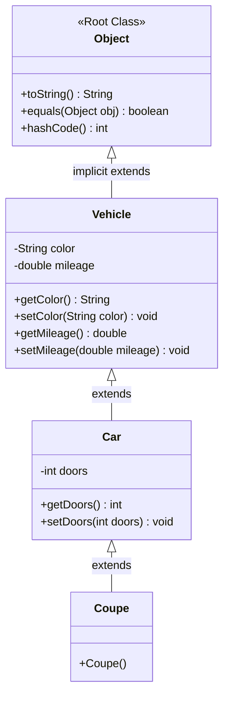

# Object-Oriented Programming: Multilevel Inheritance & The Universal Object Root

---

## Key Takeaways

Java enforces a single-inheritance model where a class can directly extend at most one superclass. However, Java supports multilevel inheritance through a chain of inheritance, allowing a subclass to transitively inherit accessible members from all its ancestor classes up the hierarchy. At the root of every inheritance hierarchy in Java sits the universal base class `java.lang.Object`, meaning every Java class automatically inherits foundational methods without requiring explicit declaration.



- **Single vs. Multilevel Inheritance**: Java does not support multiple inheritance (a single class extending multiple direct superclasses), but enables hierarchical reuse through multilevel inheritance chains.
- **Transitive Member Inheritance**: A derived subclass inherits all accessible fields and methods from its immediate superclass as well as all ancestor classes up the chain.
- **Universal Ancestor (`java.lang.Object`)**: Any class that does not explicitly specify an `extends` clause implicitly extends `java.lang.Object`, making `Object` methods available on every reference type in Java.
- **Specialization Down the Chain**: Each descending class in an inheritance hierarchy can introduce more specific state or pre-configure inherited properties.

---

## Main Discussion

### Idiomatic Java Code Snippets

#### 1. Constructing the Multilevel Inheritance Hierarchy

The top ancestor defines baseline properties, intermediate classes specialize the category, and leaf classes apply specific configurations:

```java
package inheritance_chain;

// Implicitly extends java.lang.Object
public class Vehicle {

    private String color;
    private double mileage;

    public String getColor() {
        return color;
    }

    public void setColor(String color) {
        this.color = color;
    }

    public double getMileage() {
        return mileage;
    }

    public void setMileage(double mileage) {
        this.mileage = mileage;
    }
}
```

```java
package inheritance_chain;

// Intermediate class: Car inherits from Vehicle
public class Car extends Vehicle {

    private int doors;

    public int getDoors() {
        return doors;
    }

    public void setDoors(int doors) {
        this.doors = doors;
    }
}

```

```java
package inheritance_chain;

// Leaf class: Coupe inherits from Car (and transitively from Vehicle and Object)
public class Coupe extends Car {

    public Coupe() {
        // Sets inherited state from Car
        setDoors(2);
    }
}
```

#### 2. Accessing Transitive and Universal Methods

An instance of the leaf class invokes methods defined across all ancestor levels as well as methods provided by `Object`:

```java
package inheritance_chain;

public class ChainTest {

    public static void main(String[] args) {
        Coupe myCar = new Coupe();

        // Method inherited from grandparent (Vehicle)
        myCar.setColor("red");

        // Methods inherited from Vehicle (getColor) and Car (getDoors)
        String message = String.format("My car is %s and has %d doors.",
                                       myCar.getColor(),
                                       myCar.getDoors());
        System.out.println(message); // Prints: My car is red and has 2 doors.

        // Method inherited from universal root ancestor (java.lang.Object)
        System.out.println("Object class method available: " + myCar.toString());
    }
}
```

### Under the Hood / JVM Mechanics

1. **Transitive Symbol Resolution:**
   When a method is called on a leaf instance (e.g., myCar.setColor('red')), the compiler first searches Coupe. If not found, it traverses upward to Car, then to Vehicle, and finally to Object, binding the invocation to the first matching accessible signature.

2. **Implicit Object Root Injection:**
   If a top-level class header lacks an extends clause (as in public class Vehicle), the javac compiler automatically injects extends java.lang.Object into the compiled bytecode.

3. **Constructor Cascading Up the Chain:**
   Instantiating new Coupe() triggers a chained sequence of constructor frames: Coupe invokes Car(), which invokes Vehicle(), which invokes Object(). Initialization runs from top to bottom before returning to the leaf constructor.

4. **Unified Heap Layout:**
   The allocated object on the heap contains storage slots for all fields declared throughout the entire ancestor hierarchy: color, mileage, and doors.

### Structural Comparisons

#### Single vs. Multilevel vs. Multiple Inheritance

| Category                   | Java Support    | Description                                      | Example Syntax                                   |
| -------------------------- | --------------- | ------------------------------------------------ | ------------------------------------------------ |
| **Single Inheritance**     | Supported       | A class extends exactly one direct parent        | `class Car extends Vehicle`                      |
| **Multilevel Inheritance** | Supported       | A class extends a class that extends another     | `class Coupe extends Car`                        |
| **Multiple Inheritance**   | **Unsupported** | A class directly extends multiple parent classes | `class Car extends Vehicle, Machine` _(Illegal)_ |

#### Hierarchy Levels in the Vehicle Example

| Class Level       | Class Name | Direct Superclass | Introduced Features                          | Transitive Ancestors       |
| ----------------- | ---------- | ----------------- | -------------------------------------------- | -------------------------- |
| **Root**          | `Object`   | _None_            | Core identity methods (`toString`, `equals`) | _None_                     |
| **Grandparent**   | `Vehicle`  | `Object`          | `color`, `mileage` fields and accessors      | `Object`                   |
| **Parent**        | `Car`      | `Vehicle`         | `doors` field and accessors                  | `Vehicle`, `Object`        |
| **Leaf Subclass** | `Coupe`    | `Car`             | Pre-sets `doors = 2`                         | `Car`, `Vehicle`, `Object` |

### Common Anti-Patterns & Edge Cases

- **Attempting Multiple Direct Inheritance**: Writing `public class Coupe extends Car, Vehicle` results in an immediate compile-time syntax error: `'{' expected`. Java classes cannot directly extend more than one class.
- **Assuming Ancestor Fields Are Bypassed**: If a private field exists in `Vehicle`, intermediate class `Car` cannot access it directly, and leaf class `Coupe` cannot access it directly. Both must rely on inherited non-private accessors (`getColor()`, `setColor()`).
- **Circular Inheritance**: Attempting to create an inheritance loop (e.g., `class A extends B` while `class B extends A`) causes a compile-time failure: `cyclic inheritance involving A`.

---

## Knowledge Check & JetBrains-Style Coding Challenges

### Theory Tips

- **Universal Superclass**: Every single class in Java implicitly or explicitly inherits from `java.lang.Object`.
- **No Multiple Class Inheritance**: Java does not support multiple inheritance with classes; a class can only appear after a single `extends` keyword.
- **Transitive Access**: A class inherits accessible members not just from its immediate parent, but from all ancestors in its inheritance chain.

### Question 1: Conceptual / Code Analysis

Consider the following class definitions:

```java
class Alpha {
    public void execute() {
        System.out.print("Alpha ");
    }
}

class Beta extends Alpha { }

class Gamma extends Beta {
    public void display() {
        execute();
        System.out.print(toString() != null ? "Valid" : "Invalid");
    }
}

```

What happens when `new Gamma().display()` is executed?

- [ ] **A** A compilation error occurs because `execute()` is not defined in `Beta` or `Gamma`.
- [ ] **B** A compilation error occurs because `toString()` is not defined in `Alpha`, `Beta`, or `Gamma`.
- [ ] **C** It prints `Alpha Valid` to the console.
- [ ] **D** It throws a runtime `NoSuchMethodError` when searching for `toString()`.

<details>
<summary>Correct Answer</summary>

**Correct Answer**: **C**

**Technical Breakdown**:

- **C is correct**: Through multilevel inheritance, `Gamma` transitively inherits `execute()` from its grandparent `Alpha`. Furthermore, because `Alpha` has no explicit `extends` clause, it implicitly extends `java.lang.Object`, meaning `Gamma` also inherits all accessible methods of `Object`, including `toString()`. When `display()` runs, `execute()` prints `"Alpha "`, and `toString()` returns a non-null string representation of the instance, printing `"Valid"`.
- **A is incorrect**: Transitive inheritance allows `Gamma` to inherit accessible methods defined on any ancestor class up the chain.
- **B is incorrect**: Every class in Java inherits from `java.lang.Object`, so `toString()` is available on all class instances.
- **D is incorrect**: The method references are fully resolved and valid at both compile time and runtime.

</details>

---

### Question 2: Mini Coding Problem / Implementation Challenge

**Task**: Implement a 3-tier device hierarchy modeling multilevel inheritance:

1. Base class `Device`:

- Private field `brand` (`String`).
- Public getter and setter for `brand`.

2. Intermediate class `Computer` extending `Device`:

- Private field `ramGb` (`int`).
- Public getter and setter for `ramGb`.

3. Leaf class `Laptop` extending `Computer`:

- Private field `batteryLifeHours` (`int`).
- Public getter and setter for `batteryLifeHours`.

4. Provide a utility method `formatSpecs(Laptop laptop)` in class `DeviceReporter` that returns a formatted string:
   `"[brand] Laptop: [ramGb]GB RAM, [batteryLifeHours]h Battery"` using `String.format`.

**Test Assertions**:

- A `Laptop` instance with `brand` = `"Framework"`, `ramGb` = `32`, and `batteryLifeHours` = `10` $\rightarrow$ Returns: `"Framework Laptop: 32GB RAM, 10h Battery"`

<details>
<summary>Solution</summary>

```java
package inheritance_chain;

public class Device {

    private String brand;

    public String getBrand() {
        return brand;
    }

    public void setBrand(String brand) {
        this.brand = brand;
    }
}

```

```java
package inheritance_chain;

public class Computer extends Device {

    private int ramGb;

    public int getRamGb() {
        return ramGb;
    }

    public void setRamGb(int ramGb) {
        this.ramGb = ramGb;
    }
}

```

```java
package inheritance_chain;

public class Laptop extends Computer {

    private int batteryLifeHours;

    public int getBatteryLifeHours() {
        return batteryLifeHours;
    }

    public void setBatteryLifeHours(int batteryLifeHours) {
        this.batteryLifeHours = batteryLifeHours;
    }
}

```

```java
package inheritance_chain;

public class DeviceReporter {

    public static String formatSpecs(Laptop laptop) {
        // Accesses methods across the entire multilevel hierarchy:
        // getBrand() from Device, getRamGb() from Computer, getBatteryLifeHours() from Laptop
        return String.format("%s Laptop: %dGB RAM, %dh Battery",
                laptop.getBrand(),
                laptop.getRamGb(),
                laptop.getBatteryLifeHours());
    }
}

```

**Complexity Analysis**:

- **Time Complexity**: $\mathcal{O}(L)$ where $L$ is the character length of the formatted specification string produced by `String.format`.
- **Space Complexity**: $\mathcal{O}(L)$ auxiliary memory allocated on the heap for the resulting formatted string.

</details>

---
