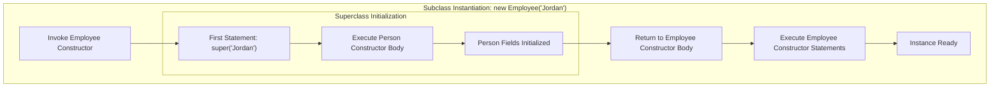

# Object-Oriented Programming: Constructor Chaining & Superclass Initialization

---

## Key Takeaways

When instantiating a subclass in an inheritance hierarchy, the superclass constructor executes unconditionally before the body of the subclass constructor runs. This ordering guarantees that all inherited state and parent-level invariants are initialized before specialized subclass logic executes. By default, Java inserts an implicit call to the superclass's no-argument (default) constructor; however, explicit invocations can target parameterized superclass constructors using the reserved keyword `super(...)`, which must be placed on the very first line of the subclass constructor.



- **Constructor Execution Order**: A superclass constructor always finishes executing before the subclass constructor executes its own body.
- **Implicit Default Chaining**: If a subclass constructor omits an explicit call to `super(...)`, Java automatically issues an implicit `super()` call to the superclass's no-argument constructor.
- **First-Statement Invariant**: Any explicit call to `super(...)` must strictly be the **very first statement** in the subclass constructor body.
- **Missing Default Constructor Consequence**: If a superclass defines parameterized constructors but no default (no-argument) constructor, the subclass must explicitly call an available superclass constructor via `super(...)` with matching arguments, or compilation will fail.

---

## Main Discussion

### Idiomatic Java Code Snippets

#### 1. Constructor Chaining with Explicit `super(...)`

The superclass defines both a default constructor and an overloaded constructor requiring arguments:

```java
package inheritance_constructors;

public class Person {

    private String name;

    // Default (no-argument) constructor
    public Person() {
        System.out.println("In Person default constructor");
    }

    // Parameterized constructor
    public Person(String name) {
        this.name = name;
        System.out.println("In Person parameterized constructor: name is set to " + name);
    }

    public String getName() {
        return name;
    }
}
```

The subclass delegates initialization to the superclass constructor using `super(...)` as the first statement:

```java
package inheritance_constructors;

public class Employee extends Person {

    private String title;

    // Default subclass constructor delegating to the superclass parameterized constructor
    public Employee() {
        // Explicit super constructor invocation must be the first line
        super("Jordan");
        System.out.println("In Employee default constructor");
    }

    // Overloaded subclass constructor
    public Employee(String name, String title) {
        super(name); // Delegates name initialization to Person(String)
        this.title = title;
        System.out.println("In Employee parameterized constructor: title is set to " + title);
    }

    public String getTitle() {
        return title;
    }
}
```

#### 2. Instantiation Verification

Executing `InheritanceChecker` reveals the nested execution order of constructor calls:

```java
package inheritance_constructors;

public class InheritanceChecker {

    public static void main(String[] args) {
        System.out.println("--- Instantiating Employee with default constructor ---");
        Employee emp1 = new Employee();

        System.out.println("\n--- Instantiating Employee with parameterized constructor ---");
        Employee emp2 = new Employee("Taylor", "Lead Engineer");
    }
}
```

**Console Output**:

```text
--- Instantiating Employee with default constructor ---
In Person parameterized constructor: name is set to Jordan
In Employee default constructor

--- Instantiating Employee with parameterized constructor ---
In Person parameterized constructor: name is set to Taylor
In Employee parameterized constructor: title is set to Lead Engineer
```

### Under the Hood / JVM Mechanics

1. **Subclass Constructor Invocation:**
   When new Employee() is called, the JVM allocates heap memory for the object and enters the Employee constructor method frame.

2. **Inspection for Explicit super(...) Call:**
   The compiler inspects the first statement in the constructor. If an explicit super(...) is present, arguments are evaluated and passed to the designated parent constructor. If absent, the compiler automatically emits an opcode for super().

3. **Superclass Frame Execution:**
   Control shifts to the matching Person constructor. Any statements and initializations inside Person complete first, ensuring parent fields and structures are valid.

4. **Subclass Frame Completion:**
   Once the superclass constructor completes, control returns to the line immediately following super(...) in the Employee constructor to initialize child-specific fields and complete object creation.

### Structural Comparisons

#### Explicit `super(...)` vs. Implicit `super()`

| Trait                      | Implicit `super()`                                         | Explicit `super(...)`                                            |
| -------------------------- | ---------------------------------------------------------- | ---------------------------------------------------------------- |
| **Declaration in Code**    | Omitted entirely; inserted by compiler                     | Written explicitly by developer                                  |
| **Target Constructor**     | Superclass no-arg/default constructor only                 | Any matching superclass constructor                              |
| **Placement Constraint**   | Handled at line 1 automatically                            | Must strictly be line 1 of the constructor body                  |
| **Superclass Requirement** | Superclass **must** have an accessible default constructor | Superclass must have a constructor matching the passed arguments |

### Common Anti-Patterns & Edge Cases

- **Placing `super(...)` Below Statements**: Writing code before calling `super(...)` triggers a compile-time failure:

```java
public Employee() {
    System.out.println("Initializing..."); // Compilation Error: call to super must be first statement in constructor
    super("Jordan");
}

```

- **No Default Constructor in Superclass**: If a superclass defines `public Person(String name)` but does not declare `public Person()`, attempting to write an empty subclass constructor triggers a compile-time error:

```java
public class Employee extends Person {
    public Employee() {
        // Implicit super() fails because Person has no default constructor
    }
}
```

_Fix_: Explicitly invoke `super("DefaultName")` on line 1.

- **Circular Constructor Delegation**: Attempting to place multiple `super(...)` calls in a single constructor is illegal; exactly one constructor delegation can run per instantiation branch.

---

## Knowledge Check & JetBrains-Style Coding Challenges

### Theory Tips

- **Line 1 Invariant**: An explicit call to `super(...)` must unconditionally be the **very first statement** in a subclass constructor.
- **Default Constructor Behavior**: A superclass constructor is run before the subclass constructor. If the superclass has no default constructor, the subclass cannot rely on implicit chaining and **must** explicitly call one of the available superclass constructors using `super(...)`.
- **Parameter Forwarding**: Subclasses often take parameters in their own constructors specifically to forward them upward to `super(param)`.

### Question 1: Conceptual / Code Analysis

Consider the following two classes:

```java
public class Device {
    public Device(String serialNumber) {
        System.out.print("Device:" + serialNumber + " ");
    }
}

public class Phone extends Device {
    public Phone() {
        System.out.print("Phone:Default ");
    }

    public Phone(String serialNumber) {
        super(serialNumber);
        System.out.print("Phone:Custom ");
    }
}
```

What is the result when compiling and running the following statement: `Phone p = new Phone();`?

- [ ] **A** It prints `Device:null Phone:Default `
- [ ] **B** It prints `Phone:Default `
- [ ] **C** A compilation error occurs in `Phone()` because `Device` does not provide a default no-argument constructor.
- [ ] **D** A runtime error occurs because `Phone` requires a serial number parameter.

<details>
<summary>Correct Answer</summary>

**Correct Answer**: **C**

**Technical Breakdown**:

- **C is correct**: In `Phone()`, no explicit call to `super(...)` is made. Java automatically attempts to insert an implicit call to `super()`. However, because `Device` explicitly defines a parameterized constructor (`Device(String serialNumber)`), the compiler does not provide an automatic default no-argument constructor for `Device`. Consequently, `Phone()` fails to compile with an error indicating that constructor `Device()` is not found.
- **A is incorrect**: Java does not automatically invent arguments (like `null`) to route to parameterized constructors.
- **B is incorrect**: The code cannot compile; even if it could, parent constructors run before subclass constructors.
- **D is incorrect**: The error is caught at compile time, not runtime.

</details>

---

### Question 2: Mini Coding Problem / Implementation Challenge

**Task**: Implement an inheritance relationship representing vehicles:

1. Superclass `Vehicle`:

- Has a private field `vin` (`String`).
- Has **only one constructor**: `public Vehicle(String vin)` which assigns the field and prints `"Vehicle constructed: [vin]"`.
- Has a getter method `public String getVin()`.

2. Subclass `Truck` extending `Vehicle`:

- Has a private field `towingCapacity` (`int`).
- Has a constructor `public Truck(String vin, int towingCapacity)` that satisfies the superclass requirement and sets the towing capacity.
- Has a getter method `public int getTowingCapacity()`.

**Test Assertions**:

- Instantiating `new Truck("1FA6P8CF", 10000)`:
- Prints `"Vehicle constructed: 1FA6P8CF"`
- `truck.getVin()` returns `"1FA6P8CF"`
- `truck.getTowingCapacity()` returns `10000`

<details>
<summary>Solution</summary>

```java
package inheritance_constructors;

public class Vehicle {

    private String vin;

    // Single parameterized constructor - no default constructor provided
    public Vehicle(String vin) {
        this.vin = vin;
        System.out.println("Vehicle constructed: " + vin);
    }

    public String getVin() {
        return vin;
    }
}

```

```java
package inheritance_constructors;

public class Truck extends Vehicle {

    private int towingCapacity;

    public Truck(String vin, int towingCapacity) {
        // Line 1: Must explicitly satisfy the superclass constructor requirement
        super(vin);
        this.towingCapacity = towingCapacity;
    }

    public int getTowingCapacity() {
        return towingCapacity;
    }
}

```

**Complexity Analysis**:

- **Time Complexity**: $\mathcal{O}(1)$ for object instantiation, as field assignments and super constructor execution run in constant time.
- **Space Complexity**: $\mathcal{O}(1)$ auxiliary space beyond the memory allocated on the heap for the `Truck` instance and its encapsulated fields.

</details>

---
