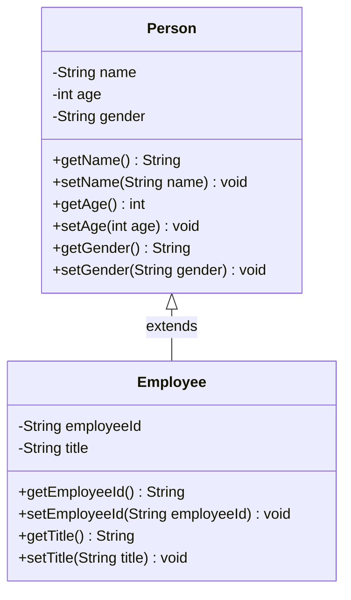

# Object-Oriented Programming: Class Inheritance & Member Accessibility

---

## Key Takeaways

Inheritance is an object-oriented paradigm where a specialized child class (subclass or derived class) extends a base parent class (superclass), inheriting its accessible members to promote code reuse and structural polymorphism. In Java, an inheritance relationship is established exclusively in the subclass header using the reserved keyword `extends`. Accessibility of inherited state is governed by access modifiers: `public` and `protected` members are accessible to derived subclasses, whereas `private` members remain strictly encapsulated within the declaring superclass and cannot be inherited or accessed directly.



- **Superclass vs. Subclass Hierarchy**: The superclass (parent/base) holds generalized attributes and behaviors, while the subclass (child/derived) represents a more specialized entity.
- **The `extends` Keyword**: Declaring `class Child extends Parent` establishes the inheritance hierarchy; modifications to the superclass are not required to participate in inheritance.
- **Encapsulation & Private Members**: Fields and methods marked `private` are never inherited; subclasses interact with private superclass state indirectly through inherited `public` or `protected` getter and setter methods.
- **Specialization Principle**: Subclasses inherit all non-private members of the superclass while introducing unique fields and behaviors specific to the specialized role.

---

## Main Discussion

### Idiomatic Java Code Snippets

#### 1. Defining the Superclass (`Person`)

The superclass encapsulates general identity fields using private access modifiers, exposing them via public accessor (getter) and mutator (setter) methods:

```java
package inheritance_demo;

public class Person {

    // Private fields: encapsulated and inaccessible directly by subclasses
    private String name;
    private int age;
    private String gender;

    public String getName() {
        return name;
    }

    public void setName(String name) {
        this.name = name;
    }

    public int getAge() {
        return age;
    }

    public void setAge(int age) {
        this.age = age;
    }

    public String getGender() {
        return gender;
    }

    public void setGender(String gender) {
        this.gender = gender;
    }
}
```

#### 2. Establishing the Subclass with `extends` (`Employee`)

The subclass extends `Person` using the `extends` keyword, inheriting general methods while defining employee-specific members:

```java
package inheritance_demo;

// Establishes an inheritance relationship where Employee is a specialized Person
public class Employee extends Person {

    // Fields unique to the Employee subclass
    private String employeeId;
    private String title;

    public String getEmployeeId() {
        return employeeId;
    }

    public void setEmployeeId(String employeeId) {
        this.employeeId = employeeId;
    }

    public String getTitle() {
        return title;
    }

    public void setTitle(String title) {
        this.title = title;
    }
}
```

#### 3. Verifying Inherited and Specialized Methods

Instantiating an `Employee` object exposes both inherited superclass methods and newly defined subclass methods via the dot operator:

```java
package inheritance_demo;

public class InheritanceChecker {

    public static void main(String[] args) {
        Person person = new Person();
        person.setName("Taylor");
        person.setAge(30);
        person.setGender("Non-binary");

        Employee employee = new Employee();

        // Accessing inherited methods from the Person superclass
        employee.setName("Jordan");
        employee.setAge(28);
        employee.setGender("Female");

        // Accessing specialized methods declared on the Employee subclass
        employee.setEmployeeId("EMP-1042");
        employee.setTitle("Software Engineer");

        System.out.println("Employee Name: " + employee.getName());
        System.out.println("Employee Title: " + employee.getTitle());
    }
}

```

### Under the Hood / JVM Mechanics

1. **Class Hierarchy Verification at Compile Time:**
   The javac compiler parses the extends declaration and verifies that the superclass exists, is accessible, and is not declared final.

2. **Subclass Symbol Resolution:**
   When the dot operator is used on an instance of a subclass (e.g., employee.getName()), the compiler checks the subclass for that method. If not declared locally, it traverses up the inheritance chain to locate the inherited method signature.

3. **Bytecode Member Visibility Enforcement:**
   Field and method access flags are compiled into the class metadata. Any direct attempt by a subclass method to read or write a superclass field marked with the ACC_PRIVATE flag causes a compile-time failure.

4. **Runtime Object Memory Layout:**
   When new Employee() is evaluated, the JVM allocates a single contiguous block of heap memory sufficient to hold both superclass fields (name, age, gender) and subclass fields (employeeId, title).

### Structural Comparisons

#### Terminology Alignment

| Role in Hierarchy | Primary Java Term | Equivalent Industry Terms  | Primary Purpose                           |
| ----------------- | ----------------- | -------------------------- | ----------------------------------------- |
| **Parent Entity** | Superclass        | Parent class, Base class   | Generalizes shared data and behavior      |
| **Child Entity**  | Subclass          | Child class, Derived class | Specializes behavior and adds unique data |

#### Member Visibility Under Inheritance

| Access Modifier | Inherited by Subclass? | Direct Access from Subclass Body?              | Access from Unrelated Classes? |
| --------------- | ---------------------- | ---------------------------------------------- | ------------------------------ |
| **`public`**    | Yes                    | Yes                                            | Yes (everywhere)               |
| **`protected`** | Yes                    | Yes                                            | Package-level and subclasses   |
| **`private`**   | **No**                 | **No** (accessible via public getters/setters) | No (declaring class only)      |

### Common Anti-Patterns & Edge Cases

- **Direct Access to Private Superclass Fields**: Writing `employee.name = "Alex";` from an external class or inside `Employee` results in a compilation error: `name has private access in Person`. Subclasses must invoke inherited accessors (e.g., `setName("Alex")`).
- **Bidirectional Inheritance Assumption**: Assuming the superclass gains awareness of subclass methods. Calling `person.getEmployeeId()` fails to compile because superclasses do not inherit or recognize members declared on subclasses.
- **Superclass Modification Traps**: Adding configuration or markers in the superclass to link it to a subclass violates OOP design; inheritance is declared exclusively from the subclass referencing the superclass.
- **Extending Incompatible Types**: Attempting to use `extends` with primitive types or multiple superclasses is invalid; Java enforces single inheritance for class extension.

---

## Knowledge Check & JetBrains-Style Coding Challenges

### Theory Tips

- **Keyword Mechanics**: Inheritance between classes is established solely with the reserved keyword `extends`.
- **Private Field Access**: Subclasses inherit `public` and `protected` methods and fields. `private` members remain strictly hidden inside the parent class; they are not directly visible or modifiable in the subclass.
- **Direction of Inheritance**: Inheritance is strictly unidirectional: subclasses inherit down from superclasses, but superclasses have no knowledge of subclass-specific members.

### Question 1: Conceptual / Code Analysis

Consider the following two class declarations:

```java
public class Vehicle {
    private String vin;
    public int wheels;

    public String getVin() {
        return vin;
    }
}

public class Car extends Vehicle {
    public void displayDetails() {
        System.out.println(wheels); // Line A
        System.out.println(vin);    // Line B
        System.out.println(getVin()); // Line C
    }
}

```

What is the result when compiling `Car.java`?

- [ ] **A** Compilation succeeds; all three lines are valid because `Car` inherits all members from `Vehicle`.
- [ ] **B** A compilation error occurs on Line A because `wheels` is defined in another class.
- [ ] **C** A compilation error occurs on Line B because `vin` has private access in `Vehicle`.
- [ ] **D** A compilation error occurs on Line C because getter methods cannot be inherited across class boundaries.

<details>
<summary>Correct Answer</summary>

**Correct Answer**: **C**

**Technical Breakdown**:

- **C is correct**: In Java inheritance, fields marked with the `private` access modifier are not inherited and cannot be directly referenced by name within the subclass body. Because `vin` is declared `private` in `Vehicle`, Line B (`System.out.println(vin);`) causes a compile-time access violation.
- **A is incorrect**: Private fields are not directly accessible in subclasses.
- **B is incorrect**: Line A is legal because `wheels` is marked `public` and is therefore inherited and directly accessible.
- **D is incorrect**: Line C is legal because `getVin()` is marked `public`, meaning it is inherited by `Car` and can be called directly.

</details>

---

### Question 2: Mini Coding Problem / Implementation Challenge

**Task**: Model an inventory domain using inheritance. Implement two classes in package `inventory`:

1. Superclass `Item`:

- Private fields: `name` (`String`) and `price` (`double`).
- Public getters and setters for both fields.

2. Subclass `Book` that inherits from `Item`:

- Private fields: `author` (`String`) and `isbn` (`String`).
- Public getters and setters for both fields.

3. Provide a test verification method `formatBookSummary(Book book)` inside a class named `BookFormatter` that returns a formatted string:
   `"[title] by [author] - $[price] (ISBN: [isbn])"`

**Test Assertions**:

- An instance of `Book` with name `"Clean Code"`, author `"Robert Martin"`, price `34.95`, and isbn `"9780132350884"` $\rightarrow$ Returns: `"Clean Code by Robert Martin - $34.95 (ISBN: 9780132350884)"`

<details>
<summary>Solution</summary>

```java
package inventory;

public class Item {
    private String name;
    private double price;

    public String getName() {
        return name;
    }

    public void setName(String name) {
        this.name = name;
    }

    public double getPrice() {
        return price;
    }

    public void setPrice(double price) {
        this.price = price;
    }
}

```

```java
package inventory;

// Subclass extending the base Item class
public class Book extends Item {
    private String author;
    private String isbn;

    public String getAuthor() {
        return author;
    }

    public void setAuthor(String author) {
        this.author = author;
    }

    public String getIsbn() {
        return isbn;
    }

    public void setIsbn(String isbn) {
        this.isbn = isbn;
    }
}

```

```java
package inventory;

public class BookFormatter {

    public static String formatBookSummary(Book book) {
        // Leverages both inherited and specialized getters
        return book.getName() + " by " + book.getAuthor() + " - $"
                + book.getPrice() + " (ISBN: " + book.getIsbn() + ")";
    }
}

```

**Complexity Analysis**:

- **Time Complexity**: $\mathcal{O}(L)$ where $L$ is the total character length of the concatenated string summary.
- **Space Complexity**: $\mathcal{O}(L)$ auxiliary memory allocated on the heap to construct the formatted string representation.

</details>

---
