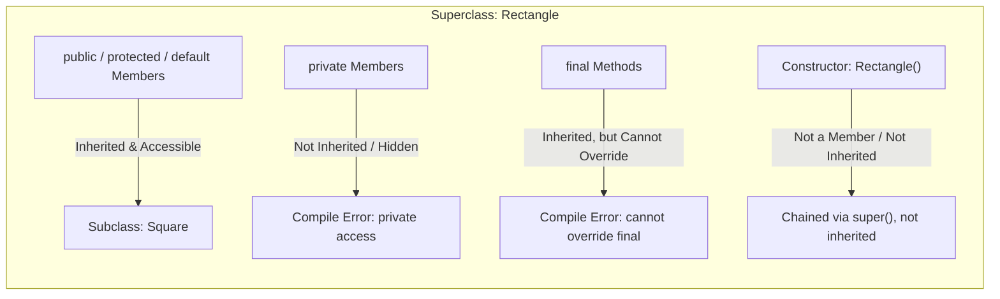

# Member Accessibility & Inheritance Limits: Visibility Modifiers, Final Methods & Overriding Constraints

---

## Key Takeaways

Inheritance does not grant subclasses access to every element of a superclass. Constructors are not class members and are therefore never inherited. Visibility modifiers determine which fields and methods transfer across the inheritance boundary: `public`, `protected`, and package-private (no modifier) members are inherited, whereas `private` members remain strictly encapsulated within the declaring class. Furthermore, the non-access modifier `final` allows a method to be inherited for execution while permanently forbidding subclasses from overriding its implementation, and overriding methods cannot assign stricter access privileges than those declared in the superclass.



- **Non-Inherited Elements**: Constructors are not class members and are never inherited; `private` fields and methods are completely inaccessible to subclasses.
- **Inherited Accessibility**: `public`, `protected`, and default (package-private) fields and methods are inherited by the subclass.
- **The `final` Method Constraint**: A method declared with the non-access modifier `final` is inherited and callable, but cannot be overridden by any subclass.
- **Access Privilege Rule in Overriding**: An overriding method in a subclass cannot assign stricter access privileges than the superclass method (e.g., overriding a `public` method with `protected` or `private` causes a compiler clash; relaxing access from `protected` to `public` is allowed).

---

## Main Discussion

### Idiomatic Java Code Snippets

#### 1. Defining Accessibility and Finality in the Superclass (`Rectangle`)

The superclass uses `protected` fields to allow subclass inheritance, defines an overridable method, and locks an immutable algorithm using `final`:

```java
package inheritance_access;

public class Rectangle {

    // Protected members: inheritable and directly accessible by subclasses
    protected double length;
    protected double width;
    protected int sides = 4;

    // Private member: encapsulated; NOT inherited by subclasses
    private String internalTrackingId = "RECT-001";

    // Standard overridable method
    protected double calculatePerimeter() {
        return (2 * length) + (2 * width);
    }

    // Final method: inherited and callable by subclasses, but CANNOT be overridden
    public final void printShapeType() {
        System.out.println("Geometric Shape: Polygon");
    }
}
```

#### 2. Respecting Access Rules and Access Expansion in the Subclass (`Square`)

The subclass overrides `calculatePerimeter()` by expanding its access modifier from `protected` to `public` (less strict), while calling the inherited `final` method directly without altering it:

```java
package inheritance_access;

public class Square extends Rectangle {

    public Square(double sideLength) {
        // Inherited protected fields can be written directly
        this.length = sideLength;
        this.width = sideLength;
        this.sides = 4;

        // Attempting to access internalTrackingId would fail:
        // this.internalTrackingId = "SQ-1"; // Compilation Error: has private access
    }

    // Legal override: changing access modifier from 'protected' to 'public' (less strict)
    // Attempting 'private' or default package-private here would cause a compile clash
    @Override
    public double calculatePerimeter() {
        return sides * length;
    }

    // Attempting to override printShapeType() would fail:
    // @Override
    // public void printShapeType() { } // Compilation Error: cannot override final method
}
```

#### 3. Verification of Access and Method Invocation

Demonstrating runtime behavior and inherited access:

```java
package inheritance_access;

public class AccessChecker {

    public static void main(String[] args) {
        Square square = new Square(5.0);

        // Subclass calls overridden method with expanded public visibility
        System.out.println("Square Perimeter: " + square.calculatePerimeter()); // Prints 20.0

        // Subclass invokes inherited final method
        square.printShapeType(); // Prints: Geometric Shape: Polygon
    }
}
```

### Under the Hood / JVM Mechanics

1. **Access Modifier Validation:**
   During compilation of a subclass, javac checks every referenced field and method against its access flags. Any direct attempt to resolve an identifier marked with ACC_PRIVATE in a superclass immediately throws an access compilation error.

2. **Final Method Table Locking:**
   When a method is marked final, the compiler marks it with the ACC_FINAL flag in the class file bytecode. The compiler forbids subclasses from creating an entry in their method tables that overrides this method signature.

3. **Visibility Clash Verification:**
   When parsing an overriding method, the compiler verifies that the subclass method's visibility modifier is equal to or wider than the superclass method's modifier. If a subclass attempts to narrow visibility (e.g., public to protected), compilation terminates with an error: attempting to assign stricter access privileges.

4. **Constructor Exclusion:**
   Constructors are compiled into bytecode as special instance initialization methods (`<init>`). Because `<init>` belongs uniquely to its declaring class, it is excluded from the class member table and cannot be inherited.

### Structural Comparisons

#### Member Inheritance by Modifier

| Element / Modifier     | Inherited by Subclass? | Subclass Direct Access?   | Can Subclass Override?       |
| ---------------------- | ---------------------- | ------------------------- | ---------------------------- |
| **Constructors**       | **No**                 | Via `super(...)` only     | No (not inheritable members) |
| **`private`**          | **No**                 | No (hidden in superclass) | No (not visible to override) |
| **Default (no label)** | Yes                    | Yes (within same package) | Yes (within same package)    |
| **`protected`**        | Yes                    | Yes (subclasses anywhere) | Yes                          |
| **`public`**           | Yes                    | Yes (everywhere)          | Yes                          |
| **`final` method**     | **Yes**                | Yes (callable as-is)      | **No** (strictly forbidden)  |

#### Visibility Expansion vs. Narrowing in Overridden Methods

| Superclass Visibility         | Allowed in Overridden Subclass Method | Forbidden (Stricter Privilege Clash)    |
| ----------------------------- | ------------------------------------- | --------------------------------------- |
| **`public`**                  | `public` only                         | `protected`, package-private, `private` |
| **`protected`**               | `protected`, `public` (expanded)      | package-private, `private`              |
| **Package-private (default)** | Default, `protected`, `public`        | `private`                               |

### Common Anti-Patterns & Edge Cases

- **Attempting to Override a `final` Method**: Defining a method in a subclass with the same signature as a `final` superclass method causes a compilation error: `printShapeType() in Square cannot override printShapeType() in Rectangle; overridden method is final`.
- **Narrowing Visibility on Override**: If a superclass method is `public`, attempting to override it as `protected` or package-private results in a compile-time failure: `attempting to assign stricter access privileges; was public`.
- **Assuming Constructors Are Inherited**: Calling `new Square()` when only `public Rectangle()` exists (and no no-arg constructor exists in `Square`) does not automatically inherit the constructor signature; constructors must be declared explicitly in each class.
- **Direct Access to Private Superclass State**: Attempting to read or mutate a `private` superclass field directly causes a compile-time error: `[fieldName] has private access in [Superclass]`.

---

## Knowledge Check & JetBrains-Style Coding Challenges

### Theory Tips

- **Constructors Are Not Members**: Constructors are instance initializers, not class members; hence, a subclass never inherits constructors from its superclass.
- **The Final Keyword Role**: `final` on a method indicates the final implementation. The method **is** inherited by subclasses to be called, but it **cannot** be overridden.
- **Access Widening vs. Narrowing**: Subclasses may keep the same access or expand access (make it less strict) when overriding methods, but they can **never** make access stricter.

### Question 1: Conceptual / Code Analysis

Consider the following superclass and subclass definitions:

```java
public class BaseService {
    protected void execute() {
        System.out.println("Base execution");
    }

    public final void logStatus() {
        System.out.println("Status: OK");
    }
}

public class CustomService extends BaseService {

    // Overriding attempt 1
    private void execute() {
        System.out.println("Custom execution");
    }

    // Overriding attempt 2
    @Override
    public void logStatus() {
        System.out.println("Custom Status: OK");
    }
}

```

What compiler errors will occur when compiling `CustomService.java`?

- [ ] **A** Only `logStatus()` produces a compiler error because `execute()` successfully overrides `protected` with `private`.
- [ ] **B** Only `execute()` produces a compiler error because `final` methods can be overridden as long as visibility remains `public`.
- [ ] **C** Both `execute()` and `logStatus()` produce compiler errors.
- [ ] **D** Neither method produces an error because subclasses can freely alter access modifiers and implementations.

<details>
<summary>Correct Answer</summary>

**Correct Answer**: **C**

**Technical Breakdown**:

- **C is correct**: Both methods violate core inheritance rules.

1. `execute()` attempts to narrow visibility from `protected` in `BaseService` to `private` in `CustomService`. Assigning stricter access privileges during method overriding is illegal and triggers a compile error.
2. `logStatus()` is marked with the non-access modifier `final` in `BaseService`. Final methods cannot be overridden under any circumstances, triggering another compile error: `cannot override final method`.

- **A is incorrect**: `execute()` is invalid because it narrows visibility.
- **B is incorrect**: `logStatus()` is invalid because `final` methods cannot be overridden regardless of visibility.
- **D is incorrect**: Both declarations violate Java compiler specifications.

</details>

---

### Question 2: Mini Coding Problem / Implementation Challenge

**Task**: Model an access-controlled account hierarchy inside package `inheritance_access`:

1. Superclass `Account`:
   - Private field `accountNumber` (`String`).
   - Protected field `balance` (`double`).
   - Constructor `public Account(String accountNumber, double balance)` initializing both fields.
   - Final method `public final String getAccountNumber()` returning the account number.
   - Protected method `protected void applyTransaction(double amount)`: adds `amount` to `balance`.
2. Subclass `PremiumAccount` extending `Account`:
   - Constructor `public PremiumAccount(String accountNumber, double balance)` forwarding to `super(...)`.
   - **Override** `applyTransaction(double amount)`:
   - Make its access modifier **`public`** (demonstrating legal visibility expansion).
   - Add `amount` plus a `$1.50` loyalty credit directly to `balance`.
   - Use the `@Override` annotation.

**Test Assertions**:

- `PremiumAccount account = new PremiumAccount("ACC-99", 100.0);`
- `account.getAccountNumber()` $\rightarrow$ Returns `"ACC-99"`
- `account.applyTransaction(50.0)` $\rightarrow$ Increases balance by `51.50`, bringing total balance to `151.50`.

<details>
<summary>Solution</summary>

```java
package inheritance_access;

public class Account {

    private String accountNumber;
    protected double balance;

    public Account(String accountNumber, double balance) {
        this.accountNumber = accountNumber;
        this.balance = balance;
    }

    // Final method: cannot be overridden by any subclass
    public final String getAccountNumber() {
        return accountNumber;
    }

    // Protected method: accessible to subclasses
    protected void applyTransaction(double amount) {
        this.balance += amount;
    }

    public double getBalance() {
        return balance;
    }
}

```

```java
package inheritance_access;

public class PremiumAccount extends Account {

    public PremiumAccount(String accountNumber, double balance) {
        super(accountNumber, balance);
    }

    // Overriding with expanded visibility: changed from 'protected' to 'public' (less strict)
    @Override
    public void applyTransaction(double amount) {
        double loyaltyCredit = 1.50;
        // Direct access to inherited protected field 'balance'
        this.balance += (amount + loyaltyCredit);
    }
}

```

**Complexity Analysis**:

- **Time Complexity**: $\mathcal{O}(1)$ because field updates, constructor delegation, and method dispatch run in constant time.
- **Space Complexity**: $\mathcal{O}(1)$ auxiliary memory allocated; variables and calculations execute within isolated stack frames.

</details>

---
