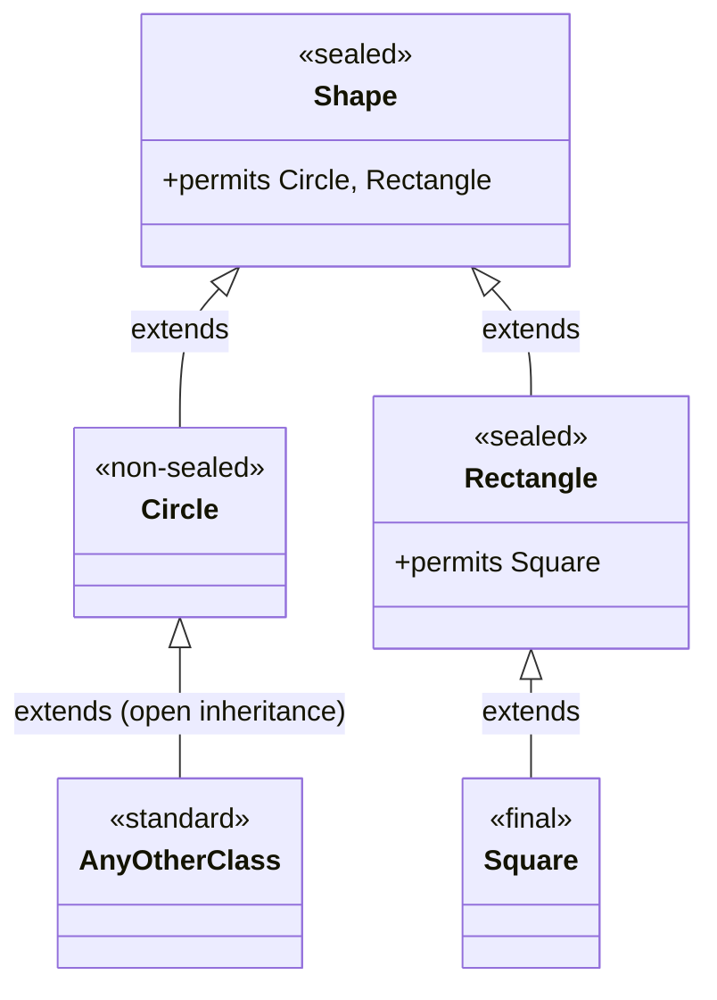

# Object-Oriented Programming: Sealed Classes & Domain Hierarchy Control

---

## Key Takeaways

Sealed classes allow a superclass to explicitly control and restrict which subclasses are permitted to extend it, providing domain modeling boundaries within an inheritance hierarchy. Declared using the `sealed` modifier followed by a `permits` clause, sealed classes require that every permitted subclass directly extends the superclass and explicitly defines its own inheritance boundary. Every permitted subclass must declare itself as `final`, `sealed`, or `non-sealed`, ensuring the inheritance hierarchy is exhaustively defined and bounded.



- **Restricted Inheritance**: Sealed classes restrict inheritance by granting extension permissions exclusively to a comma-delimited list of classes in a `permits` clause.
- **Permitted Subclass Obligations**: Every subclass listed in a `permits` clause must directly extend the sealed parent class.
- **The Three Subclass Modifiers**: Each permitted subclass must explicitly declare exactly one of three modifiers:
  - `final`: Closes inheritance permanently; no class may extend it.
  - `sealed`: Continues controlled inheritance by permitting its own explicit list of subclasses.
  - `non-sealed`: Re-opens inheritance; any class can extend it without restriction.
- **Unbounded Descendants of `non-sealed`**: Classes extending a `non-sealed` class operate under standard Java inheritance rules and are not obligated to declare`final`, `sealed`, or `non-sealed`.

---

## Main Discussion

### Idiomatic Java Code Snippets

#### 1. Declaring the Root Sealed Class (`Shape`)

The superclass uses the `sealed` reserved word and explicitly enumerates its allowed direct subclasses using `permits`:

```java
package sealed_hierarchy;

// Root sealed class permitting only Circle and Rectangle to extend it
public sealed class Shape permits Circle, Rectangle {

    public void draw() {
        System.out.println("Drawing a shape");
    }
}
```

#### 2. Defining Permitted Subclasses with Required Modifiers

Each direct subclass must extend `Shape` and declare whether it is `non-sealed`, `sealed`, or `final`:

```java
package sealed_hierarchy;

// Re-opens inheritance: any class in the program can extend Circle
public non-sealed class Circle extends Shape {

    private double radius;

    public double getRadius() {
        return radius;
    }

    public void setRadius(double radius) {
        this.radius = radius;
    }
}
```

```java
package sealed_hierarchy;

// Continues restricted inheritance: permits only Square to extend it
public sealed class Rectangle extends Shape permits Square {

    private double length;
    private double width;

    public double getLength() {
        return length;
    }

    public void setLength(double length) {
        this.length = length;
    }

    public double getWidth() {
        return width;
    }

    public void setWidth(double width) {
        this.width = width;
    }
}
```

```java
package sealed_hierarchy;

// Closes the hierarchy: Square cannot be extended by any class
public final class Square extends Rectangle {

    public Square(double side) {
        setLength(side);
        setWidth(side);
    }
}
```

#### 3. Extending a Non-Sealed Class

Classes extending `Circle` return to standard inheritance rules:

```java
package sealed_hierarchy;

// Standard inheritance: no obligation to declare final, sealed, or non-sealed
public class ColoredCircle extends Circle {

    private String color;

    public String getColor() {
        return color;
    }

    public void setColor(String color) {
        this.color = color;
    }
}
```

### Under the Hood / JVM Mechanics

1. **Permitted Subclass Verification at Compile Time:**
   During compilation of Shape.java, javac reads the permits clause and confirms that Circle and Rectangle exist and explicitly extend Shape. If a permitted class does not extend the sealed class, compilation halts with an error.

2. **Subclass Modifier Enforcement:**
   The compiler verifies that every direct subclass carries exactly one of the three required modifiers (final, sealed, or non-sealed). Omitting a modifier produces a compile-time failure.

3. **PermittedSubclasses Bytecode Attribute:**
   The compiler injects a PermittedSubclasses attribute into the compiled .class file metadata of the sealed class, listing the authorized binary class symbols.

4. **Unauthorized Subclass Rejection:**
   If an unlisted class attempts to extend Shape (e.g., class Triangle extends Shape), the compiler and the JVM's class verification engine reject it, preventing unauthorized extensions.

### Structural Comparisons

#### The Three Permitted Subclass Modifiers

| Modifier         | Effect on Inheritance              | Subclass Must Have `permits`?            | Future Extensions Allowed?             |
| ---------------- | ---------------------------------- | ---------------------------------------- | -------------------------------------- |
| **`final`**      | Permanently terminates inheritance | No (cannot have subclasses)              | **No** (leaf node)                     |
| **`sealed`**     | Continues restricted inheritance   | **Yes** (must define allowed subclasses) | **Yes**, but only to permitted classes |
| **`non-sealed`** | Re-opens unrestricted inheritance  | No                                       | **Yes**, open to any class             |

#### Standard Class vs. Sealed Class

| Feature                  | Standard Class (`class`)                     | Sealed Class (`sealed class`)                                  |
| ------------------------ | -------------------------------------------- | -------------------------------------------------------------- |
| **Inheritance Scope**    | Open to any class (unless marked `final`)    | Restricted to explicitly permitted classes                     |
| **Permits Clause**       | Not supported                                | Required when subclasses exist in separate files               |
| **Subclass Constraints** | Subclasses can be normal, abstract, or final | Subclasses **must** declare `final`, `sealed`, or `non-sealed` |

### Common Anti-Patterns & Edge Cases

- **Missing Permitted Subclass Modifier**: Declaring a permitted subclass without `final`, `sealed`, or `non-sealed` (e.g., `public class Circle extends Shape`) triggers a compile-time failure: `sealed, non-sealed or final modifiers expected`.
- **Permitting an Unrelated Class**: Listing a class in the `permits` clause that does not declare `extends [SealedClass]` causes a compilation error: `class is not allowed to extend sealed class`.
- **Extending Without Permission**: Creating `public final class Triangle extends Shape` when `Triangle` is not listed in `Shape`'s `permits` clause causes a compile error: `class not allowed to extend sealed class: sealed_hierarchy.Shape`.
- **Attempting to Extend a `final` Subclass**: Creating a class that extends a subclass marked `final` (e.g., `class MiniSquare extends Square`) fails compilation: `cannot inherit from final sealed_hierarchy.Square`.

---

## Knowledge Check & JetBrains-Style Coding Challenges

### Theory Tips

- **The Modifier Triad**: Every class directly extending a `sealed` class **must** be declared with exactly one of three modifiers: `final`, `sealed`, or `non-sealed`.
- **The Non-Sealed Escape**: The `non-sealed` modifier is a hyphenated keyword that breaks out of the sealed restriction, allowing downstream classes to extend it without restriction.
- **Mutual Contract**: A sealed class must list its subclasses in `permits`, and each permitted subclass must explicitly declare that it `extends` the sealed class.

### Question 1: Conceptual / Code Analysis

Consider the following proposed class structure:

```java
public sealed class Vehicle permits Car, Truck { }

public class Car extends Vehicle { }

public final class Truck extends Vehicle { }
```

What occurs when attempting to compile this code?

- [ ] **A** Compilation succeeds; `Car` defaults to an open subclass and `Truck` terminates inheritance.
- [ ] **B** A compilation error occurs because `Car` fails to declare itself as `sealed`, `non-sealed`, or `final`.
- [ ] **C** A compilation error occurs because `Vehicle` must declare at least one abstract method.
- [ ] **D** A runtime error occurs when loading `Vehicle` because `Car` is not marked `final`.

<details>
<summary>Correct Answer</summary>

**Correct Answer**: **B**

**Technical Breakdown**:

- **B is correct**: Java language specifications strictly require that any class directly extending a sealed class must explicitly declare its own inheritance posture using one of three modifiers: `final`, `sealed`, or `non-sealed`. Because `Car` is declared simply as `public class Car`, compilation fails with an error: `sealed, non-sealed or final modifiers expected`.
- **A is incorrect**: Java does not assume a default inheritance posture for children of sealed classes.
- **C is incorrect**: Sealed classes do not require abstract methods.
- **D is incorrect**: This constraint is checked at compile time by `javac`, not at runtime.

</details>

---

### Question 2: Mini Coding Problem / Implementation Challenge

**Task**: Model a document service hierarchy using sealed classes inside package `sealed_hierarchy`:

1. Sealed superclass `Document`:
   - Private field `title` (`String`).
   - Constructor `public Document(String title)` initializing the field.
   - Public getter `getTitle()`.
   - Permits two direct subclasses: `TextDocument` and `SpreadsheetDocument`.
2. Permitted subclass `TextDocument`:
   - Must be declared `final`.
   - Has a constructor passing `title` to `super(title)`.
3. Permitted subclass `SpreadsheetDocument`:
   - Must be declared `non-sealed`.
   - Has a constructor passing `title` to `super(title)`.
4. Class `FinancialSheet` extending `SpreadsheetDocument`:
   - Demonstrates extending an open `non-sealed` class without requiring special sealed modifiers.
   - Constructor passing `title` to `super(title)`.

**Test Assertions**:

- `Document doc = new TextDocument("Report.docx");` $\rightarrow$ `doc.getTitle()` returns `"Report.docx"`
- `FinancialSheet sheet = new FinancialSheet("Q3_Budget.xlsx");` $\rightarrow$ `sheet.getTitle()` returns `"Q3_Budget.xlsx"`

<details>
<summary>Solution</summary>

```java
package sealed_hierarchy;

// Sealed root restricting direct extension to TextDocument and SpreadsheetDocument
public sealed class Document permits TextDocument, SpreadsheetDocument {

    private String title;

    public Document(String title) {
        this.title = title;
    }

    public String getTitle() {
        return title;
    }
}

```

```java
package sealed_hierarchy;

// Final permitted subclass: terminates further inheritance
public final class TextDocument extends Document {

    public TextDocument(String title) {
        super(title);
    }
}

```

```java
package sealed_hierarchy;

// Non-sealed permitted subclass: re-opens inheritance
public non-sealed class SpreadsheetDocument extends Document {

    public SpreadsheetDocument(String title) {
        super(title);
    }
}

```

```java
package sealed_hierarchy;

// Normal class extending the non-sealed class without inheritance restrictions
public class FinancialSheet extends SpreadsheetDocument {

    public FinancialSheet(String title) {
        super(title);
    }
}

```

**Complexity Analysis**:

- **Time Complexity**: $\mathcal{O}(1)$ for class instantiation and method execution, as constructor chaining and field assignment operate in constant time.
- **Space Complexity**: $\mathcal{O}(1)$ auxiliary memory allocated beyond the standard heap allocation for object instances.

</details>

---
