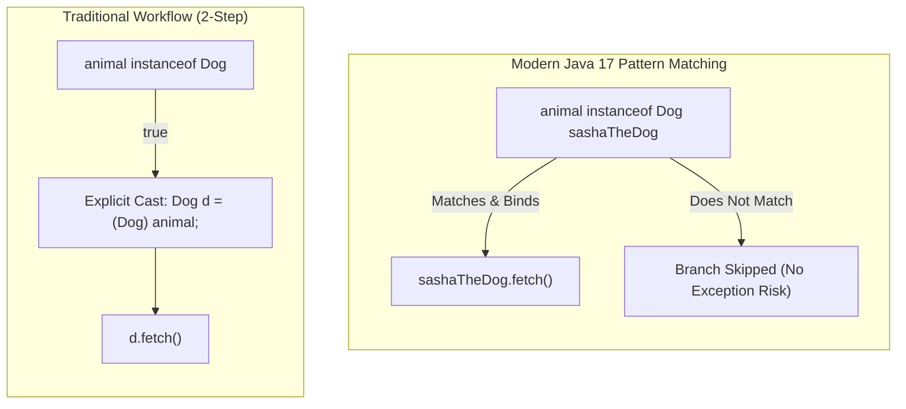

# Runtime Type Inspection: The `instanceof` Operator & Pattern Matching

---

## Key Takeaways

The `instanceof` binary operator evaluates whether a reference object at runtime is an instance of a specified class, superclass, or interface, returning a `boolean` value (`true` or `false`). It provides a runtime safety mechanism to verify type compatibility before performing downcasting, preventing unexpected `ClassCastException` runtime failures. Modern Java simplifies this workflow through **pattern matching for `instanceof`**, which tests the condition, safely casts the target reference, and binds it to a freshly scoped variable in a single atomic expression.



- **Dynamic Type Testing**: The expression `object instanceof ClassName` inspects the actual underlying runtime instance on the heap, not the static declared type of the reference variable.
- **Hierarchy Traversal**: A subclass instance evaluates to `true` when tested against its own concrete class and any of its ancestor superclasses (e.g., a `Dog` instance yields `true` for both `Dog` and `Animal`).
- **Sibling Rejection**: Testing an instance against an unrelated branch in the class hierarchy (e.g., testing a `Dog` instance against `Cat`) evaluates safely to `false`.
- **Pattern Matching for `instanceof`**: Modern Java 17 idiom combines type testing, explicit casting, and local variable declaration into one construct: `if (animal instanceof Dog sashaTheDog)`.

---

## Main Discussion

### Idiomatic Java Code Snippets

#### 1. Runtime Type Evaluation in Polymorphic Pipelines

Using `instanceof` allows methods accepting generalized superclass parameters to route specialized behaviors cleanly:

```java
package runtime_inspection;

public class AnimalFeeder {

    public static void feed(Animal animal) {
        // Evaluate dynamic type using instanceof
        if (animal instanceof Dog) {
            System.out.println("Here's your dog food.");
        } else if (animal instanceof Cat) {
            System.out.println("Here's your cat food.");
        } else {
            System.out.println("Here's generic animal food.");
        }
    }

    public static void main(String[] args) {
        Animal rocky = new Dog();
        Animal sasha = new Cat();

        feed(rocky); // Prints: Here's your dog food.
        feed(sasha); // Prints: Here's your cat food.
    }
}
```

#### 2. Modern Java Pattern Matching for `instanceof`

Pattern matching eliminates redundant, error-prone manual casting boilerplate:

```java
package runtime_inspection;

public class PatternMatchingDemo {

    public static void handleAnimalAction(Animal animal) {
        // Traditional approach (verbose and requires explicit cast):
        // if (animal instanceof Dog) {
        //     Dog dog = (Dog) animal;
        //     dog.fetch();
        // }

        // Modern Java 17 pattern matching:
        // Checks type, casts, and declares 'sashaTheDog' in a single step
        if (animal instanceof Dog sashaTheDog) {
            System.out.print("Identified Dog: ");
            sashaTheDog.fetch(); // sashaTheDog is directly usable as Dog
        } else if (animal instanceof Cat cat) {
            System.out.print("Identified Cat: ");
            cat.scratch();       // cat is directly usable as Cat
        }
    }

    public static void main(String[] args) {
        Animal sasha = new Dog();
        handleAnimalAction(sasha); // Prints: Identified Dog: Fetch is fun
    }
}
```

### Under the Hood / JVM Mechanics

1. **Null Reference Verification:**
   If the target operand evaluates to null, the instanceof check evaluates to false immediately without throwing a NullPointerException.

2. **Bytecode Opcode Execution: instanceof:**
   The javac compiler emits the instanceof opcode. The JVM inspects the object header of the target heap instance to retrieve its runtime class descriptor pointer.

3. **Class Hierarchy Scanning:**
   The JVM traverses the runtime type’s class hierarchy table. If the target type matches the operand class or any of its superclasses, the check yields true.

4. **Pattern Matching Variable Binding:**
   When using pattern matching (e.g., instanceof Dog sashaTheDog), the compiler automatically provisions a local stack frame variable (sashaTheDog) and stores the verified reference pointer without requiring a separate checkcast instruction.

### Structural Comparisons

#### Hierarchy Evaluation of `Animal sasha = new Dog();`

| Tested Class | Expression                | Result  | Technical Justification                                                   |
| ------------ | ------------------------- | ------- | ------------------------------------------------------------------------- |
| **`Animal`** | `sasha instanceof Animal` | `true`  | `Animal` is the superclass of `Dog`; satisfies _is-a_ hierarchy.          |
| **`Dog`**    | `sasha instanceof Dog`    | `true`  | `sasha` was explicitly instantiated as a `Dog` on the heap.               |
| **`Cat`**    | `sasha instanceof Cat`    | `false` | `Cat` is a sibling class; it is not present in `Dog`'s inheritance chain. |
| **`Object`** | `sasha instanceof Object` | `true`  | `Object` is the root ancestor of all reference types.                     |

#### Traditional `instanceof` vs. Pattern Matching

| Characteristic      | Traditional `instanceof`                          | Pattern Matching for `instanceof`               |
| ------------------- | ------------------------------------------------- | ----------------------------------------------- |
| **Syntax**          | `if (animal instanceof Dog)`                      | `if (animal instanceof Dog sashaTheDog)`        |
| **Type Safety**     | High (guards the block)                           | High (guards the block)                         |
| **Casting Step**    | Manual explicit downcast required: `(Dog) animal` | Handled automatically by the compiler           |
| **Boilerplate**     | Two distinct steps (test + downcast)              | Combined into a single atomic check and binding |
| **Target Variable** | Requires manual identifier declaration            | Pattern variable bound and scoped directly      |

### Common Anti-Patterns & Edge Cases

- **Manual Casting Without `instanceof` Verification**: Performing an explicit downcast without checking `instanceof` first risks runtime crashes. If the underlying instance is an incompatible sibling type, the JVM throws a `ClassCastException`.
- **Pattern Variable Scope Leaks**: A pattern variable (e.g., `sashaTheDog`) is scoped only to the conditional branch where the pattern matches `true`. Attempting to reference `sashaTheDog` outside the matching `if` block triggers a compile-time `cannot find symbol` error.
- **Testing Incompatible Types at Compile Time**: Attempting to evaluate `instanceof` between types that have no hierarchical relationship whatsoever (e.g., `"text" instanceof Integer`) fails at compile time because the compiler knows the comparison is impossible.
- **Null Check Redundancy**: Writing `if (animal != null && animal instanceof Dog)` is redundant; `instanceof` inherently returns `false` if the reference is `null`.

---

## Knowledge Check & JetBrains-Style Coding Challenges

### Theory Tips

- **Null Safety Contract**: The expression `null instanceof AnyClass` always evaluates to `false` and never throws an exception.
- **Boolean Return Value**: The `instanceof` operator always returns a primitive `boolean` (`true` or `false`).
- **Pattern Variable Binding**: In `obj instanceof TargetType target`, the variable `target` is automatically typed and available within the scope guarded by the `true` evaluation.

### Question 1: Conceptual / Code Analysis

Consider the following inheritance hierarchy and code snippet:

```java
class Vehicle {}
class Car extends Vehicle {}
class Sedan extends Car {}
class Motorcycle extends Vehicle {}

public class TestDrive {
    public static void main(String[] args) {
        Vehicle v = new Sedan();

        boolean check1 = v instanceof Vehicle;
        boolean check2 = v instanceof Car;
        boolean check3 = v instanceof Motorcycle;

        System.out.println(check1 + " " + check2 + " " + check3);
    }
}

```

What is printed to the console?

- [ ] **A** `true true true`
- [ ] **B** `true true false`
- [ ] **C** `true false false`
- [ ] **D** A compilation error occurs because `v` cannot be tested against `Motorcycle`.

<details>
<summary>Correct Answer</summary>

**Correct Answer**: **B**

**Technical Breakdown**:

- **B is correct**: The reference variable `v` points to an instance of `Sedan` on the heap.

1. `check1` (`v instanceof Vehicle`): Evaluates to `true` because `Sedan` extends `Car`, which extends `Vehicle` (multilevel transitive inheritance).
2. `check2` (`v instanceof Car`): Evaluates to `true` because `Car` is the direct superclass of `Sedan`.
3. `check3` (`v instanceof Motorcycle`): Evaluates to `false` because `Motorcycle` is not part of the inheritance chain for `Sedan`. The code compiles without error because `v` is declared as `Vehicle`, and `Motorcycle` is a subclass of `Vehicle`.

- **A is incorrect**: `Sedan` does not inherit from `Motorcycle`, so `check3` cannot be `true`.
- **C is incorrect**: `Sedan` is an indirect descendant of `Car`, so `check2` is `true`.
- **D is incorrect**: The check is legal because `v` is statically typed as `Vehicle`, making `Motorcycle` a valid polymorphic branch for comparison.

</details>

---

### Question 2: Mini Coding Problem / Implementation Challenge

**Task**: Implement a payment dispatch processor using modern pattern matching for `instanceof` inside package `runtime_inspection`:

1. Base class `Payment`:

- Private field `amount` (`double`).
- Constructor `public Payment(double amount)`.
- Getter `public double getAmount()`.

2. Subclass `CreditCardPayment` extending `Payment`:

- Private field `cardNumber` (`String`).
- Constructor `public CreditCardPayment(double amount, String cardNumber)`.
- Method `public String getCardNumber()`.

3. Subclass `CryptoPayment` extending `Payment`:

- Private field `walletAddress` (`String`).
- Constructor `public CryptoPayment(double amount, String walletAddress)`.
- Method `public String getWalletAddress()`.

4. Utility class `PaymentProcessor`:

- Method `public static String processPayment(Payment payment)`:
- If `payment` is a `CreditCardPayment`, return: `"Card [cardNumber]: $[amount]"`
- If `payment` is a `CryptoPayment`, return: `"Crypto [walletAddress]: $[amount]"`
- If it is a generic `Payment`, return: `"Standard: $[amount]"`
- Use pattern matching for `instanceof` to eliminate manual casts.

**Test Assertions**:

- `processPayment(new CreditCardPayment(150.0, "4111-XXXX"))` $\rightarrow$ Returns: `"Card 4111-XXXX: $150.0"`
- `processPayment(new CryptoPayment(0.05, "0xABC123"))` $\rightarrow$ Returns: `"Crypto 0xABC123: $0.05"`
- `processPayment(new Payment(20.0))` $\rightarrow$ Returns: `"Standard: $20.0"`

<details>
<summary>Solution</summary>

```java
package runtime_inspection;

public class Payment {

    private double amount;

    public Payment(double amount) {
        this.amount = amount;
    }

    public double getAmount() {
        return amount;
    }
}
```

```java
package runtime_inspection;

public class CreditCardPayment extends Payment {

    private String cardNumber;

    public CreditCardPayment(double amount, String cardNumber) {
        super(amount);
        this.cardNumber = cardNumber;
    }

    public String getCardNumber() {
        return cardNumber;
    }
}
```

```java
package runtime_inspection;

public class CryptoPayment extends Payment {

    private String walletAddress;

    public CryptoPayment(double amount, String walletAddress) {
        super(amount);
        this.walletAddress = walletAddress;
    }

    public String getWalletAddress() {
        return walletAddress;
    }
}
```

```java
package runtime_inspection;

public class PaymentProcessor {

    public static String processPayment(Payment payment) {
        // Pattern matching for instanceof performs type test, cast, and local declaration
        if (payment instanceof CreditCardPayment cardPayment) {
            return "Card " + cardPayment.getCardNumber() + ": $" + cardPayment.getAmount();
        } else if (payment instanceof CryptoPayment cryptoPayment) {
            return "Crypto " + cryptoPayment.getWalletAddress() + ": $" + cryptoPayment.getAmount();
        } else if (payment != null) {
            return "Standard: $" + payment.getAmount();
        }

        return "Invalid Payment";
    }
}
```

**Complexity Analysis**:

- **Time Complexity**: $\mathcal{O}(1)$ because type inspection and pattern variable binding execute in constant time.
- **Space Complexity**: $\mathcal{O}(1)$ auxiliary space beyond the string constructed and returned on the heap.

</details>

---
