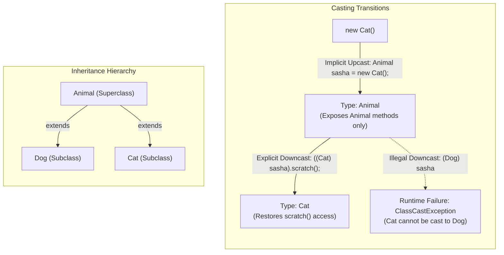

# Object Typecasting: Upcasting, Downcasting & ClassCastException Mechanics

---

## Key Takeaways

Object typecasting is the act of converting an object reference from one type to another within an inheritance hierarchy, operating either upward (upcasting) or downward (downcasting). Assigning a subclass instance to a superclass reference variable constitutes an implicit upcast, which restricts the reference’s visible interface strictly to superclass members. To regain access to specialized subclass members, an explicit downcast is required by prefixing the reference with the target subclass enclosed in parentheses; however, an invalid downcast causes the JVM to abort execution with a runtime `ClassCastException`.



- **Implicit Upcasting**: Occurs automatically when assigning a subclass instance to a superclass reference; the reference loses direct access to specialized subclass-only methods (e.g., `fetch()`, `scratch()`).
- **Explicit Downcasting Syntax**: Downcasting requires the target subclass enclosed in parentheses—such as `((Cat) sasha).scratch()` or `Dog d = (Dog) sasha;`.
- **Temporary Cast vs. Stored Downcast**: Wrapping the cast in parentheses (`((Cat) sasha).scratch()`) temporarily treats the reference as the target type for a single call without mutating the original variable's type; assigning the cast to a new variable retains the downcasted type.
- **The `ClassCastException` Trap**: The compiler permits explicit casting between types in the same inheritance tree, but downcasting an instance to an incompatible sibling class (e.g., casting a `Cat` instance to `Dog`) triggers a runtime `ClassCastException`.

---

## Main Discussion

### Idiomatic Java Code Snippets

#### 1. Defining the Domain Classes

Superclass `Animal` defines baseline behavior, while `Dog` and `Cat` supply specialized methods:

```java
package casting_demo;

public class Animal {

    public void makeSound() {
        System.out.println("Unknown animal sound");
    }
}
```

```java
package casting_demo;

public class Dog extends Animal {

    @Override
    public void makeSound() {
        System.out.println("Woof");
    }

    public void fetch() {
        System.out.println("Fetch is fun");
    }
}
```

```java
package casting_demo;

public class Cat extends Animal {

    @Override
    public void makeSound() {
        System.out.println("Meow");
    }

    public void scratch() {
        System.out.println("Scratching furniture");
    }
}
```

#### 2. Executing Upcasting, Downcasting, and Stored Casts

Demonstrating implicit upcasts, temporary in-line downcasts, and persistent downcast variable assignments:

```java
package casting_demo;

public class CastingRunner {

    public static void main(String[] args) {
        // 1. Implicit Upcast: Cat instance held in an Animal reference
        Animal sasha = new Cat();
        sasha.makeSound(); // Prints: Meow (dynamic dispatch)

        // Compile error if called directly:
        // sasha.scratch(); // Error: cannot find symbol 'scratch' in class Animal

        // 2. Explicit Temporary Downcast:
        // Enclose the cast and object in parentheses to call scratch() on the Cat instance
        ((Cat) sasha).scratch(); // Prints: Scratching furniture

        // 3. Stored Downcast:
        // Assigning the casted reference to a new reference variable of type Cat
        Cat sashaTheCat = (Cat) sasha;
        sashaTheCat.scratch(); // Prints: Scratching furniture
    }
}
```

#### 3. The `ClassCastException` Runtime Failure

Illustrating an incompatible downward cast between sibling classes:

```java
package casting_demo;

public class InvalidCastDemo {

    public static void main(String[] args) {
        Animal sasha = new Cat();

        // Compiles cleanly because Dog and Animal share an inheritance relationship.
        // Fails at runtime with ClassCastException: Cat cannot be cast to Dog!
        Dog sashaTheDog = (Dog) sasha;
        sashaTheDog.fetch();
    }
}
```

### Under the Hood / JVM Mechanics

1. **Compile-Time Interface Filtering (Upcasting):**
   When a subclass instance is assigned to a superclass reference (Animal sasha = new Cat()), the javac compiler filters the accessible method symbols strictly to those declared on Animal. Specialized subclass methods are excluded from the symbol table for that reference.

2. **Explicit Cast Syntax & Parsing:**
   When parsing ((Cat) sasha).scratch(), the inner parentheses enforce operator precedence, applying the cast to sasha first so the compiler allows the invocation of scratch().

3. **Bytecode Emission: checkcast:**
   For every explicit downcast, javac emits the checkcast bytecode instruction specifying the target class symbol (e.g., checkcast #Cat).

4. **Runtime Type Verification & Exception Handling:**
   At runtime, checkcast inspects the concrete class metadata of the instance on the heap. If the actual object is not an instance of the target class (e.g., inspecting a Cat object during (Dog) sasha), the JVM halts execution and throws a ClassCastException.

### Structural Comparisons

#### Upcasting vs. Downcasting

| Dimension             | Upcasting                                  | Downcasting                                       |
| --------------------- | ------------------------------------------ | ------------------------------------------------- |
| **Direction**         | Subclass $\rightarrow$ Superclass (Upward) | Superclass $\rightarrow$ Subclass (Downward)      |
| **Syntax**            | **Implicit** (Automatic assignment)        | **Explicit** (Requires `(TargetType)` syntax)     |
| **Method Visibility** | Narrows to superclass-only methods         | Restores access to subclass-specific methods      |
| **Safety**            | Always safe (Subclass _is-a_ Superclass)   | Potentially unsafe (Risk of `ClassCastException`) |
| **Runtime Impact**    | No runtime exception risk                  | Throws `ClassCastException` if types do not match |

### Common Anti-Patterns & Edge Cases

- **Missing Enclosing Parentheses in Downcast Invocations**: Writing `(Cat) sasha.scratch()` instead of `((Cat) sasha).scratch()` causes a compile-time failure. Due to operator precedence, the dot operator (`.`) evaluates before the cast `(Cat)`, causing the compiler to attempt calling `.scratch()` on `Animal sasha` first.
- **Sibling Type Downcasting**: Explicitly casting between two sibling classes that share a parent (e.g., casting a `Cat` instance to a `Dog` reference) compiles without warning, but crashes at runtime with a `ClassCastException`.
- **Assuming Downcasting Modifies the Underlying Object**: An explicit cast does not mutate the heap object itself; downcasting simply tells the compiler to treat the reference as the specified type for subsequent operations.
- **Overusing Downcasting**: Casting bypasses compile-time type safety; downcasting should be used sparingly and only when strictly necessary to access subclass-specific functionality.

---

## Knowledge Check & JetBrains-Style Coding Challenges

### Theory Tips

- **Precedence Rule**: Always wrap both the cast and the object reference in parentheses when chaining method calls: `((TargetClass) reference).method()`.
- **Compile-Time vs. Runtime Cast Rules**: The compiler allows an explicit cast if there is an ancestor/descendant relationship between the reference's static type and the target type. The runtime checks the **actual heap object's concrete type**, throwing a `ClassCastException` if the instance does not match the target type.
- **Implicit Upcast Accessibility**: An implicitly upcasted object has access only to members declared in the superclass type it was cast up to, even though the underlying object remains an instance of the subclass.

### Question 1: Conceptual / Code Analysis

Consider the following class definitions and `main` method:

```java
public class Media {
    public void play() {
        System.out.print("PlayMedia ");
    }
}

public class Video extends Media {
    @Override
    public void play() {
        System.out.print("PlayVideo ");
    }

    public void adjustResolution() {
        System.out.print("Adjust4K ");
    }
}

public class Audio extends Media {
    @Override
    public void play() {
        System.out.print("PlayAudio ");
    }
}

public class CastTest {
    public static void main(String[] args) {
        Media item = new Video();
        ((Video) item).adjustResolution();
        Audio sound = (Audio) item;
        sound.play();
    }
}
```

What is the result when compiling and running `CastTest`?

- [ ] **A** It prints `Adjust4K PlayAudio `
- [ ] **B** A compilation error occurs at `((Video) item).adjustResolution()` because `Media` does not have `adjustResolution`.
- [ ] **C** A compilation error occurs at `Audio sound = (Audio) item;` because `Video` cannot be converted to `Audio`.
- [ ] **D** It prints `Adjust4K ` and then terminates with a `ClassCastException`.

<details>
<summary>Correct Answer</summary>

**Correct Answer**: **D**

**Technical Breakdown**:

- **D is correct**:

1. `item` is declared as `Media` and instantiated as `new Video()`.
2. `((Video) item).adjustResolution()` explicitly downcasts `item` to `Video`, granting access to `adjustResolution()` and successfully printing `"Adjust4K "`.
3. `Audio sound = (Audio) item;` compiles without error because `Audio` and `Media` belong to the same inheritance hierarchy. However, at runtime, the underlying object on the heap is a `Video`. Because `Video` is not a subclass of `Audio`, the JVM throws a `ClassCastException: class Video cannot be cast to class Audio`.

- **A is incorrect**: Execution halts upon reaching the illegal cast to `Audio`; `sound.play()` is never reached.
- **B is incorrect**: The explicit downcast `(Video)` makes `adjustResolution()` accessible to the compiler.
- **C is incorrect**: `javac` permits the cast because `item` is statically typed as `Media`, which is an ancestor of `Audio`. The incompatibility is detected at runtime.

</details>

---

### Question 2: Mini Coding Problem / Implementation Challenge

**Task**: Implement an alert processing class named `NotificationService` that handles an array of generic `Alert` objects.

1. Base class `Alert`:
   - Method `public String getMessage()` returning the alert message.
2. Subclass `CriticalAlert` extending `Alert`:
   - Provides an additional specialized method `public void triggerSiren()` which returns a `String`: `"SIREN ACTIVATED: " + getMessage()`.
3. Subclass `StandardAlert` extending `Alert`:
   - Provides no specialized methods.
4. Implement method `processCriticalAlert(Alert alert)` in class `NotificationService`:
   - If `alert` is an instance of `CriticalAlert`, perform an explicit downcast and return the output of calling its specialized `triggerSiren()` method.
   - If `alert` is not an instance of `CriticalAlert`, return the standard message via `alert.getMessage()`.

**Test Assertions**:

- An instance of `StandardAlert` with message `"System update available"` $\rightarrow$ Returns: `"System update available"`
- An instance of `CriticalAlert` with message `"Overheating detected"` $\rightarrow$ Returns: `"SIREN ACTIVATED: Overheating detected"`

<details>
<summary>Solution</summary>

```java
package casting_demo;

public class Alert {

    private String message;

    public Alert(String message) {
        this.message = message;
    }

    public String getMessage() {
        return message;
    }
}
```

```java
package casting_demo;

public class CriticalAlert extends Alert {

    public CriticalAlert(String message) {
        super(message);
    }

    // Specialized subclass method
    public String triggerSiren() {
        return "SIREN ACTIVATED: " + getMessage();
    }
}
```

```java
package casting_demo;

public class StandardAlert extends Alert {

    public StandardAlert(String message) {
        super(message);
    }
}
```

```java
package casting_demo;

public class NotificationService {

    public static String processAlert(Alert alert) {
        // Evaluate type to avoid ClassCastException before downcasting
        if (alert instanceof CriticalAlert) {
            // Explicit downcast to access specialized method
            CriticalAlert critical = (CriticalAlert) alert;
            return critical.triggerSiren();
        }

        // Standard superclass method access
        return alert.getMessage();
    }
}
```

**Complexity Analysis**:

- **Time Complexity**: $\mathcal{O}(1)$ as reference downcasting, instance verification, and method invocation execute in constant time.
- **Space Complexity**: $\mathcal{O}(1)$ auxiliary space beyond the string constructed and returned on the heap.

</details>

---
