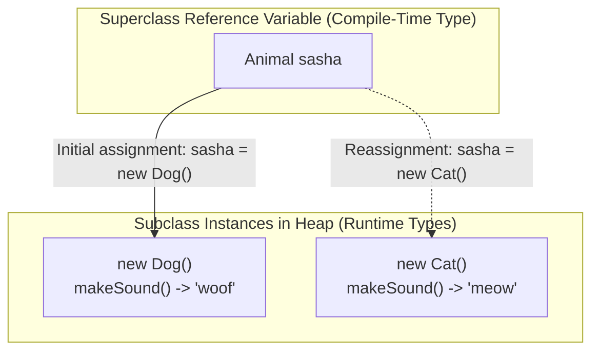

# Polymorphism with Objects: Dynamic Method Dispatch & Reference Polymorphism

---

## Key Takeaways

Polymorphism—meaning "the ability to take multiple forms"—is a core pillar of Object-Oriented Programming that allows subclasses to define unique behaviors while sharing common interfaces and behaviors established by a superclass. In Java, reference polymorphism enables a variable declared with a superclass type to hold a reference to an instance of any of its subclasses (e.g., `Animal sasha = new Dog()`). When an overridden method is invoked on a polymorphic reference, Java resolves the call dynamically at runtime to the subclass implementation rather than the superclass version.



- **Superclass Type, Subclass Instance**: A reference variable's compile-time type can be a superclass, while its runtime instance is a concrete subclass (because a `Dog` _is-an_ `Animal`).
- **Dynamic Method Dispatch**: When an overridden method is invoked on a polymorphic object, the JVM executes the subclass implementation at runtime, not the superclass method.
- **Reference Flexibility / Morphing**: A superclass reference variable can be reassigned to point to different subclass instances over its lifecycle, provided each subclass extends the declared reference type.
- **Compile-Time Type Boundaries**: A reference variable determines which methods can be called at compile time based on the reference type, while the underlying instance dictates how overridden methods execute at runtime.

---

## Main Discussion

### Idiomatic Java Code Snippets

#### 1. Defining the Hierarchy (`Animal`, `Dog`, `Cat`)

The base class defines a generic action, and subclasses provide specialized implementations and unique behaviors:

```java
package polymorphism_objects;

public class Animal {

    public void makeSound() {
        System.out.println("unknown animal sound");
    }
}
```

```java
package polymorphism_objects;

public class Dog extends Animal {

    @Override
    public void makeSound() {
        System.out.println("woof");
    }

    public void fetch() {
        System.out.println("fetch is fun");
    }
}
```

```java
package polymorphism_objects;

public class Cat extends Animal {

    @Override
    public void makeSound() {
        System.out.println("meow");
    }

    public void scratch() {
        System.out.println("scratching furniture");
    }
}
```

#### 2. Demonstrating Object Polymorphism and Reassignment

A single reference variable of type `Animal` references different subclass instances at runtime:

```java
package polymorphism_objects;

public class PolymorphismDemo {

    public static void main(String[] args) {
        // Standard inheritance instantiation
        Dog rocky = new Dog();
        rocky.fetch();       // Prints: fetch is fun
        rocky.makeSound();   // Prints: woof

        System.out.println("--- Polymorphic Reference ---");

        // Polymorphic declaration: superclass type holding a subclass instance
        Animal sasha = new Dog();

        // Invoking overridden method resolves dynamically to Dog's implementation
        sasha.makeSound();   // Prints: woof

        // Reassigning sasha to an instance of Cat (also an Animal)
        sasha = new Cat();

        // Invoking overridden method now resolves dynamically to Cat's implementation
        sasha.makeSound();   // Prints: meow
    }
}

```

### Under the Hood / JVM Mechanics

1. **Compile-Time Type Checking:**
   The javac compiler verifies that the method being called (makeSound()) exists on the declared reference type (Animal). If the method is absent on the reference type, compilation fails.

2. **Polymorphic Heap Assignment:**
   When Animal sasha = new Dog() executes, memory for a Dog instance is allocated on the heap, and the reference variable sasha on the stack stores a pointer to that heap address.

3. **Dynamic Method Dispatch (Runtime Lookup):**
   At runtime, the JVM uses dynamic dispatch to resolve the method invocation. It inspects the actual instance on the heap (Dog), locates its virtual method table (vtable), and executes Dog.makeSound() instead of Animal.makeSound().

4. **Reference Mutation:**
   When sasha = new Cat() executes, the pointer inside the stack reference variable sasha is updated to the address of the newly allocated Cat instance. Subsequent calls to makeSound() resolve to Cat.makeSound().

### Structural Comparisons

#### Direct Subclass Reference vs. Polymorphic Superclass Reference

| Feature                      | Direct Subclass Reference (`Dog rocky = new Dog()`)  | Polymorphic Reference (`Animal sasha = new Dog()`)                             |
| ---------------------------- | ---------------------------------------------------- | ------------------------------------------------------------------------------ |
| **Declared Type**            | Subclass (`Dog`)                                     | Superclass (`Animal`)                                                          |
| **Instance Type**            | Subclass (`Dog`)                                     | Subclass (`Dog`)                                                               |
| **Overridden Methods**       | Executes subclass implementation (`woof`)            | Executes subclass implementation (`woof`)                                      |
| **Subclass-Only Methods**    | Can call subclass methods directly (`rocky.fetch()`) | Cannot call subclass-only methods directly (`sasha.fetch()` fails compilation) |
| **Reassignment Flexibility** | Can only hold `Dog` instances                        | Can be reassigned to any subclass instance (e.g., `sasha = new Cat()`)         |

### Common Anti-Patterns & Edge Cases

- **Attempting to Call Subclass-Specific Methods via Superclass Reference**: Writing `Animal sasha = new Dog(); sasha.fetch();` causes a compile-time failure (`cannot find symbol method fetch()`). The compiler evaluates method availability based on the declared reference type (`Animal`), which does not define `fetch()`.
- **Incompatible Reference Reassignment**: Attempting to assign an unrelated type or a superclass instance to a subclass reference (e.g., `Dog rocky = new Animal();`) causes a compilation error: `incompatible types: Animal cannot be converted to Dog`.
- **Assuming Overriding Depends on Reference Type**: Thinking that calling `sasha.makeSound()` on an `Animal` reference will print `"unknown animal sound"`. In Java, overridden methods are dynamically dispatched based on the actual underlying instance, not the reference variable's type.

---

## 3. Knowledge Check & JetBrains-Style Coding Challenges

### Exam / Theory Tips

- **Dynamic Binding Rule**: If a method is overridden by a subclass, a polymorphic object (`Superclass ref = new Subclass()`) always executes the overridden subclass method at runtime.
- **The "Is-A" Relationship**: Polymorphic assignment is legal only when the instantiated type satisfies the "is-a" relationship with the declared reference type (e.g., `Dog` is an `Animal`).
- **Variable Reassignment**: A superclass reference variable can point to different subclass objects sequentially during program execution.

### Question 1: Conceptual / Code Analysis

Consider the following three classes:

```java
public class Appliance {
    public void operate() {
        System.out.print("Operating ");
    }
}

public class Washer extends Appliance {
    @Override
    public void operate() {
        System.out.print("Washing ");
    }

    public void spin() {
        System.out.print("Spinning ");
    }
}

public class Dryer extends Appliance {
    @Override
    public void operate() {
        System.out.print("Drying ");
    }
}

```

What is the output of executing the following `main` method?

```java
public static void main(String[] args) {
    Appliance item = new Washer();
    item.operate();
    item = new Dryer();
    item.operate();
}

```

- [ ] **A** `Operating Operating `
- [ ] **B** `Washing Drying `
- [ ] **C** `Washing Operating `
- [ ] **D** A compilation error occurs because `item` cannot change its instance type from `Washer` to `Dryer`.

<details>
<summary>Correct Answer</summary>

**Correct Answer**: **B**

**Technical Breakdown**:

- **B is correct**: `item` is declared as type `Appliance`. Initially, it references an instance of `Washer`. When `item.operate()` is called, Java uses dynamic method dispatch to execute `Washer`'s overridden `operate()` method, printing `"Washing "`. Next, `item` is reassigned to an instance of `Dryer` (which is valid because `Dryer` inherits from `Appliance`). When `item.operate()` is called a second time, dynamic dispatch executes `Dryer`'s overridden `operate()` method, printing `"Drying "`.
- **A is incorrect**: Java uses runtime dynamic dispatch for overridden methods, not compile-time static binding to `Appliance`.
- **C is incorrect**: `Dryer` overrides `operate()`, so it prints `"Drying "`, not `"Operating "`.
- **D is incorrect**: Reassigning a superclass reference variable to point to another valid subclass instance is fully supported by Java polymorphism.

</details>

---

### Question 2: Mini Coding Problem / Implementation Challenge

**Task**: Implement a sound-testing simulation using polymorphism inside package `polymorphism_objects`:

1. Superclass `Animal`:
   - Method `public String makeSound()` returning `"unknown sound"`.
2. Subclass `Dog` extending `Animal`:
   - Overrides `makeSound()` to return `"woof"`.
3. Subclass `Cat` extending `Animal`:
   - Overrides `makeSound()` to return `"meow"`.
4. Utility class `AnimalSimulator`:
   - Method `public static String runChorus(Animal[] choir)`: Iterates through the polymorphic `choir` array, invokes `makeSound()` on each element, and concatenates the sounds separated by a single space.

**Test Assertions**:

- `Animal[] animals = new Animal[] { new Dog(), new Cat(), new Dog() };`
- `AnimalSimulator.runChorus(animals)` $\rightarrow$ Returns: `"woof meow woof"`

<details>
<summary>Solution</summary>

```java
package polymorphism_objects;

public class AnimalSimulator {

    public static String runChorus(Animal[] choir) {
        StringBuilder chorus = new StringBuilder();

        // Iterate through array of polymorphic Animal references
        for (int i = 0; i < choir.length; i++) {
            // Overridden makeSound() resolves dynamically at runtime
            chorus.append(choir[i].makeSound());

            if (i < choir.length - 1) {
                chorus.append(" ");
            }
        }

        return chorus.toString();
    }
}
```

**Complexity Analysis**:

- **Time Complexity**: $\mathcal{O}(N)$ where $N$ is the number of elements in the `choir` array. Each method call and string append runs in constant time $\mathcal{O}(1)$.
- **Space Complexity**: $\mathcal{O}(K)$ auxiliary memory allocated in the heap for the `StringBuilder` buffer to construct the concatenated chorus string of length $K$.

</details>

---
