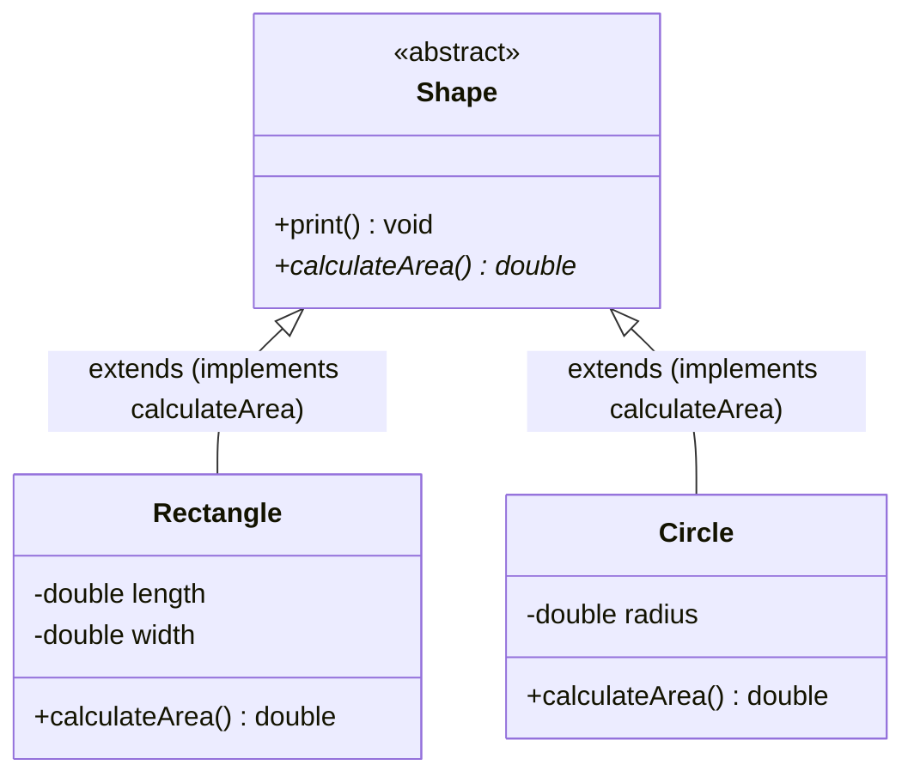

# Abstraction: Abstract Classes, Abstract Methods & Architectural Templates

---

## Key Takeaways

Abstraction is a fundamental pillar of Object-Oriented Programming representing a concept that exists in theory without a concrete existence. In Java, the non-access modifier `abstract` marks classes and methods designed to act as architectural templates rather than fully functional units. An abstract class cannot be directly instantiated using `new`; instead, it serves as a generalized superclass that delegates the responsibility of method implementation to concrete subclasses. An abstract method defines only a signature followed by a semicolon—it has no body—establishing a mandatory contract that extending subclasses must override.



- **Instantiation Restriction**: A class declared with the `abstract` keyword cannot be instantiated directly via `new Shape()`; it exists solely to be extended.
- **Abstract Method Anatomy**: An abstract method contains the non-access modifier `abstract`, a return type, an identifier, and a parameter list, ending with a semicolon (`;`) without curly braces or an executable body.
- **Enclosure Rule**: Any class containing at least one abstract method **must** explicitly be declared as an abstract class.
- **Mixed Member Capability**: An abstract class does not need to consist solely of abstract methods; it can contain concrete, fully implemented methods that are shared and executed across all subclasses.

---

## Main Discussion

### Idiomatic Java Code Snippets

#### 1. Defining the Abstract Base Template (`Shape`)

The abstract class defines a shared concrete method (`print`) alongside an unimplemented contract method (`calculateArea`):

```java
package abstraction_demo;

// Abstract class: cannot be instantiated directly
public abstract class Shape {

    // Concrete method: fully implemented and inherited by all subclasses
    public void print() {
        System.out.println("I am a shape");
    }

    // Abstract method: defines only the signature and ends with a semicolon; no body
    public abstract double calculateArea();
}
```

#### 2. Implementing Concrete Subclasses (`Rectangle` & `Circle`)

Subclasses extend the abstract template and fulfill the implementation burden by overriding `calculateArea()`:

```java
package abstraction_demo;

public class Rectangle extends Shape {

    private double length;
    private double width;

    public Rectangle(double length, double width) {
        this.length = length;
        this.width = width;
    }

    // Mandatory implementation of the inherited abstract method
    @Override
    public double calculateArea() {
        return length * width;
    }
}
```

```java
package abstraction_demo;

public class Circle extends Shape {

    private double radius;

    public Circle(double radius) {
        this.radius = radius;
    }

    // Mandatory implementation of the inherited abstract method
    @Override
    public double calculateArea() {
        return 3.14159 * radius * radius;
    }
}
```

#### 3. Polymorphic Consumption

Abstract classes serve as polymorphic reference types for concrete instances:

```java
package abstraction_demo;

public class ShapeTester {

    public static void main(String[] args) {
        // Direct instantiation of an abstract class is illegal:
        // Shape s = new Shape(); // Compilation Error: Shape is abstract; cannot be instantiated

        // Polymorphic references: abstract type holding concrete subclass instances
        Shape shape1 = new Rectangle(4.0, 5.0);
        Shape shape2 = new Circle(3.0);

        // Subclasses execute inherited concrete methods
        shape1.print(); // Prints: I am a shape
        shape2.print(); // Prints: I am a shape

        // Subclasses execute their specialized implementations of the abstract contract
        System.out.println("Rectangle Area: " + shape1.calculateArea()); // Prints: 20.0
        System.out.println("Circle Area: " + shape2.calculateArea());    // Prints: 28.27431
    }
}

```

### Under the Hood / JVM Mechanics

1. **Class Flag Emission (ACC_ABSTRACT):**
   When javac compiles a class marked abstract, it sets the ACC_ABSTRACT flag in the class file binary header. If a method is declared abstract, it also receives the ACC_ABSTRACT flag and omits the Code bytecode attribute entirely.

2. **Instantiation Blocking:**
   Any bytecode instruction attempting to instantiate an abstract class directly (e.g., new #Shape) causes the compiler to halt compilation. If attempted dynamically, the JVM verifier rejects execution with an InstantiationError.
   `
3. **Concrete Subclass Obligation Check:**
   During the compilation of a non-abstract subclass (e.g., Rectangle), the compiler verifies that every method marked ACC_ABSTRACT in the superclass hierarchy has a matching concrete method body defined in the subclass.

4. **Dynamic Method Dispatch via vtable:**
   At runtime, calls to abstract methods via an abstract reference (shape1.calculateArea()) are resolved through the vtable of the concrete runtime instance (Rectangle), executing the subclass's compiled bytecode.

### Structural Comparisons

#### Concrete Class vs. Abstract Class

| Feature                   | Concrete Class                               | Abstract Class                                         |
| ------------------------- | -------------------------------------------- | ------------------------------------------------------ |
| **Instantiation**         | Permitted via `new ConcreteClass()`          | **Forbidden** (cannot call `new AbstractClass()`)      |
| **Method Implementation** | All methods must have concrete bodies (`{}`) | Can contain both concrete methods and abstract methods |
| **Abstract Methods**      | Not permitted                                | Permitted (requires `abstract` keyword on method)      |
| **Primary Purpose**       | Represent complete, functional objects       | Define common templates and enforce subclass contracts |
| **Modifier**              | None (or standard class)                     | Requires non-access modifier `abstract`                |

#### Abstract Method vs. Concrete Method

| Characteristic    | Abstract Method                               | Concrete Method                              |
| ----------------- | --------------------------------------------- | -------------------------------------------- |
| **Keyword**       | Requires `abstract`                           | No `abstract` keyword                        |
| **Method Body**   | None (ends with a semicolon `;`)              | Fully enclosed within curly braces `{ ... }` |
| **Execution**     | Cannot be executed as-is                      | Executed directly when invoked               |
| **Subclass Role** | **Must** be overridden by concrete subclasses | Inherited as-is (optionally overridable)     |

### Common Anti-Patterns & Edge Cases

- **Attempting to Instantiate an Abstract Class**: Calling `Shape s = new Shape();` results in an immediate compile-time failure: `Shape is abstract; cannot be instantiated`.
- **Abstract Method in a Non-Abstract Class**: Declaring `public abstract void calculate();` inside a standard class without adding `abstract` to the class header produces a compilation error: `abstract method in non-abstract class`.
- **Supplying a Body to an Abstract Method**: Adding curly braces to an abstract method (e.g., `public abstract void run() {}`) triggers a compile-time failure: `abstract methods cannot have a body`.
- **Failing to Override Abstract Methods**: If a concrete subclass extends an abstract class but fails to implement all inherited abstract methods, the subclass fails compilation with an error: `[Subclass] is not abstract and does not override abstract method [method] in [Superclass]`.

---

## Knowledge Check & JetBrains-Style Coding Challenges

### Theory Tips

- **Class vs. Method Requirement**: A class containing an abstract method **must** be declared abstract. However, an abstract class is **not required** to contain abstract methods; it can contain only concrete methods while still forbidding direct instantiation.
- **No Method Bodies**: Abstract methods end strictly with a semicolon: `public abstract void doWork();`. Adding `{}` is a syntax violation.
- **Modifier Positioning**: In method declarations, `abstract` is a non-access modifier that appears before the return type: `public abstract double calculateArea();`.

### Question 1: Conceptual / Code Analysis

Consider the following proposed class structure:

```java
public abstract class Graphic {
    public void render() {
        System.out.println("Rendering graphic");
    }

    public abstract void resize();
}

public class Icon extends Graphic {
    // No additional code provided
}
```

What happens when attempting to compile `Icon.java`?

- [ ] **A** Compilation succeeds; `Icon` inherits `render()` and `resize()` defaults to an empty operation.
- [ ] **B** A compilation error occurs in `Graphic` because an abstract class cannot contain a concrete method like `render()`.
- [ ] **C** A compilation error occurs in `Icon` because it does not implement the inherited abstract method `resize()` or declare itself as abstract.
- [ ] **D** A runtime error occurs when instantiating `Icon` because its method table is incomplete.

<details>
<summary>Correct Answer</summary>

**Correct Answer**: **C**

**Technical Breakdown**:

- **C is correct**: When a concrete subclass extends an abstract superclass, the compiler pushes the entire burden of implementation onto that subclass. Because `Icon` is declared as a standard, concrete class (`public class Icon`) and fails to provide an implementation for `public abstract void resize()`, the compiler rejects the class: `Icon is not abstract and does not override abstract method resize() in Graphic`.
- **A is incorrect**: Java does not generate default dummy bodies for unimplemented abstract methods.
- **B is incorrect**: Abstract classes are explicitly allowed to have implemented concrete methods.
- **D is incorrect**: This contract is enforced at compile time by `javac`, preventing bytecode generation.

</details>

---

### Question 2: Mini Coding Problem / Implementation Challenge

**Task**: Model an employee compensation system using abstraction inside package `abstraction_demo`:

1. Abstract class `Employee`:
   - Private fields: `name` (`String`) and `id` (`int`).
   - Constructor `public Employee(String name, int id)` initializing both fields.
   - Concrete getters: `getName()` and `getId()`.
   - Concrete method `public void printBadge()`: prints `"Badge: [id] - [name]"`.
   - Abstract method: `public abstract double calculatePay();`
2. Concrete subclass `SalariedEmployee` extending `Employee`:
   - Private field `weeklySalary` (`double`).
   - Constructor `public SalariedEmployee(String name, int id, double weeklySalary)`: chains to super constructor and sets `weeklySalary`.
   - Implements `calculatePay()`: returns `weeklySalary`.
3. Concrete subclass `HourlyEmployee` extending `Employee`:
   - Private fields: `hoursWorked` (`double`) and `hourlyRate` (`double`).
   - Constructor `public HourlyEmployee(String name, int id, double hourlyRate, double hoursWorked)`: chains to super constructor and sets fields.
   - Implements `calculatePay()`: returns `hoursWorked * hourlyRate`.

**Test Assertions**:

- `Employee emp1 = new SalariedEmployee("Alice", 101, 1500.0);`
- `emp1.calculatePay()` $\rightarrow$ Returns: `1500.0`
- `Employee emp2 = new HourlyEmployee("Bob", 102, 25.0, 40.0);`
- `emp2.calculatePay()` $\rightarrow$ Returns: `1000.0`

<details>
<summary>Solution</summary>

```java
package abstraction_demo;

// Abstract template class
public abstract class Employee {

    private String name;
    private int id;

    public Employee(String name, int id) {
        this.name = name;
        this.id = id;
    }

    public String getName() {
        return name;
    }

    public int getId() {
        return id;
    }

    // Concrete shared method
    public void printBadge() {
        System.out.println("Badge: " + id + " - " + name);
    }

    // Abstract method defining the mandatory compensation contract
    public abstract double calculatePay();
}

```

```java
package abstraction_demo;

public class SalariedEmployee extends Employee {

    private double weeklySalary;

    public SalariedEmployee(String name, int id, double weeklySalary) {
        super(name, id);
        this.weeklySalary = weeklySalary;
    }

    // Fulfills the abstract method contract
    @Override
    public double calculatePay() {
        return weeklySalary;
    }
}

```

```java
package abstraction_demo;

public class HourlyEmployee extends Employee {

    private double hourlyRate;
    private double hoursWorked;

    public HourlyEmployee(String name, int id, double hourlyRate, double hoursWorked) {
        super(name, id);
        this.hourlyRate = hourlyRate;
        this.hoursWorked = hoursWorked;
    }

    // Fulfills the abstract method contract
    @Override
    public double calculatePay() {
        return hoursWorked * hourlyRate;
    }
}

```

**Complexity Analysis**:

- **Time Complexity**: $\mathcal{O}(1)$ for object instantiation and invocations of `calculatePay()`, as field assignments and arithmetic operations run in constant time.
- **Space Complexity**: $\mathcal{O}(1)$ auxiliary space beyond the allocated heap objects for `SalariedEmployee` and `HourlyEmployee`.

</details>

---
