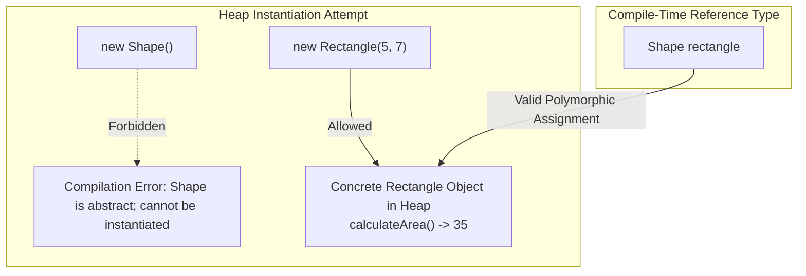

# Abstraction: Abstract Reference Types, Instantiation Constraints & Polymorphic Execution

---

## Key Takeaways

An abstract class serves as an architectural template and cannot be instantiated directly using the `new` operator. However, an abstract class can be used as a reference type variable to hold instances of any of its concrete (non-abstract) subclasses. When an abstract method declared in the template class is invoked on such a reference, Java uses runtime dynamic method dispatch to execute the concrete subclass's overridden implementation.



- **Instantiation Restriction**: Attempting to instantiate an abstract class directly (e.g., `new Shape()`) causes an immediate compile-time failure.
- **Abstract Type as Reference**: While an abstract class cannot be instantiated, it is fully valid as a declared reference type (e.g., `Shape s = new Rectangle(...)`).
- **Subclass Instantiation Requirement**: When assigning an object to an abstract reference type, the instantiated object must belong to a concrete (non-abstract) subclass.
- **Polymorphic Execution of Overridden Contracts**: Invoking a method defined as abstract in the superclass executes the concrete subclass's implementation at runtime.

---

## Main Discussion / Deep Dive

### Idiomatic Java Code Snippets

#### 1. Defining the Abstract Template (`Shape`)

The abstract superclass specifies the contract method without providing a body:

```java
package abstraction_usage;

public abstract class Shape {

    // Abstract method: defines contract to be overridden by concrete subclasses
    public abstract double calculateArea();
}
```

#### 2. Defining the Concrete Subclass (`Rectangle`)

The concrete subclass implements the abstract method:

```java
package abstraction_usage;

public class Rectangle extends Shape {

    private double length;
    private double width;

    public Rectangle(double length, double width) {
        this.length = length;
        this.width = width;
    }

    public double getLength() {
        return length;
    }

    public double getWidth() {
        return width;
    }

    // Overridden implementation of the abstract contract
    @Override
    public double calculateArea() {
        return length * width;
    }
}
```

#### 3. Instantiating via Abstract Reference Types

An abstract class cannot be instantiated directly, but it can reference a concrete subclass instance:

```java
package abstraction_usage;

public class AbstractInstantiationDemo {

    public static void main(String[] args) {
        // ILLEGAL: Abstract classes cannot be instantiated directly
        // Shape shape = new Shape();
        // Compilation Error: Shape is abstract; cannot be instantiated

        // LEGAL: Abstract class used as the reference type, instantiated with concrete subclass
        Shape rectangle = new Rectangle(5.0, 7.0);

        // Dynamic dispatch invokes Rectangle's overridden calculateArea() method
        double area = rectangle.calculateArea();

        System.out.println("Calculated Area: " + area); // Prints: Calculated Area: 35.0
    }
}
```

### Under the Hood / JVM Mechanics

1. **Compile-Time Instantiation Verification:**
   When javac encounters a new expression (e.g., new Shape()), it inspects the target class metadata. If the class possesses the ACC_ABSTRACT flag, compilation halts with: cannot instantiate an abstract class.
2. **Reference Type Assignability Check:**
   When Shape rectangle = new Rectangle(...) is evaluated, the compiler verifies that Rectangle is a descendant of Shape. Because Rectangle is concrete and extends Shape, the assignment is valid.
3. **Bytecode Method Call Emission:**
   The invocation rectangle.calculateArea() is emitted as an invokevirtual bytecode instruction targeting the Shape.calculateArea() signature descriptor.
4. **Runtime Dynamic Method Dispatch:**
   At runtime, the JVM resolves the invokevirtual call by inspecting the actual object referenced on the heap. Because the instance is a Rectangle, execution routes to Rectangle.calculateArea(), returning 35.0.

### Structural Comparisons

#### Direct Concrete Instantiation vs. Abstract Polymorphic Instantiation

| Feature                | Direct Concrete Instantiation (`Rectangle r = new Rectangle(...)`) | Abstract Polymorphic Reference (`Shape r = new Rectangle(...)`) | Direct Abstract Instantiation (`Shape s = new Shape(...)`) |
| ---------------------- | ------------------------------------------------------------------ | --------------------------------------------------------------- | ---------------------------------------------------------- |
| **Declared Type**      | Concrete (`Rectangle`)                                             | Abstract (`Shape`)                                              | Abstract (`Shape`)                                         |
| **Instantiated Type**  | Concrete (`Rectangle`)                                             | Concrete (`Rectangle`)                                          | Abstract (`Shape`)                                         |
| **Compilation Status** | Compiles successfully                                              | Compiles successfully                                           | **Fails to compile**                                       |
| **Accessible Methods** | All methods defined in `Rectangle` and `Shape`                     | Methods declared in `Shape` only                                | N/A (Compilation error)                                    |
| **Execution Target**   | `Rectangle`'s implementation                                       | `Rectangle`'s implementation (via dynamic dispatch)             | N/A                                                        |

### Common Anti-Patterns & Edge Cases

- **Direct Instantiation of Abstract Classes**: Writing `Shape s = new Shape();` results in an immediate compilation failure: `Shape is abstract; cannot be instantiated`.
- **Assigning Unimplemented Subclasses**: If a subclass `Triangle` extends `Shape` but is also declared `abstract` (e.g., because it deferred method implementations), attempting `Shape s = new Triangle();` fails with the same instantiation error.
- **Assuming Static Method Binding on Abstract References**: Believing that calling an abstract method via an abstract reference executes an empty or missing method. Java routes calls at runtime to the concrete instance's overridden implementation via dynamic dispatch.

---

## Knowledge Check & JetBrains-Style Coding Challenges

### Exam / Theory Tips

- **Reference vs. Instance**: An abstract class can **never** be used as an instance type after `new`, but it can **always** be used as a reference type variable before the identifier.
- **Core Abstraction Rules**:
  1. Abstract classes and methods are declared using the reserved word `abstract`.
  2. If a subclass inherits from an abstract class, it must implement all abstract methods or declare itself `abstract`.
  3. Abstract classes cannot be instantiated; they exist to serve as superclasses.

### Question 1: Conceptual / Code Analysis

Consider the following abstract and concrete class definitions:

```java
public abstract class Report {
    public abstract void generate();
}

public class PdfReport extends Report {
    @Override
    public void generate() {
        System.out.println("Generating PDF report");
    }
}
```

Which of the following statements inside a `main` method will compile and execute successfully?

- [ ] **A** `Report report = new Report(); report.generate();`
- [ ] **B** `PdfReport report = new Report(); report.generate();`
- [ ] **C** `Report report = new PdfReport(); report.generate();`
- [ ] **D** `Report report = (Report) new Object(); report.generate();`

<details>
<summary>Correct Answer</summary>

**Correct Answer**: **C**

**Technical Breakdown**:

- **C is correct**: `Report` is an abstract class, so it cannot be instantiated directly, but it can serve as a reference type. `PdfReport` is a concrete subclass that implements the abstract method `generate()`. Declaring `Report report = new PdfReport();` is a valid polymorphic assignment. When `report.generate()` is called, runtime dynamic dispatch executes `PdfReport`'s implementation, printing `"Generating PDF report"`.
- **A is incorrect**: `new Report()` attempts to directly instantiate an abstract class, causing a compile-time failure.
- **B is incorrect**: `new Report()` is illegal because `Report` is abstract; additionally, a superclass instance cannot be directly assigned to a subclass reference.
- **D is incorrect**: While this compiles due to the explicit cast, it throws a runtime `ClassCastException` because an `Object` instance cannot be cast to `Report`.

</details>

---

### Question 2: Mini Coding Problem / Implementation Challenge

**Task**: Model an audio notification dispatcher inside package `abstraction_usage`:

1. Abstract class `Notification`:
   - Private field `recipient` (`String`).
   - Constructor `public Notification(String recipient)`.
   - Public getter `getRecipient()`.
   - Abstract method `public abstract String send();`
2. Concrete subclass `EmailNotification` extending `Notification`:
   - Constructor `public EmailNotification(String recipient)` chaining to `super`.
   - Implements `send()`: returns `"Email sent to: " + getRecipient()`.
3. Concrete subclass `SmsNotification` extending `Notification`:
   - Constructor `public SmsNotification(String recipient)` chaining to `super`.
   - Implements `send()`: returns `"SMS sent to: " + getRecipient()`.
4. Utility class `NotificationDispatcher`:
   - Method `public static String[] dispatchAll(Notification[] notifications)`:
   - Accepts an array of polymorphic `Notification` references.
   - Iterates through the array and populates a new `String[]` array with the output of each notification's `send()` method.
   - Returns the array of result strings.

**Test Assertions**:

- Input:

  ```java
  Notification[] batch = new Notification[] {
      new EmailNotification("user@example.com"),
      new SmsNotification("555-0199")
  };
  ```

- `NotificationDispatcher.dispatchAll(batch)` $\rightarrow$ Returns: `["Email sent to: user@example.com", "SMS sent to: 555-0199"]`

<details>
<summary>Solution</summary>

```java
package abstraction_usage;

public abstract class Notification {

    private String recipient;

    public Notification(String recipient) {
        this.recipient = recipient;
    }

    public String getRecipient() {
        return recipient;
    }

    // Abstract contract to be fulfilled by concrete subclasses
    public abstract String send();
}
```

```java
package abstraction_usage;

public class EmailNotification extends Notification {

    public EmailNotification(String recipient) {
        super(recipient);
    }

    @Override
    public String send() {
        return "Email sent to: " + getRecipient();
    }
}
```

```java
package abstraction_usage;

public class SmsNotification extends Notification {

    public SmsNotification(String recipient) {
        super(recipient);
    }

    @Override
    public String send() {
        return "SMS sent to: " + getRecipient();
    }
}
```

```java
package abstraction_usage;

public class NotificationDispatcher {

    public static String[] dispatchAll(Notification[] notifications) {
        String[] results = new String[notifications.length];

        for (int i = 0; i < notifications.length; i++) {
            // Polymorphic method call resolved dynamically to concrete subclass send()
            results[i] = notifications[i].send();
        }

        return results;
    }
}
```

**Complexity Analysis**:

- **Time Complexity**: $\mathcal{O}(N)$ where $N$ is the number of elements in the `notifications` array. Each invocation of `send()` executes in constant time $\mathcal{O}(1)$.
- **Space Complexity**: $\mathcal{O}(N)$ auxiliary memory allocated for the returned `String[]` array containing the dispatch results.

</details>

---
