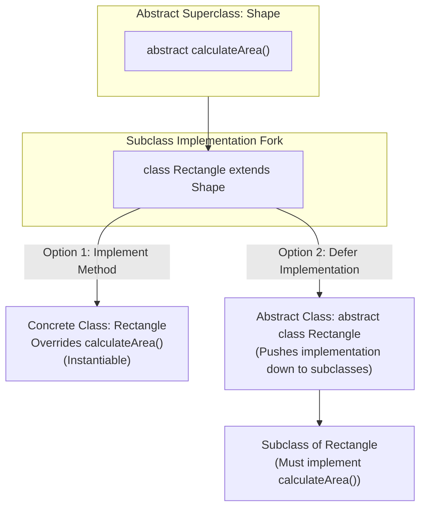

# Object-Oriented Programming: Inheriting from Abstract Classes & Implementation Delegation

---

## Key Takeaways

When a subclass extends an abstract class, it inherits all members of that superclass—including any unimplemented abstract methods. Because a class containing unimplemented abstract methods cannot be a valid concrete class, Java imposes a binary compiler rule on the subclass: it must either provide concrete implementations for every inherited abstract method or declare itself `abstract`. If a subclass only provides implementations for a subset of inherited abstract methods, it must remain abstract, delegating the remaining implementation burden further down the inheritance chain.



- **The Subclass Obligation**: Extending an abstract class requires the subclass to either override and implement all inherited abstract methods or prefix its own class declaration with `abstract`.
- **Delegation of Implementation**: An intermediate subclass can implement a portion of inherited abstract methods and declare itself `abstract`, pushing the remaining unimplemented methods down to its descendants.
- **IDE Acceleration**: IDEs like IntelliJ IDEA streamline satisfying abstract contracts via **Generate > Implement Methods** (`Ctrl+I` / `Cmd+I`), automatically scaffolding the required method signatures.
- **Restoring Instantiability**: A class hierarchy becomes instantiable only when a subclass in the chain fully fulfills all outstanding abstract method contracts.

---

## Main Discussion

### Idiomatic Java Code Snippets

#### 1. Fulfilling the Contract in a Concrete Subclass (`Rectangle`)

The abstract base class defines the contract, and the concrete subclass supplies the calculation:

```java
package abstract_inheritance;

public abstract class Shape {

    // Abstract contract method
    public abstract double calculateArea();
}
```

```java
package abstract_inheritance;

// Rectangle satisfies the superclass requirement by implementing calculateArea()
public class Rectangle extends Shape {

    private double length;
    private double width;

    public Rectangle(double length, double width) {
        this.length = length;
        this.width = width;
    }

    public double getLength() {
        return length;
    }

    public void setLength(double length) {
        this.length = length;
    }

    public double getWidth() {
        return width;
    }

    public void setWidth(double width) {
        this.width = width;
    }

    // Fulfills the inherited abstract contract from Shape
    @Override
    public double calculateArea() {
        return length * width;
    }
}
```

#### 2. Partial Implementation and Downward Delegation

When an intermediate class only partially implements abstract methods, it must remain abstract:

```java
package abstract_inheritance;

public abstract class MultiMetricShape {
    public abstract double calculateArea();
    public abstract double calculatePerimeter();
}

```

```java
package abstract_inheritance;

// Intermediate class implements only 1 of 2 abstract methods; MUST be declared abstract
public abstract class Quadrilateral extends MultiMetricShape {

    protected double side1;
    protected double side2;
    protected double side3;
    protected double side4;

    // Implements calculatePerimeter(), but leaves calculateArea() abstract
    @Override
    public double calculatePerimeter() {
        return side1 + side2 + side3 + side4;
    }

    // calculateArea() remains unimplemented, pushing the burden to subclasses
}
```

```java
package abstract_inheritance;

// Leaf concrete subclass implements the final remaining abstract method
public class StandardRectangle extends Quadrilateral {

    public StandardRectangle(double length, double width) {
        this.side1 = length;
        this.side2 = width;
        this.side3 = length;
        this.side4 = width;
    }

    // Implements the remaining abstract method inherited from MultiMetricShape
    @Override
    public double calculateArea() {
        return side1 * side2;
    }
}
```

### Under the Hood / JVM Mechanics

1. **Abstract Symbol Inheritance:**
   When javac processes extends Shape, it pulls all method descriptors with the ACC_ABSTRACT flag from the superclass into the subclass's compile-time contract table.
2. **Completeness Validation:**
   The compiler inspects the subclass method declarations. For each abstract descriptor:
   - If a concrete method with an identical signature exists, the descriptor is marked resolved.
   - If any abstract descriptor remains unresolved and the class lacks abstract, compilation halts with: class must either be declared abstract or implement abstract method.
3. **Intermediate Class Flag Propagation:**
   If an intermediate class (like Quadrilateral) does not resolve all abstract methods, marking it abstract emits the ACC_ABSTRACT flag on the class file, deferring verification of the remaining methods to its child classes.
4. **vtable Population in the Leaf Class:**
   Once a concrete class (StandardRectangle) fulfills all remaining methods, the JVM builds a complete virtual method table (vtable) with non-null function pointers for all methods, enabling safe instantiation and runtime dynamic dispatch.

### Structural Comparisons

#### Resolving Inherited Abstract Methods

| Approach                    | Class Declaration                            | Implementation Responsibility                       | Can Be Instantiated?                   |
| --------------------------- | -------------------------------------------- | --------------------------------------------------- | -------------------------------------- |
| **Complete Implementation** | `public class Child extends Parent`          | Implements **all** inherited abstract methods       | **Yes** (`new Child()`)                |
| **Partial Implementation**  | `public abstract class Child extends Parent` | Implements **some** methods; leaves others abstract | **No** (Compile error if instantiated) |
| **Zero Implementation**     | `public abstract class Child extends Parent` | Implements **no** methods; passes all down          | **No** (Compile error if instantiated) |

### Common Anti-Patterns & Edge Cases

- **Missing Abstract Keyword on Partial Implementation**: Extending an abstract class with multiple abstract methods, implementing only some of them, and omitting `abstract` from the subclass header triggers: `[Subclass] is not abstract and does not override abstract method [method] in [Superclass]`.
- **Incorrect Signature During Implementation**: Attempting to implement an abstract method with mismatched parameter types or names (without `@Override`) creates an overload rather than satisfying the abstract contract, leaving the abstract method unresolved and breaking compilation.
- **Attempting to Instantiate an Intermediate Abstract Class**: Trying to call `new Quadrilateral()` when `Quadrilateral` partially implemented `MultiMetricShape` fails because abstract classes cannot be instantiated regardless of how many methods they have implemented.

---

## Knowledge Check & JetBrains-Style Coding Challenges

### Theory Tips

- **The Binary Rule**: When extending an abstract class, a subclass has exactly two choices: implement **all** inherited abstract methods, or declare itself **abstract**.
- **Partial Implementation Pattern**: If a class implements only a subset of inherited abstract methods, it is legally an abstract class and **must** include the `abstract` modifier in its class header.
- **IDE Shortcuts**: In IntelliJ IDEA, use the shortcut `Ctrl+I` (Windows/Linux) or `Cmd+I` (macOS), or **Right-Click > Generate > Implement Methods** to scaffold mandatory overrides.

### Question 1: Conceptual / Code Analysis

Consider the following hierarchy:

```java
public abstract class DatabaseConnector {
    public abstract void connect();
    public abstract void disconnect();
}

public abstract class RelationalConnector extends DatabaseConnector {
    @Override
    public void connect() {
        System.out.println("Connected to relational database");
    }
}

public class PostgresConnector extends RelationalConnector {
    // No methods defined inside
}

```

What occurs when attempting to compile `PostgresConnector.java`?

- [ ] **A.** Compilation succeeds; `PostgresConnector` inherits `connect()` and `disconnect()` defaults to an empty operation.
- [ ] **B.** A compilation error occurs in `RelationalConnector` because an abstract class cannot implement only one abstract method.
- [ ] **C.** A compilation error occurs in `PostgresConnector` because it does not implement `disconnect()` or declare itself as `abstract`.
- [ ] **D.** A runtime error occurs when instantiating `PostgresConnector` due to a missing method pointer.

<details>
<summary>Correct Answer</summary>

**Correct Answer**: **C**

**Technical Breakdown**:

- **C is correct**: `DatabaseConnector` defines two abstract methods: `connect()` and `disconnect()`. `RelationalConnector` implements `connect()`, but leaves `disconnect()` unimplemented, correctly declaring itself `abstract`. When concrete class `PostgresConnector` extends `RelationalConnector`, it inherits the unimplemented `disconnect()` method. Because `PostgresConnector` is not declared `abstract` and does not provide an implementation for `disconnect()`, the compiler rejects it: `PostgresConnector is not abstract and does not override abstract method disconnect() in DatabaseConnector`.
- **A is incorrect**: Java does not generate empty fallback implementations for abstract methods.
- **B is incorrect**: An abstract class can implement any number of methods (none, some, or all) from its parent.
- **D is incorrect**: The check is strictly enforced at compile time by `javac`.

</details>

---

### Question 2: Mini Coding Problem / Implementation Challenge

**Task**: Model a document-exporting pipeline inside package `abstract_inheritance`:

1. Abstract class `Exporter`:
   - Defines abstract method `public abstract String getFormatName();`
   - Defines abstract method `public abstract byte[] exportData(String content);`
2. Intermediate abstract class `TextBasedExporter` extending `Exporter`:
   - Fulfills `exportData(String content)`: converts `content` to a byte array by calling `content.getBytes()`.
   - Leaves `getFormatName()` unimplemented for downstream specialized classes.
   - Declares itself `abstract`.
3. Leaf concrete class `CsvExporter` extending `TextBasedExporter`:
   - Fulfills the remaining contract `getFormatName()`: returns `"CSV"`.
4. Leaf concrete class `MarkdownExporter` extending `TextBasedExporter`:
   - Fulfills the remaining contract `getFormatName()`: returns `"MARKDOWN"`.

**Test Assertions**:

- `Exporter csv = new CsvExporter();`
- `csv.getFormatName()` $\rightarrow$ Returns: `"CSV"`
- `new String(csv.exportData("a,b,c"))` $\rightarrow$ Returns: `"a,b,c"`
- `Exporter md = new MarkdownExporter();`
- `md.getFormatName()` $\rightarrow$ Returns: `"MARKDOWN"`

<details>
<summary>Solution</summary>

```java
package abstract_inheritance;

public abstract class Exporter {

    public abstract String getFormatName();

    public abstract byte[] exportData(String content);
}

```

```java
package abstract_inheritance;

// Intermediate abstract class implementing 1 of 2 abstract methods
public abstract class TextBasedExporter extends Exporter {

    @Override
    public byte[] exportData(String content) {
        return content.getBytes();
    }
    // getFormatName() is left abstract, pushing responsibility to leaf subclasses
}

```

```java
package abstract_inheritance;

// Concrete leaf class fulfilling the final abstract requirement
public class CsvExporter extends TextBasedExporter {

    @Override
    public String getFormatName() {
        return "CSV";
    }
}

```

```java
package abstract_inheritance;

// Concrete leaf class fulfilling the final abstract requirement
public class MarkdownExporter extends TextBasedExporter {

    @Override
    public String getFormatName() {
        return "MARKDOWN";
    }
}

```

**Complexity Analysis**:

- **Time Complexity**: $\mathcal{O}(N)$ for `exportData()`, where $N$ is the character length of the input string converted to bytes via `.getBytes()`. Invoking `getFormatName()` runs in constant time $\mathcal{O}(1)$.
- **Space Complexity**: $\mathcal{O}(N)$ auxiliary heap memory allocated for the returned byte array corresponding to the exported text.

</details>

---
