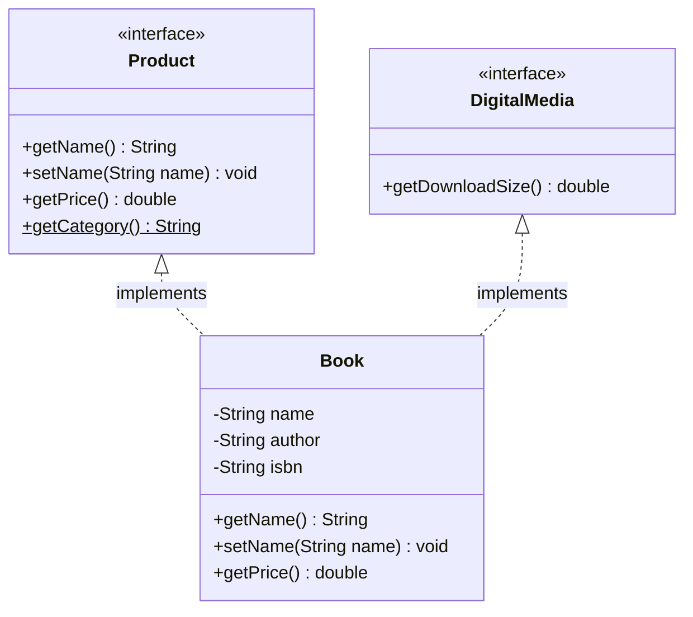

# Interfaces: Contractual Templates, Multiple Inheritance & Default Methods

---

## Key Takeaways

An interface in Java serves as a purely abstract contractual template that defines _what_ behaviors a class must implement, without dictating _how_ they are executed. Because interfaces lack state and constructors, they cannot be instantiated directly; instead, they are implemented by classes, allowing Java to support multiple inheritance of type. Modern interfaces balance strict abstraction with backward compatibility by permitting `default` and `static` methods, which provide concrete implementations directly within the interface body.



- **Implicit Modifiers**: By default, any field declared in an interface is implicitly `public static final` (a constant), and any standard method is implicitly `public abstract`.
- **Multiple Inheritance**: Unlike class extension (`extends`), a single Java class can implement multiple interfaces via a comma-delimited list, inheriting the abstract contracts of all specified interfaces.
- **Default Methods**: Marked with the `default` keyword, these methods provide a fallback implementation within the interface to prevent breaking existing implementing classes when new contracts are added.
- **Static Methods**: Interfaces can define `static` methods that provide utility logic. These belong strictly to the interface itself and are not inherited by implementing classes.

---

## Main Discussion

### Idiomatic Java Code Snippets

#### 1. Defining the Interface

An interface acts as a contract. It declares abstract methods, provides backward compatibility via `default` methods, and offers utility via `static` methods:

```java
package interfaces_demo;

public interface Product {
    // Implicitly public, static, and final. Must be initialized immediately.
    String DEFAULT_CATEGORY = "General Merchandise";

    // Implicitly public and abstract. Implementing classes MUST override these.
    String getName();
    void setName(String name);

    // Default method: Provides concrete implementation. Can be overridden, but not required.
    default double getPrice() {
        return 50.0;
    }

    // Static method: Belongs to the interface. Cannot be overridden.
    static void printCategory() {
        System.out.println("Category: " + DEFAULT_CATEGORY);
    }
}
```

#### 2. Implementing the Interface

A concrete class uses the `implements` keyword to fulfill the interface's contract. It must provide bodies for all abstract methods:

```java
package interfaces_demo;

// Book implements Product. It could implement multiple: implements Product, Shippable
public class Book implements Product {

    private String name;
    private String author;

    // Fulfilling the abstract method contracts
    @Override
    public String getName() {
        return name;
    }

    @Override
    public void setName(String name) {
        this.name = name;
    }

    // Optionally overriding the default method for specialized behavior
    @Override
    public double getPrice() {
        return 19.99;
    }

    public void setAuthor(String author) {
        this.author = author;
    }
}
```

#### 3. Polymorphic Instantiation and Method Invocation

Interfaces are powerful polymorphic reference types:

```java
package interfaces_demo;

public class StoreFront {

    public static void main(String[] args) {
        // Polymorphic reference: Interface type holding a concrete subclass instance
        Product myBook = new Book();
        myBook.setName("Effective Java");

        System.out.println("Product: " + myBook.getName());
        System.out.println("Price: $" + myBook.getPrice());

        // Interface static methods must be called on the Interface itself, not the instance
        Product.printCategory();
    }
}
```

### Under the Hood / JVM Mechanics

1. **Compile-Time Modifier Injection:**
   When javac compiles an interface, it automatically applies ACC_PUBLIC and ACC_ABSTRACT flags to all methods lacking bodies. Fields are injected with ACC_PUBLIC, ACC_STATIC, and ACC_FINAL.
2. **Implementation Verification:**
   When compiling an implementing class, the compiler cross-references the class's method signatures against the interface. If any abstract method from the interface lacks a concrete implementation in the class, and the class is not marked abstract, compilation halts.
3. **Multiple Inheritance Clash Resolution:**
   If a class implements two interfaces containing methods with the identical name and parameter list, but different return types (e.g., int getId() vs String getId()), the compiler throws a clash error because the class cannot satisfy both return types simultaneously.
4. **Runtime Interface Dispatch (itable):**
   At runtime, the JVM uses an Interface Method Table (itable) to resolve polymorphic calls on interface references. When myBook.getName() executes, the invoke interface bytecode instruction performs a dynamic lookup in the instance's itable to route execution to Book.getName().

### Structural Comparisons

#### Abstract Class vs. Interface

| Feature                   | Abstract Class                                    | Interface                                                     |
| ------------------------- | ------------------------------------------------- | ------------------------------------------------------------- |
| **State / Fields**        | Can hold mutable instance variables (state)       | Cannot hold state; fields are `public static final` constants |
| **Constructors**          | Can declare constructors (called via `super()`)   | Cannot declare constructors                                   |
| **Inheritance Limit**     | A class can `extends` only **one** abstract class | A class can `implements` **multiple** interfaces              |
| **Default Method Access** | Methods can be `protected`, package-private, etc. | Methods are implicitly `public`                               |

#### Interface Method Types

| Method Type  | Keyword Requirement               | Implementation Body? | Inherited by Implementing Class?   | Overridable?    |
| ------------ | --------------------------------- | -------------------- | ---------------------------------- | --------------- |
| **Abstract** | Implicit (or explicit `abstract`) | No (ends with `;`)   | Yes (Must be implemented)          | Yes (Mandatory) |
| **Default**  | Explicit `default`                | Yes `{ ... }`        | Yes (Provides fallback)            | Yes (Optional)  |
| **Static**   | Explicit `static`                 | Yes `{ ... }`        | **No** (Called via Interface name) | **No**          |

### Common Anti-Patterns & Edge Cases

- **Attempting to Instantiate an Interface**: Executing `Product p = new Product();` results in an immediate compilation failure (`Product is abstract; cannot be instantiated`).
- **Calling Static Interface Methods via Instances**: Writing `myBook.printCategory();` fails compilation. Unlike class static methods, interface static methods do not belong to the implementing object's namespace and must be called as `Product.printCategory();`.
- **Private / Protected Fields**: Declaring `private int id;` in an interface causes a syntax error. Interfaces define public contracts, so encapsulated state is strictly forbidden.
- **Return Type Clashes in Multiple Inheritance**: If `InterfaceA` defines `int fetch()` and `InterfaceB` defines `String fetch()`, a class declaring `implements InterfaceA, InterfaceB` will fail to compile due to an unresolvable return type clash.

---

## Knowledge Check & JetBrains-Style Coding Challenges

### Exam / Theory Tips

- **Implicit Modifiers**: You do not need to write `public abstract` for methods or `public static final` for fields in an interface; the compiler adds them automatically.
- **The `default` Keyword**: In interfaces, `default` is an access modifier used to provide backward-compatible method bodies. It is unrelated to the `default` case in `switch` statements or package-private visibility.
- **Multiple Inheritance Rule**: A Java class can `extends` only one class, but can `implements` an unlimited number of interfaces.

### Question 1: Conceptual / Code Analysis

Consider the following definitions:

```java
public interface Document {
    int MAX_SIZE = 100;

    void save();

    default void print() {
        System.out.println("Printing document...");
    }

    static void clearCache() {
        System.out.println("Cache cleared");
    }
}

public class Report implements Document {
    @Override
    public void save() {
        System.out.println("Saving report...");
    }
}

```

Given the following `main` method, which line causes a compilation error?

```java
public static void main(String[] args) {
    Document doc = new Report(); // Line 1
    doc.save();                  // Line 2
    doc.print();                 // Line 3
    doc.clearCache();            // Line 4
}

```

- [ ] **A.** Line 1, because an interface cannot be used as a reference type.
- [ ] **B.** Line 2, because `save()` is implicitly private in the interface.
- [ ] **C.** Line 3, because `Report` did not override the `print()` method.
- [ ] **D.** Line 4, because static methods in an interface cannot be invoked through an instance reference.

<details>
<summary>Correct Answer</summary>

**Correct Answer**: **D**

**Technical Breakdown**:

- **D is correct**: Static methods defined in an interface belong strictly to the interface type itself and are not inherited by implementing classes or their instances. To invoke `clearCache()`, the syntax must be `Document.clearCache();`. Attempting to call it via the instance reference `doc.clearCache()` causes a compilation error.
- **A is incorrect**: Polymorphic assignment of a concrete instance (`Report`) to an interface reference (`Document`) is perfectly legal.
- **B is incorrect**: Methods in an interface are implicitly `public abstract`, not private.
- **C is incorrect**: `print()` is a `default` method, meaning it provides a fallback implementation. `Report` is not required to override it to compile successfully.

</details>

---

### Question 2: Mini Coding Problem / Implementation Challenge

**Task**: Implement a payment processing contract utilizing interfaces and multiple inheritance.

1. Create an interface `Payable`:
   - Implicitly abstract method: `void processPayment(double amount);`
   - Default method: `default boolean validateFraud()`, returning `true`.
   - Static method: `static String getCurrency()`, returning `"USD"`.
2. Create an interface `Refundable`:
   - Implicitly abstract method: `void processRefund(double amount);`
3. Create a concrete class `CreditCardTransaction` that implements both `Payable` and `Refundable`:
   - Implement `processPayment(double amount)`: prints `"Charged $[amount] to credit card."`
   - Implement `processRefund(double amount)`: prints `"Refunded $[amount] to credit card."`
   - Override the default `validateFraud()` method to return `false` (simulating a flagged transaction).

**Test Assertions**:

- `CreditCardTransaction tx = new CreditCardTransaction();`
- `tx.processPayment(50.0)` $\rightarrow$ Prints `"Charged $50.0 to credit card."`
- `tx.processRefund(25.0)` $\rightarrow$ Prints `"Refunded $25.0 to credit card."`
- `tx.validateFraud()` $\rightarrow$ Returns `false`
- `Payable.getCurrency()` $\rightarrow$ Returns `"USD"`

<details>
<summary>Solution</summary>

```java
package interfaces_demo;

public interface Payable {

    // Implicitly public and abstract
    void processPayment(double amount);

    // Default method providing fallback implementation
    default boolean validateFraud() {
        return true;
    }

    // Static interface utility method
    static String getCurrency() {
        return "USD";
    }
}
```

```java
package interfaces_demo;

public interface Refundable {

    void processRefund(double amount);
}
```

```java
package interfaces_demo;

// Class implements multiple interfaces via comma-delimited list
public class CreditCardTransaction implements Payable, Refundable {

    @Override
    public void processPayment(double amount) {
        System.out.println("Charged $" + amount + " to credit card.");
    }

    @Override
    public void processRefund(double amount) {
        System.out.println("Refunded $" + amount + " to credit card.");
    }

    // Overriding the default method to provide specialized behavior
    @Override
    public boolean validateFraud() {
        return false;
    }
}
```

**Complexity Analysis**:

- **Time Complexity**: $\mathcal{O}(1)$ for object instantiation, payment processing, refunding, and validation checks, as all operations execute in constant time without iteration.
- **Space Complexity**: $\mathcal{O}(1)$ auxiliary space beyond the allocation of the `CreditCardTransaction` instance on the heap.

</details>

---
