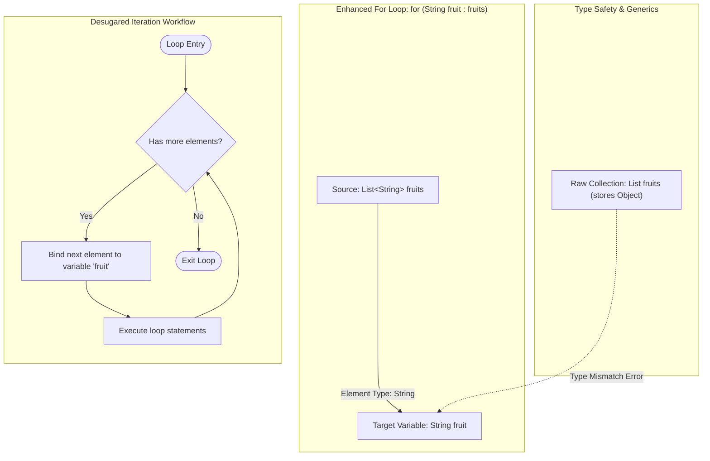

# Collections Framework: Enhanced For Loops, Generics & Iteration Mechanics

---

## Key Takeaways

The enhanced for loop (commonly referred to as the for-each loop) provides a streamlined syntax for sequentially traversing collections and arrays without manually managing index counters or explicit `Iterator` objects. Traversal is declared using the syntax `for (ElementType element : collection)`, which the compiler interprets as "for each element in the collection." To ensure compile-time type safety during enhanced loop traversal, collections must be declared with generic type parameters enclosed in angle brackets (`<T>`); otherwise, elements default to `Object`, triggering type-mismatch compilation errors.



- **Declarative Iteration**: The enhanced for loop eliminates manual pointer tracking, off-by-one errors, and explicit cursor calls by automating element extraction.
- **Generics Requirement**: Collections declared without generic type parameters default to `Object`; binding elements to a concrete type (such as `String`) requires specifying the type within angle brackets (`List<String>`).
- **Universal Collection Support**: Operates uniformly across all collections implementing `Collection` (`List`, `Set`, `Queue`) as well as native Java arrays.
- **Map Traversal Restriction**: Because `Map` does not inherit from `Collection`, it cannot be passed directly to an enhanced for loop; traversal must target derived collection views such as `map.entrySet()` or `map.keySet()`.

---

## Main Discussion

### Idiomatic Java Code Snippets

#### 1. Traversing Generic Collections (`List` and `Set`)

Specifying type arguments via angle brackets allows direct, type-safe iteration:

```java
package collections_traversal;

import java.util.ArrayList;
import java.util.HashSet;
import java.util.List;
import java.util.Set;

public class EnhancedLoopDemo {

    public static void main(String[] args) {
        // Generic List definition using angle brackets <String>
        List<String> fruits = new ArrayList<>();
        fruits.add("apple");
        fruits.add("lemon");
        fruits.add("banana");
        fruits.add("orange");

        System.out.println("--- Iterating over List ---");
        // Enhanced for loop: "for each fruit of type String in fruits"
        for (String fruit : fruits) {
            System.out.println("Fruit: " + fruit);
        }

        // Generic Set definition
        Set<String> fruitSet = new HashSet<>(fruits);

        System.out.println("\n--- Iterating over Set ---");
        // Works identically across all Collection subtypes
        for (String fruit : fruitSet) {
            System.out.println("Set Element: " + fruit);
        }
    }
}
```

#### 2. Resolving Raw Type Mismatches with Generics

Omitting generic parameters forces elements to be treated as `Object`, requiring correction:

```java
package collections_traversal;

import java.util.ArrayList;
import java.util.List;

public class GenericsTypeSafety {

    public static void main(String[] args) {
        // NON-IDIOMATIC (Raw Type):
        // List rawFruits = new ArrayList();
        // rawFruits.add("apple");
        // for (String fruit : rawFruits) { }
        // Compilation Error: incompatible types: java.lang.Object cannot be converted to java.lang.String

        // IDIOMATIC: Explicit generic declaration on left, diamond operator on right
        List<String> parameterizedFruits = new ArrayList<>();
        parameterizedFruits.add("apple");

        for (String fruit : parameterizedFruits) {
            System.out.println("Safely typed element: " + fruit);
        }
    }
}
```

#### 3. Traversing Maps via `entrySet()`

Traversing key-value pairs requires targeting the map's entry set view:

```java
package collections_traversal;

import java.util.HashMap;
import java.util.Map;

public class MapEnhancedLoopDemo {

    public static void main(String[] args) {
        Map<String, Integer> fruitCalories = new HashMap<>();
        fruitCalories.put("apple", 95);
        fruitCalories.put("lemon", 20);
        fruitCalories.put("banana", 105);

        // ILLEGAL: Map does not implement Collection or Iterable
        // for (var entry : fruitCalories) { } // Compilation Error!

        System.out.println("--- Iterating over Map Entries ---");
        // Traversal targeted at entrySet()
        for (Map.Entry<String, Integer> entry : fruitCalories.entrySet()) {
            System.out.println(entry.getKey() + " has " + entry.getValue() + " calories.");
        }
    }
}
```

### Under the Hood / JVM Mechanics

1. **Generic Type Verification at Compile Time:**
   During compilation, javac validates that the declared loop variable type (e.g., String) matches or is a supertype of the generic type argument defined on the target collection (`List<String>`).

2. **Compiler Bytecode Desugaring:**
   The compiler desugars the enhanced for loop on collections into standard iterator bytecode. The source code:
   `for (String fruit : fruits) { ... }`
   is compiled into the bytecode equivalent of:
   `Iterator<String> i = fruits.iterator(); while(i.hasNext()) { String fruit = i.next(); ... }`.

3. **Array Traversal Desugaring:**
   When applied to an array (e.g., String[]), the compiler desugars the loop into an index-based counter loop using an internal temporary index variable, eliminating iterator object allocation overhead.

4. **Map View Adapter Execution:**
   Invoking fruitCalories.entrySet() returns a lightweight set adapter over the map's hash table nodes. The enhanced loop consumes this set's iterator, retrieving each Map.Entry node sequentially.

### Structural Comparisons

#### Loop Styles in Java

| Feature                | Standard `for` Loop                      | `Iterator` with `while` Loop             | Enhanced `for` Loop                  |
| ---------------------- | ---------------------------------------- | ---------------------------------------- | ------------------------------------ |
| **Syntax**             | `for (int i = 0; i < n; i++)`            | `while (it.hasNext())`                   | `for (Type item : collection)`       |
| **Index Access**       | Direct access via counter `i`            | None (cursor-driven)                     | None (element-driven)                |
| **Readability**        | Verbose; requires bounds management      | Moderate; requires manual iterator setup | High; clean and declarative          |
| **Collection Types**   | Indexed structures only (`List`, arrays) | All `Collection` subtypes                | All `Collection` subtypes and arrays |
| **Direct Map Support** | No                                       | No (requires `entrySet().iterator()`)    | No (requires `entrySet()`)           |

### Common Anti-Patterns & Edge Cases

- **Attempting Direct Map Traversal**: Writing `for (var item : map)` causes a compile-time failure: `foreach not applicable to type 'java.util.Map'`. A map is not a collection; you must invoke `.entrySet()` or `.keySet()`.
- **Raw Type Assignment Failure**: Declaring a collection without generics (e.g., `List list = new ArrayList();`) and attempting `for (String s : list)` triggers a compilation error: `incompatible types: Object cannot be converted to String`.
- **Missing Index Tracking**: The enhanced for loop does not track the current numeric index. If algorithmic logic requires tracking the element's position, a standard counted loop (`for (int i = 0; ...)`) or external counter is required.

---

## 3. Knowledge Check & JetBrains-Style Coding Challenges

### Exam / Theory Tips

- **Generics in Angle Brackets**: The data type of elements a collection holds is specified within a pair of angle brackets (`<Type>`) on the declaration side.
- **The Colon Operator**: In an enhanced for loop, the colon (`:`) separates the single-element local variable declaration from the collection or array being iterated.
- **Underlying Mechanism**: On collections, the enhanced for loop is syntactic sugar that compiles down to standard `iterator()`, `hasNext()`, and `next()` calls.

### Question 1: Conceptual / Code Analysis

Consider the following source code:

```java
import java.util.ArrayList;
import java.util.List;

public class TraversalQuiz {
    public static void main(String[] args) {
        List cities = new ArrayList();
        cities.add("Sydney");
        cities.add("Tokyo");

        for (String city : cities) {
            System.out.print(city + " ");
        }
    }
}
```

What is the result when attempting to compile and execute this program?

- [ ] **A** It compiles and prints `Sydney Tokyo `.
- [ ] **B** A compilation error occurs at `for (String city : cities)` because `cities` is declared without generics, causing elements to default to `Object`.
- [ ] **C** Compilation succeeds, but a runtime `ClassCastException` is thrown on the first loop iteration.
- [ ] **D** A compilation error occurs because enhanced for loops cannot be used with `ArrayList`.

<details>
<summary>Correct Answer</summary>

**Correct Answer**: **B**

**Technical Breakdown**:

- **B is correct**: The collection `cities` is declared as a raw type (`List cities = new ArrayList();`) without specifying type arguments in angle brackets. Consequently, the compiler treats all elements inside `cities` as `Object`. In the enhanced for loop header, the variable `city` is declared as `String`. Because Java is statically typed, assigning an expression of type `Object` to a variable of type `String` without an explicit cast is illegal, resulting in a compile-time error: `incompatible types: java.lang.Object cannot be converted to java.lang.String`.
- **A is incorrect**: The code fails at compile time and cannot run.
- **C is incorrect**: Type incompatibility between raw collections and typed enhanced loop variables is caught at compile time, preventing runtime execution.
- **D is incorrect**: Enhanced for loops fully support `ArrayList` when type parameters are declared properly.

</details>

---

### Question 2: Mini Coding Problem / Implementation Challenge

**Task**: Implement an aggregation and audit class named `InventoryAuditor` inside package `collections_traversal`:

1. Method `public static int calculateTotalCalories(Map<String, Integer> calorieMap)`:
   - Uses an enhanced for loop over `calorieMap.entrySet()`.
   - Sums and returns the total calories across all map entries.
2. Method `public static int countWordsExceedingLength(List<String> words, int minLength)`:
   - Uses an enhanced for loop over the generic `List<String>`.
   - Counts and returns how many strings have a character length greater than or equal to `minLength`.
3. Method `public static boolean hasDuplicateItem(List<String> items, String target)`:
   - Uses an enhanced for loop to count occurrences of `target` in `items`.
   - Returns `true` if `target` appears 2 or more times, or `false` otherwise.

**Test Assertions**:

- `Map<String, Integer> map = Map.of("Apple", 95, "Banana", 105, "Lemon", 20);`
  - `calculateTotalCalories(map)` $\rightarrow$ Returns: `220`
- `List<String> list = List.of("watermelon", "pear", "strawberry", "fig");`
  - `countWordsExceedingLength(list, 5)` $\rightarrow$ Returns: `2` ("watermelon", "strawberry")
- `List<String> groceries = List.of("apple", "banana", "apple", "orange");`
  - `hasDuplicateItem(groceries, "apple")` $\rightarrow$ Returns: `true`
  - `hasDuplicateItem(groceries, "banana")` $\rightarrow$ Returns: `false`

<details>
<summary>Solution</summary>

```java
package collections_traversal;

import java.util.List;
import java.util.Map;

public class InventoryAuditor {

    public static int calculateTotalCalories(Map<String, Integer> calorieMap) {
        int total = 0;

        // Enhanced for loop traversing the EntrySet view of the Map
        for (Map.Entry<String, Integer> entry : calorieMap.entrySet()) {
            total += entry.getValue();
        }

        return total;
    }

    public static int countWordsExceedingLength(List<String> words, int minLength) {
        int count = 0;

        // Enhanced for loop traversing a generic List
        for (String word : words) {
            if (word.length() >= minLength) {
                count++;
            }
        }

        return count;
    }

    public static boolean hasDuplicateItem(List<String> items, String target) {
        int occurrences = 0;

        // Enhanced for loop evaluating matching items
        for (String item : items) {
            if (item.equals(target)) {
                occurrences++;
            }
        }

        return occurrences >= 2;
    }
}
```

**Complexity Analysis**:

- **Time Complexity**: $\mathcal{O}(N)$ where $N$ is the number of elements in the collection or map view being traversed. Each element is visited exactly once in sequential order.
- **Space Complexity**: $\mathcal{O}(1)$ auxiliary memory; loop variables reside on the execution stack frame without dynamic heap allocations.

</details>

---
