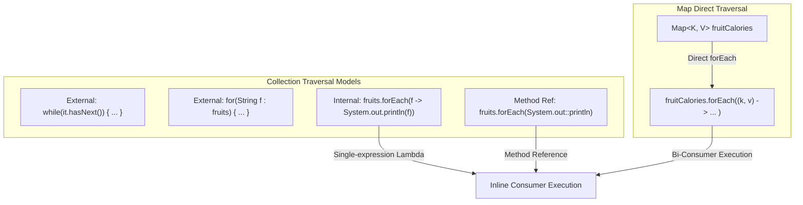

# Functional Iteration: The `forEach()` Method, Lambda Expressions & Method References

---

## Key Takeaways

The `forEach()` method provides an internal, functional traversal model across Java collections and maps, removing the need for external loop syntax (`for`, `while`) or manual iterator state management. Actions applied during iteration are expressed concisely using lambda expressions—anonymous in-line blocks of code taking parameters, an arrow operator (`->`), and an execution body. When a lambda merely passes its argument directly to an existing method, it can be simplified further using a double-colon method reference (`ClassOrObject::methodName`). Crucially, while `Map` does not implement `Collection`, it provides its own specialized `forEach()` method accepting a bi-consumer lambda taking two parameters: key and value.



- **Internal vs. External Iteration**: Unlike external loops where the caller controls cursor advancement, `forEach()` delegates the traversal loop entirely to the underlying collection implementation.
- **Lambda Anatomy**: Formatted as `(parameters) -> expression` for single expressions, or `(parameters) -> { statements; }` for multi-statement blocks requiring curly braces.
- **Method References (`::`)**: A shorthand syntax (`System.out::println`) that replaces boilerplate lambdas where the target method consumes the item directly.
- **Direct `Map.forEach()`**: Unlike `Iterator`and enhanced`for`loops which require views like`entrySet()`, `Map`defines its own direct`forEach()`accepting two arguments:`(k, v) -> ...`.

---

## Main Discussion

### Idiomatic Java Code Snippets

#### 1. Traversing Collections with Lambdas and Method References

Traversing standard `List` or `Set` instances using single-line lambdas, method references, and multi-line lambda blocks:

```java
package functional_traversal;

import java.util.List;

public class CollectionForEachDemo {

    public static void main(String[] args) {
        List<String> fruits = List.of("apple", "lemon", "banana", "orange");

        // 1. Single-expression Lambda with arrow syntax (->)
        System.out.println("--- Single-line Lambda ---");
        fruits.forEach(f -> System.out.println(f));

        // 2. Simplified Method Reference (Class/Object::method)
        System.out.println("\n--- Method Reference ---");
        fruits.forEach(System.out::println);

        // 3. Multi-statement block Lambda enclosed in curly braces
        System.out.println("\n--- Multi-statement Block Lambda ---");
        fruits.forEach(f -> {
            String formatted = "fruit: " + f;
            System.out.println(formatted);
        });
    }
}
```

#### 2. Traversing Maps Directly via Two-Argument Lambdas

Demonstrating direct key-value iteration on `Map` without intermediate `entrySet()` extraction:

```java
package functional_traversal;

import java.util.Map;

public class MapForEachDemo {

    public static void main(String[] args) {
        Map<String, Integer> fruitCalories = Map.of(
                "apple", 95,
                "lemon", 20,
                "banana", 105
        );

        System.out.println("--- Direct Map forEach Iteration ---");
        // Accepts two parameters enclosed in parentheses for key and value
        fruitCalories.forEach((k, v) -> System.out.println(k + ": " + v));
    }
}
```

### Under the Hood / JVM Mechanics

1. **invokedynamic Bootstrapping:**
   When javac compiles a lambda expression, it does not generate an anonymous inner class .class file. Instead, it emits an invokedynamic bytecode instruction referencing LambdaMetafactory.

2. **CallSite Generation at Runtime:**
   Upon the first execution of fruits.forEach(...), the JVM dynamically links a CallSite that produces an optimized instance implementing the required functional interface (Consumer for collections, BiConsumer for maps).

3. **Internal Traversal Invocation:**
   The collection's internal forEach() implementation runs a tight internal loop over its array or node chain, invoking the functional interface's method directly on each element.

4. **Method Reference Resolution:**
   Method references like System.out::println resolve the target receiver (System.out) and bind the instance method directly, skipping redundant lambda parameter wrappers.

### Structural Comparisons

#### Iteration Paradigms Across Collections and Maps

| Traversal Paradigm | Syntax Style                                  | Mechanism          | Works Directly on `Map`?               | Requires External Loop? |
| ------------------ | --------------------------------------------- | ------------------ | -------------------------------------- | ----------------------- |
| **`Iterator`**     | `while (it.hasNext()) { var x = it.next(); }` | External cursor    | No (requires `entrySet().iterator()`)  | Yes                     |
| **Enhanced `for`** | `for (Type x : collection) { ... }`           | Compiler-desugared | No (requires `map.entrySet()`)         | Yes                     |
| **`forEach()`**    | `collection.forEach(x -> ...)`                | Internal dispatch  | **Yes** (`map.forEach((k, v) -> ...)`) | **No**                  |

#### Single-Line vs. Block vs. Method Reference

| Construct                    | Syntax Pattern               | When to Use                                      | Example                                                    |
| ---------------------------- | ---------------------------- | ------------------------------------------------ | ---------------------------------------------------------- |
| **Single-Expression Lambda** | `param -> action`            | One statement or expression                      | `f -> System.out.println(f)`                               |
| **Block Lambda**             | `param -> { stmt1; stmt2; }` | Multiple lines of logic required                 | `f -> { String x = "Item: " + f; System.out.println(x); }` |
| **Method Reference**         | `Target::method`             | Direct parameter pass-through to existing method | `System.out::println`                                      |

### Common Anti-Patterns & Edge Cases

- **Missing Parentheses Around Multiple Lambda Parameters**: In a Map's `forEach()`, omitting parentheses for two arguments (e.g., `k, v -> System.out.println(k)`) causes a compile-time syntax error. Multiple arguments require enclosing parentheses: `(k, v) -> ...`.
- **Omitting Semicolons in Block Lambdas**: When using curly braces `{ ... }`, every enclosed statement must terminate with a semicolon, just like regular Java code blocks.
- **Assuming Method References Work with Arbitrary Transformations**: Writing `System.out::println("fruit: " + f)` is illegal syntax. Method references take only the class/object and the method name (`System.out::println`). If arguments must be modified or prepended, use a standard lambda expression instead.

---

## Knowledge Check & JetBrains-Style Coding Challenges

### Theory Tips

- **Internal Loop Nature**: `forEach()` eliminates manual loops entirely; the method accepts the action directly and iterates internally.
- **Arrow Operator**: The lambda expression operator is formed by a hyphen followed by a greater-than sign (`->`).
- **Map vs. Collection Signatures**: Collections accept a single-parameter lambda (`e -> ...`), while maps accept a two-parameter lambda `(k, v) -> ...` directly on the map reference.

### Question 1: Conceptual / Code Analysis

Consider the following two snippets iterating over a `Map<String, Integer>` named `scores`:

```java
// Snippet 1
scores.forEach((player, score) -> System.out.println(player + "=" + score));

// Snippet 2
for (var entry : scores) {
    System.out.println(entry.getKey() + "=" + entry.getValue());
}
```

What occurs when compiling both snippets?

- [ ] **A** Both snippets compile and execute successfully.
- [ ] **B** Snippet 1 fails to compile because `Map` does not have a `forEach` method.
- [ ] **C** Snippet 2 fails to compile because `Map` does not directly implement `Iterable` for enhanced `for` loops.
- [ ] **D** Both snippets fail to compile due to missing explicit type parameters in the lambdas and loops.

<details>
<summary>Correct Answer</summary>

**Correct Answer**: **C**

**Technical Breakdown**:

- **C is correct**: `Map` does not implement `Iterable` or `Collection`, meaning it cannot be passed directly into an enhanced `for` loop (Snippet 2 causes a compile-time failure: `foreach not applicable to type 'java.util.Map'`). Conversely, the `Map` interface declares its own `forEach(BiConsumer)` default method, making Snippet 1 completely valid Java syntax.
- **A is incorrect**: Snippet 2 cannot compile without using `scores.entrySet()`.
- **B is incorrect**: `Map` provides a dedicated `forEach` method accepting two arguments.
- **D is incorrect**: Java infers lambda and `var` types automatically.

</details>

---

### Question 2: Mini Coding Problem / Implementation Challenge

**Task**: Implement a logging and report utility class named `BatchProcessor` inside package `functional_traversal`:

1. Method `public static void printNumberedList(List<String> items)`:
   - Uses an enhanced `for` loop or `forEach()` with external state to print each item preceded by its 1-based index in the format: `"[index]. [item]"`.
2. Method `public static void auditMapEntries(Map<String, Integer> metrics)`:
   - Uses `metrics.forEach(...)` with a multi-statement block lambda enclosed in curly braces.
   - For each key-value pair, constructs an audit string in the format `"METRIC: [key] | VALUE: [value]"` and prints it via `System.out.println`.
3. Method `public static void printUppercaseItems(List<String> items)`:
   - Uses `items.forEach(...)` with a single-line lambda expression converting each string to uppercase (`item.toUpperCase()`) and printing it.

**Test Assertions**:

- `List.of("alpha", "beta")` passed to `printUppercaseItems`:
  - Prints `"ALPHA"` then `"BETA"`.
- `Map.of("CPU", 80, "RAM", 60)` passed to `auditMapEntries`:
  - Prints `"METRIC: CPU | VALUE: 80"` and `"METRIC: RAM | VALUE: 60"`.

<details>
<summary>Solution</summary>

```java
package functional_traversal;

import java.util.List;
import java.util.Map;

public class BatchProcessor {

    public static void printNumberedList(List<String> items) {
        int[] counter = {1};
        // forEach utilizing an effectively final array reference for numbering
        items.forEach(item -> {
            System.out.println(counter[0] + ". " + item);
            counter[0]++;
        });
    }

    public static void auditMapEntries(Map<String, Integer> metrics) {
        // Direct Map.forEach using a two-argument block lambda
        metrics.forEach((key, value) -> {
            String auditLog = "METRIC: " + key + " | VALUE: " + value;
            System.out.println(auditLog);
        });
    }

    public static void printUppercaseItems(List<String> items) {
        // Single-expression lambda performing in-line method call
        items.forEach(item -> System.out.println(item.toUpperCase()));
    }
}
```

**Complexity Analysis**:

- **Time Complexity**: $\mathcal{O}(N)$ where $N$ is the number of elements in the collection or map. The `forEach()` method performs a single sequential pass across all entries.
- **Space Complexity**: $\mathcal{O}(1)$ auxiliary space; lambda execution operates on the invocation stack without accumulating intermediate collections.

</details>

---
