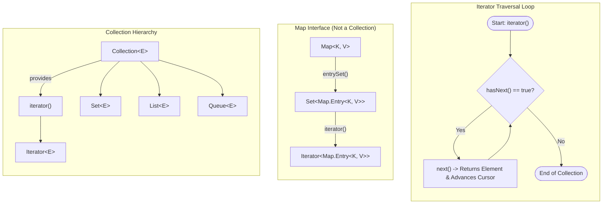

# Collections Framework: The `Iterator` Pattern, Traversal Mechanics & Map Iteration

---

## Key Takeaways

An `Iterator` is an object that provides a standardized traversal interface to sequentially iterate through the elements of a collection without exposing its underlying internal structure. The root `java.util.Collection` interface defines the `iterator()` factory method, making an iterator available across all core collections (such as `Set`, `List`, and `Queue`). Iteration is driven by two primary methods: `hasNext()`, which checks if additional elements remain in the sequence, and `next()`, which returns the next element and advances the cursor. Because `Map` does not extend `Collection`, it does not provide an `iterator()` method directly; developers instead obtain an iterator from its collection views, such as `entrySet()` or `keySet()`.



- **Standardized Traversal**: `Iterator` enables sequential traversal over collections that do not support index-based retrieval (such as `HashSet`).
- **Core Traversal Protocol**: Traversal uses a `while (iterator.hasNext())` loop where `iterator.next()` returns the current element and advances the internal traversal pointer.
- **Universal Collection Availability**: The `iterator()` method is inherited by all subtypes of `Collection`, ensuring consistent iteration across lists, sets, and queues.
- **Map Traversal Pattern**: Because `Map` does not implement `Collection`, calling `map.iterator()` causes a compile-time failure. Traversal requires calling `iterator()` on a derived collection view, such as `map.entrySet().iterator()` or `map.keySet().iterator()`.

---

## Main Discussion / Deep Dive

### Idiomatic Java Code Snippets

#### 1. Traversing Non-Indexed Collections (`Set`) with an Iterator

Because sets lack index-based accessors like `get(int index)`, an `Iterator` provides the standard mechanism to visit every element:

```java
package collections_traversal;

import java.util.HashSet;
import java.util.Iterator;
import java.util.Set;

public class SetIteratorDemo {

    public static void main(String[] args) {
        Set<String> fruits = new HashSet<>();
        fruits.add("apple");
        fruits.add("banana");
        fruits.add("lemon");
        fruits.add("orange");

        // Obtain an iterator from the Collection interface factory method
        Iterator<String> iterator = fruits.iterator();

        System.out.println("--- Iterating through Set elements ---");
        // Loop while more items remain to be processed
        while (iterator.hasNext()) {
            // Retrieve next element and advance the cursor
            String fruit = iterator.next();
            System.out.println("Processing fruit: " + fruit);
        }
    }
}
```

#### 2. Traversing Maps via `entrySet()` Iterators

Maps are traversed by obtaining an iterator from the set returned by `entrySet()`:

```java
package collections_traversal;

import java.util.HashMap;
import java.util.Iterator;
import java.util.Map;

public class MapIteratorDemo {

    public static void main(String[] args) {
        Map<String, Integer> fruitCalories = new HashMap<>();
        fruitCalories.put("apple", 95);
        fruitCalories.put("banana", 105);
        fruitCalories.put("lemon", 20);

        // Map does NOT have .iterator() directly:
        // Iterator it = fruitCalories.iterator(); // Compilation Error!

        // Obtain an iterator from the Set view returned by entrySet()
        Iterator<Map.Entry<String, Integer>> entryIterator = fruitCalories.entrySet().iterator();

        System.out.println("--- Iterating through Map Entries ---");
        while (entryIterator.hasNext()) {
            Map.Entry<String, Integer> entry = entryIterator.next();
            System.out.println("Fruit: " + entry.getKey() + " | Calories: " + entry.getValue());
        }
    }
}
```

### Under the Hood / JVM Mechanics

1. **Iterator Instantiation:**
   Calling collection.iterator() allocates a lightweight iterator object on the heap. This object captures a reference to the backing data structure and initializes an internal cursor position (typically starting before index 0 or at the first hash bucket node).

2. **hasNext() Bounds Inspection:**
   The hasNext() method checks whether the current cursor position has reached the end of the collection's internal storage without modifying the cursor.

3. **next() Cursor Advancement:**
   When next() executes, the iterator fetches the element reference at the current cursor position, advances the cursor forward to the next valid element, and returns the reference. If called when hasNext() is false, it throws a runtime NoSuchElementException.

4. **Map View Delegation:**
   Calling map.entrySet() creates a lightweight Set view backed directly by the map's hash table. Calling .iterator() on that view delegates traversal across the map's internal entry nodes.

### Structural Comparisons

#### `Iterator` Methods

| Method Signature | Return Type | Purpose                                   | Side Effect on Cursor                            |
| ---------------- | ----------- | ----------------------------------------- | ------------------------------------------------ |
| `hasNext()`      | `boolean`   | Checks if more elements exist to traverse | None (read-only check)                           |
| `next()`         | `E`         | Returns next element in sequence          | Advances internal cursor forward by one position |

#### Collection Traversal Capabilities

| Data Structure / Interface | Directly Implements `Collection`? | Has Direct `iterator()` Method? | Primary Traversal Technique                              |
| -------------------------- | --------------------------------- | ------------------------------- | -------------------------------------------------------- |
| **`List`**                 | **Yes**                           | **Yes**                         | `list.iterator()` or positional `get(i)`                 |
| **`Set`**                  | **Yes**                           | **Yes**                         | `set.iterator()`                                         |
| **`Queue`**                | **Yes**                           | **Yes**                         | `queue.iterator()` or `remove()` / `poll()`              |
| **`Map`**                  | **No**                            | **No**                          | `map.entrySet().iterator()` or `map.keySet().iterator()` |

### Common Anti-Patterns & Edge Cases

- **Directly Calling `iterator()` on a Map**: Writing `fruitCalories.iterator()` causes an immediate compilation failure: `cannot find symbol method iterator()`. You must call `iterator()` on `map.entrySet()` or `map.keySet()`.
- **Multiple `next()` Calls in a Single Loop**: Calling `iterator.next()` multiple times inside a single `while (iterator.hasNext())` iteration advances the cursor multiple times per check. If the collection contains an odd number of items, the second call can run past the end of the collection and throw a `NoSuchElementException`.
- **Calling `next()` Without `hasNext()`**: Invoking `next()`after the iterator has reached the end of the collection throws a runtime`NoSuchElementException`. Always guard `next()`calls with`hasNext()`.

---

## Knowledge Check & JetBrains-Style Coding Challenges

### Theory Tips

- **Root Origin of `iterator()`**: The `iterator()`method is declared directly on the root`java.util.Collection` interface; all collection subtypes inherit it automatically.
- **Why Map Lacks `iterator()`**: `Map`is an associative key-value mapping and does **not** inherit from`Collection`, so it lacks a direct `iterator()` method.
- **Dual Action of `next()`**: Calling `next()` performs two distinct actions: it returns the element at the current position and advances the cursor forward.

### Question 1: Conceptual / Code Analysis

Consider the following code snippet:

```java
import java.util.HashMap;
import java.util.Iterator;
import java.util.Map;

public class TraversalTest {
    public static void main(String[] args) {
        Map<String, String> capitals = new HashMap<>();
        capitals.put("Japan", "Tokyo");
        capitals.put("France", "Paris");

        Iterator<String> iterator = capitals.keySet().iterator();
        while (iterator.hasNext()) {
            System.out.print(iterator.next() + " ");
            System.out.print(iterator.next() + " ");
        }
    }
}
```

Now assume a third entry is added: `capitals.put("Italy", "Rome");`. What is the result when executing this modified program?

- [ ] **A** It prints all three countries and finishes cleanly.
- [ ] **B** A compilation error occurs because `keySet()` returns a set of keys, not country names.
- [ ] **C** It prints two countries, then crashes at runtime with a `NoSuchElementException`.
- [ ] **D** It enters an infinite loop printing the third country repeatedly.

<details>
<summary>Correct Answer</summary>

**Correct Answer**: **C**

**Technical Breakdown**:

- **C is correct**: With three elements in `capitals`, `keySet()` contains 3 keys. During the first iteration of the `while` loop, `iterator.hasNext()` returns `true`. The first `iterator.next()` prints the first key (1 consumed, 2 remaining), and the second `iterator.next()` prints the second key (2 consumed, 1 remaining). The loop condition `iterator.hasNext()` runs again and returns `true` because 1 element remains. Inside the loop, the first `iterator.next()` prints the third key (3 consumed, 0 remaining). The second `iterator.next()` executes unconditionally without an intervening `hasNext()` check. Because no elements remain, the iterator throws a runtime `NoSuchElementException`.
- **A is incorrect**: The loop consumes two items per iteration, leading to an index overflow on an odd number of items.
- **B is incorrect**: `keySet()` returns a `Set<String>`, which inherits `iterator()` and yields `String` keys without compilation errors.
- **D is incorrect**: Iterators throw `NoSuchElementException` when depleted; they do not loop infinitely on valid calls.

</details>

---

### Question 2: Mini Coding Problem / Implementation Challenge

**Task**: Implement an inventory audit service named `InventoryAuditor` inside package `collections_traversal`:

1. Implement method `public static int countLowStockItems(Map<String, Integer> inventory, int threshold)`:
   - Uses an `Iterator` over the map's `entrySet()`.
   - Iterates through the entries using a `while` loop with `hasNext()` and `next()`.
   - Counts and returns the total number of items whose stock value is strictly less than `threshold`.
2. Implement method `public static String findFirstMatchingTag(Set<String> tags, String prefix)`:
   - Uses an `Iterator` obtained from `tags.iterator()`.
   - Traverses elements using `hasNext()` and `next()`.
   - Returns the first tag found that starts with `prefix` (using `.startsWith(prefix)`).
   - If no tag matches after the iterator finishes, returns `null`.

**Test Assertions**:

- Inventory: `{"Apples": 5, "Bananas": 15, "Oranges": 2}`
  - `countLowStockItems(inventory, 10)` $\rightarrow$ Returns: `2` (Apples and Oranges)
- Tags: `{"java-17", "spring-boot", "junit-5"}`
  - `findFirstMatchingTag(tags, "spring")` $\rightarrow$ Returns: `"spring-boot"`
  - `findFirstMatchingTag(tags, "docker")` $\rightarrow$ Returns: `null`

<details>
<summary>Solution</summary>

```java
package collections_traversal;

import java.util.Iterator;
import java.util.Map;
import java.util.Set;

public class InventoryAuditor {

    public static int countLowStockItems(Map<String, Integer> inventory, int threshold) {
        int lowStockCount = 0;

        // Obtain an iterator via entrySet()
        Iterator<Map.Entry<String, Integer>> iterator = inventory.entrySet().iterator();

        // Iterate through entries using hasNext() and next()
        while (iterator.hasNext()) {
            Map.Entry<String, Integer> entry = iterator.next();
            if (entry.getValue() < threshold) {
                lowStockCount++;
            }
        }

        return lowStockCount;
    }

    public static String findFirstMatchingTag(Set<String> tags, String prefix) {
        // Obtain an iterator from the Set collection
        Iterator<String> iterator = tags.iterator();

        while (iterator.hasNext()) {
            String tag = iterator.next();
            if (tag.startsWith(prefix)) {
                return tag;
            }
        }

        return null;
    }
}
```

**Complexity Analysis**:

- **Time Complexity**: $\mathcal{O}(N)$ where $N$ is the number of entries in the inventory map or set of tags. The iterator visits each node in the collection once.
- **Space Complexity**: $\mathcal{O}(1)$ auxiliary space beyond the lightweight `Iterator` reference allocated on the call stack.

</details>

---
