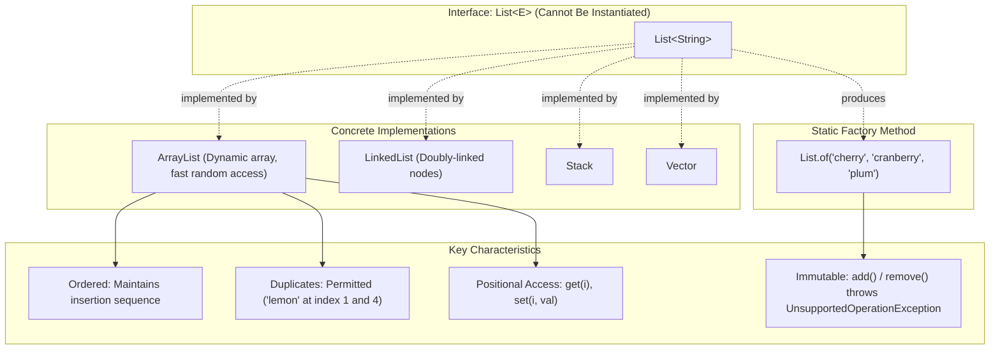

# Collections Framework: The `List` Interface, Positional Indexing & Sequence Mechanics

---

## Key Takeaways

A `List` is an ordered, sequence-based collection (also called a sequence) that allows precise control over where each element is inserted and accessed. Unlike a `Set`, a `List` preserves insertion order, allows duplicate elements, and exposes positional index-based operations (`get`, `set`, `remove`, `indexOf`, `lastIndexOf`) using zero-based indexing. As an interface, `List` cannot be directly instantiated and requires concrete implementations such as `ArrayList`, `LinkedList`, `Stack`, or `Vector`, or unmodifiable instances created via the static factory method `List.of(...)`.



- **Ordered & Index-Based**: Elements are stored in a predictable sequence; each element occupies a zero-based index (`0` to `size() - 1`) and can be retrieved using `get(index)`.
- **Duplicates Allowed**: A `List` permits multiple occurrences of identical elements; methods like `indexOf(obj)` and `lastIndexOf(obj)` return the first and last matching positions, respectively.
- **Element Replacement**: The `set(index, element)` method replaces an existing element at the specified position without shifting other elements or altering list size.
- **Overloaded `remove` Methods**: Calling `remove(int index)` deletes the element at that index, while `remove(Object o)` removes the **first found instance** of the specified object.
- **Immutable Lists (`List.of`)**: Creates a pre-populated, unmodifiable list; calling mutating methods like `add()` or `remove()` throws an `UnsupportedOperationException` at runtime.

---

## Main Discussion

### Idiomatic Java Code Snippets

#### 1. Mutable List Operations Using `ArrayList`

`ArrayList` provides a resizable, index-accessible list implementation:

```java
package collections_demo;

import java.util.ArrayList;
import java.util.List;

public class MutableListDemo {

    public static void main(String[] args) {
        // Polymorphic declaration: Interface type holding concrete ArrayList instance
        List<String> fruits = new ArrayList<>();

        // 1. Adding elements in sequential order
        fruits.add("apple");   // Index 0
        fruits.add("lemon");   // Index 1
        fruits.add("banana");  // Index 2
        fruits.add("orange");  // Index 3

        // Prints in the exact insertion order: [apple, lemon, banana, orange]
        System.out.println("Initial fruits list: " + fruits);

        // 2. Positional access using get(index)
        String fruitAtIndex2 = fruits.get(2);
        System.out.println("Fruit at index 2: " + fruitAtIndex2); // Prints: banana

        // 3. Replacing an element using set(index, newElement)
        fruits.set(2, "grape");
        System.out.println("After replacing index 2 with grape: " + fruits);

        // 4. Duplicate handling
        fruits.add("lemon"); // Appends second lemon at index 4
        System.out.println("After adding duplicate lemon: " + fruits);

        // 5. Querying indices of duplicates
        int firstLemonIndex = fruits.indexOf("lemon");
        int lastLemonIndex = fruits.lastIndexOf("lemon");
        System.out.println("Index of first lemon: " + firstLemonIndex); // Prints: 1
        System.out.println("Index of last lemon: " + lastLemonIndex);   // Prints: 4

        // 6. Overloaded remove: by index vs. by object
        // Remove by index removes the element at position 4 (the last lemon)
        fruits.remove(4);
        System.out.println("After removing index 4: " + fruits);

        // Remove by object removes only the first matching instance (index 1)
        fruits.remove("lemon");
        System.out.println("After removing object 'lemon': " + fruits);
    }
}
```

#### 2. Immutable Lists via `List.of`

Static factory method creating an unmodifiable sequence:

```java
package collections_demo;

import java.util.List;

public class ImmutableListDemo {

    public static void main(String[] args) {
        // Creates an immutable list containing three items
        List<String> moreFruit = List.of("cherry", "cranberry", "plum");
        System.out.println("Immutable list: " + moreFruit);

        // Access via get() works as expected
        System.out.println("First element: " + moreFruit.get(0));

        // Mutating operations fail at runtime with UnsupportedOperationException
        try {
            moreFruit.add("peach");
        } catch (UnsupportedOperationException e) {
            System.out.println("Cannot add elements to an immutable List.");
        }

        try {
            moreFruit.remove(0);
        } catch (UnsupportedOperationException e) {
            System.out.println("Cannot remove elements from an immutable List.");
        }
    }
}
```

### Under the Hood / JVM Mechanics

1. **Internal Storage & Dynamic Resizing:**
   An ArrayList is backed by an internal Object[] array. When elements are appended via add(element), they are placed at the current trailing index. When capacity is exceeded, the JVM allocates a larger array on the heap and copies existing references.

2. **Fast Positional Access:**
   Invoking get(int index) performs constant-time $\mathcal{O}(1)$ random access, retrieving the reference pointer directly from the underlying array offset.

3. **Element Replacement via set(index, element):**
   Calling set(index, element) directly updates the pointer at the target index in the backing array, returning the displaced element without shifting adjacent elements.

4. **Overload Resolution for remove():**
   The compiler differentiates remove(int) and remove(Object) by argument type. Removing by index shifts subsequent elements left by one position. Removing by object traverses the array from index 0, invokes equals(), and stops after deleting the first matching element found.

### Structural Comparisons

#### `List` vs. `Set`

| Feature                 | `List`                                      | `Set`                                                   |
| ----------------------- | ------------------------------------------- | ------------------------------------------------------- |
| **Ordering**            | **Ordered** (Preserves insertion sequence)  | **Unordered** (No guaranteed sequence in standard sets) |
| **Duplicates**          | **Allowed** (Can contain duplicates)        | **Disallowed** (Duplicates silently ignored)            |
| **Positional Indexing** | Supported (`get(index)`, `set(index, val)`) | Not supported (no index-based access)                   |
| **Duplicate Queries**   | Supported (`indexOf`, `lastIndexOf`)        | Not applicable (elements are unique)                    |
| **Immutable Factory**   | `List.of(...)`                              | `Set.of(...)`                                           |

#### Key `List` Positional Methods

| Method Signature            | Return Type | Functional Behavior                                                  |
| --------------------------- | ----------- | -------------------------------------------------------------------- |
| `get(int index)`            | `E`         | Returns element at the specified zero-based index                    |
| `set(int index, E element)` | `E`         | Replaces the element at specified index with the new element         |
| `indexOf(Object o)`         | `int`       | Returns the index of the **first** occurrence of the object, or `-1` |
| `lastIndexOf(Object o)`     | `int`       | Returns the index of the **last** occurrence of the object, or `-1`  |
| `remove(int index)`         | `E`         | Removes and returns the element at the specified index               |
| `remove(Object o)`          | `boolean`   | Removes the **first found instance** of the matching object          |

### Common Anti-Patterns & Edge Cases

- **Ambiguity with Overloaded `remove()` on Integer Lists**: When working with `List<Integer>`, calling `list.remove(2)` defaults to `remove(int index)`, removing the element at index 2 rather than the number `2`. To remove by object, the value must be explicitly boxed: `list.remove(Integer.valueOf(2))`.
- **Assuming `remove(Object)` Deletes All Occurrences**: Calling `fruits.remove("lemon")` on a list containing multiple lemons removes only the _first_ occurrence. Remaining duplicates stay in the list.
- **Mutating `List.of` Instances**: Calling `.add()`, `.set()`, or `.remove()` on a list instantiated via `List.of(...)` compiles without warning, but throws an `UnsupportedOperationException` at runtime.
- **Index Out of Bounds**: Calling `get(index)` or `set(index, val)` with an index outside `0` to `size() - 1` results in an `IndexOutOfBoundsException`.

---

## Knowledge Check & JetBrains-Style Coding Challenges

### Exam / Theory Tips

- **Core Implementations**: Standard implementations of the `List` interface discussed in Java include `ArrayList`, `LinkedList`, `Stack`, and `Vector`.
- **Zero-Based Indexing**: List indices begin at `0`. The last element is located at `list.size() - 1`.
- **First Match Removal**: `remove(Object)` only removes the first occurrence of the specified object in the list.

### Question 1: Conceptual / Code Analysis

Consider the following code snippet:

```java
import java.util.ArrayList;
import java.util.List;

public class ListBehaviorTest {
    public static void main(String[] args) {
        List<String> items = new ArrayList<>();
        items.add("A");
        items.add("B");
        items.add("A");
        items.add("C");

        items.set(1, "A");
        items.remove("A");

        System.out.println(items.indexOf("A") + " " + items.lastIndexOf("A"));
    }
}
```

What is printed to the console?

- [ ] **A** `0 1`
- [ ] **B** `1 2`
- [ ] **C** `0 2`
- [ ] **D** `-1 -1`

<details>
<summary>Correct Answer</summary>

**Correct Answer**: **A**

**Technical Breakdown**:

- **A is correct**: Step-by-step state tracing:

1. `items` starts as `["A", "B", "A", "C"]`.
2. `items.set(1, "A")` replaces index 1 (`"B"`) with `"A"`, resulting in `["A", "A", "A", "C"]`.
3. `items.remove("A")` invokes `remove(Object)`. Because list removal by object deletes only the **first found occurrence**, index 0 is removed. The remaining elements shift left, resulting in `["A", "A", "C"]`.
4. Now `"A"` exists at index 0 and index 1.
5. `items.indexOf("A")` returns the first occurrence (`0`), and `items.lastIndexOf("A")` returns the last occurrence (`1`). The program prints `0 1`.

- **B is incorrect**: It assumes no elements shifted after removing index 0.
- **C is incorrect**: It assumes `remove("A")` did not delete the first occurrence.
- **D is incorrect**: Elements remain in the list, so indices cannot be `-1`.

</details>

---

### Question 2: Mini Coding Problem / Implementation Challenge

**Task**: Implement a shopping cart manager named `CartManager` inside package `collections_demo`:

1. Maintain an internal `List<String>` initialized as an `ArrayList<String>`.
2. Implement method `public void addItem(String item)`: appends an item to the cart.
3. Implement method `public boolean replaceItem(int index, String newItem)`: replaces the item at `index` with `newItem` if `index` is valid (within `0` to `size() - 1`) and returns `true`; otherwise returns `false`.
4. Implement method `public boolean removeFirstOccurrence(String item)`: removes the first instance of `item` using object removal and returns `true` if found and removed, or `false` otherwise.
5. Implement method `public boolean removeLastOccurrence(String item)`: finds the last occurrence of `item` using `lastIndexOf(item)` and, if found, removes it by index and returns `true`; otherwise returns `false`.
6. Implement method `public List<String> getItems()`: returns the current internal list.

**Test Assertions**:

- `CartManager cart = new CartManager();`
- `cart.addItem("milk"); cart.addItem("bread"); cart.addItem("milk");` $\rightarrow$ list is `["milk", "bread", "milk"]`
- `cart.replaceItem(1, "eggs")` $\rightarrow$ Returns `true`, list becomes `["milk", "eggs", "milk"]`
- `cart.replaceItem(5, "butter")` $\rightarrow$ Returns `false`
- `cart.removeLastOccurrence("milk")` $\rightarrow$ Returns `true`, list becomes `["milk", "eggs"]`
- `cart.removeFirstOccurrence("milk")` $\rightarrow$ Returns `true`, list becomes `["eggs"]`

<details>
<summary>Solution</summary>

```java
package collections_demo;

import java.util.ArrayList;
import java.util.List;

public class CartManager {

    private final List<String> items = new ArrayList<>();

    public void addItem(String item) {
        items.add(item);
    }

    public boolean replaceItem(int index, String newItem) {
        if (index >= 0 && index < items.size()) {
            items.set(index, newItem);
            return true;
        }
        return false;
    }

    public boolean removeFirstOccurrence(String item) {
        // remove(Object) deletes the first matching instance found
        return items.remove(item);
    }

    public boolean removeLastOccurrence(String item) {
        int lastIndex = items.lastIndexOf(item);
        if (lastIndex != -1) {
            // Overloaded remove(int) deletes the element at that index
            items.remove(lastIndex);
            return true;
        }
        return false;
    }

    public List<String> getItems() {
        return items;
    }
}
```

**Complexity Analysis**:

- **Time Complexity**:
- `addItem`: Amortized $\mathcal{O}(1)$ insertion.
- `replaceItem`: $\mathcal{O}(1)$ random access replacement.
- `removeFirstOccurrence`: $\mathcal{O}(N)$ due to linear search and shifting remaining elements left.
- `removeLastOccurrence`: $\mathcal{O}(N)$ to scan backward from the end and shift remaining elements.

- **Space Complexity**: $\mathcal{O}(N)$ where $N$ is the number of elements stored in the backing dynamic array.

</details>

---
