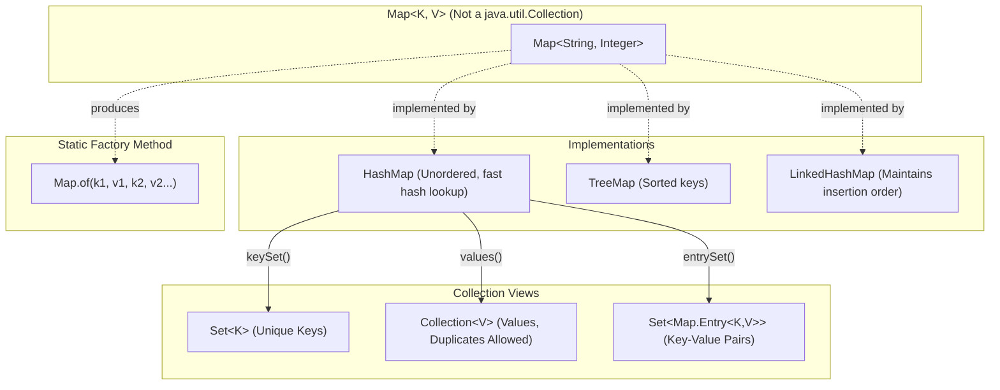

# Collections Framework: The `Map` Interface, Key-Value Associations & Mutation Mechanics

---

## Key Takeaways

The `Map` interface models an association of unique keys mapped to specific values. Although an integral part of the Java Collections Framework, `Map` does not inherit from the root `java.util.Collection` interface, meaning it lacks conventional collection methods like `add()`. Map entries are unordered in standard implementations such as `HashMap`, enforce unique keys while permitting duplicate values, and provide dedicated insertion, update, and lookup APIs (`put`, `putIfAbsent`, `replace`, `get`, `remove`). Read views can be projected out of a map into true collections via `keySet()`, `values()`, and `entrySet()`.



- **Framework Hierarchy**: `Map` is part of the Collections Framework, but it does **not** inherit from the `Collection` interface; it uses `put(key, value)` rather than `add(element)`.
- **Key Uniqueness & Value Duplication**: Keys must be unique; inserting a duplicate key via `put()` silently overwrites the previous value. Values do not need to be unique.
- **Conditional Mutation**: `putIfAbsent(key, value)` stores the entry only if the key is not already mapped, preventing unintended overwrites. `replace(key, value)` updates a mapping only if the key already exists.
- **Key-Based Access & Removal**: Methods like `get(key)` and `remove(key)` operate on the key rather than positional indices.
- **Collection View Projections**: A map projects its internal contents into true collections via `keySet()` (a `Set` of keys), `values()` (a `Collection` of values), and `entrySet()` (a `Set` of key-value pairs).

---

## Main Discussion

### Idiomatic Java Code Snippets

#### 1. Mutable Key-Value Operations Using `HashMap`

A `HashMap` stores key-value pairs, allows dynamic updates, and supports conditional mutations:

```java
package collections_demo;

import java.util.Collection;
import java.util.HashMap;
import java.util.Map;
import java.util.Set;

public class MutableMapDemo {

    public static void main(String[] args) {
        // Polymorphic declaration: Map interface holding a concrete HashMap instance
        Map<String, Integer> fruitCalories = new HashMap<>();

        // 1. Ingesting entries using put(key, value)
        fruitCalories.put("apple", 95);
        fruitCalories.put("lemon", 20);
        fruitCalories.put("banana", 105);
        fruitCalories.put("orange", 62);

        // Standard HashMap entries are unordered
        System.out.println("Initial map entries: " + fruitCalories);

        // 2. Overwriting an existing mapping via put()
        // Using an existing key overrides the current value
        fruitCalories.put("lemon", 17);
        System.out.println("After updating lemon: " + fruitCalories.get("lemon")); // Prints: 17

        // 3. Conditional insertion with putIfAbsent()
        // Lemon already exists, so this operation leaves the existing value intact
        fruitCalories.putIfAbsent("lemon", 25);
        System.out.println("After putIfAbsent (lemon): " + fruitCalories.get("lemon")); // Prints: 17

        // 4. Conditional update with replace()
        // Updates value only if the key already exists
        fruitCalories.replace("banana", 110);
        fruitCalories.replace("grape", 70); // "grape" is absent, so nothing is added
        System.out.println("Map after replace attempts: " + fruitCalories);

        // 5. Querying existence via containsKey() and containsValue()
        System.out.println("Contains key 'banana'? " + fruitCalories.containsKey("banana")); // true
        System.out.println("Contains value 95? " + fruitCalories.containsValue(95));         // true

        // 6. Removing an entry by its key
        fruitCalories.remove("orange");
        System.out.println("After removing orange: " + fruitCalories);

        // 7. Extracting Collection views
        Set<String> keys = fruitCalories.keySet();
        Collection<Integer> values = fruitCalories.values();
        System.out.println("Keys Set: " + keys);
        System.out.println("Values Collection: " + values);
    }
}
```

#### 2. Immutable Maps via `Map.of`

`Map.of` constructs an unmodifiable map of key-value pairs inline:

```java
package collections_demo;

import java.util.Map;

public class ImmutableMapDemo {

    public static void main(String[] args) {
        // Creating an immutable map with key-value pairs
        Map<String, Integer> fruitInventory = Map.of(
                "apple", 50,
                "lemon", 20,
                "banana", 35
        );

        System.out.println("Immutable Map: " + fruitInventory);

        // Mutating operations fail at runtime
        try {
            fruitInventory.put("cherry", 15);
        } catch (UnsupportedOperationException e) {
            System.out.println("Cannot add entries to an immutable Map.");
        }
    }
}
```

### Under the Hood / JVM Mechanics

1. **Hash Calculation & Bucket Indexing:**
   When put(key, value) is called, the JVM invokes the key's hashCode() method and routes the entry to an internal table bucket index.

2. **Duplicate Key Detection & Overwrite:**
   The map inspects existing entries inside the bucket. If an entry has an identical key (validated via equals()), the old value pointer is replaced with the new value pointer and the old value is returned. If no key matches, a new entry node is appended.

3. **Conditional Guard Checks:**
   For putIfAbsent(), if the key is located in the bucket and maps to a non-null value, the operation exits immediately without reassigning the value pointer. For replace(), the bucket is scanned: if the key does not exist, the method exits without modifying the map.

4. **Collection View Projection:**
   Calling keySet(), values(), or entrySet() returns lightweight view adapters backed directly by the map's internal data structures rather than allocating a separate copy of the data.

### Structural Comparisons

#### `put()` vs. `putIfAbsent()` vs. `replace()`

| Method                      | Behavior if Key Exists          | Behavior if Key is Absent  | Typical Use Case                        |
| --------------------------- | ------------------------------- | -------------------------- | --------------------------------------- |
| `put(K key, V val)`         | Overwrites existing value       | Inserts new key-value pair | Unconditional insertion or update       |
| `putIfAbsent(K key, V val)` | Leaves existing value unchanged | Inserts new key-value pair | Safe initialization without overwriting |
| `replace(K key, V val)`     | Overwrites existing value       | Does **not** insert entry  | Updating existing entries only          |

#### Collection Views Derived from `Map`

| Method       | Return Type            | Inherits from `Collection`? | Uniqueness Guarantee          |
| ------------ | ---------------------- | --------------------------- | ----------------------------- |
| `keySet()`   | `Set<K>`               | **Yes**                     | All elements are unique       |
| `values()`   | `Collection<V>`        | **Yes**                     | Duplicates are allowed        |
| `entrySet()` | `Set<Map.Entry<K, V>>` | **Yes**                     | Unique key-value pair entries |

### Common Anti-Patterns & Edge Cases

- **Assuming `Map` Extends `Collection`**: Expecting `Map`to support`add()`or pass directly to methods expecting`Collection<E>`. A map is not a `Collection`; its components must be accessed through `keySet()`, `values()`, or `entrySet()`.
- **Accidental Overwrites with `put()`**: Using `put()`when you want to avoid altering existing state. If a key already exists,`put()`silently replaces the old value. Use`putIfAbsent()` to prevent overwrites.
- **Mutating `Map.of()`**: Calling `put()`, `replace()`, or `remove()`on a map created via`Map.of()`compiles cleanly, but throws an`UnsupportedOperationException` at runtime.
- **Duplicate Keys in `Map.of()`**: Passing duplicate keys to `Map.of("apple", 10, "apple", 20)`causes an`IllegalArgumentException` during construction.

---

## Knowledge Check & JetBrains-Style Coding Challenges

### Theory Tips

- **No `add()` Method**: `Map` uses `put(key, value)`. Attempting to call `map.add(...)` triggers a compilation error.
- **Hierarchy Nuance**: The `Map` interface is part of the Java Collections Framework, but it is **not** a subtype of `java.util.Collection`.
- **View Retyping**: The keys of a map are returned as a `Set` because keys must be unique. The values are returned as a general `Collection` because values may contain duplicates.

### Question 1: Conceptual / Code Analysis

Consider the following code snippet:

```java
import java.util.HashMap;
import java.util.Map;

public class MapQuiz {
    public static void main(String[] args) {
        Map<String, Integer> stock = new HashMap<>();
        stock.put("pen", 10);
        stock.put("pencil", 20);

        stock.putIfAbsent("pen", 30);
        stock.replace("eraser", 15);
        stock.put("pencil", 25);

        System.out.println(stock.get("pen") + " " + stock.get("pencil") + " " + stock.get("eraser"));
    }
}
```

What is printed to the console?

- [ ] **A** `30 25 15`
- [ ] **B** `10 25 null`
- [ ] **C** `10 20 null`
- [ ] **D** `10 25 15`

<details>
<summary>Correct Answer</summary>

**Correct Answer**: **B**

**Technical Breakdown**:

- **B is correct**:

1. `stock` is initialized with mappings `pen -> 10` and `pencil -> 20`.
2. `stock.putIfAbsent("pen", 30)` evaluates the key `"pen"`. Because `"pen"` is already present, its value remains `10`.
3. `stock.replace("eraser", 15)` checks for the key `"eraser"`. Because `"eraser"` does not exist, `replace` does nothing and does not insert the key. Calling `stock.get("eraser")` returns `null`.
4. `stock.put("pencil", 25)` unconditionally overwrites the value of `"pencil"` from `20` to `25`.
5. The program prints `10 25 null`.

- **A is incorrect**: It assumes `putIfAbsent` overwrote `"pen"` and `replace` inserted `"eraser"`.
- **C is incorrect**: It assumes `put("pencil", 25)` did not update the existing entry.
- **D is incorrect**: It assumes `replace` inserted a new entry for `"eraser"`.

</details>

---

### Question 2: Mini Coding Problem / Implementation Challenge

**Task**: Implement a grade book registry named `GradeBook` inside package `collections_demo`:

1. Maintain an internal `Map<String, Integer>` using a `HashMap<String, Integer>`.
2. Implement method `public void registerStudent(String studentName, int grade)`: inserts the mapping only if the student is not already present, preventing grade overwrites.
3. Implement method `public boolean updateGrade(String studentName, int newGrade)`: updates the student's grade only if the student already exists, returning `true` if updated, or `false` otherwise.
4. Implement method `public int getGrade(String studentName)`: returns the student's grade, or `-1` if the student is not registered.
5. Implement method `public Set<String> getAllStudents()`: returns the set of all registered student names using `keySet()`.
6. Implement method `public int getTotalStudents()`: returns the number of entries using `size()`.

**Test Assertions**:

- `GradeBook gb = new GradeBook();`
- `gb.registerStudent("Alice", 90); gb.registerStudent("Alice", 95);`
- `gb.getGrade("Alice")` $\rightarrow$ Returns: `90` (prevented overwrite)
- `gb.updateGrade("Bob", 80)` $\rightarrow$ Returns: `false` (student does not exist)
- `gb.updateGrade("Alice", 92)` $\rightarrow$ Returns: `true` (updated)
- `gb.getGrade("Alice")` $\rightarrow$ Returns: `92`
- `gb.getTotalStudents()` $\rightarrow$ Returns: `1`

<details>
<summary>Solution</summary>

```java
package collections_demo;

import java.util.HashMap;
import java.util.Map;
import java.util.Set;

public class GradeBook {

    // Internal mapping of unique student names to their respective integer grades
    private final Map<String, Integer> records = new HashMap<>();

    public void registerStudent(String studentName, int grade) {
        // Inserts entry only if the student does not already exist
        records.putIfAbsent(studentName, grade);
    }

    public boolean updateGrade(String studentName, int newGrade) {
        // replace() returns the old value if the key was present, or null if absent
        Integer previousGrade = records.replace(studentName, newGrade);
        return previousGrade != null;
    }

    public int getGrade(String studentName) {
        Integer grade = records.get(studentName);
        if (grade == null) {
            return -1;
        }
        return grade;
    }

    public Set<String> getAllStudents() {
        // Return view of keys as a Set
        return records.keySet();
    }

    public int getTotalStudents() {
        return records.size();
    }
}
```

**Complexity Analysis**:

- **Time Complexity**: $\mathcal{O}(1)$ average time complexity for `registerStudent`, `updateGrade`, `getGrade`, and `getTotalStudents` operations, relying on constant-time hashing lookups and updates in `HashMap`.
- **Space Complexity**: $\mathcal{O}(N)$ where $N$ is the number of student-grade key-value pairs stored in the internal table.

</details>

---
