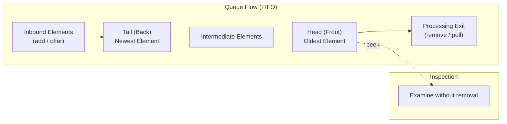

# Collections Framework: The `Queue` Interface, FIFO Processing & Inspection Mechanics

---

## Key Takeaways

A `Queue` is an ordered collection engineered specifically to hold elements prior to processing. Operating as an interface, it cannot be instantiated directly and is typically implemented using concrete classes such as `LinkedList` or `PriorityQueue`. Standard queues follow a First-In, First-Out (FIFO) algorithm where incoming elements are appended to the back (the _tail_) and extracted from the front (the _head_). In addition to maintaining insertion order and permitting duplicates, the `Queue` interface introduces specialized methods for insertion, non-destructive inspection (`peek()`), and destructive head extraction (`remove()`).



- **FIFO Algorithm**: Elements are retrieved and processed in the exact order in which they were added.
- **Structural Boundaries**: The first element in line for processing is called the **head**; the most recently added element is positioned at the **tail**.
- **Duplicates & Ordering**: A `Queue` is an ordered collection that permits duplicate items.
- **Destructive Removal (`remove()`)**: Calling no-argument `remove()` dequeues and returns the current head element, advancing the next element in line to become the new head.
- **Non-Destructive Inspection (`peek()`)**: Calling `peek()` inspects and returns the element at the head of the queue without modifying or removing it from the collection.

---

## Main Discussion

### Idiomatic Java Code Snippets

#### 1. FIFO Queue Processing Using `LinkedList`

A `LinkedList` fulfills the `Queue` interface contract, providing FIFO queuing operations:

```java
package collections_demo;

import java.util.LinkedList;
import java.util.Queue;

public class QueueLifecycleDemo {

    public static void main(String[] args) {
        // Polymorphic declaration: Queue interface holding a LinkedList instance
        Queue<String> fruits = new LinkedList<>();

        // Enqueueing elements (appended to tail)
        fruits.add("apple");
        fruits.add("lemon");
        fruits.add("banana");
        fruits.add("orange");

        // Queues maintain insertion order
        System.out.println("Initial queue: " + fruits); // [apple, lemon, banana, orange]

        // Queues permit duplicates
        fruits.add("lemon");
        System.out.println("After adding duplicate lemon: " + fruits);

        // Destructive extraction: remove() dequeues the current head ("apple")
        var removed = fruits.remove();
        System.out.println("Processed and removed head element: " + removed); // Prints: apple
        System.out.println("Queue after removal: " + fruits); // [lemon, banana, orange, lemon]

        // Non-destructive inspection: peek() returns head without removal
        String currentHead = fruits.peek();
        System.out.println("Current head of queue: " + currentHead); // Prints: lemon

        // Verify that peek() did not modify queue size or contents
        System.out.println("Queue remains unchanged: " + fruits);
    }
}
```

### Under the Hood / JVM Mechanics

1. **Node Chaining at Insertion (add):**
   When add() is invoked on a LinkedList-backed queue, the JVM allocates a heap node containing the element payload and updates the pointer of the existing tail node to link to the new node, which becomes the new tail.

2. **Inspection Without Mutation (peek):**
   Calling peek() directly reads the object reference from the current head node. Because no pointers are shifted or nulled out, the queue structure remains untouched.

3. **Head Extraction & Dereferencing (remove):**
   When remove() is called, the JVM unlinks the head node. It reads the reference payload to return it to the caller, updates the head pointer to point to the immediate successor node (which becomes the new head), and dereferences the old node so it becomes eligible for Garbage Collection.

### Structural Comparisons

#### `Queue` vs. `List` vs. `Set`

| Feature                     | `Queue`                              | `List`                                       | `Set`                                    |
| --------------------------- | ------------------------------------ | -------------------------------------------- | ---------------------------------------- |
| **Primary Focus**           | Staging items for ordered processing | Index-based storage & random access          | Unique item containment                  |
| **Ordering**                | **Ordered** (FIFO sequence)          | **Ordered** (Positional sequence)            | **Unordered** (Standard implementations) |
| **Duplicates**              | **Allowed**                          | **Allowed**                                  | **Disallowed**                           |
| **Element Access**          | Head-centric (`peek()`, `remove()`)  | Arbitrary index (`get(int index)`)           | Iteration or containment checks          |
| **Primary Implementations** | `LinkedList`, `PriorityQueue`        | `ArrayList`, `LinkedList`, `Stack`, `Vector` | `HashSet`, `LinkedHashSet`, `TreeSet`    |

#### Core Queue Processing Operations

| Method     | Operation Type | Effect on Queue                | Return Value               | Target Position |
| ---------- | -------------- | ------------------------------ | -------------------------- | --------------- |
| `add(E e)` | Insertion      | Appends element to tail        | `boolean` (`true`)         | **Tail**        |
| `remove()` | Deletion       | Removes current head element   | Removed element (`E`)      | **Head**        |
| `peek()`   | Inspection     | None (queue remains unchanged) | Current head element (`E`) | **Head**        |

### Common Anti-Patterns & Edge Cases

- **Attempting Direct Instantiation**: Writing `Queue<String> q = new Queue<>();` fails compilation (`Queue is abstract; cannot be instantiated`). Concrete types like `LinkedList` or `PriorityQueue` must be instantiated.
- **Confusing `peek()` with `remove()`**: Using `peek()`expecting it to advance the queue causes infinite loops during batch processing, because`peek()` never dequeues or discards the head item.
- **Assuming Arbitrary Access in Queues**: The `Queue` interface is tailored for head/tail processing. While implementations like `LinkedList` support index-based methods through the `List` interface, declaring the reference as `Queue` restricts accessible methods to queuing operations.

---

## Knowledge Check & JetBrains-Style Coding Challenges

### Theory Tips

- **Head vs. Tail**: Elements are added to the **tail** and retrieved/removed from the **head**.
- **`remove()` Return Value**: `remove()` performs a dual action: it removes the head element from the queue and returns it to the caller for immediate processing.
- **Standard Queue Implementations**: The two prominent concrete classes implementing `Queue` highlighted in core Java are `LinkedList` and `PriorityQueue`.

### Question 1: Conceptual / Code Analysis

Consider the following code snippet:

```java
import java.util.LinkedList;
import java.util.Queue;

public class PrintJobProcessor {
    public static void main(String[] args) {
        Queue<String> jobs = new LinkedList<>();
        jobs.add("Doc1");
        jobs.add("Doc2");
        jobs.add("Doc1");

        String next = jobs.peek();
        String processed = jobs.remove();

        System.out.println(next + " " + processed + " " + jobs.peek());
    }
}
```

What is printed to the console?

- [ ] **A** `Doc1 Doc1 Doc2`
- [ ] **B** `Doc1 Doc2 Doc1`
- [ ] **C** `Doc1 Doc1 Doc1`
- [ ] **D** A compilation error occurs because `jobs.remove()` requires an argument.

<details>
<summary>Correct Answer</summary>

**Correct Answer**: **A**

**Technical Breakdown**:

- **A is correct**:

1. `jobs` is initialized with elements `["Doc1", "Doc2", "Doc1"]` (duplicates are permitted).
2. `jobs.peek()` inspects the current head without removing it, returning `"Doc1"`.
3. `jobs.remove()` removes the head element (`"Doc1"`) and returns it, assigning it to `processed`.
4. With `"Doc1"` removed, `"Doc2"` advances to become the new head.
5. The subsequent `jobs.peek()` reads the new head (`"Doc2"`).
6. The output is `Doc1 Doc1 Doc2`.

- **B is incorrect**: `remove()` extracts the head (`Doc1`), not the second element.
- **C is incorrect**: The second call to `peek()` reflects the updated head (`Doc2`), not the removed duplicate.
- **D is incorrect**: The `Queue` interface defines a parameterless `remove()` method specifically to dequeue the head item.

</details>

---

### Question 2: Mini Coding Problem / Implementation Challenge

**Task**: Implement a task processing class named `TaskDispatcher` inside package `collections_demo`:

1. Maintain an internal `Queue<String>` using a `LinkedList<String>`.
2. Implement method `public void enqueueTask(String task)`: adds the task string to the queue.
3. Implement method `public String previewNextTask()`: returns the task at the head of the queue without removing it. If the queue is empty, return `null`.
4. Implement method `public String processNextTask()`: removes and returns the task at the head of the queue. If the queue is empty, return `null`.
5. Implement method `public int getPendingCount()`: returns the current number of tasks in the queue using `size()`.

**Test Assertions**:

- `TaskDispatcher dispatcher = new TaskDispatcher();`
- `dispatcher.enqueueTask("Compile"); dispatcher.enqueueTask("Test");`
- `dispatcher.previewNextTask()` $\rightarrow$ Returns: `"Compile"`
- `dispatcher.getPendingCount()` $\rightarrow$ Returns: `2`
- `dispatcher.processNextTask()` $\rightarrow$ Returns: `"Compile"`
- `dispatcher.previewNextTask()` $\rightarrow$ Returns: `"Test"`
- `dispatcher.getPendingCount()` $\rightarrow$ Returns: `1`

<details>
<summary>Solution</summary>

```java
package collections_demo;

import java.util.LinkedList;
import java.util.Queue;

public class TaskDispatcher {

    // Internal Queue holding items for FIFO processing
    private final Queue<String> taskQueue = new LinkedList<>();

    public void enqueueTask(String task) {
        taskQueue.add(task);
    }

    public String previewNextTask() {
        if (taskQueue.isEmpty()) {
            return null;
        }
        // Non-destructive inspection of the head
        return taskQueue.peek();
    }

    public String processNextTask() {
        if (taskQueue.isEmpty()) {
            return null;
        }
        // Destructive removal of the head
        return taskQueue.remove();
    }

    public int getPendingCount() {
        return taskQueue.size();
    }
}

```

**Complexity Analysis**:

- **Time Complexity**:
- `enqueueTask`: $\mathcal{O}(1)$ constant-time insertion at the tail.
- `previewNextTask`: $\mathcal{O}(1)$ constant-time reference lookup at the head.
- `processNextTask`: $\mathcal{O}(1)$ constant-time node removal from the head.
- `getPendingCount`: $\mathcal{O}(1)$ constant-time size retrieval.

- **Space Complexity**: $\mathcal{O}(N)$ where $N$ is the number of pending tasks maintained in the linked list node chain.

</details>

---
