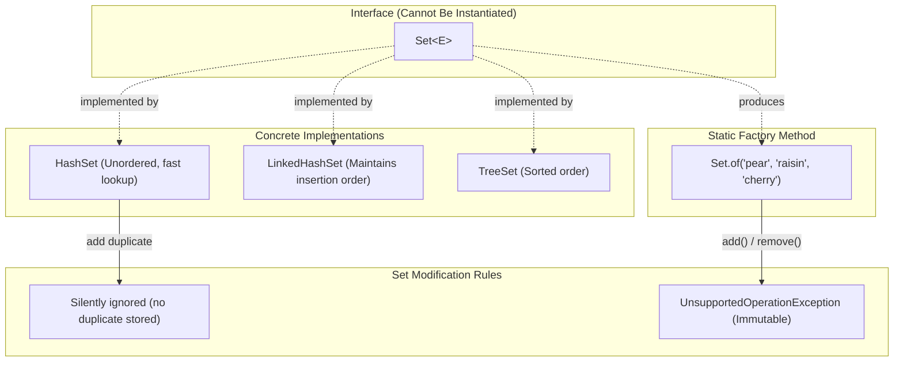

# Collections Framework: The `Set` Interface, Uniqueness & Immutability

---

## Key Takeaways

A `Set` is an unordered collection that contains no duplicate elements, modeling the mathematical set abstraction. Because `Set` is an interface, it cannot be instantiated directly with `new Set()`; instead, developers use concrete implementations such as `HashSet`, `LinkedHashSet`, or `TreeSet`. Adding duplicate elements to a `Set` does not trigger an error, but the duplicate is silently ignored and not stored. Developers can initialize sets dynamically via mutable concrete implementations or concisely via the static factory method `Set.of(...)`, which produces an immutable set that forbids subsequent structural modifications.



- **No Duplicates Allowed**: A `Set` guarantees uniqueness; adding an element that already exists returns `false` internally without throwing an exception or inserting a duplicate.
- **Unordered Nature**: Standard implementations like `HashSet` do not preserve the insertion order of elements, and callers have no control over element positioning.
- **Core Collection Methods**: Key operational methods include `add(element)`, `contains(object)`, `remove(object)`, and `size()`.
- **Immutable Factory Method (`Set.of`)**: Creates a pre-populated, unmodifiable set instance; invoking mutator methods such as `add()` or `remove()` on an unmodifiable set causes a runtime `UnsupportedOperationException`.

---

## Main Discussion

### Idiomatic Java Code Snippets

#### 1. Mutable Set Operations Using `HashSet`

`HashSet` provides a mutable collection that enforces element uniqueness and supports dynamic querying and removal:

```java
package collections_demo;

import java.util.HashSet;
import java.util.Set;

public class MutableSetDemo {

    public static void main(String[] args) {
        // Polymorphic declaration: Interface type holding concrete HashSet instance
        Set<String> fruits = new HashSet<>();

        // Adding elements to the set
        fruits.add("apple");
        fruits.add("banana");
        fruits.add("lemon");

        // Attempting to add a duplicate element: no error, but will not be stored
        fruits.add("apple");

        // Elements print without duplicates and without guaranteed insertion order
        System.out.println("Current fruits set: " + fruits);

        // Checking membership using contains()
        boolean hasLemon = fruits.contains("lemon");
        System.out.println("Have lemon? " + hasLemon); // Prints: true

        // Removing an element from the set
        fruits.remove("lemon");

        // Querying set cardinality using size()
        System.out.println("Number of elements after removing lemon: " + fruits.size()); // Prints: 2
        System.out.println("Remaining fruits: " + fruits);
    }
}
```

#### 2. Immutable Sets Using the Static Factory Method `Set.of`

`Set.of` offers a concise way to instantiate pre-populated sets, but enforces strict runtime immutability:

```java
package collections_demo;

import java.util.Set;

public class ImmutableSetDemo {

    public static void main(String[] args) {
        // Static factory method creates an immutable (unmodifiable) Set
        Set<String> moreFruit = Set.of("pear", "raisins", "cherry");
        System.out.println("More fruit: " + moreFruit);

        // Attempting to modify an immutable set compiles cleanly,
        // but fails at runtime with UnsupportedOperationException:
        try {
            moreFruit.add("cranberry");
        } catch (UnsupportedOperationException e) {
            System.out.println("Caught expected exception: Cannot call add() on an immutable set.");
        }

        try {
            moreFruit.remove("pear");
        } catch (UnsupportedOperationException e) {
            System.out.println("Caught expected exception: Cannot call remove() on an immutable set.");
        }
    }
}
```

### Under the Hood / JVM Mechanics

1. **Instantiation Boundary:**
   Because Set is an interface, invoking new Set() causes a compile-time failure. Instantiation must target a concrete class (e.g., `new HashSet<>()`) or utilize static factory helpers like Set.of(...).

2. **Duplicate Rejection Mechanism:**
   When fruits.add('apple') is called, the underlying set evaluates candidate uniqueness against existing elements using object hashing and equality checks. If a matching element already exists, the set retains the existing element and ignores the new entry without throwing an exception.

3. **Unordered Storage:**
   In a HashSet, elements are bucketed based on internal hash calculations rather than insertion sequence. Traversing or printing the set yields elements in an arbitrary order that can shift across executions.

4. **Immutable Set Enforcement:**
   Set.of(...) instantiates internal, unmodifiable set classes. In these implementations, mutator methods (add, remove, clear) are overridden to unconditionally throw UnsupportedOperationException without inspecting their arguments.

### Structural Comparisons

#### Common `Set` Implementations & Factory Variants

| Feature / Variant      | `HashSet`                        | `LinkedHashSet`                   | `TreeSet`                        | `Set.of(...)`                             |
| ---------------------- | -------------------------------- | --------------------------------- | -------------------------------- | ----------------------------------------- |
| **Ordering**           | Unordered (arbitrary)            | Insertion order                   | Sorted / Natural order           | Unordered (arbitrary)                     |
| **Allows Duplicates?** | **No**                           | **No**                            | **No**                           | **No** (throws error if literals collide) |
| **Mutability**         | Mutable (`add`/`remove` allowed) | Mutable (`add`/`remove` allowed)  | Mutable (`add`/`remove` allowed) | **Immutable** (read-only)                 |
| **Instantiation Type** | Concrete class (`new`)           | Concrete class (`new`)            | Concrete class (`new`)           | Static factory method on interface        |
| **Primary Use Case**   | General high-performance set     | When insertion order must be kept | When sorted order is required    | Fixed constant reference collections      |

### Common Anti-Patterns & Edge Cases

- **Attempting to Instantiate `Set` Directly**: Writing `Set<String> items = new Set<>();` triggers a compilation error: `Set is abstract; cannot be instantiated`. An implementing class like `HashSet` must be used instead.
- **Mutating `Set.of` Collections**: Calling `.add()` or `.remove()` on a set created via `Set.of(...)` compiles without warnings because the variable adheres to the `Set` interface, but crashes at runtime with an `UnsupportedOperationException`.
- **Relying on Set Element Ordering**: Assuming that elements added in a specific order to a `HashSet` will be printed or retrieved in that same order leads to logic bugs; standard sets are inherently unordered.
- **Expecting Duplicate Errors on `.add()`**: Expecting an exception when adding duplicates to a mutable set. Calling `.add()`with an existing element simply returns`false` and leaves the set unchanged.

---

## Knowledge Check & JetBrains-Style Coding Challenges

### Theory Tips

- **Interface Instantiation**: `Set` is an interface and cannot be instantiated directly with `new Set()`.
- **Behavior of Duplicate Additions**: Adding a duplicate element to a mutable `Set` does not throw an error; the operation simply fails to store the element and returns `false`.
- **Static Factory Immutability**: `Set.of(...)` produces an unmodifiable set; modifying it via `add()` or `remove()` causes a runtime `UnsupportedOperationException`.

### Question 1: Conceptual / Code Analysis

Consider the following code snippet:

```java
import java.util.Set;

public class CollectionQuiz {
    public static void main(String[] args) {
        Set<String> colors = Set.of("red", "green", "blue");
        colors.add("yellow");
        System.out.println(colors.size());
    }
}
```

What is the result when compiling and executing this program?

- [ ] **A** It prints `4` to the console.
- [ ] **B** A compilation error occurs because `Set.of` cannot accept string literals.
- [ ] **C** A compilation error occurs because `add` cannot be called on a variable of type `Set`.
- [ ] **D** The code compiles successfully, but throws an `UnsupportedOperationException` at runtime when calling `add`.

<details>
<summary>Correct Answer</summary>

**Correct Answer**: **D**

**Technical Breakdown**:

- **D is correct**: `Set.of(...)` returns an immutable (unmodifiable) instance of `Set`. Because `add` is declared in the `Set` interface, the code passes compile-time type verification. However, at runtime, the immutable set implementation rejects modifications by throwing an `UnsupportedOperationException`.
- **A is incorrect**: The element is never added because the collection cannot be modified.
- **B is incorrect**: `Set.of(...)` accepts varargs/comma-delimited arguments of any object type, including string literals.
- **C is incorrect**: `add(E e)` is a standard method declared in the `Set` interface, so the compiler accepts the invocation.

</details>

---

### Question 2: Mini Coding Problem / Implementation Challenge

**Task**: Implement a tag registry manager named `TagManager` inside package `collections_demo`:

1. Use an internal `HashSet<String>` to store tags.
2. Implement method `public boolean addTag(String tag)`: adds the tag to the set and returns `true` if it was added (did not already exist), or `false` if it was a duplicate.
3. Implement method `public boolean hasTag(String tag)`: checks whether the tag exists in the registry.
4. Implement method `public int removeTag(String tag)`: removes the tag if present and returns the updated `size()` of the tag set.
5. Implement method `public Set<String> getImmutableSnapshot()`: returns an immutable set containing the elements `"alpha"`, `"beta"`, and `"gamma"` created via `Set.of(...)`.

**Test Assertions**:

- `TagManager tm = new TagManager();`
- `tm.addTag("java")` $\rightarrow$ Returns: `true`
- `tm.addTag("java")` $\rightarrow$ Returns: `false`
- `tm.hasTag("java")` $\rightarrow$ Returns: `true`
- `tm.removeTag("java")` $\rightarrow$ Returns: `0`
- `tm.getImmutableSnapshot().size()` $\rightarrow$ Returns: `3`

<details>
<summary>Solution</summary>

```java
package collections_demo;

import java.util.HashSet;
import java.util.Set;

public class TagManager {

    // Internal mutable set holding unique tag strings
    private final Set<String> tags = new HashSet<>();

    public boolean addTag(String tag) {
        // Set.add returns false if the item was already present
        return tags.add(tag);
    }

    public boolean hasTag(String tag) {
        return tags.contains(tag);
    }

    public int removeTag(String tag) {
        tags.remove(tag);
        return tags.size();
    }

    public Set<String> getImmutableSnapshot() {
        // Creates an unmodifiable set via the static of() method
        return Set.of("alpha", "beta", "gamma");
    }
}
```

**Complexity Analysis**:

- **Time Complexity**: $\mathcal{O}(1)$ on average for `addTag`, `hasTag`, and `removeTag` operations, as hash-based set lookups, insertions, and deletions execute in constant time.
- **Space Complexity**: $\mathcal{O}(N)$ where $N$ is the number of unique tags maintained inside the underlying `HashSet`.

</details>

---
