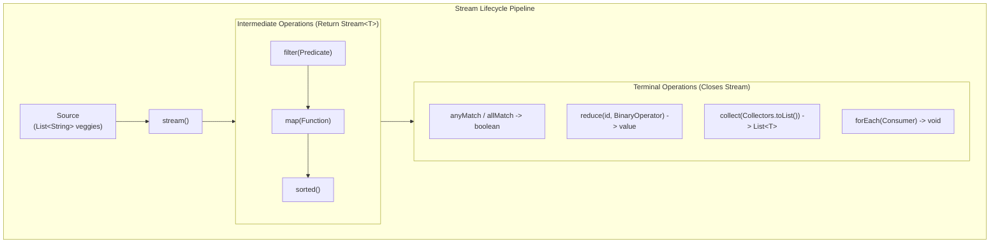

# The Stream API: Intermediate vs. Terminal Operations, Reductions & Collectors

---

## Key Takeaways

The Java Stream API organizes computations into pipelines composed of **intermediate** and **terminal** operations. Intermediate operations (such as `filter`, `map`, and `sorted`) transform a stream and return a new stream, enabling fluent method chaining where all chained operations execute cooperatively in a single pass through the data. Terminal operations (such as `anyMatch`, `allMatch`, `forEach`, `reduce`, and `collect`) produce an end result (a primitive, an object, or `void`) and immediately close the stream, rendering it consumed and unavailable for further use.



- **Intermediate vs. Terminal**: Intermediate operations always return a resulting stream for continuous chaining; terminal operations consume the stream, produce a final value or side effect, and close the pipeline permanently.
- **Predicate Matches (`anyMatch`, `allMatch`)**: Terminal operations accepting a `Predicate` to evaluate whether at least one or all elements satisfy a condition, returning a boolean.
- **Filtering & Transforming (`filter`, `map`)**: `filter(Predicate)` narrows elements by condition; `map(Function)` transforms elements into alternate representations (e.g., converting strings to uppercase via method references).
- **Accumulation & Aggregation (`reduce`)**: Folds a sequence of elements into a single aggregate value using an initial starting value (the _identity_) and an accumulating `BinaryOperator`.
- **Materialization (`collect`)**: Terminal operation that re-packages stream elements into concrete collections (e.g., `Collectors.toList()`).

---

## Main Discussion

### Idiomatic Java Code Snippets

#### 1. Matching Conditions (`anyMatch`, `allMatch`)

Matching operations inspect elements against a predicate and close the stream with a boolean result:

```java
package streams_operations;

import java.util.List;

public class StreamMatchingDemo {

    public static void main(String[] args) {
        List<String> veggies = List.of(
                "cabbage",
                "carrots",
                "green beans",
                "Brussels sprouts"
        );

        // anyMatch: terminal operation returning boolean
        // Checks if any element contains a space (multi-word vegetable)
        boolean hasMultiWordVeggie = veggies.stream()
                .anyMatch(v -> v.contains(" "));
        System.out.println("Contains multi-word veggie: " + hasMultiWordVeggie); // true

        // allMatch: terminal operation returning boolean
        // Checks if every vegetable contains the letter 's'
        boolean allContainS = veggies.stream()
                .allMatch(v -> v.contains("s"));
        System.out.println("All veggies contain 's': " + allContainS); // false (cabbage fails)
    }
}
```

#### 2. Pipeline Chaining: Filtering, Mapping & Sorting

Chaining intermediate operations into a single continuous pipeline terminated by `forEach`:

```java
package streams_operations;

import java.util.List;

public class StreamChainingDemo {

    public static void main(String[] args) {
        List<String> veggies = List.of(
                "cabbage",
                "carrots",
                "green beans",
                "Brussels sprouts"
        );

        System.out.println("--- Filter, Map, Sort and Print Pipeline ---");
        // Intermediate: filter veggies containing 'c' or 'C'
        // Intermediate: map strings to uppercase via method reference String::toUpperCase
        // Intermediate: sorted in natural alphabetical order
        // Terminal: forEach terminal operation closes the stream
        veggies.stream()
               .filter(v -> v.toLowerCase().startsWith("c"))
               .map(String::toUpperCase)
               .sorted()
               .forEach(System.out::println);

        // Verification of source immutability
        System.out.println("Source list remains unchanged: " + veggies);
    }
}
```

#### 3. Stream Reductions (`reduce`) and Materialization (`collect`)

Demonstrating numeric aggregation, string delimiting, and collecting into new data structures:

```java
package streams_operations;

import java.util.List;
import java.util.stream.Collectors;

public class StreamReductionAndCollectionDemo {

    public static void main(String[] args) {
        // Numeric reduction: summing integers with an identity of 0
        List<Integer> numbers = List.of(2, 4, 6, 8, 10);
        int sum = numbers.stream()
                         .reduce(0, (a, b) -> a + b);
        System.out.println("Reduced Sum: " + sum); // 30

        // String reduction: pipe-delimited concatenation with empty identity
        List<String> words = List.of("cabbage", "carrots", "beans");
        String concatenated = words.stream()
                                   .sorted()
                                   .reduce("", (a, b) -> a.isEmpty() ? b : a + "|" + b);
        System.out.println("Pipe Delimited: " + concatenated); // beans|cabbage|carrots

        // collect: gathering matching elements into a new List data structure
        List<String> pluralVeggies = words.stream()
                                          .filter(v -> v.endsWith("s"))
                                          .collect(Collectors.toList());
        System.out.println("Collected Plural Veggies List: " + pluralVeggies); // [carrots, beans]
    }
}
```

### Under the Hood / JVM Mechanics

1. **Pipeline Assembly (Intermediate Stages):**
   When intermediate operations like filter and map are invoked, the JVM does not process any data immediately. It links internal ReferencePipeline stage objects, recording operations as a planned execution graph.
2. **Single-Pass Execution Trigger (Terminal Operation):**
   Invoking a terminal operation (collect, reduce, forEach) activates the pipeline. The stream pulls elements sequentially from the source, pushing each element through all chained intermediate stages in a single pass.
3. **Short-Circuiting Mechanics (anyMatch / allMatch):**
   For matching operations like anyMatch, traversal terminates as soon as an element satisfies the predicate, immediately closing the pipeline without evaluating remaining elements.
4. **Stream Closure & Invalidation:**
   Once the terminal stage produces its output, an internal linkedOrConsumed flag is set to true. Any subsequent attempt to invoke operations on the same stream reference throws an IllegalStateException.

### Structural Comparisons

#### Intermediate Operations vs. Terminal Operations

| Characteristic       | Intermediate Operation                  | Terminal Operation                                               |
| -------------------- | --------------------------------------- | ---------------------------------------------------------------- |
| **Return Type**      | Always returns a `Stream<T>`            | Returns a non-stream value (`boolean`, `int`, `List`, `void`)    |
| **Execution Timing** | Deferred / Chained                      | Triggers execution across the whole pipeline                     |
| **Stream State**     | Leaves stream open for further chaining | **Closes** the stream permanently                                |
| **Common Examples**  | `filter()`, `map()`, `sorted()`         | `anyMatch()`, `allMatch()`, `forEach()`, `reduce()`, `collect()` |

#### Reduction vs. Collection

| Dimension             | `reduce(identity, accumulator)`                  | `collect(collector)`                                        |
| --------------------- | ------------------------------------------------ | ----------------------------------------------------------- |
| **Core Intent**       | Folds stream elements into a single scalar value | Assembles stream elements into a container/data structure   |
| **Primary Arguments** | Starting identity value + `BinaryOperator`       | Implementation of `Collector` (e.g., `Collectors.toList()`) |
| **Typical Target**    | Sums, products, string concatenations            | Lists, Sets, custom collections                             |
| **Operation Type**    | Terminal                                         | Terminal                                                    |

### Common Anti-Patterns & Edge Cases

- **Reusing a Consumed Stream**: Attempting to call multiple terminal operations or another operation on a closed stream throws an `IllegalStateException: stream has already been operated upon or closed`:

```java
Stream<String> veggieStream = veggies.stream();
veggieStream.forEach(System.out::println);
veggieStream.filter(v -> v.startsWith("c")); // Throws IllegalStateException!
```

- **Forgetting the Terminal Operation**: Writing `veggies.stream().filter(v -> v.length() > 5).map(String::toUpperCase);` without a terminal method causes nothing to happen. Intermediate operations do not run without a terminal trigger.
- **Assuming Intermediate Operations Mutate Source Elements**: Expecting `veggies.stream().map(String::toUpperCase)` to make the strings in `veggies` uppercase. Source elements remain untouched; results must be extracted via `collect()` or `forEach()`.

---

## Knowledge Check & JetBrains-Style Coding Challenges

### Theory Tips

- **Stream Classification**: Intermediate operations return a `Stream`; terminal operations return a concrete value, collection, or `void`, and close the stream.
- **Identity in `reduce**`: The identity serves as both the seed starting value of the accumulation and the default return value if the stream is empty.
- **Method References with `map**`: When an element is passed directly to an instance method without alteration, prefer method references (e.g., `map(String::toUpperCase)`over`map(s -> s.toUpperCase())`).

### Question 1: Conceptual / Code Analysis

Consider the following code snippet:

```java
import java.util.List;
import java.util.stream.Stream;

public class StreamLifecycleCheck {
    public static void main(String[] args) {
        List<String> items = List.of("pen", "pencil", "paper");

        Stream<String> itemStream = items.stream().filter(i -> i.startsWith("p"));
        boolean anyLong = itemStream.anyMatch(i -> i.length() > 4);
        long count = itemStream.count();

        System.out.println(anyLong + " " + count);
    }
}
```

What is the result when compiling and running this code?

- [ ] **A** It prints `true 2`.
- [ ] **B** It prints `true 3`.
- [ ] **C** A compilation error occurs because `count()` cannot follow `anyMatch()`.
- [ ] **D** It compiles cleanly, but throws an `IllegalStateException` at runtime on `itemStream.count()`.

<details>
<summary>Correct Answer</summary>

**Correct Answer**: **D**

**Technical Breakdown**:

- **D is correct**: `anyMatch` is a terminal operation. When `itemStream.anyMatch(...)` executes, it evaluates the condition, returns `true`, and closes `itemStream`. Once closed, a stream cannot be operated upon again. The subsequent invocation of `itemStream.count()` attempts to operate on a consumed stream, causing the JVM to throw an `IllegalStateException: stream has already been operated upon or closed`.
- **A & B are incorrect**: The program aborts with a runtime exception before reaching `System.out.println`.
- **C is incorrect**: Both `anyMatch` and `count` are valid methods on the `Stream` interface; the failure occurs at runtime due to stream reuse.

</details>

---

### Question 2: Mini Coding Problem / Implementation Challenge

**Task**: Implement a stream-based inventory parser named `ProducePipeline` inside package `streams_operations`:

1. Method `public static boolean hasLongNames(List<String> items, int threshold)`:
   - Uses `anyMatch` to return `true` if any string in `items` has a character length greater than `threshold`.
2. Method `public static List<String> getSanitizedList(List<String> items)`:
   - Uses a stream pipeline on `items`:
   - Filters elements to include only strings that contain the letter `"e"`.
   - Maps matching strings to uppercase (`String::toUpperCase`).
   - Sorts the results in alphabetical order (`sorted()`).
   - Collects and returns the results as a `List<String>` using `Collectors.toList()`.
3. Method `public static int sumEvenSquares(List<Integer> numbers)`:
   - Filters `numbers` to retain only even numbers (`n % 2 == 0`).
   - Maps each even number to its square (`n * n`).
   - Reduces the sequence to an integer sum using `reduce` with an identity of `0` and a summation `BinaryOperator`.

**Test Assertions**:

- `hasLongNames(List.of("pea", "carrot"), 5)` $\rightarrow$ Returns: `true` ("carrot" has length 6)
- `getSanitizedList(List.of("green beans", "cabbage", "celery", "corn"))`:
  - Matching elements containing 'e': `"green beans"`, `"celery"`
  - Returns: `["CELERY", "GREEN BEANS"]`
- `sumEvenSquares(List.of(1, 2, 3, 4))` $\rightarrow$ Even numbers: 2, 4 $\rightarrow$ Squares: 4, 16 $\rightarrow$ Sum: `20`

<details>
<summary>Solution</summary>

```java
package streams_operations;

import java.util.List;
import java.util.stream.Collectors;

public class ProducePipeline {

    public static boolean hasLongNames(List<String> items, int threshold) {
        // Terminal anyMatch using a Predicate
        return items.stream()
                    .anyMatch(item -> item.length() > threshold);
    }

    public static List<String> getSanitizedList(List<String> items) {
        // Chained pipeline: filter -> map -> sorted -> collect
        return items.stream()
                    .filter(item -> item.contains("e"))
                    .map(String::toUpperCase)
                    .sorted()
                    .collect(Collectors.toList());
    }

    public static int sumEvenSquares(List<Integer> numbers) {
        // Chained pipeline: filter -> map -> reduce
        return numbers.stream()
                      .filter(n -> n % 2 == 0)
                      .map(n -> n * n)
                      .reduce(0, (a, b) -> a + b);
    }
}
```

**Complexity Analysis**:

- **Time Complexity**:
  - `hasLongNames`: Best-case $\mathcal{O}(1)$ via short-circuiting; worst-case $\mathcal{O}(N)$ where $N$ is the number of elements.
  - `getSanitizedList`: $\mathcal{O}(K \log K)$ where $K$ is the number of filtered elements, dominated by the `sorted()` step. Filtering, mapping, and collecting occur in a single linear pass $\mathcal{O}(N)$.
  - `sumEvenSquares`: $\mathcal{O}(N)$ linear single-pass evaluation across all numbers.
- **Space Complexity**:
  - `hasLongNames` & `sumEvenSquares`: $\mathcal{O}(1)$ auxiliary space.
  - `getSanitizedList`: $\mathcal{O}(K)$ auxiliary memory allocated for the new collected list container.

</details>

---
