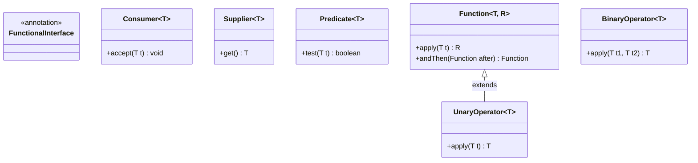

# Functional Programming: Built-in Functional Interfaces, SAM Contract & Custom Functional Design

---

## Key Takeaways

Functional programming in Java treats computation as the evaluation of mathematical functions that transform an input set into an output set. At the core of Java's functional programming model is the **Functional Interface**—an interface containing exactly one **Single Abstract Method (SAM)**. When a lambda expression or method reference is declared, it is compiled as an inline implementation of that exact abstract method. The `java.util.function` package provides standard built-in interfaces (`Consumer`, `Supplier`, `Predicate`, `Function`, `UnaryOperator`, `BinaryOperator`) along with default combinator methods (such as `andThen`) to facilitate pipeline chaining. Developers can also define custom functional contracts enforced by the `@FunctionalInterface` compiler annotation.



- **The SAM Rule**: A functional interface must declare exactly one abstract method; any number of `default` or `static` methods may coexist alongside it.
- **Core Built-in Categories**:
  - `Consumer<T>`: Consumes one input, returns nothing (`void accept(T t)`).
  - `Supplier<T>`: Takes no input, produces a result (`T get()`).
  - `Predicate<T>`: Evaluates a condition on one input, returns a boolean (`boolean test(T t)`).
  - `Function<T, R>`: Transforms an argument of type `T` into a result of type `R` (`R apply(T t)`).
  - `UnaryOperator<T>`: Specialized `Function<T, T>` where input and output types match.
  - `BinaryOperator<T>`: Specialized `BiFunction<T, T, T>` taking two inputs of type `T` and returning type `T`.
- **Method Composition via `andThen`**: Default methods on interfaces like `Function` allow chaining transformations where the output of the first function serves as the input to the next.
- **The `@FunctionalInterface` Annotation**: An optional but strongly encouraged compile-time guard that causes the compiler to flag an error if an annotated interface does not have exactly one abstract method.

---

## Main Discussion

### Idiomatic Java Code Snippets

#### 1. Core Built-In Functional Interfaces (`java.util.function`)

Demonstrating direct variable assignment, abstract method execution, and method references:

```java
package functional_programming;

import java.util.List;
import java.util.function.BinaryOperator;
import java.util.function.Consumer;
import java.util.function.Function;
import java.util.function.Predicate;
import java.util.function.Supplier;
import java.util.function.UnaryOperator;

public class CoreInterfacesDemo {

    public static void main(String[] args) {
        // 1. Consumer<T>: Accepts input, returns void (Single Abstract Method: accept)
        Consumer<String> printConsumer = country -> System.out.println("Country: " + country);
        printConsumer.accept("Australia");

        // Passing Consumer directly into forEach
        List<String> countries = List.of("Japan", "Canada", "Germany");
        countries.forEach(printConsumer);
        // Using a method reference as a Consumer implementation
        countries.forEach(System.out::println);

        // 2. Supplier<T>: Takes no input, returns output (Single Abstract Method: get)
        Supplier<Double> randomSupplier = () -> Math.random();
        System.out.println("Supplied Value: " + randomSupplier.get());

        // 3. Predicate<T>: Accepts input, returns boolean (Single Abstract Method: test)
        Predicate<String> startsWithJ = str -> str.startsWith("J");
        System.out.println("Starts with J? " + startsWithJ.test("Japan")); // true

        // 4. Function<T, R>: Accepts T, returns R (Single Abstract Method: apply)
        Function<String, Integer> stringLength = str -> str.length();
        System.out.println("Length of 'Australia': " + stringLength.apply("Australia")); // 9

        // 5. UnaryOperator<T>: Specialized Function<T, T>
        UnaryOperator<Integer> square = n -> n * n;
        System.out.println("Square of 6: " + square.apply(6)); // 36

        // 6. BinaryOperator<T>: Specialized BiFunction<T, T, T>
        BinaryOperator<Integer> sum = (a, b) -> a + b;
        System.out.println("Sum of 10 and 20: " + sum.apply(10, 20)); // 30
    }
}
```

#### 2. Function Composition Using Default Method `andThen`

Default methods on functional interfaces enable declarative processing pipelines:

```java
package functional_programming;

import java.util.function.Function;

public class FunctionCompositionDemo {

    public static void main(String[] args) {
        // Square operation: Function<Integer, Integer>
        Function<Integer, Integer> square = x -> x * x;

        // Add operation: adds input to itself (x + x)
        Function<Integer, Integer> add = x -> x + x;

        // Compose: First execute square, and then execute add on the result
        Function<Integer, Integer> squareThenAdd = square.andThen(add);

        // Input 5 -> square.apply(5) = 25 -> add.apply(25) = 50
        int result = squareThenAdd.apply(5);
        System.out.println("Pipeline Result (5^2 then doubled): " + result); // Prints: 50
    }
}
```

#### 3. Defining a Custom Functional Interface

Using `@FunctionalInterface` to enforce the SAM rule while including utility `default` methods:

```java
package functional_programming;

@FunctionalInterface
public interface StringTransformer {

    // The Single Abstract Method (SAM)
    String transform(String input);

    // Default method: provides reusable behavior without violating SAM contract
    default void printTransformed(String input) {
        System.out.println(transform(input));
    }
}
```

```java
package functional_programming;

public class CustomInterfaceRunner {

    public static void main(String[] args) {
        // Implementing custom functional interface via lambda
        StringTransformer shoutTransformer = s -> s.toUpperCase() + "!!!";

        // Calling the SAM
        String transformed = shoutTransformer.transform("hello world");
        System.out.println(transformed); // Prints: HELLO WORLD!!!

        // Calling the default method
        shoutTransformer.printTransformed("functional java"); // Prints: FUNCTIONAL JAVA!!!
    }
}
```

### Under the Hood / JVM Mechanics

1. **Compiler Verification of SAM Contract:**
   When @FunctionalInterface is present, javac counts all non-static, non-default methods declared in the interface. If the count is 0 or greater than 1, compilation fails immediately with: Unexpected @FunctionalInterface annotation.

2. **Lambda Desugaring & invokedynamic Emission:**
   When a lambda target (e.g., `Consumer<String> c = ...`) is evaluated, the compiler avoids generating an inner class file. It emits an invokedynamic instruction pointing to the standard library bootstrap method LambdaMetafactory.metafactory.

3. **Target Type Matching & Invocation:**
   At runtime, the JVM uses the functional interface's SAM descriptor to construct a synthetic call target. When accept(), apply(), or test() is called, execution jumps directly to the lambda body with minimal object creation overhead.

4. **Default Combinator Chaining:**
   Invoking f1.andThen(f2) returns a new synthetic lambda instance: (T t) -> f2.apply(f1.apply(t)). The intermediate result is forwarded from the first function's return frame directly into the second function's parameter frame.

### Structural Comparisons

#### Core Interfaces in `java.util.function`

| Interface Name          | Input Parameter(s)     | Return Type     | SAM Name            | Extends / Specializes |
| ----------------------- | ---------------------- | --------------- | ------------------- | --------------------- |
| **`Consumer<T>`**       | `T` (Single argument)  | `void`          | `accept(T t)`       | Base interface        |
| **`Supplier<T>`**       | _None_                 | `T`             | `get()`             | Base interface        |
| **`Predicate<T>`**      | `T` (Single argument)  | `boolean`       | `test(T t)`         | Base interface        |
| **`Function<T, R>`**    | `T` (Single argument)  | `R` (Result)    | `apply(T t)`        | Base interface        |
| **`UnaryOperator<T>`**  | `T` (Single argument)  | `T` (Same type) | `apply(T t)`        | `Function<T, T>`      |
| **`BinaryOperator<T>`** | `T, T` (Two arguments) | `T` (Same type) | `apply(T t1, T t2)` | `BiFunction<T, T, T>` |

### Common Anti-Patterns & Edge Cases

- **Violating the SAM Contract Under `@FunctionalInterface`**: Adding a second abstract method to an annotated interface triggers a compile-time failure: `foo is not a functional interface; multiple non-overriding abstract methods found`.
- **Type Confusion Between `Function<T, R>` and `UnaryOperator<T>`**: Using `Function<Integer, Integer>`when types are strictly identical is valid, but using`UnaryOperator<Integer>` communicates intent clearly and eliminates redundant generic type parameters.
- **Incorrect Parameter Order in `andThen`**: `a.andThen(b)`executes`a`first and feeds its result into`b`. Confusing `andThen`with reverse evaluation alters the pipeline result entirely (e.g.,`(x _ x) + (x _ x)`vs`(x + x)^2`).
- **Treating `Consumer` as Returning Values**: Writing a lambda with a return value for a `Consumer` (e.g., `Consumer<String> c = s -> s.length();`) fails compilation: `bad return type in lambda expression`.

---

## Knowledge Check & JetBrains-Style Coding Challenges

### Theory Tips

- **SAM Identification**: Lambda expressions and method references can only implement interfaces that have exactly **one** abstract method.
- **Type Generic Conventions**: In standard signatures, `T` represents the input type, `R` represents the return type, and `U` represents a secondary input argument.
- **Default and Static Methods Allowed**: An interface can have multiple `default` and `static` methods and still remain a valid functional interface, provided it has only one abstract method.

### Question 1: Conceptual / Code Analysis

Consider the following custom interface and usage:

```java
@FunctionalInterface
public interface MathTransformer {
    int operate(int a, int b);

    default int doubleOperate(int a, int b) {
        return operate(a, b) * 2;
    }

    static void printDescription() {
        System.out.println("Operates on two integers");
    }
}
```

What occurs when this interface is compiled and instantiated as follows:
`MathTransformer mt = (x, y) -> x * y;`?

- [ ] **A** A compilation error occurs because `@FunctionalInterface` cannot have default or static methods.
- [ ] **B** A compilation error occurs because `operate` takes two parameters, but functional interfaces only allow single-argument methods.
- [ ] **C** Compilation succeeds; `mt.doubleOperate(3, 4)` returns `24`.
- [ ] **D** A runtime error occurs when invoking `doubleOperate` because default methods cannot call abstract methods inside a lambda.

<details>
<summary>Correct Answer</summary>

**Correct Answer**: **C**

**Technical Breakdown**:

- **C is correct**: `MathTransformer` adheres to the SAM contract: it declares exactly one abstract method (`operate(int, int)`). The presence of `default` and `static` methods does not violate the functional interface definition. The lambda `(x, y) -> x * y` implements `operate`. Calling `mt.doubleOperate(3, 4)` evaluates `operate(3, 4)` ($3 \times 4 = 12$) and multiplies the result by 2, returning `24`.
- **A is incorrect**: Functional interfaces allow any number of default and static methods.
- **B is incorrect**: Functional interfaces can take any number of parameters (e.g., `BinaryOperator` and `BiFunction` take two).
- **D is incorrect**: Default methods can invoke abstract methods on the current instance via dynamic dispatch.

</details>

---

### Question 2: Mini Coding Problem / Implementation Challenge

**Task**: Implement an automated string validator and data sanitizer utility named `PipelineUtils` inside package `functional_programming`:

1. Method `public static List<String> filterValidEntries(List<String> entries, Predicate<String> validator)`:
   - Accepts a list of strings and a `Predicate<String>`.
   - Filters and returns a new `List<String>` containing only entries where `validator.test(entry)` evaluates to `true`.
2. Method `public static Function<Integer, Integer> buildScaledMultiplier(int factor, int offset)`:
   - Uses `Function<Integer, Integer>` composition.
   - First multiplies the input by `factor` (`x -> x * factor`).
   - Then adds `offset` to the result using `andThen(...)`.
   - Returns the composed `Function`.
3. Custom functional interface `TriStringFormatter`:
   - Annotated with `@FunctionalInterface`.
   - SAM: `String format(String a, String b, String c);`

**Test Assertions**:

- `List<String> data = List.of("java", "c", "python", "go");`
- `filterValidEntries(data, s -> s.length() > 2)` $\rightarrow$ Returns: `["java", "python"]`
- `Function<Integer, Integer> pipeline = buildScaledMultiplier(3, 10);`
- `pipeline.apply(5)` $\rightarrow$ Evaluates $(5 \times 3) + 10 = 25 \rightarrow$ Returns: `25`
- `TriStringFormatter formatter = (x, y, z) -> x + "-" + y + "-" + z;`
- `formatter.format("A", "B", "C")` $\rightarrow$ Returns: `"A-B-C"`

<details>
<summary>Solution</summary>

```java
package functional_programming;

import java.util.ArrayList;
import java.util.List;
import java.util.function.Function;
import java.util.function.Predicate;

public class PipelineUtils {

    public static List<String> filterValidEntries(List<String> entries, Predicate<String> validator) {
        List<String> filtered = new ArrayList<>();
        for (String entry : entries) {
            // Predicate SAM execution: test()
            if (validator.test(entry)) {
                filtered.add(entry);
            }
        }
        return filtered;
    }

    public static Function<Integer, Integer> buildScaledMultiplier(int factor, int offset) {
        Function<Integer, Integer> multiplyStep = x -> x * factor;
        Function<Integer, Integer> offsetStep = x -> x + offset;

        // Composing functions using default method andThen
        return multiplyStep.andThen(offsetStep);
    }
}
```

```java
package functional_programming;

@FunctionalInterface
public interface TriStringFormatter {

    // Single Abstract Method taking three arguments and returning a String
    String format(String a, String b, String c);
}
```

**Complexity Analysis**:

- **Time Complexity**:
  - `filterValidEntries`: $\mathcal{O}(N)$ where $N$ is the number of elements in `entries`. Each element is tested by the `Predicate` once.
  - `buildScaledMultiplier` composition: $\mathcal{O}(1)$ instantiation and $\mathcal{O}(1)$ execution when `.apply()` runs arithmetic operations.
- **Space Complexity**: $\mathcal{O}(K)$ auxiliary memory allocated for the filtered `ArrayList` containing $K$ matching elements ($K \le N$).

</details>

---
