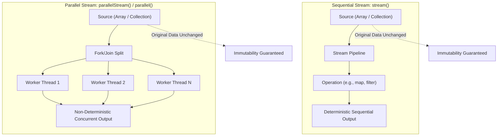

# Functional Pipelines: The Stream API, Non-Destructive Operations & Parallel Processing

---

## Key Takeaways

The Java Stream API (`java.util.stream`) provides a functional approach to processing sequences of elements from data sources such as collections, arrays, or I/O channels. Unlike collections, a stream does not store data in memory or modify the underlying source; it acts as a computational pipeline that conveys elements through functional stages. In addition to sequential processing, the Stream API supports parallel execution, distributing computational work across multiple JVM worker threads simultaneously—trading deterministic execution order for throughput on multi-core architectures.



- **No Data Storage**: A stream is not a data structure; it does not store elements. It is an on-demand view that transfers items through computational transformations.
- **Non-Destructive Nature**: Stream operations do not mutate the underlying data source (arrays, lists, or sets retain their original state).
- **Parallel Processing**: Streams can process elements in parallel across multiple CPU cores, using worker threads to execute operations simultaneously.
- **Non-Deterministic Parallel Order**: Because parallel streams execute across concurrent threads, the processing and output order is non-deterministic and can vary on every execution run.

---

## Main Discussion / Deep Dive

### Idiomatic Java Code Snippets

#### 1. Creating Streams and Non-Destructive Transformations

Creating a stream from an array, mapping elements to transform them without altering the source array:

```java
package streams_demo;

import java.util.Arrays;
import java.util.stream.IntStream;

public class StreamTransformationDemo {

    public static void main(String[] args) {
        // Original source: array of even integers
        int[] evenNumbers = {2, 4, 6, 8, 10};

        System.out.println("--- Stream Processing (Converting Evens to Odds) ---");
        // Creating a stream from the array using Arrays.stream()
        // Performing an operation (+ 1) to derive odd numbers and printing each
        Arrays.stream(evenNumbers)
              .map(n -> n + 1)
              .forEach(odd -> System.out.print(odd + " "));
        System.out.println();

        // Verifying the non-destructive property: original array is unchanged
        System.out.println("Original array remains intact: " + Arrays.toString(evenNumbers));
        // Output: [2, 4, 6, 8, 10]
    }
}

```

#### 2. Sequential vs. Parallel Processing

Demonstrating the difference in execution ordering between sequential pipelines and multi-threaded parallel streams:

```java
package streams_demo;

import java.util.List;

public class ParallelStreamDemo {

    public static void main(String[] args) {
        List<String> items = List.of("alpha", "beta", "gamma", "delta", "epsilon", "zeta");

        System.out.println("--- Sequential Stream Processing (Ordered) ---");
        // Sequential stream: processed predictably on a single thread
        items.stream()
             .forEach(item -> System.out.println(Thread.currentThread().getName() + " -> " + item));

        System.out.println("\n--- Parallel Stream Processing (Concurrent & Non-Sequential) ---");
        // Parallel stream: distributed across multiple threads
        // Order of completion will vary across runs
        items.parallelStream()
             .forEach(item -> System.out.println(Thread.currentThread().getName() + " -> " + item));
    }
}

```

### Under the Hood / JVM Mechanics

1. **Stream Pipeline Construction:**
   When Arrays.stream() or collection.stream() is invoked, the JVM instantiates a stream pipeline object encapsulating a spliterator (splitable iterator) over the backing data source.
2. **Non-Destructive Conveyance:**
   During processing (such as map(n -> n + 1)), values are read from the backing array into local CPU registers, transformed, and passed directly down the pipeline. The underlying memory offsets of the original array or collection are never modified.
3. **Parallel Splitting via ForkJoinPool:**
   When parallelStream() is invoked, the runtime leverages the common ForkJoinPool. The stream's internal spliterator recursively divides the source into smaller chunks (forking) and distributes these segments to separate worker threads.
4. **Concurrent Execution & Race-to-Output:**
   Each worker thread processes its chunk independently. When terminal operations like forEach are used, threads write output as their operations complete, resulting in non-sequential, non-deterministic output sequences.

### Structural Comparisons

#### Collections vs. Streams

| Dimension              | Collection (`List`, `Set`, `Queue`)                   | Stream (`java.util.stream.Stream`)                     |
| ---------------------- | ----------------------------------------------------- | ------------------------------------------------------ |
| **Data Storage**       | Stores elements in heap memory buffers                | Does **not** store elements; purely computational      |
| **Source Mutation**    | Can modify elements directly (`add`, `set`, `remove`) | **Non-destructive**; original source remains unaltered |
| **Iteration Model**    | External iteration (`for`, `iterator()`)              | Internal iteration driven by pipeline execution        |
| **Parallel Execution** | Requires manual multi-threading / synchronization     | Native support via `.parallel()` / `.parallelStream()` |
| **Primary Package**    | `java.util`                                           | `java.util.stream`                                     |

#### Sequential vs. Parallel Streams

| Trait                 | Sequential Stream (`stream()`)                    | Parallel Stream (`parallelStream()`)                   |
| --------------------- | ------------------------------------------------- | ------------------------------------------------------ |
| **Thread Model**      | Single caller thread                              | Multiple worker threads (`ForkJoinPool`)               |
| **Execution Order**   | Strictly deterministic (respects encounter order) | **Non-deterministic**; varies per run                  |
| **Overhead**          | Minimal per-element overhead                      | Thread coordination and splitting overhead             |
| **Primary Advantage** | Predictability and simplicity                     | Higher throughput on large datasets on multi-core CPUs |

### Common Anti-Patterns & Edge Cases

- **Expecting Source Data to Mutate**: Assuming operations like `.map(...)` update the elements in the original collection. Streams are strictly non-destructive; if transformed data must be saved, it must be collected into a new data structure.
- **Assuming Parallel Processing Preserves Order**: Using `parallelStream().forEach(...)` and assuming output will appear in source sequence. Concurrent thread scheduling makes parallel `forEach` output non-deterministic.
- **Modifying the Source During Stream Traversal**: Mutating the underlying collection while a stream is actively traversing it leads to runtime concurrent modification issues. The source should remain stable during pipeline execution.

---

## Knowledge Check & JetBrains-Style Coding Challenges

### Exam / Theory Tips

- **No Storage Invariant**: Streams do not store elements; they convey elements from a source through a computational pipeline.
- **Non-Destructive Contract**: Performing transformations (like mapping or filtering) on a stream never modifies the original array or collection.
- **Parallelism Package**: The classes and interfaces governing streams are hosted in `java.util.stream`. Parallel operations utilize multiple threads simultaneously, resulting in non-sequential output.

### Question 1: Conceptual / Code Analysis

Consider the following code snippet:

```java
import java.util.Arrays;

public class StreamCheck {
    public static void main(String[] args) {
        int[] numbers = {10, 20, 30};

        Arrays.stream(numbers)
              .map(n -> n / 10)
              .forEach(n -> {});

        System.out.println(numbers[0] + " " + numbers[1] + " " + numbers[2]);
    }
}

```

What is printed to the console?

- [ ] **A.** `1 2 3`
- [ ] **B.** `10 20 30`
- [ ] **C.** A compilation error occurs because `Arrays.stream` cannot accept primitive arrays.
- [ ] **D.** A runtime error occurs because the terminal `forEach` consumer is empty.

<details>
<summary>Correct Answer</summary>

**Correct Answer**: **B**

**Technical Breakdown**:

- **B is correct**: The Stream API is strictly non-destructive. `Arrays.stream(numbers)` constructs an `IntStream` from the primitive integer array. The intermediate `map(n -> n / 10)` operation transforms values as they flow through the stream, but never writes back to the backing `numbers` array. Once the pipeline completes via `forEach`, the original array elements retain their values: `10 20 30`.
- **A is incorrect**: It incorrectly assumes stream intermediate operations mutate the source array in place.
- **C is incorrect**: `Arrays.stream(int[])` is an overloaded method that produces an `IntStream`.
- **D is incorrect**: A no-op consumer `n -> {}` is valid syntax and compiles cleanly.

</details>

---

### Question 2: Mini Coding Problem / Implementation Challenge

**Task**: Implement a stream processing utility named `DataProcessor` inside package `streams_demo`:

1. Method `public static int[] getTransformedEvensToOdds(int[] evens)`:
   - Uses `Arrays.stream(evens)` to map each even integer `n` to `n + 1`.
   - Returns a new `int[]` array containing the transformed odd values (using `.toArray()`).
   - Guarantees that the input array `evens` remains completely unmodified.
2. Method `public static boolean isSourceUnmodified(int[] original, int[] snapshot)`:
   - Compares the contents of `original` and `snapshot` using `Arrays.equals(original, snapshot)`.
   - Returns `true` if `original` has not been mutated.
3. Method `public static void processInParallel(List<String> entries)`:
   - Converts `entries` to a parallel stream using `.parallelStream()`.
   - Invokes `forEach` with a consumer that prints each element prepended with the thread name: `Thread.currentThread().getName() + " - " + entry`.

**Test Assertions**:

- Input array `int[] evens = {2, 4, 6};`
- `getTransformedEvensToOdds(evens)` $\rightarrow$ Returns new array `[3, 5, 7]`
- `evens` array remains `[2, 4, 6]`
- `isSourceUnmodified(evens, new int[]{2, 4, 6})` $\rightarrow$ Returns: `true`

<details>
<summary>Solution</summary>

```java
package streams_demo;

import java.util.Arrays;
import java.util.List;

public class DataProcessor {

    public static int[] getTransformedEvensToOdds(int[] evens) {
        // Creates an IntStream, applies non-destructive mapping, and collects into a new array
        return Arrays.stream(evens)
                     .map(n -> n + 1)
                     .toArray();
    }

    public static boolean isSourceUnmodified(int[] original, int[] snapshot) {
        // Validates that stream operations did not mutate source memory
        return Arrays.equals(original, snapshot);
    }

    public static void processInParallel(List<String> entries) {
        // Leverages parallel processing across available CPU cores via ForkJoinPool
        entries.parallelStream()
               .forEach(entry -> System.out.println(Thread.currentThread().getName() + " - " + entry));
    }
}

```

**Complexity Analysis**:

- **Time Complexity**:
- `getTransformedEvensToOdds`: $\mathcal{O}(N)$ where $N$ is the number of elements in the `evens` array. The stream processes each integer once.
- `processInParallel`: $\mathcal{O}(N)$ total operations, with wall-clock execution distributed across up to $P$ CPU worker threads ($\approx \mathcal{O}(N/P)$ under optimal multi-core load).

- **Space Complexity**: $\mathcal{O}(N)$ auxiliary heap memory allocated for the new `int[]` array returned by `toArray()`, preserving source immutability.

</details>

---
