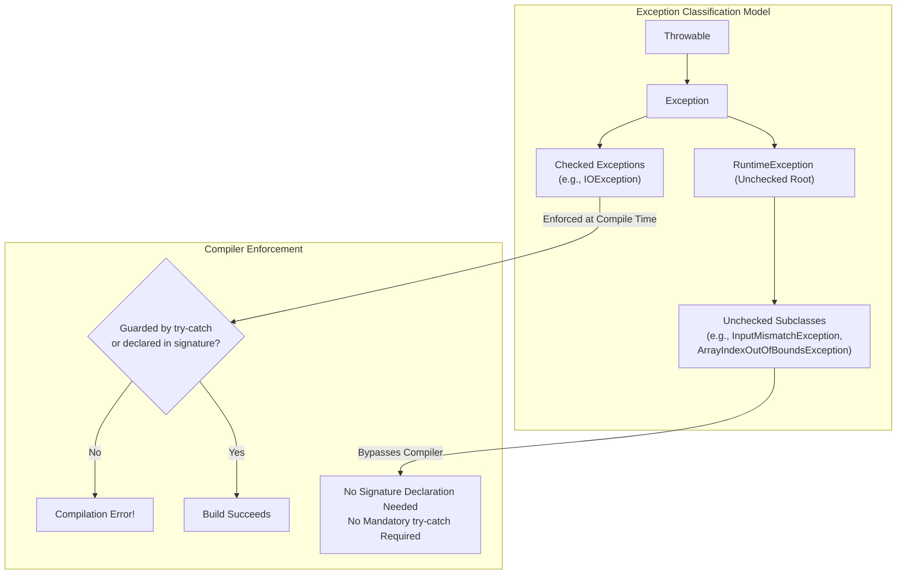

# Exception Classification: Checked vs. Unchecked Exceptions & Compiler Verification

---

## Key Takeaways

Java categorizes all exceptions into two fundamental groups: **checked exceptions** and **unchecked exceptions**. Checked exceptions (such as `IOException`) represent recoverable external failure scenarios and are strictly validated by the Java compiler at compile time. Any method that triggers or throws a checked exception must declare it in its signature, obligating calling code to enclose the invocation in a `try-catch` block or declare it further. In contrast, unchecked exceptions comprise `RuntimeException` and all of its subclasses (such as `InputMismatchException`); they represent conditions that are not checked by the compiler, require no signature declarations, and can occur anywhere without mandatory compile-time handling.



- **Checked Exceptions**: Exceptions verified at compile time by `javac`. If a method might throw a checked exception, it must declare it in its header; calling code is required by the compiler to account for it.
- **Unchecked Exceptions**: Exceptions extending `RuntimeException` that are not validated by the compiler. Methods do not need to declare them, and callers are not forced to write `try-catch` blocks.
- **Design Intent**:
  - **Checked**: Used for scenarios where it is reasonable to expect the calling method can recover from the error (e.g., missing files, unavailable networks).
  - **Unchecked**: Used when the calling code generally cannot anticipate or recover gracefully, often pointing to bad user input, logic errors, or API contract violations.
- **Optional Handling**: While the compiler does not mandate handling unchecked exceptions, developers are still free to catch and handle them with `try-catch` blocks when appropriate.

---

## Main Discussion / Deep Dive

### Idiomatic Java Code Snippets

#### 1. Checked Exception: Mandatory Handling (`IOException`)

Attempting to invoke `File.createNewFile()` without handling fails compile-time checks because its method header declares `throws IOException`:

```java
package exception_types;

import java.io.File;
import java.io.IOException;

public class CheckedExceptionDemo {

    public static void main(String[] args) {
        File file = new File("docs/output.txt");

        // ILLEGAL: Causes a compilation error if unguarded
        // file.createNewFile();
        // Error: unreported exception java.io.IOException; must be caught or declared to be thrown

        // LEGAL: Calling code satisfies compiler obligations via try-catch
        try {
            boolean created = file.createNewFile();
            System.out.println("File created: " + created);
        } catch (IOException e) {
            System.out.println("Handled checked exception: " + e.getMessage());
        }
    }
}

```

#### 2. Unchecked Exception: Silent at Compile Time (`InputMismatchException`)

Reading input with `Scanner.nextDouble()` requires no `try-catch` block to compile, but crashes at runtime if input format constraints are violated:

```java
package exception_types;

import java.util.InputMismatchException;
import java.util.Scanner;

public class UncheckedExceptionDemo {

    public static void main(String[] args) {
        String mockInput = "not-a-double";
        Scanner scanner = new Scanner(mockInput);

        // Compiles cleanly without try-catch even though nextDouble() can fail!
        // At runtime, reading "not-a-double" as double throws InputMismatchException
        try {
            System.out.print("Enter your rate: ");
            double rate = scanner.nextDouble();
            System.out.println("Rate entered: " + rate);
        } catch (InputMismatchException e) {
            // Optional catch: Developer chooses to intercept the unchecked exception
            System.out.println("Handled unchecked exception: Input is not a valid floating-point number.");
        } finally {
            scanner.close();
        }

        System.out.println("Application recovered successfully.");
    }
}

```

### Under the Hood / JVM Mechanics

1. **Abstract Syntax Tree (AST) Inspection:**
   During the semantic analysis phase of compilation, javac traverses method invocations in the AST. If a called method contains an Exceptions attribute listing any class not inheriting from RuntimeException (or Error), it marks the call site as requiring a checked exception handler.
2. **Enclosure Validation:**
   The compiler inspects whether the call site is enclosed by a matching try-catch block or if the enclosing method header declares the exception via throws. If neither exists, javac aborts with: must be caught or declared to be thrown.
3. **RuntimeException Exemption Rule:**
   If the thrown type inherits from java.lang.RuntimeException, the compiler bypasses the checked exception validation algorithm entirely, generating standard invokevirtual bytecode without verifying calling guards.
4. **Runtime Execution and Propagation:**
   At runtime, the JVM makes no performance distinction between checked and unchecked exceptions. If an unchecked exception like InputMismatchException is thrown and no catch block exists on the call stack, the thread terminates and dumps its stack trace to standard error.

### Structural Comparisons

#### Checked vs. Unchecked Exceptions

| Feature                      | Checked Exceptions                                 | Unchecked Exceptions                                                              |
| ---------------------------- | -------------------------------------------------- | --------------------------------------------------------------------------------- |
| **Inheritance Hierarchy**    | Extends `Exception` (excluding `RuntimeException`) | Extends `RuntimeException` (or subclasses)                                        |
| **Compiler Enforcement**     | **Verified at compile time**                       | **Ignored at compile time**                                                       |
| **Method Header Obligation** | Must explicitly declare via `throws`               | No declaration required in method header                                          |
| **Caller Requirement**       | Mandatory: must catch or re-declare                | Optional: can catch, but compiler does not enforce                                |
| **Standard Use Case**        | External, recoverable conditions                   | Programming flaws, invalid state, unrecoverable data                              |
| **Coursework Examples**      | `IOException` (`File.createNewFile`)               | `InputMismatchException` (`Scanner.nextDouble`), `ArrayIndexOutOfBoundsException` |

### Common Anti-Patterns & Edge Cases

- **Assuming Unchecked Exceptions Cannot Be Caught**: Believing that because `RuntimeException` subclasses do not require compile-time handling, they cannot be handled with `try-catch`. Catching unchecked exceptions (such as `InputMismatchException`) is completely valid and recommended when recovering from faulty user input.
- **Missing Method Header Declarations**: Creating a method that throws a checked exception without including `throws [ExceptionName]` in its signature causes an immediate compile-time failure.
- **Relying on Compile-Time Checks for Input Validation**: Assuming that because code compiles without warnings, it is immune to exceptions. Operations like `scanner.nextDouble()` compile cleanly even when fed incompatible data types, resulting in unchecked runtime crashes.

---

## Knowledge Check & JetBrains-Style Coding Challenges

### Theory Tips

- **The Root Identifier**: `RuntimeException` and all of its subclasses are defined as **unchecked exceptions**.
- **Compiler Rule**: Checked exceptions are verified by the compiler before execution; unchecked exceptions are not.
- **Signature Declaration**: Methods throwing checked exceptions must declare them in their method signature; methods throwing unchecked exceptions are not required to declare them.

### Question 1: Conceptual / Code Analysis

Consider the following two method definitions in class `InputValidator`:

```java
import java.io.IOException;
import java.util.InputMismatchException;

public class InputValidator {

    public void processFile() {
        throw new IOException("Disk failure"); // Line 1
    }

    public void parseNumber() {
        throw new InputMismatchException("Invalid number"); // Line 2
    }
}
```

What occurs when attempting to compile this class?

<details>
<summary>Correct Answer</summary>

- [ ] **A.** Line 1 causes a compilation error; Line 2 compiles cleanly.
- [ ] **B.** Line 2 causes a compilation error; Line 1 compiles cleanly.
- [ ] **C.** Both lines compile cleanly because exceptions are runtime phenomena.
- [ ] **D.** Both lines cause compilation errors because neither method declares `throws Exception`.

**Correct Answer**: **A**

**Technical Breakdown**:

- **A is correct**:

1. `IOException` is a **checked exception**. Because it is checked, the compiler requires that any method throwing it must either catch it or explicitly declare it in its header (`public void processFile() throws IOException`). Because `processFile()` does neither, Line 1 triggers a compilation error: `unreported exception IOException; must be caught or declared to be thrown`.
2. `InputMismatchException` inherits from `NoSuchElementException`, which extends `RuntimeException`. Because it is an **unchecked exception**, the compiler does not verify it. Line 2 compiles cleanly without a `throws` clause or `try-catch` block.

- **B is incorrect**: Unchecked exceptions never trigger compile-time requirement checks.
- **C is incorrect**: Checked exceptions are strictly verified at compile time.
- **D is incorrect**: Unchecked exceptions do not require a `throws` clause.

</details>

---

### Question 2: Mini Coding Problem / Implementation Challenge

**Task**: Implement a resilient parsing and file audit utility named `SafeReader` inside package `exception_types`:

1. Method `public static double parseDoubleInput(String input, double defaultValue)`:
   - Accepts a string representation of a number.
   - Uses a `Scanner` to read the double value via `scanner.nextDouble()`.
   - Encloses the call inside a `try-catch` block catching the **unchecked** exception `InputMismatchException`.
   - Returns the parsed double on success, or `defaultValue` if `InputMismatchException` is thrown.
2. Method `public static boolean checkAndCreateFile(File file)`:
   - Encloses `file.createNewFile()` in a `try-catch` block handling the **checked** exception `IOException`.
   - Returns `true` if the file was created or exists cleanly.
   - Returns `false` if an `IOException` is intercepted, logging `"Creation error: " + e.getMessage()` to `System.out`.

**Test Assertions**:

- `parseDoubleInput("42.5", 0.0)` $\rightarrow$ Returns: `42.5`
- `parseDoubleInput("invalid_text", 0.0)` $\rightarrow$ Returns: `0.0` (Handled unchecked input mismatch)
- Calling `checkAndCreateFile(new File("invalid_directory/nonexistent.txt"))` $\rightarrow$ Catches `IOException` and returns: `false`

<details>
<summary>Solution</summary>

```java
package exception_types;

import java.io.File;
import java.io.IOException;
import java.util.InputMismatchException;
import java.util.Scanner;

public class SafeReader {

    public static double parseDoubleInput(String input, double defaultValue) {
        Scanner scanner = new Scanner(input);

        try {
            // nextDouble() throws the unchecked InputMismatchException on invalid format
            return scanner.nextDouble();
        } catch (InputMismatchException e) {
            // Optional handling of unchecked runtime exception
            return defaultValue;
        } finally {
            scanner.close();
        }
    }

    public static boolean checkAndCreateFile(File file) {
        try {
            // createNewFile() throws the checked IOException; mandatory handling
            return file.createNewFile();
        } catch (IOException e) {
            System.out.println("Creation error: " + e.getMessage());
            return false;
        }
    }
}
```

**Complexity Analysis**:

- **Time Complexity**:
  - `parseDoubleInput`: $\mathcal{O}(L)$ where $L$ is the string length parsed by `Scanner`.
  - `checkAndCreateFile`: $\mathcal{O}(1)$ filesystem I/O check duration.
- **Space Complexity**: $\mathcal{O}(1)$ auxiliary space beyond the temporary `Scanner` and `File` object references.

</details>

---
