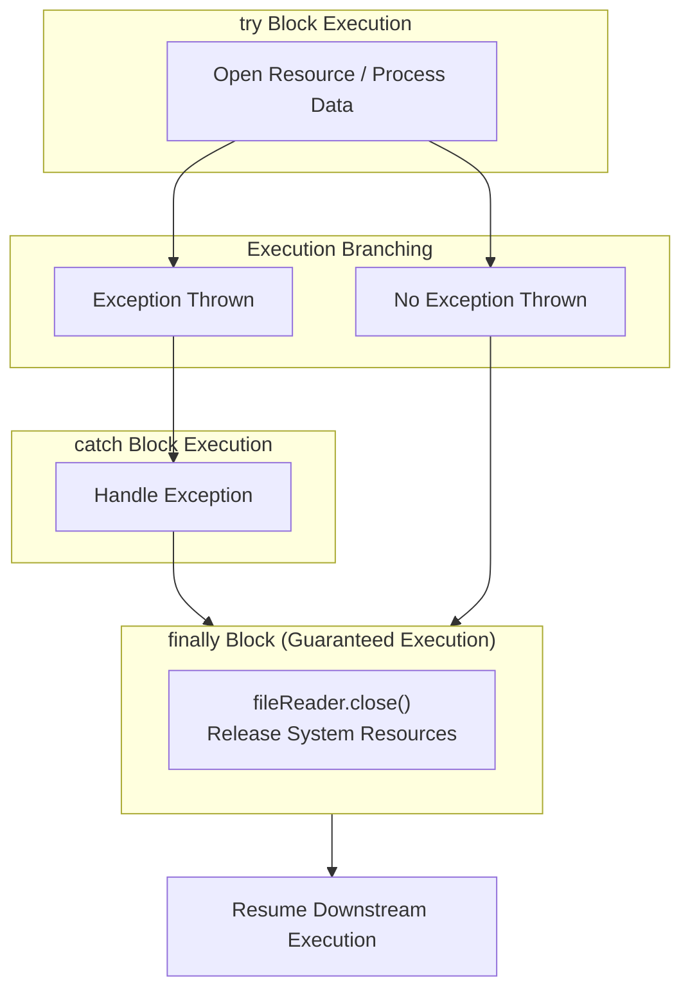

# Resource Safety: The `finally` Block & Execution Guarantees

---

## Key Takeaways

Exceptions disrupt normal program flow, bypassing subsequent statements within a `try` block and jumping straight to an appropriate `catch` block or uncaught exception handler. Placing resource deallocation routines (such as `fileReader.close()`) inside the `try` block, inside the `catch` block, or below the construct fails to guarantee execution across all success and error paths. To solve this cleanup problem, Java provides the optional `finally` clause, appended after all `catch` blocks. The code enclosed in the `finally` block executes unconditionally—regardless of whether an exception is thrown, caught, or completely omitted—making it the foundational mechanism for deterministic resource cleanup.



- **The Cleanup Dilemma**: Statements placed after a failing line inside a `try` block are skipped; statements in a `catch` block only run on error; statements placed after an unguarded block do not run if an unhandled exception or early exit occurs.
- **The `finally` Guarantee**: Statements within a `finally` block execute unconditionally under all runtime scenarios (normal completion, caught exceptions, or rethrown errors).
- **Syntax & Placement**: Declared using the reserved word `finally` followed directly by curly braces `{ ... }` without parentheses, placed strictly after all preceding `catch` blocks.
- **Primary Use Case**: Designed specifically for closing input/output streams, releasing operating system file locks, and finalizing state to prevent memory leaks and dangling resources.

---

## Main Discussion

### Idiomatic Java Code Snippets

#### 1. Why Naive Placement Fails for Cleanup

Examining common placement mistakes when attempting to close open resources:

```java
package finally_demo;

import java.io.File;
import java.io.FileNotFoundException;
import java.util.Scanner;

public class CleanupPlacementFlaws {

    public static void demonstrateFlaws() {
        File file = new File("numbers.txt");
        Scanner fileReader = null;

        // FLAW 1: Placing close() inside try
        try {
            fileReader = new Scanner(file);
            System.out.println(fileReader.nextDouble()); // If this throws InputMismatchException...
            fileReader.close(); // ...THIS LINE IS NEVER REACHED! Resource leaks.
        } catch (FileNotFoundException e) {
            System.out.println("File not found.");
        }

        // FLAW 2: Placing close() in catch
        // If NO exception is thrown, the catch block never runs, and the file remains open!

        // FLAW 3: Placing close() outside after try-catch
        // If an unchecked exception occurs that is NOT caught, the thread crashes before reaching here.
    }
}
```

#### 2. The Idiomatic `finally` Block Solution

Enclosing resource finalization within a `finally` block ensures that cleanup runs deterministically:

```java
package finally_demo;

import java.io.File;
import java.io.FileNotFoundException;
import java.util.InputMismatchException;
import java.util.Scanner;

public class FinallyBlockDemo {

    public static void main(String[] args) {
        File file = new File("numbers.txt");
        Scanner fileReader = null;

        try {
            System.out.println("Entering try block...");
            fileReader = new Scanner(file);

            while (fileReader.hasNext()) {
                double value = fileReader.nextDouble();
                System.out.println("Read value: " + value);
            }

        } catch (FileNotFoundException e) {
            System.out.println("Handling missing file: " + e.getMessage());

        } catch (InputMismatchException e) {
            System.out.println("Handling bad data: File contained non-numeric content.");

        } finally {
            // Unconditional execution: runs whether an exception was thrown or not
            System.out.println("Entering finally block for cleanup...");
            if (fileReader != null) {
                fileReader.close();
                System.out.println("Resource fileReader successfully closed.");
            }
        }

        System.out.println("Application proceeded safely past try-catch-finally.");
    }
}
```

### Under the Hood / JVM Mechanics

1. **Bytecode Exception Table Augmentation:**
   When javac compiles a try-catch-finally structure, it emits entries in the method's Exception table covering both the try and catch byte ranges with an any handler target pointing directly to the finally code.

2. **Inline Duplication / Execution Path Routing:**
   The compiler duplicates the bytecode instructions contained inside the finally block across all exit paths:

3. **Guaranteed Invocation Guarantee:**
   Whether instructions complete cleanly or jump to a catch handler, the JVM encounters the replicated finally instructions before control leaves the method frame.

4. **Uncaught Exception Re-throwing:**
   If an unexpected exception occurs that has no matching catch block, the JVM runs the finally bytecode first, and only then re-throws the exception up the call stack to the calling method.

### Structural Comparisons

#### Resource Cleanup Placement Strategies

| Placement Location         | Runs on Success?               | Runs on Handled Exception? | Runs on Unhandled Exception?     | Safe for Resource Cleanup?         |
| -------------------------- | ------------------------------ | -------------------------- | -------------------------------- | ---------------------------------- |
| **Inside `try` block**     | **Yes**                        | **No** (Skipped on error)  | **No** (Skipped on error)        | **Unsafe** (Causes resource leaks) |
| **Inside `catch` block**   | **No** (Never runs on success) | **Yes**                    | **No** (If another type throws)  | **Unsafe** (Leaking on success)    |
| **After `try-catch`**      | **Yes**                        | **Yes**                    | **No** (Thread terminates prior) | **Unsafe** (Leaking on crashes)    |
| **Inside `finally` block** | **Yes**                        | **Yes**                    | **Yes** (Executes before crash)  | **Safe & Guaranteed**              |

### Common Anti-Patterns & Edge Cases

- **Missing Null-Check on Uninitialized Resources in `finally`**: If an exception is thrown during instantiation (e.g., `new Scanner(file)`fails with`FileNotFoundException`), `fileReader`remains`null`. Invoking `fileReader.close()`directly inside`finally`without a null check throws a secondary`NullPointerException`.
- **Exceptions Thrown Inside `finally`**: If a statement inside a `finally`block itself throws an exception, it suppresses and replaces any prior exception that was currently being propagated out of the`try`or`catch` block.
- **Assuming `finally` Has Parameters**: Writing `finally (Exception e)` causes an immediate compile-time syntax error: `'{' expected`. Unlike `catch`, the `finally` block takes no arguments.
- **Redundant Duplicate Closes**: Closing a resource in both `try` and `catch` leads to code bloat and maintenance errors. Consolidate closing logic solely inside `finally`.

---

## Knowledge Check & JetBrains-Style Coding Challenges

### Theory Tips

- **No Parentheses**: The `finally` keyword is followed directly by curly braces `{ ... }`; it does not accept parameter parentheses.
- **Execution Rule**: The code inside a `finally` block executes **no matter what happens** in the preceding `try` and `catch` blocks.
- **Positioning**: If present, the `finally` block must be placed at the very end of the `try-catch` structure, below all declared `catch` blocks.

### Question 1: Conceptual / Code Analysis

Consider the following program:

```java
public class ExecutionOrderPuzzle {
    public static void main(String[] args) {
        System.out.print(compute() + " ");
    }

    public static String compute() {
        try {
            System.out.print("1 ");
            int result = 10 / 0; // ArithmeticException
            System.out.print("2 ");
            return "TRY";
        } catch (ArithmeticException e) {
            System.out.print("3 ");
            return "CATCH";
        } finally {
            System.out.print("4 ");
        }
    }
}
```

What is the exact sequence printed to the console when `main` executes?

- [ ] **A.** `1 3 CATCH`
- [ ] **B.** `1 3 4 CATCH `
- [ ] **C.** `1 3 CATCH 4 `
- [ ] **D.** `1 4 3 CATCH `

<details>
<summary>Correct Answer</summary>

**Correct Answer**: **B**

**Technical Breakdown**:

- **B is correct**:

1. The `compute()` method enters the `try` block, printing `"1 "`.
2. Evaluating `10 / 0` throws an `ArithmeticException`. The remainder of the `try` block (`"2 "` and `return "TRY"`) is aborted.
3. Control shifts to `catch (ArithmeticException e)`. The block prints `"3 "`.
4. The catch block prepares to return `"CATCH"`. However, Java guarantees that the `finally` block executes before the method frame is popped.
5. Control executes the `finally` block, printing `"4 "`.
6. The caught return value `"CATCH"` completes and is returned to `main`, which prints it with a trailing space: `"CATCH "`.
7. The full output sequence is `"1 3 4 CATCH "`.

- **A is incorrect**: The `finally` block cannot be skipped.
- **C is incorrect**: `finally` executes before control yields back to the caller's `System.out.print` statement.
- **D is incorrect**: The `catch` block intercepts the exception before `finally` runs.

</details>

---

### Question 2: Mini Coding Problem / Implementation Challenge

**Task**: Implement a resilient resource-reading class named `SafeResourceProcessor` inside package `finally_demo`:

1. Method `public static int processNumbers(String textContent)`:
   - Initializes a `Scanner` reference to `null`.
   - Enters a `try` block and instantiates the `Scanner` with `textContent`.
   - Reads all integer tokens using `scanner.nextInt()` and accumulates their sum.
   - Catches `InputMismatchException`: prints `"DATA_ERROR"` to `System.out` and returns `-1`.
   - Includes a `finally` block that verifies if `scanner != null`, and if so, invokes `scanner.close()` and prints `"SCANNER_CLOSED"` to `System.out`.
   - Returns the accumulated sum on success.

**Test Assertions**:

- `processNumbers("10 20 30")`:
  - Prints: `"SCANNER_CLOSED"`
  - Returns: `60`
- `processNumbers("10 invalid 30")`:
  - Prints: `"DATA_ERROR"`
  - Prints: `"SCANNER_CLOSED"`
  - Returns: `-1`

<details>
<summary>Solution</summary>

```java
package finally_demo;

import java.util.InputMismatchException;
import java.util.Scanner;

public class SafeResourceProcessor {

    public static int processNumbers(String textContent) {
        Scanner scanner = null;
        int sum = 0;

        try {
            scanner = new Scanner(textContent);

            while (scanner.hasNext()) {
                sum += scanner.nextInt();
            }

            return sum;

        } catch (InputMismatchException e) {
            System.out.println("DATA_ERROR");
            return -1;

        } finally {
            // The finally block executes unconditionally before return statements exit
            if (scanner != null) {
                scanner.close();
                System.out.println("SCANNER_CLOSED");
            }
        }
    }
}
```

**Complexity Analysis**:

- **Time Complexity**: $\mathcal{O}(N)$ where $N$ is the number of tokens scanned from `textContent`. Scanning and closing run in linear and constant time, respectively.
- **Space Complexity**: $\mathcal{O}(1)$ auxiliary memory allocated; the scanner maintains an internal character buffer without additional dynamic collection allocation.

</details>

---
